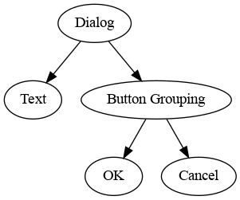

# How Chrome Accessibility Works

This document explains the technical details behind Chrome accessibility
code by starting at a high level and progressively adding more levels of
detail.

Please read the accessibility [overview](../overview.md) first.

[TOC]

## Accessibility for a simple (non-browser) application

As described in the [overview](../overview.md), every platform has its own
accessibility APIs that are used by both assistive technology and sometimes
by automation software. To better understand the challenges of accessibility
support in Chromium, let's first explore what it's like to build an
accessible application using a standard UI toolkit.

Examples of standard toolkits would be Win32 UI controls or .NET components
on Windows, or Cocoa NSViews on macOS, or Android Views via Java or Kotlin.
When you use such a toolkit to build an application, a lot of accessibility
comes for free.

Typically every UI element - including containers and grouping elements - gets
its own corresponding accessibility element, implementing that platform's
accessibility API. So if you add a button, checkbox, scroll container, or
text field to your application, you don't need to do any work to make it
accessible - the built-in UI toolkit has provided all of that already.



### Changing accessibility properties

There are some cases where a bit of extra information may be required on the
part of the app author. If you add an image button, you may need to ensure
you provide an accessible label ("alt text"). Other common simple modifications
might include hiding UI elements from accessibility because they're primarily
decorative, or marking a UI element as an alert to ensure it's announced
to screen reader users when it appears. However, none of these require
writing more than a few lines of code.

#### Windows

The [dynamic annotation API](https://docs.microsoft.com/en-us/windows/win32/winauto/dynamic-annotation-api)
lets you change any accessibility property of a UI element represented by an HWND. Here's a tiny code
snippet showing how you could override the accessible name property (PROPID_ACC_NAME) to be the
text "Accessible Name":

```C++
CComPtr<IAccPropServices> pAccPropSrv;
pAccPropSrv.CoCreateInstance(CLSID_AccPropServices);
COleVariant varName("Accessible Name");
pAccPropSrv->SetHwndProp(hwnd, OBJID_CLIENT, 0, PROPID_ACC_NAME, varName);
```

#### Android

On Android, if you don't want to subclass a View you can just set its accessibility delegate
as an easy way to override one or more accessibility attributes. In this case we override
the content description to say "Accessible Name".

```Java
view.setAccessibilityDelegate(new AccessibilityDelegate() {
    public void onInitializeAccessibilityNodeInfo(View host, AccessibilityNodeInfo info) {
        super.onInitializeAccessibilityNodeInfo(host, info);
        info.setContentDescription("Accessible Name");
    }
});
```

### Custom controls and subclassing

When building a custom control, more work is often required. As an example,
suppose an application is implementing a "cover flow" image picker, such as the
one found in the original iTunes album picker.  Conceptually the user is picking
one album from a large list, but visually it's shown as a horizontally scrolling
list of album cover images that fly by in three dimensions.


While this control may be implemented as a single UI element, from the
perspective of accessibility APIs it would typically be represented as
a parent element with a "list box" role and children with "option" roles.
This can't be done using the code snippets above, which are only sufficient
for overriding some simple accessibility properties. A more complex custom
control like this requires subclassing.

To make the CoverFlow accessible, we would need to first need to subclass the
appropriate accessibility interface, such as IAccessible on Windows or
AccessibilityDelegate on Android. In addition to setting properties such as the
name and role (like ComboBox on Windows, or Choice on Android), we'd want to
override any methods that are used to walk the tree, in order to give this
object accessible children - one for each option the user can pick.


Each option would be another instance of our subclass of an accessibility
interface. Each one might need to implement a role, name, and very
importantly, a bounding box representing the position of that option
within the view's bounds.

## A single-process browser for basic HTML only

Let's next discuss what's needed in order to make a single-process web
browser accessible. At the time Chrome was first released, this is
more or less how other browsers such as Safari and Firefox worked.
However, let's start with the simplifying assumption that we're dealing
with basic HTML only, and no CSS or ARIA.

From the perspective of accessibility APIs, the web contents is one
big custom control. Modern web browsers do not build their UI using
platform UI elements.

*** note
Years ago, some browsers may have rendered web pages using
platform UI elements, but this doesn't scale well as most UI frameworks
get bogged down after thousands of UI elements, whereas many web pages
have hundreds of thousands of elements.

In addition, note that web form controls support CSS effects
including unusual ones like 3-D transformations, whereas most
platform UI controls don't support, e.g. a 45-degree rotated
text box.
***

The web contents can be represented as a tree of elements.
For the moment let's ignore details between the DOM and the
final rendered layout, and let's just assume that every DOM node
corresponds perfectly to one node in the accessibility tree.

Essentially the web browser needs to create one accessible
object for every DOM node. The accessible object subclasses
that platform's accessibility interface, and its accessible
role, name, and other properties can all be computed by
querying the corresponding DOM node. When DOM nodes are created
or destroyed, the corresponding accessible objects need to
be updated accordingly.

Here's an example of a DOM tree and a corresponding accessibility
tree. There's a 1:1 correspondence in this example.


Objects in the accessibility tree are sometimes called "wrappers" in this
design. Each accessible object "wraps" its corresponding DOM element. The DOM
element contains all of the state, and the accessible object just implements the
accessibility API based on the DOM element. This design avoids the need for DOM
code to need to be tightly bound to accessibility code.

For efficiency, these accessible objects are sometimes built
lazily. Initially there could just be one accessible object
for the root of the web contents. If that object is ever
queried and asked for its children, the accessible objects
corresponding to the children of the root DOM element could
be created on-demand, and so on. This is useful because
many users don't have any features enabled that use
accessibility APIs, so very little work would be done
unless they're utilized.

The overall system so far is pretty simple - the DOM tree is used to
build the accessibility tree, which is used to communicate with the
platform accessibility APIs.


## A single-process browser with CSS and ARIA

In the previous example we assumed that there was a 1:1 correspondence
between a DOM node and an accessible node. Unfortunately that doesn't
hold true. Here are some examples of where that assumption doesn't work.

* CSS can have generated content, like list item markers (bullets or numbers)
  or text inserted before or after an element with pseudoselectors
  like ::before and ::after.
* Some DOM subtrees are never displayed (like &lt;head&gt;) or are hidden using
  display:none
* Some DOM nodes are hidden using visibility:hidden, but it's possible for
  some of their descendant nodes to be visible
* aria-hidden can hide a subtree from the accessibility tree even if it's
  displayed visually
* ARIA role=none or role=presentation hides a node but not its subtree
* aria-owns can be used to reparent a node within the accessibility tree

So in practice, the accessibility tree is similar to the DOM tree, but with
important differences.  Objects in the accessibility tree usually wrap DOM
nodes, but occasionally they wrap pseudoelements (like list markers or CSS
generated content) or other layout objects with no corresponding node (such as
images that are children of pseudoelements).

Here's an example where the DOM tree has list items and the corresponding
accessibility tree has nodes for the list item markers:


Here's a different example where some of the content is excluded from the
accessibility tree using aria-hidden:


This new system diagram reflects the complexity of the system when
you consider both HTML, CSS, and ARIA all affecting the accessibility
tree.


## A multi-process browser

In the next section we'll explore how the system diagram needs to change
in order to support a multi-process browser.

See [How Chrome Accessibility Works, Part 2](how_a11y_works_2.md)
