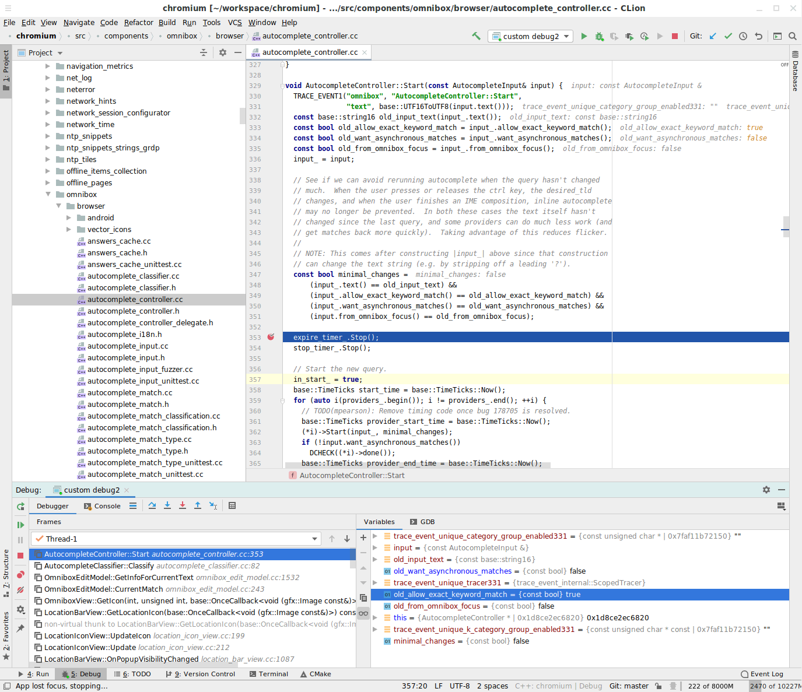

# CLion Dev

CLion is an IDE

Prerequisite:
[Checking out and building the chromium code base](README.md#Checking-Out-and-Building)

[TOC]

## Setting up CLion

1. Install CLion
    - Googlers only: See
      [go/intellij-getting-started](https://goto.google.com/intellij-getting-started)
      for installation and license authentication instructions

1. Run CLion
1. Increase CLion's memory allocation

   This step will help performance with large projects
    1. Option 1
        1. At the startup dialog, in the bottom left corner, click on the Cog
           icon and then click on `Edit Custom VM Options`:
        1. In the textbox, you will see different flags. Add or replace the
           following flags (to learn
           more: [Advanced configuration | IntelliJ IDEA](https://www.jetbrains.com/help/idea/tuning-the-ide.html#common-jvm-options)):
            ```
            -Xss2m
            -Xms1g
            -Xmx31g
            ...
            ```
        1. Close the `Edit Custom VM Options` dialog.
        1. Again, at the startup dialogue, in the bottom left corner, click on
           the Cog icon and then click on `Edit Custom Properties`:
        1. Add or replace the following flags (to learn
           more: [Platform Properties | IntelliJ IDEA](https://www.jetbrains.com/help/idea/tuning-the-ide.html#configure-platform-properties)):
            ```
            idea.max.intellisense.filesize=12500
            ```
    1. Option 2; 2017 and prior versions may not include the options to setup
       your `VM Options` and `Properties` in the `configure` menu. Instead:
        1. `Create New Project`
        1. `Help` > `Edit Custom VM Options`
        1. `Help` > `Edit Custom Properties`

## Creating a new CLion project

1. Import project
    - At the startup dialog, select `Import Project` and select your `chromium`
      directory; this should be the parent directory to `src`. Selecting `src`
      instead would result in some CLion IDE files appearing in your repository.

## Building, Running, and Debugging within CLion

Configure CLion to use ninja for building
(see [Linux Build Instructions](https://g3doc.corp.google.com/company/teams/chrome/linux_build_instructions.md))

### Custom Build Targets

A custom Build Target allows CLion to compile Chromium similarly to running
ninja in the command line.

#### Add a Custom Build Target

The first step is to add Ninja (specifically autoninja) as an external tool
that will be used to create the build targets.

1. Go to `Settings`
1. Then, to `Build, Execution, Deployment > Custom Build Targets`
1. Click on the `+` sign to add a new build target.
1. Fill the Name: `Default`
1. Next to `Build`, click on the three dots (`...`)
1. Click on `+` to add an External Tool
1. Fill the form:
    1. Name: `autoninja - Default`
    1. Program: `<absolute path to depot_tools/autoninja>`
    1. Arguments: `-C out/Default chrome`
    1. Working Directory: `<absolute path to chromium/src>`
1. Click `Ok` to close the dialog.

#### Run/Debug configuration

The build target configured in the previous section was necessary to configure
the Run/Debug configuration.

1. Click on the `Run` menu and then on `Edit Configurations`.
1. Click on the `+` sign then on `Custom Build Application`
1. Fill the form:
    1. Name: `Default`
    1. Target: Select the `Default` build target that was created previously.
    1. Executable: Click the three dots (`...`) and select
       `src/out/Default/chrome`
1. Click `Ok` to close the dialog.

### Configure `~/.gdbinit`

Before being able to debug, you need to configure `~/.gdbinit`. Open it with a
text editor and enter:

```
source <path to chromium>/src/tools/gdb/gdbinit
```

### Set the local gdb executable

There have been some reports of slowness while debugging using CLion.
It seems that using that CLion's bundled gdb executable is the culprit. To use
the local one:
1. Open `Settings`
1. Search for `Toolchains`
1. Next to `Debugger`, select `/usr/bin/gdb`

#### Run Chrome!

You can now run chrome directly from CLion. You can also debug and add a
breakpoint. Try it!

`Run` > `Run` (`shift+f10`) or `Run` > `Debug` (`shift+f9`) (screenshot)


## Autocompletion

### Approach 1: Using CMakeLists
**Note**: It's possible that when you open the project, CLion created one for you.

1. Create or Modify the `chromium/CMakeLists.txt` file
    1. Open `chromium/CMakeLists.txt`
    1. Add or Replace the content with:
       ```
       cmake_minimum_required(VERSION 3.10)
       project(chromium)

       set(CMAKE_CXX_STANDARD 14)

       include_directories(${CMAKE_CURRENT_SOURCE_DIR}/src)
       include_directories(${CMAKE_CURRENT_SOURCE_DIR}/src/out/Default/gen)
       include_directories(${CMAKE_CURRENT_SOURCE_DIR}/src/third_party/protobuf/src)
       include_directories(${CMAKE_CURRENT_SOURCE_DIR}/src/third_party/googletest/src/googletest/include)
       include_directories(${CMAKE_CURRENT_SOURCE_DIR}/src/third_party/googletest/src/googlemock/include)
       include_directories(${CMAKE_CURRENT_SOURCE_DIR}/src/third_party/abseil-cpp)

       # The following file used is irrelevant, it's only to improve CLion
       # performance. Leaving at least 1 file is required in order for CLion
       # to provide code completion, navigation, etc.
       add_executable(chromium src/components/omnibox/browser/document_provider.cc)
       ```

### Approach 2: Compilation database

Since Chromium does not use CMake to build, to “benefit from the advanced IDE
features that CLion provides”, a
[Compilation database](https://www.jetbrains.com/help/clion/compilation-database.html)
must be created to expose to CLion how Chromium is built.

In the Chromium code source, there’s a python script
`src/tools/clang/scripts/generate_compdb.py` that will generate
the Compilation Database.

**Note**: The two approaches are not currently compatible and switching between
one and the other is cumbersome. To go from approach 1 to 2, the
`CMakeWorkspace` line from `.idea/misc.xml` must be removed first.

1. Run from your `chromium` folder:

   ```
   python3 src/tools/clang/scripts/generate_compdb.py -p src/out/Default -o ./compile_commands.json --target_os=linux
   ```

   This generates the compilation database at `chromium/compile_commands.json`.

1. In CLion, select the `compile_commands.json` file in the project navigator,
   right-click on it, then click on `Load Compilation Database Project`.

   **Note:** This step will produce a few hundred errors but it doesn't cause
   any issues. It's simply because some files are not compiled. To remove some
   errors, these flags can be added in `src/out/Default/args.gn`:
   ```
   enable_nocompile_tests=true
   ```

1. CLion will start processing the files and will start indexing the symbols.
This step can take a few hours. To expedite this process, see the section
[Exclude irrelevant folders from indexing to speed up CLion](#exclude-irrelevant-folders-from-indexing-to-speed-up-clion)
below.

## Optional Steps

### Create terminal cli or desktop entry

To make it easier to startup CLion or open individual files:

1. Open the actions menu (`ctrl+shift+a`)
1. Type `create desktop entry` and press `enter`
1. Open the actions menu and enter `create command-line launcher`

### Exclude irrelevant folders from indexing to speed up CLion

Exclude folders that are irrelevant to your work from the indexing. Exclude at
first the following folders and manually include the ones relevant to you. Open
`chromium/.idea/misc.xml` and under `<project>` add or edit the following
XML component:

**Note**: This step can be done from the UI in the Project view by selecting
all the folders to exclude, right-clicking on them, selecting
`Mark Directory As` and then selecting `Excluded`.

```
<component name="CidrRootsConfiguration">
    <excludeRoots>
      <file path="$PROJECT_DIR$/src/android_webview" />
      <file path="$PROJECT_DIR$/src/apps" />
      <file path="$PROJECT_DIR$/src/ash" />
      <file path="$PROJECT_DIR$/src/build" />
      <file path="$PROJECT_DIR$/src/build_overrides" />
      <file path="$PROJECT_DIR$/src/buildtools" />
      <file path="$PROJECT_DIR$/src/cc" />
      <file path="$PROJECT_DIR$/src/chromecast" />
      <file path="$PROJECT_DIR$/src/chromeos" />
      <file path="$PROJECT_DIR$/src/codelabs" />
      <file path="$PROJECT_DIR$/src/content" />
      <file path="$PROJECT_DIR$/src/courgette" />
      <file path="$PROJECT_DIR$/src/crypto" />
      <file path="$PROJECT_DIR$/src/dbus" />
      <file path="$PROJECT_DIR$/src/device" />
      <file path="$PROJECT_DIR$/src/docs" />
      <file path="$PROJECT_DIR$/src/extensions" />
      <file path="$PROJECT_DIR$/src/fuchsia_web" />
      <file path="$PROJECT_DIR$/src/gin" />
      <file path="$PROJECT_DIR$/src/google_apis" />
      <file path="$PROJECT_DIR$/src/google_update" />
      <file path="$PROJECT_DIR$/src/gpu" />
      <file path="$PROJECT_DIR$/src/headless" />
      <file path="$PROJECT_DIR$/src/infra" />
      <file path="$PROJECT_DIR$/src/ios" />
      <file path="$PROJECT_DIR$/src/ipc" />
      <file path="$PROJECT_DIR$/src/media" />
      <file path="$PROJECT_DIR$/src/mojo" />
      <file path="$PROJECT_DIR$/src/native_client" />
      <file path="$PROJECT_DIR$/src/native_client_sdk" />
      <file path="$PROJECT_DIR$/src/net" />
      <file path="$PROJECT_DIR$/src/out" />
      <file path="$PROJECT_DIR$/src/pdf" />
      <file path="$PROJECT_DIR$/src/ppapi" />
      <file path="$PROJECT_DIR$/src/printing" />
      <file path="$PROJECT_DIR$/src/remoting" />
      <file path="$PROJECT_DIR$/src/rlz" />
      <file path="$PROJECT_DIR$/src/sandbox" />
      <file path="$PROJECT_DIR$/src/services" />
      <file path="$PROJECT_DIR$/src/skia" />
      <file path="$PROJECT_DIR$/src/sql" />
      <file path="$PROJECT_DIR$/src/storage" />
      <file path="$PROJECT_DIR$/src/styleguide" />
      <file path="$PROJECT_DIR$/src/testing" />
      <file path="$PROJECT_DIR$/src/third_party" />
      <file path="$PROJECT_DIR$/src/tools" />
      <file path="$PROJECT_DIR$/src/ui" />
      <file path="$PROJECT_DIR$/src/url" />
      <file path="$PROJECT_DIR$/src/v8" />
      <file path="$PROJECT_DIR$/src/venv" />
      <file path="$PROJECT_DIR$/src/weblayer" />
    </excludeRoots>
  </component>
```

### Mark directories as `Library Files`

To speed up CLion, optionally mark directories such as `src/third_party` as
`Library Files`

1. Open the `Project` navigation (`alt+1`)
1. Select and right-click the directories > `Mark directory as` >
   `Library Files`
1. See `https://blog.jetbrains.com/clion/2015/12/mark-dir-as/` for more details
