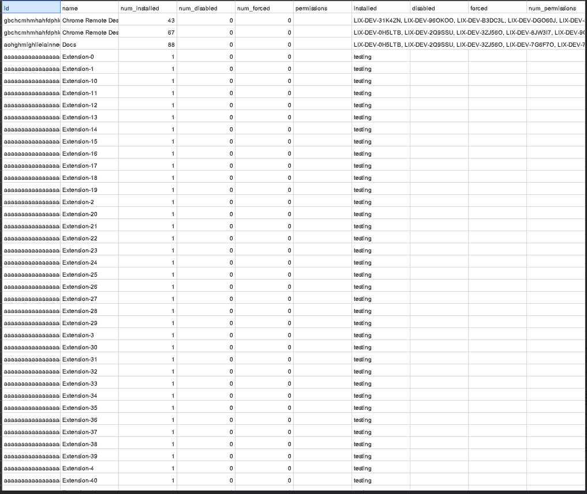

# Python script to compute an extension list using Takeout API

## Setup Access to API

Before using CBCM Takeout API you will need to do some initial setup:

1.  Enable the Admin SDK API (if not already enabled) in the Google Developer
    Console by following this
    [link](https://console.developers.google.com/apis/api/admin.googleapis.com/overview?project=_)
    and selecting the project on which you wish to enable the API.
1.  Create a service account and have the necessary service account keys for
    this service account. You can follow
    [this](https://developers.google.com/admin-sdk/directory/v1/guides/delegation)
    for creating a service account and getting the service account keys. You
    must grant the service account the "Service Account User" role on the
    permissions during creation.
1.  The client ID for this service account will need to be authorized for the
    OAuth scopes listed below in the Admin Console under Security -> Advanced
    settings -> Manage API client access. On this page, the Client ID
    corresponds to the Unique ID of your service account. You will need to
    authorize the client ID for the scope:
    * https://www.googleapis.com/auth/admin.directory.device.chromebrowsers.readonly

## Running the Script

You can download the scripts [here](extension_query.py) (or [here](extension_query_py2.py)
for a python 2.7 compatible version).

With the service account keys, you can now run the script which uses Google API
Client Libraries to make the necessary queries to the API. The script requires
that both the service account keys you downloaded from the developers console as
well as the e-mail of an admin user in your domain that is allowed to access the
data you wish to query.

You can run the script from the command-line:
``` sh
python extension_query.py --service_account_key_path <service_account_key_file> --admin_email <admin_email>
```
(also: `python extension_query.py --help` for a reminder of the
argument names)

## Example Data output

Here is an example of what that data will look like:

