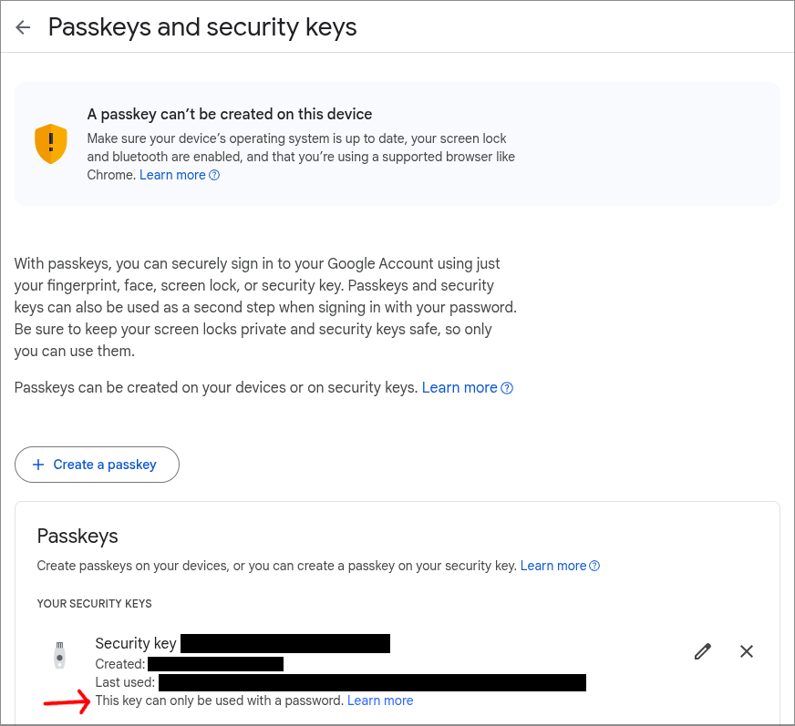
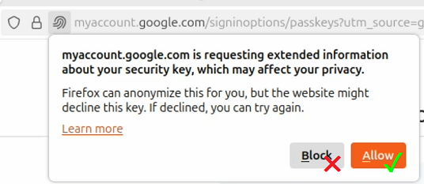
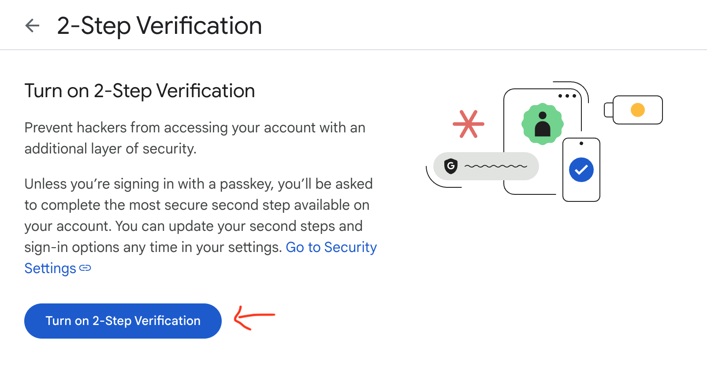
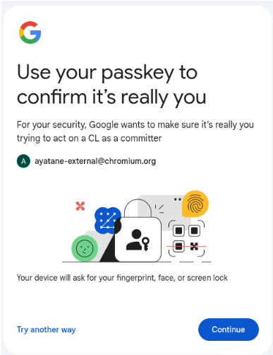
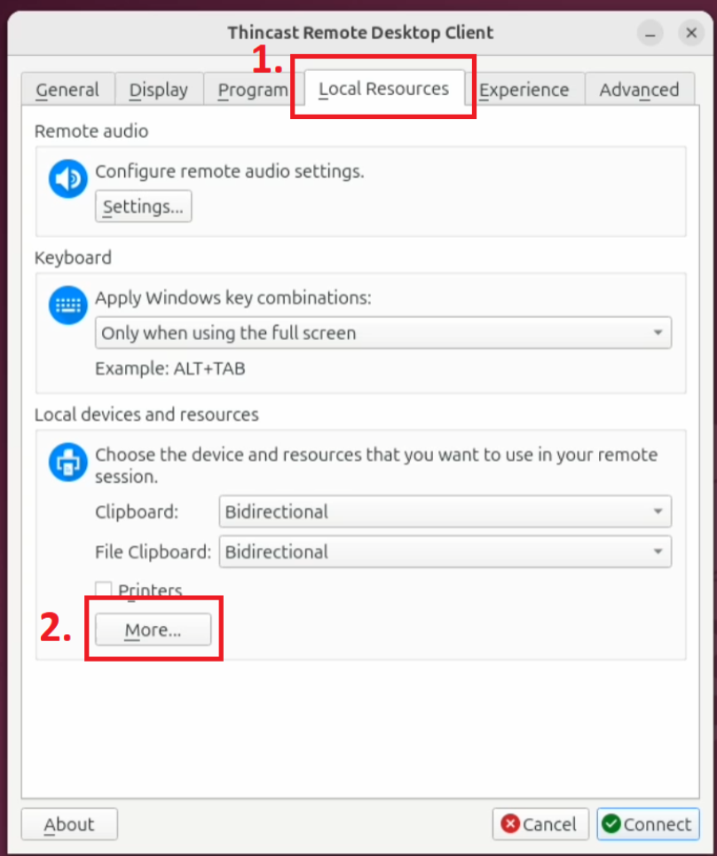
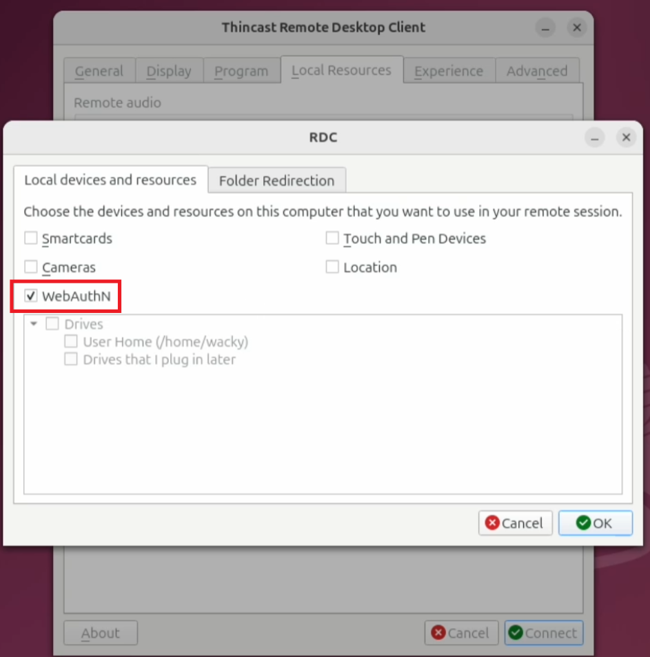
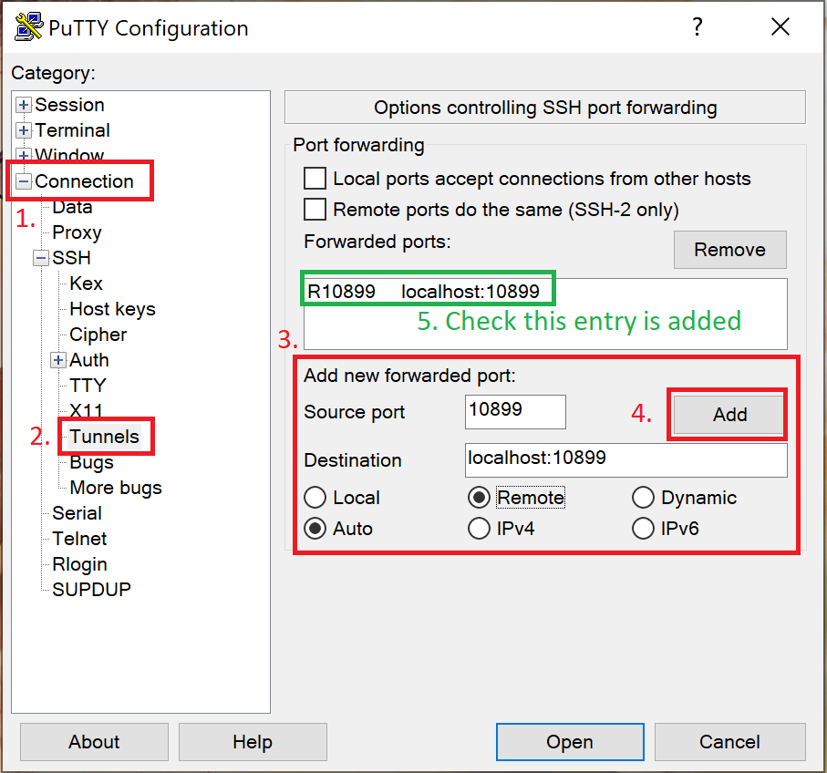
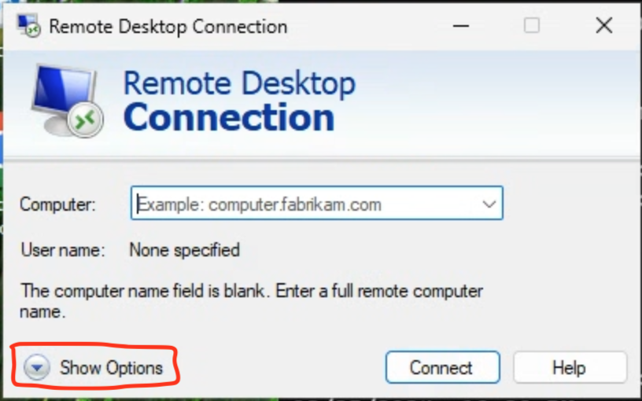
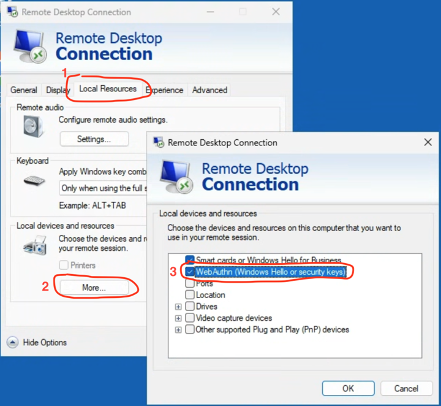
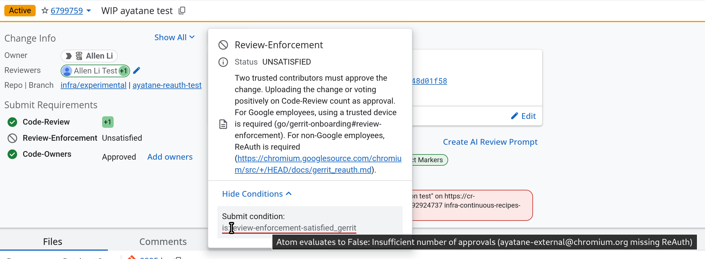

# Gerrit ReAuth

*** note
**Googlers:**

If you use your @google.com account, or a @chromium.org account linked to your
@google.com account: stop reading now (`gcert` already fulfills ReAuth
requirements).

If you aren't sure if your account is linked, follow [the steps
here](http://go/chromium-account-support#how-can-i-check-if-my-gerrit-accounts-are-linked).

Otherwise, read this guide, and AFTERWARDS read this for additional instructions:
[go/gerrit-reauth](http://go/gerrit-reauth).
***

[TOC]

## Background

To protect the source code integrity of Chromium and related projects, we require
all **committers** who write or review code to use a security key for two-factor
authentication on their associated Google account.

This process, called ReAuth, prompts for a security key tap once every 20
hours to obtain a fresh set of credentials for interactions with
Gerrit. Specifically, actions requiring committer powers such as applying
Code-Review+1 to CLs, and uploading CLs (which counts as the uploader
self-reviewing the CL), require ReAuth.

The goal of this policy is to establish a robust layer of protection against
unauthorized access, mitigating the risk of supply chain attacks via stolen
committer credentials.

## Overview

There are two parts to ReAuth:

1. performing the security key touch to get a short lived token
2. passing the token when authenticating to Gerrit

These are done differently for CLI tools and the Gerrit Web UI.

This guide will go over the prerequisites, the setup instructions, and what to
expect.

## Prerequisites

### Register a physical security key {#register-security-key}

You must have a physical [FIDO security
key](https://www.google.com/search?q=FIDO+security+key) registered with your
Google account.

To register a key or check your existing keys, go to
[https://myaccount.google.com/signinoptions/passkeys](https://myaccount.google.com/signinoptions/passkeys)



The line "This key can only be used with a password" indicates a **U2F**
security key. If the line is missing, the key is a **FIDO2** security key.
Please include this info when reporting issues.

*** promo
**Important Note**: Passkeys and TouchID aren't supported by ReAuth. A physical security
key is required.
***

**If you use Firefox**: You must **allow** the website to request "extended
information about your security key" when registering your security key (refer
to the screenshot below).
Otherwise the key won't be usable for ReAuth (you'll see BAD_REQUEST error in
the log). If you've already registered the key, remove it from the security key
list, then add it again.



### Turn on 2SV

**If you’re using a Google Workspace account**, make sure
"[2-Step Verification](https://myaccount.google.com/signinoptions/twosv)" is
turned on.



### Correct time and timezone

Make sure your device's timezone and time are set correctly.

If you’re behind a corporate network or network proxy, your system’s auto
configured timezone might be incorrect. If this is the case, go to your system’s
settings and set timezone and/or time manually.

### Latest Git

Ensure you have the latest version of Git (or at least later than 2.46.0). Use
the package manager for your system or download from the [Git
website](https://git-scm.com/downloads). (Note: if you are on Ubuntu LTS you may
need to follow the instructions on the Git website to install from PPA)

### Latest depot_tools {#latest-depot-tools}

Ensure you
[have depot_tools](https://commondatastorage.googleapis.com/chrome-infra-docs/flat/depot_tools/docs/html/depot_tools_tutorial.html#_setting_up)
installed and configured on PATH.

Then run:

```
update_depot_tools
```

### Setup CLI authentication {#setup-cli-auth}

You should have CLI authentication set up (these instructions are the same as
for regular users not using ReAuth):

First, you will need to be logged in to the auth tool.

Check if you're already logged in:

```
git credential-luci info
```

This should print a line containing `email=<your email>`. If not, you'll need to
login first:

```
git credential-luci login
# Check again
git credential-luci info
```

Next, you will need to configure Git to use the auth tool.  Run the
configuration helper which will do this:

```
git cl creds-check --global
```

Please follow the prompts from the tool and resolve any issues.

(For advanced Git users: you may use the [manual setup
guide](https://commondatastorage.googleapis.com/chrome-infra-docs/flat/depot_tools/docs/html/depot_tools_gerrit_auth.html).
You will be expected to debug config issues yourself.)

### Linux: Check security key support {#check-security-key}

Check that your security keys are recognized by running:

```
luci-auth-fido2-plugin --list-devices
```

If the above command lists your security keys, you’re good to go.

If not, you need to configure your system to grant access to security keys.

The configuration steps vary by Linux distributions. We recommend following
[Yubico’s
guide](https://support.yubico.com/hc/en-us/articles/360013708900-Troubleshooting-using-your-YubiKey-with-Linux),
which is confirmed to work on Ubuntu 24.04 LTS Desktop.

### Linux: PIN entry program

While ReAuth doesn't require PINs for security keys, your key might require them
(either because of the manufacturer or the key configuration).

On Linux, you need the `pinentry` program to input PINs. If you don't have this
program, your security key will refuse to complete the ReAuth challenge. You
will typically see `BAD_REQUEST` or `PinRequiredError` in the logs depending on
the security key.

For the best experience, we recommend using a **GUI based pinentry** program.

Terminal based pinentry only works with local ReAuth. If you don't need to
ReAuth over SSH, feel free to use one.

To install a GUI-based pinentry program:

* Ubuntu, Debian: `sudo apt install pinentry-gnome3`
* Fedora: `sudo dnf install pinentry-qt`

After installing the package, your system should default to the newly installed
GUI-based pinentry program.

You can check the current pinentry program by running:

```
readlink -f $( which pinentry )
```

The output path's suffix should be a GUI based name, such as "-gnome" or "-qt".

If the above path ends with terminal based name, such as "tty" or "curses", set
`LUCI_AUTH_PINENTRY=pinentry-gnome3` environment variable to override.

## Setup and usage

### Web UI

No additional setup is needed.

During normal usage, when you perform actions such as voting Code-Review or
editing commit descriptions on Gerrit Web UI, you will see a ReAuth popup once
every 20 hours:



Click "Continue". You'll be asked to touch your security key to perform ReAuth,
after which everything will proceed as normal.

### Local CLI tools (git, depot_tools, git cl upload, etc.)

This is for performing ReAuth locally, on a machine with your security key
inserted.

Ensure you have followed all of the prerequisites, especially:

- [Latest depot_tools](#latest-depot-tools)
- [Setup CLI auth](#setup-cli-auth)
- [Check security key support](#check-security-key)

All of the one time setup is taken care of.

For regular use, you will need to run this every 20 hours, such as at the
beginning of your work day:

```
git credential-luci reauth
```

You will be prompted to touch your security key.

You can inspect the status of your ReAuth session with:

```
git credential-luci info
```

## Remote CLI workflows

This is for when:

- You plug in a security key to a local machine
- You SSH or remote desktop into a remote machine
- You upload code to Gerrit from the remote machine

First, make sure you have the [latest depot_tools](#latest-depot-tools)
installed on **both local and remote** machines.

On the **remote** machine, do [Setup CLI auth](#setup-cli-auth).

If you're using a Linux **local** machine (i.e. the machine with the security
key plugged in), do [Check security key support](#check-security-key).

Then, refer to sections below for your specific workflow.

### I’m using a Linux or Mac client, I want to SSH into Linux

Then, use `luci-auth-ssh-helper` to SSH into the remote machine. You can
specify SSH options (such as port forwarding) after a double dash.

```
luci-auth-ssh-helper [-- ssh_options...] [user@]host
```

In this SSH session, run the following command to ReAuth:

```
git credential-luci reauth
```

You should be prompted to touch your security key.

For the first security key touch, there might be a delay before your security
key starts blinking. This is caused by `luci-auth-fido2-plugin` bootstrapping.

### I’m using a Linux or Mac client, I want to remote desktop into Windows

You need a remote desktop client that supports WebAuthn forwarding.

For example,
[Thincast Remote Desktop Client](https://thincast.com/en/products/client)
(available free of charge for non-commercial use):

- On Linux, install the **flatpak version**
  ([instructions](https://thincast.com/en/documentation/tcc/latest/index#install-linux)).
  Snapcraft version doesn’t work with security keys (as of 2025 August)
- On MacOS, download and install the universal dmg package
  ([instructions](https://thincast.com/en/documentation/tcc/latest/index#install-linux))

Then, launch the Thincast remote desktop client, enable the "WebAuthn" option in
`Local Resource > Local devices and resource > More…` (refer to screenshots
below).

Click "OK" to save your settings, then go back to the "General" tab, input the
remote desktop server with your development machine’s hostname (or IP address)
and user name, then click "Connect".





In the remote desktop session, open a command prompt (CMD), then run the
following command to ReAuth:

```
git credential-luci reauth
```

Wait for your security key to blink, then touch it to complete ReAuth. You
should see "ReAuth succeed" in the command prompt.

For the first security key touch, there might be a delay before your security
key starts blinking. This is caused by `luci-auth-fido2-plugin` bootstrapping.

### I’m using a Windows client, I want to SSH into Linux

First, start `luci-auth-ssh-helper` in daemon mode on a TCP port (we use 10899
in the example). The helper will listen for incoming ReAuth challenges.

```
luci-auth-ssh-helper -mode=daemon -port=10899
```

Then, use your SSH client and port-forward a port (here we use the same port
number for convenience) on your remote Linux machine to the helper’s port on the
local machine.

Note, you might need to update your SSH server config to allow port-forwarding
(if not enabled by default).

If you’re using the an OpenSSH client (e.g. built-in to Windows, or included in
Git-on-Windows):

```
ssh -R 10899:localhost:10899 [user@]remote_host
```

If you’re using PuTTY, set up port-forwarding on the "Connection \> SSH \>
Tunnels" page in the connection dialog (see screenshot). Remember to "Save" your
configuration in the "Session" page if you want to persist the configuration.



Inside your SSH session, set `SSH_AUTH_SOCK` to the forwarding port, then run
the ReAuth command.

```
export SSH_AUTH_SOCK=localhost:10899
git credential-luci reauth
```

Windows will prompt you to touch the security key.

For the first security key touch, there might be a delay before your security
key starts blinking. This is caused by `luci-auth-ssh-plugin` and
`luci-auth-fido2-plugin` bootstrapping.

You need to make sure `luci-auth-ssh-helper` is running on your local machine
when you want to perform ReAuth challenges over a SSH session. For convenience,
you can register it to start as a service on login.

### I’m using a Windows client, I want to remote desktop into Windows

Use the built-in Windows Remote Desktop Connection application (also known as
`mstsc`), make sure "WebAuthn (Windows Hello or security keys)" is enabled in
"Show Options \> Local Resources \> More…" (refer to screenshots below). Then
connect to the remote Windows machine as usual.





Then, in the remote desktop session, run the following command in command prompt
(CMD):

```shell
git credential-luci reauth
```

Windows will prompt you to touch the security key.

### None of the above

Remote workflows not listed above aren’t tested. We’re working on
adding support for more workflows.

## Troubleshooting

For all CLI issues, please set `LUCI_AUTH_DEBUG` environment variable to enable
debug logs.

In Linux / Mac, run:

```
export LUCI_AUTH_DEBUG=1
```

In Windows (CMD), run:

```
set LUCI_AUTH_DEBUG=1
```

Then, retry the failed command (e.g. `git credential-luci reauth`).

When reporting issues, **please be sure to include**:

- The debug logs produced by setting `LUCI_AUTH_DEBUG`
- The security key you're using (e.g. manufacturer, model, etc.)
- Whether the security key is registered as a [FIDO2 or U2F key](#register-security-key)
- The following environment variables: `SSH_AUTH_SOCK`, `SSH_CONNECTION` and
  `GOOGLE_AUTH_WEBAUTHN_PLUGIN`

## Reporting issues

If you run into issues, please report them using this [bug
template](https://issues.chromium.org/issues/new?component=1456702&template=2176581)

## FAQs

**Why can't I submit this CL?**

There is a tooltip in the Gerrit Web UI that will explain what is missing:



Likely one of the committers who reviewed the CL did not do ReAuth.

We are aware that this is not very discoverable; we're investigating how to
improve it.

**ReAuth doesn't work in `screen`, `tmux`, `shpool`, etc.**

You need to manually set the `GOOGLE_AUTH_WEBAUTHN_PLUGIN` environment variable for
ReAuth to work. This is in addition to the local or remote workflow instructions above.

If you're a Googler, see [go/gerrit-reauth](http://go/gerrit-reauth).

Otherwise, set the environment variable depending on your situation:

* Inside `screen`, etc., running locally:
  `GOOGLE_AUTH_WEBAUTHN_PLUGIN=luci-auth-fido2-plugin`
* Inside `screen`, etc., running remotely with `luci-auth-ssh-helper`:
  `GOOGLE_AUTH_WEBAUTHN_PLUGIN=luci-auth-ssh-plugin`

Then run `git credential-luci reauth`.

**Can I use other forms of 2-Step Verification (2SV)?**

For ReAuth: No. You must use a physical security key. SMS, authenticator app,
passkeys won't satisfy the ReAuth requirement for uploading code or code review.

You can still add and use other 2SV methods to sign into your Google account for
other purposes.
