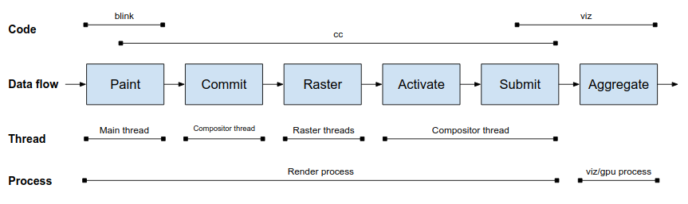
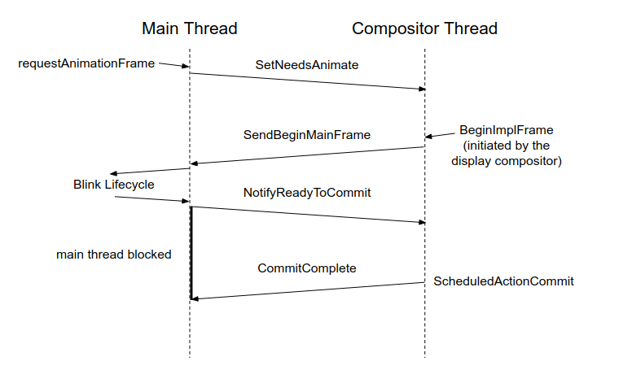
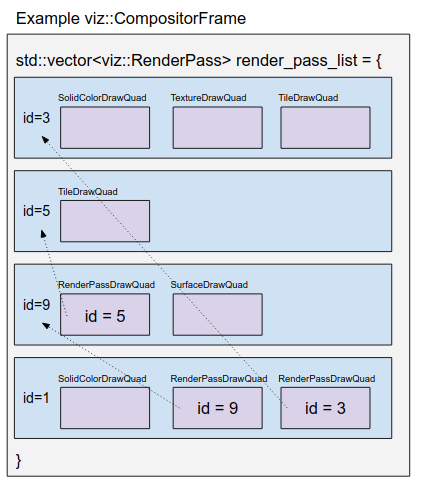

# How cc Works

[Original google doc](https://docs.google.com/document/d/1yjzOWrPfFGviEd1nru3yzqxSHETC-zsEBSt9C8SvV-Q/edit)

[Chinese](https://zhuanlan.zhihu.com/p/54601110) | [Korean](https://github.com/naver/whale-browser-developers/blob/master/translation/chromium/docs/how_cc_works.md)

[TOC]

## tl;dr

[cc/](https://cs.chromium.org/chromium/src/cc/) is historically but inaccurately called the Chrome Compositor.
It's neither "the" chrome compositor (of course we have many), nor a compositor at all any more.
danakj suggests "content collator" as an alternative name.

cc is embedded via ui/compositor or Android code in the browser process.
It is also embedded in the renderer process via Blink / RenderWidget.
cc is responsible for taking painted inputs from its embedder, figuring out where and if they appear on screen, rasterizing and decoding and animating images from the painted input into gpu textures, and finally forwarding those textures on to the display compositor in the form of a compositor frame.
cc also handles input forwarded from the browser process to handle pinch and scroll gestures responsively without involving Blink.

## Process / thread architecture

cc can be embedded in both single-threaded and multi-threaded incarnations.
The single-threaded version has less overhead.
The multi-threaded version incurs a latency cost, but allows for input and animations to be responsively handled on one thread while the other thread is busy.
In general, the browser uses the single-threaded version as its main thread is cheap and light, whereas the renderer uses the multi-threaded version as its main thread (Blink) can be quite busy on some pages.

Both single and multi-threaded versions drive themselves using the [cc::Scheduler](#scheduling), which determines when to submit frames.
The one exception (a third mode that is only used in one place) is Blink web tests and sim tests, which do not (always) use a scheduler and tell cc when to composite synchronously, via LayerTreeHost::CompositeForTest.
This is for historical reasons, and also to have more control during testing.

## Content Data Flow Overview

The main interface to cc by embedders is a LayerTreeHost (created with various LayerTreeSettings) and a [tree](#trees-commit-activation) of [Layers](#layers).
A Layer is a rectangle of content, with various properties describing how that content should appear on screen.
cc is responsible for turning a painted representation of that content (e.g. a PaintRecord) into a rasterized representation (a software bitmap or a gpu texture) and figuring out where that rectangle appears on screen.

cc turns this layer tree input into a set of property trees via a PropertyTreeBuilder and simplifies the layer tree down to an ordered list of visible layers.
As a part of the slimming paint project, Blink will set property trees and layer list directly instead of going through the more historical layer tree interface and avoid the work of this part of the pipeline.

During the [commit process](#commit-flow), cc forwards all of the inputs from the main thread data structures to compositor thread data structures.
At this point, cc determines which parts of each Layer are visible and proceeds to decode images and [raster content](#raster-and-tile-management).
Once all the content is ready to appear on screen, cc [activates](#trees-commit-activation) the committed tree and can then "draw" from it.

cc unfortunately still uses the language of "draw" and “swap” in a number of places, despite the fact that it no longer does either of these things.
“Draw” in cc means constructing a [compositor frame](#compositor-frames-render-passes-quads) full of quads and render passes for eventual drawing on screen.
“Swap” in cc means submitting that frame to the display compositor via a CompositorFrameSink.
These frames get sent to the viz SurfaceAggregator where compositor frames from all frame producers are aggregated together.

## Input Data Flow Overview

The other main piece of input to cc is user input, such as mouse clicks, mouse wheels, and touch gestures.
In the renderer process, input is forwarded from the browser process.
It is processed by ui::InputHandlerProxy (a cc::InputHandlerClient).

Some of this input is forwarded to the LayerTreeHostImpl (a cc::InputHandler) at specific times.
This allows it to modify the active layer’s property tree and scroll or pinch as needed.
Some input can’t be handled by the compositor thread (e.g. there’s a synchronous Javascript touch or wheel handler) and so that input is forwarded along to Blink to handle directly.
This input flow follows the opposite path of the content data flow in the section above.

## Commit Flow

Commit is a method of getting data atomically from the main thread to the compositor thread.
(Even when running in single threaded mode, this operation occurs to move data into the right data structures.) Rather than sending an ipc, commit is done by blocking the main thread and copying data over.

The main thread can request a commit in several ways.
Most webpages request one via requestAnimationFrame, which eventually calls SetNeedsAnimate on LayerTreeHost.
Additionally, modifying any of cc’s inputs (e.g. a layer property, such as its transform or a change to the layer’s content), will call either SetNeedsAnimate, SetNeedsUpdate, or SetNeedsCommit on LayerTreeHost.
The different SetNeeds functions allow for different levels of early-out aborts of the commit if no work is determined to be needed.
(For example, if the requestAnimationFrame callback does no work, then there’s no need to do the commit or even update layers.) All of these functions request a BeginMainFrame from the scheduler, if not currently in the middle of servicing one.

At some point, the scheduler will respond with a ScheduledActionBeginMainFrame.
This sends BeginFrameArgs from the compositor thread to the main thread to start a BeginMainFrame.
BeginFrameArgs contain a time (for animation purposes) as well as any scroll deltas that have been applied on the compositor thread (mainly as a result of handling user scroll gestures) that Blink doesn’t know about.
When Blink is embedding cc, a BeginMainFrame applies any compositor scroll deltas to Blink, kicks off requestAnimationFrame logic, and finishes the Blink half of the [rendering lifecycle](https://docs.google.com/document/d/1aitSOucL0VHZa9Z2vbRJSyAIsAz24kX8LFByQ5xQnUg/edit#).

Once this is done, cc updates all layers.
If at any point in this update pipeline, cc determines that no work left is required (e.g. a compositor thread scroll updates Blink, but Blink makes no changes to the page in response to that scroll), then it may abort the commit early.
(Single-threaded cc never aborts commits, currently.)  Once the embedder has finished its BeginMainFrame work and if the commit has not been aborted, then ProxyMain sends a synchronous NotifyReadyToCommit and blocks by forwarding a mutex to the compositor thread.

When the scheduler is ready to commit, it will respond with a ScheduledActionCommit.
The ProxyImpl on the compositor thread then does all the work of copying the data from the main thread (while it is blocked) to compositor thread data structures.
It then releases the mutex so that the main thread can proceed.

ProxyImpl is the only class that accesses data structures on both the main thread and the compositor thread.
It only accesses the LayerTreeHost and Layers on the main thread when the main thread is blocked and enforces this through accessor DCHECKs.
ProxyMain is its counterpart that exists on the main thread and is owned by the LayerTreeHost.
For the single threaded case, SingleThreadProxy encompasses the tasks of both ProxyMain and ProxyImpl.

## Layers

A layer is a 2d rectangle of content with integer bounds.
It has some transform, clip, and effects on it that describe how it should look on screen.

There are two separate class hierarchies of Layers, one for the main thread layer tree (deriving from cc::Layer) and one for the compositor thread pending, active, and recycle layer trees (deriving from cc::LayerImpl).
There is roughly a 1:1 correspondence, such that there exists SurfaceLayer and SurfaceLayerImpl or PictureLayer and PictureLayerImpl, so this section will mostly talk about these pairs synonymously.

On the main thread, Layers are refcounted.
LayerTreeHost owns the root layer, and each layer recursively owns its children.
Some other parts of Blink also provide layers (e.g. the media system creating surface or video layers, plugins), which is why this is ref-counted.
On the compositor thread, layers are unique_ptrs, owned by their parents.

### Property Trees

There are two ways of specifying hierarchical properties in cc.
The historical way (and the way that ui/ manages this) is to provide a tree of Layers.
If a parent layer has a transform (e.g. a translation, scale, or perspective), a clip, or an effect (e.g. a blur filter, or a mask, or an opacity) then this applies recursively to its children.
This abstraction has a lot of [corner cases](https://docs.google.com/presentation/d/1V7gCqKR-edNdRDv0bDnJa_uEs6iARAU2h5WhgxHyejQ/edit#slide=id.g1c810b6196_0_68) (fixed position layers, scroll parents, scroll children) as well as not being performant (requires traversing a very large tree and calculating all properties at all steps).

[Property trees](https://docs.google.com/presentation/d/1V7gCqKR-edNdRDv0bDnJa_uEs6iARAU2h5WhgxHyejQ/edit?usp=sharing) are a way around this.
Instead, cc is provided with separate trees of properties: a transform tree, a clip tree, an effect tree.
Each layer then has a node id for which transform, clip, and effect node that the layer is using.
In this way, the update is O(interesting nodes) instead of O(layers).
When there are property trees, there is also no longer a need for a tree of layers, and instead an ordered list of layers can be used.

### PictureLayer

A layer containing painted content.
This content comes in the form of a cc::PaintRecord.
PictureLayer is responsible for figuring out which scale(s) the content should be rastered at.
Each scale is represented by a PictureLayerTiling, which is a sparse 2d regular tiling of the content at a particular scale.

Each tile in this tiling is a cc::Tile, which represents potential content and their [rasterization is organized by the TileManager](#raster-and-tile-management).
If you turn on composited layer borders in the [DevTools rendering settings](https://developer.chrome.com/devtools/docs/rendering-settings), you can see the tile borders.
There are a number of heuristics that determine tile sizes, but for software raster tiles are roughly 256x256 px and for gpu raster tiles are roughly viewport width x one quarter viewport height.

There are a number of heuristics to determine when and how to change rasterization scales.
These aren’t perfect, but change them at your own peril.
🐉🐉🐉

#### Directly composited images

A specialized raster mode of PictureLayerImpl.
If a PictureLayer's DisplayItemList consists of a single drawImageRect DrawOp, we use different logic to determine what the raster scale of the image should end up being.
The layer is rastered at fixed scales such that scaling this image is performant.
The default raster scale is chosen such that the image will raster at its intrinsic side, then that scale is adjusted, based on how close it is to the ideal scale.
See PictureLayerImpl::ShouldAdjustRasterScale and RecalculateRasterScales for more details.

### TextureLayer

Used for plugins, canvas when it does its own raster, and WebGL.
The "texture" here refers to a reference to a gpu texture, though under software compositing it would be a shared memory bitmap.

### SolidColorLayer

If a layer is known to be merely a solid color, then there is no need to spend raster work or gpu memory on it.
This is an optimization for when a layer’s content is known to be simple.

### VideoLayer

Deprecated as a part of the [surfaces for video project](https://docs.google.com/document/d/1tIWUfys0fH2L7h1uH8r53uIrjQg1Ee15ttTMlE0X2Ow/edit).
Should eventually be deleted.

### SurfaceLayer

A surface layer has a surface id, which refers to some other stream of compositor frames in the system.
This is a way of having an indirection to other compositor frame producers.
See also: [surface documentation](https://www.chromium.org/developers/design-documents/chromium-graphics/surfaces).
For example, Blink embeds references to out of process iframes via SurfaceLayer.

### SolidColorScrollbarLayer

Android scrollbars are "solid color" scrollbar layers.
They are simple boxes that can be drawn on the compositor without creating texture resources for them.
Both solid color and painted scrollbar layers exist so that scrolling on the compositor thread can update the scrollbar responsively without going back to the main thread.
Without this, the page would scroll smoothly but the scrollbar would jump around jankily.

### Painted(Overlay)ScrollbarLayer

Desktop (non-Android) scrollbars are painted scrollbars.
Because theme code is not thread safe, the thumb and track are painted and rastered into bitmaps on the main thread.
Then, those bitmaps are emitted as quads on the compositor thread.
ChromeOS uses PaintedOverlayScrollbarLayer, which is a nine-patch bitmap version.

### HeadsUpDisplayLayer

This layer supports [devtools rendering settings](https://developer.chrome.com/devtools/docs/rendering-settings).
It draws an Frame Rendering Stats, as well as overlays for paint invalidation or damage.
This layer is special because it must be updated last because its inputs depend on all of the other layers’ damage calculations.

### UIResourceLayer / NinePatchLayer

UIResourceLayer is the software bitmap equivalent of TextureLayer.
It handles uploading bitmaps and recreating them as needed when contexts are lost.
NinePatchLayer is a derived UIResourceLayer class that dices up a UIResource into stretchable pieces.

## Trees: commit / activation

There are four types of layer trees, although there always exists 2-3 at any given time:

* Main thread tree (cc::Layers, main thread, always exists)

* Pending tree (cc::LayerImpl, compositor thread, staging for rasterization, optional)

* Active tree (cc::LayerImpl, compositor thread, staging for drawing, always exists)

* Recycle tree (cc::LayerImpl, compositor thread, mutually exclusive with pending tree)

These are called "trees" as historically they have been trees and they exist in cc/trees/, but they are all lists and not trees (sorry).
The main thread tree of Layers is owned by LayerTreeHost.
The pending, active, and recycle trees of LayerImpls are all LayerTreeImpl instances owned by LayerTreeHostImpl.

Commit is the process of pushing layer trees and properties from the main thread layer list to the pending tree.
Activation is the process of pushing layer trees and properties from the pending tree to the active tree.
During each of these processes, a duplicate layer structure is created (with the same layer ids, layer types, and properties).
Layer ids are used to find the corresponding layer on each tree.
A layer with id 5 on the main thread tree will push to layer id 5 on the pending tree.
That pending layer will push to a layer with id 5 on the active tree.
If that layer doesn’t exist, during the push it will be created. Similarly layers that no longer exist in the source tree are removed from the destination tree.
This is all done via the tree synchronization process.

Because allocation of Layer(Impl)s is expensive and most layer tree structures do not change from frame to frame, once a pending tree activates, it becomes the "recycle tree".
This tree is never used for anything except for a cache of the last pending tree.
This avoids allocation and property pushing work from main thread to pending tree.
This is merely an optimization.

The reason the pending tree exists is that if there are multiple changes to webpage content in a single Javascript callstack (e.g. an html canvas has a line drawn on it, while a div moves, and some background-color changes to blue), these all must be presented to the user atomically.
Commit takes a snapshot of these changes and pushes them to the pending tree, so that Blink can continue to update the main thread tree for a future commit.
After commit, these changes need to be rastered, and all of that rasterization must be complete before any of those new tiles can be presented to the user.
The pending tree is the staging area to wait until all of the asynchronous rasterization work is complete.
While the pending tree is staging all the rasterization work, the active tree can be updated with animations and scrolling to still be responsive to the user.

Single-threaded versions of cc do not have a pending tree and commit directly to the active tree.
(The recycle tree is unused in this mode.)  This is an optimization to avoid extra work and copies.
To work around this, the active tree is unable to be drawn until its tiles are all ready to draw.
However, given that this is a single-threaded version of cc, there are no compositor thread animations or scrolling, and so there is little reason to need to draw.

## Raster and tile management

TileManager is responsible for rasterizing the world of tiles.
Each PictureLayer provides a set of Tiles to rasterize, where each Tile is a subrectangle of painted content at a particular scale.

The TileManager finds all the tiles that are required to draw on the active tree, all the tiles that are required to activate on the pending tree, less important tiles that are close to the viewport but are not visible, and also offscreen images to decode.

There are currently two modes of raster in cc:

* software raster: generate software bitmaps in the raster worker

* gpu raster: generate gpu textures by sending paint commands over the command buffer

The TileManager always uses software raster for software compositing. For GPU compositing the
decisions is based on RasterContextProvider capabilities. It is always in one mode or the other.
See [Raster Buffer Providers](#raster-buffer-providers) for further details.
Switching modes destroys all resources.
A common reason for switching modes is that the gpu process has crashed too much and all of Chrome switches from gpu to software raster and compositing modes.

Once the TileManager decides the set of work to do, it generates a TaskGraph with dependencies and schedules that work across worker threads.
TaskGraphs are not updated dynamically, but instead rescheduled as a whole graph.
Tasks cannot be cancelled once they have started running.
Scheduled tasks that have not yet started are cancelled by submitting another graph that does not include them.

### Image Decoding

Image decoding receives a lot of special care in the TileManager, as they are the most expensive part of raster, especially relative to comparatively speedy gpu raster.
Each decode receives its own dependent task in the task graph.
There is a separate decode cache for software raster vs gpu raster.
The SoftwareImageDecodeCache manages decode, scale, and color correction, whereas the GpuImageDecodeCache also uploads those textures to the gpu process, storing them in [gpu discardable memory](https://docs.google.com/document/d/1LoNv02sntMa7PPK-TZTuMgc3UuWFqKpOdEqtFvcm_QE/edit).

cc also handles all animation of animated gifs in Chrome.
When gifs animate, they generate a new pending tree (initiated by the compositor thread instead of the main thread) with some raster invalidations and then re-raster tiles that are covered by that gif.

### Raster Buffer Providers

Apart from software vs hardware raster modes, Chrome can also run in software vs hardware display compositing modes.
Chrome never mixes software compositing with hardware raster, but the other three combinations of raster mode x compositing mode are valid.

The compositing mode affects the choice of RasterBufferProvider that cc provides, which manages the raster process and resource management on the raster worker threads:

* BitmapRasterBufferProvider: rasters software bitmaps for software compositing

* OneCopyRasterBufferProvider: rasters software bitmaps for gpu compositing into shared memory, which are then uploaded to gpu memory in the gpu process

* ZeroCopyRasterBufferProvider: rasters software bitmaps for gpu compositing directly into a GpuMemoryBuffer (e.g. IOSurface), which is memory that can be mapped by CPU and used by the GPU

* GpuRasterBufferProvider: rasters gpu textures for gpu compositing over a command buffer via paint commands (for gpu raster)

Note, due to locks on the context, gpu raster is limited to one worker thread at a time, although image decoding can proceed in parallel on other threads.
This single thread limitation is solved with a lock and not with thread affinity.

## Animation

This directory implements an animation framework (used by LayerTreeHost(Impl) through the cc::MutatorHost interface). The framework supports keyframe based animations of transform lists, opacity, and filter lists which directly manipulate those values on the relevant TransformNode / EffectNode in the property tree (identified by ElementId).

An animation is represented by an instance of Animation which has one (or more in the future) KeyframeEffects, each of which has multiple KeyframeModels. Animation manages the play state, start time, etc of an animation, KeyframeEffect represents a target element of the animation, and each KeyframeModel describes the animation of a particular property (e.g. transform / opacity / filter) on that element. An animation may either represent an embedder animation (e.g., a Blink animation of a transform property) or it can be an animation from cc itself (e.g., a scroll animation for smooth scrolling).

LayerTreeHostImpl informs AnimationHost of new and removed elements, which in turn will update the state of animations which depend on those elements. It calls NeedsTickAnimations to know if more animation frames should be scheduled, and TickAnimations every frame to update animation timing, state, generate animation events, and update the actual output value of property tree nodes based on the animation.

## cc/paint/

This directory stores a number of classes that represent painted content.
They are extremely similar to Skia data structures, but are mutable, introspectable, and serializable in all cases.
They also handle security concerns (e.g. [TOCTOU](https://en.wikipedia.org/wiki/Time_of_check_to_time_of_use) issues serializing out of shared memory that a malicious renderer could be manipulating as it is read by the gpu process) that Skia does not want to think about.

PaintRecord (aka PaintOpBuffer) is the SkPicture equivalent that stores a number of PaintOps.
A PaintRecord can either be rasterized by a raster buffer provider into a bitmap (when using software raster) or it can be serialized (when using gpu raster).

PaintCanvas is the abstract class to record paint commands.
It can be backed by either a SkiaPaintCanvas (to go from paint ops to SkCanvas) or a PaintRecordCanvas (to turn paint ops into a recorded PaintRecord).

## Scheduling

cc’s actions are driven by a cc::Scheduler.
This is one of many schedulers in Chrome, including the Blink scheduler, the viz::DisplayScheduler, the browser UI task scheduler, and the gpu scheduler.

The cc::Scheduler is owned by ProxyImpl (or SingleThreadProxy).
It takes various inputs (visibility, begin frame messages, needs redraw, ready to draw, ready to activate, etc).
These inputs drive the cc::SchedulerStateMachine, which then determines actions for the SchedulerClient (LayerTreeHostImpl) to take, such as "Commit" or “ActivateSyncTree” or “PrepareTiles”.
These actions are generally expensive parts of the pipeline that we want to carefully rate limit or that have state-related dependencies.

cc::Scheduler code differentiates begin frames from the display compositor as BeginImplFrame (i.e. should cc produce a compositor frame) and a begin frame for its embedder as BeginMainFrame (i.e. should cc tell Blink to run requestAnimationFrame and produce a commit, or in the browser if should cc tell ui to do something similar).
The BeginImplFrame is driven by a viz::BeginFrameSource which in turn is driven the the display compositor.

In a full pipeline update with low latency and fast rasterization, the general scheduling flow is BeginImplFrame -> BeginMainFrame -> Commit -> ReadyToActivate -> Activate -> ReadyToDraw -> Draw.

Additionally, if rasterization is slow, a second BeginMainFrame can be sent before activation, and it will block in NotifyReadyToCommit until the activation completes, as the SchedulingStateMachine will prevent the commit from starting while there is a pending tree that hasn’t activated yet.
This allows the main thread to work on the next frame in parallel instead of sitting idle at the expense of latency.
One hypothetical ordering of events with slow raster could be:

BeginImplFrame1 -> BeginMainFrame1 -> Commit1 -> (slow raster) -> BeginImplFrame2 -> BeginMainFrame2 -> ReadyToActivate1 -> Activate1 -> Commit2 -> ReadyToDraw1 -> Draw1.

The cc::Scheduler maintains a deadline by which it expects its embedder to respond.
If the main thread is slow to respond, then the Scheduler may draw without waiting for a commit.
If this happens, then Scheduler is considered to be in high latency mode.
If future frames start becoming faster again, the scheduler can attempt to skip a BeginMainFrame in order to "catch up" and re-enter low latency mode.
High latency mode trades off latency for throughput by increasing pipelining.
It maintains this distinction by keeping a history of times and trying to adjust with heuristics.

## Compositor frames, render passes, quads

The output of cc is a compositor frame.
A compositor frame consists of metadata (device scale, color space, size) and an ordered set of render passes.
A render pass contains an ordered set of quads that have references to resources (e.g. gpu textures) and information about how to draw those resources (sizes, scales, texture coordinates, etc).
A quad is a single rectangle on screen, and is what you see when [composited layer borders are visualized](https://developer.chrome.com/devtools/docs/rendering-settings#show-composited%20layer%20borders).
Layers themselves produce quads via derived AppendQuads function.
This produces a set of quads that fill (without overlapping or intersecting) the visible rect of the layer.

There are various types of quads that roughly correspond to different layer types (ContentDrawQuad, TextureDrawQuad, SolidColorDrawQuad).
Because layers that produce many quads (i.e. PictureLayerImpl) produce many quads with the same info, SharedQuadState is an optimization that collects this shared information so that each individual quad is slimmer.
RenderSurfaceImpls are 1:1 with render passes and exist mostly to provide the same AppendQuads logic that Layers do for their quads, in that RenderSurfaceImpl produces RenderPassDrawQuads.

A render pass exists to support composited effects (see: effect tree).
These can be cases where compositing is required to perform an effect.
It can also be cases where doing compositing first can make the effect easier to implement (because then it applies to a single render pass texture, instead of an arbitrary set of quads produced by some subtree of layers).
Common cases for render passes are: masks, filters (e.g. blur), clipping rotated layers, or opacity applied to a subtree of content.

Inside a compositor frame, render passes and the quads within a render pass are ordered.
The render passes are a flattened list that represent that dependency tree of render passes.
If render pass 1 depends on render pass 9 (because it contains a RenderPassDrawQuad referencing the output of 9), then 9 will appear in the list before 1.
Therefore, the root render pass is always last in the list.
Inside a single render pass, the quads are ordered back to front ([Painter’s algorithm](https://en.wikipedia.org/wiki/Painter%27s_algorithm)).

In general, quads are not considered to live in a 3d space (even if transformed by 3d transforms) and are still drawn in order, on top of anything drawn before it.
However, there is a mode where a set of quads can be in a 3d context (caused by css transform-style: preserve-3d).
A BSP tree is used to sort and intersect these against each other in the same 3d context.

## Glossary

See: [cc/README.md](https://chromium.googlesource.com/chromium/src/+/main/cc/README.md#glossaries)

## Other Resources

For a list of presentations, videos, and design docs, see: [https://www.chromium.org/developers/design-documents/chromium-graphics](https://www.chromium.org/developers/design-documents/chromium-graphics)

## Miscellaneous Corner Cases That Don’t Fit Anywhere Else, Sorry

### Damage

Chrome has different notions of invalidation throughout the system.
"Paint invalidation" is portions of the document that need to be repainted in Blink.
“Raster invalidation” is parts of a layer that have changed and need to be re-rastered (possibly due to paint invalidation, but also synthetic invalidations such as the first time a layer is rastered or when textures are thrown away and then needed again).
Finally, damage is another word for “draw invalidation”.
It’s the part of the screen that needs to be redrawn.

There are two types of damage: invalidation damage and expose damage.
Invalidation damage is due to raster invalidation, where a part of a texture has changed and the screen needs to be updated.
Expose damage is when a layer goes away, gets added for the first time, or gets reordered.
There’s no raster invalidation in these cases, but the screen still needs to be updated.

cc calculates damage in the DamageTracker and forwards it along with a CompositorFrame.
One reason damage is needed in the display compositor is to do partial swap (where only a portion of the screen is updated), which saves power.
Another reason is when using hardware overlays, such that the display compositor can know that only an overlay was damaged and not have to re-composite the rest of the scene.

### Mask Layers

Mask layers are layers used to implement a [masking effect](https://webkit.org/blog/181/css-masks/).
They sit outside the layer tree, without parents.
They’re owned by the layer the mask is applied to.
They can be any type of layer subclass (e.g. PictureLayer or SolidColorLayer).
Any time layers are iterated over, they are a special case that needs to be considered because they aren’t part of the normal parent/child tree.
They get treated the same as other layers in terms of rasterization and tile management, although their AppendQuads function goes through RenderSurfaceImpl instead of in the top level iteration, because they are part of an effect and not a layer drawn on its own.

### "Impl"

cc uses the "impl" suffix ...differently than the rest of Chrome or other software engineers.
In cc, “impl” means that the class is used on the compositor thread and not on the main thread.

The historical reason for this is that at one point we had Layer on the main thread and we needed an equivalent class to run on the compositor thread.
jamesr@ consulted with nduca@ who made the very logical argument that things on the compositor thread were internal to the compositor and would really be the implementation of the main thread version, and hence LayerImpl.
See: [https://bugs.webkit.org/show\_bug.cgi?id=55013#c5](https://bugs.webkit.org/show_bug.cgi?id=55013#c5)

Then if you need a tree of LayerImpls, you have LayerTreeImpl, and a place to hang those trees is LayerTreeHostImpl.
Suddenly, then the "impl thread" was the thread where all the “impl classes” lived.
If you’re moving rasterization to the compositor thread, then suddenly that’s called “impl-side painting”.
