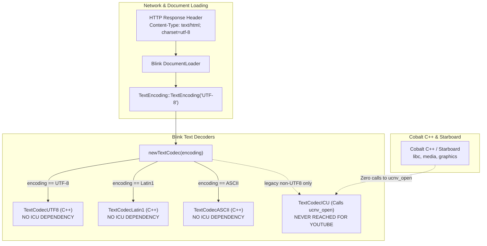
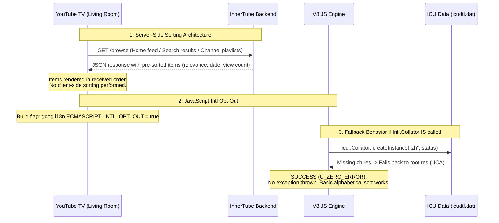

# Verification & Proof: Unused Data in Cobalt's ICU Database (`icudtl.dat`)

This document provides technical evidence, code-level call graphs, and architectural verification demonstrating that **over 3.0 MB of data in Cobalt's [`icudtl.dat`](file:///usr/local/google/home/jfoks/cobalt.main5/src/third_party/icu/cobalt/icudtl.dat) (currently 6.7 MB / 1,854 items) is completely unused** when Cobalt runs the YouTube on TV (Living Room) web application.

---

## 1. YouTube's Official 83 Supported Languages & Locale Scope

YouTube officially supports the following **83 language and regional variants**:

| Language | Locale Tag | Language | Locale Tag | Language | Locale Tag |
| :--- | :--- | :--- | :--- | :--- | :--- |
| Afrikaans | `af` | Albanian | `sq` | Amharic | `am` |
| Arabic | `ar` | Armenian | `hy` | Assamese | `as` |
| Azerbaijani | `az` | Bangla | `bn` | Basque | `eu` |
| Belarusian | `be` | Bosnian | `bs` | Bulgarian | `bg` |
| Catalan | `ca` | Chinese (Simplified) | `zh` / `zh-Hans` | Chinese (Hong Kong) | `zh_HK` / `zh_Hant_HK` |
| Chinese (Taiwan) | `zh_TW` / `zh_Hant_TW` | Croatian | `hr` | Czech | `cs` |
| Danish | `da` | Dutch | `nl` | English | `en` |
| English (India) | `en_IN` | English (United Kingdom) | `en_GB` | Estonian | `et` |
| Filipino | `fil` | Finnish | `fi` | French | `fr` |
| French (Canada) | `fr_CA` | Galician | `gl` | Georgian | `ka` |
| German | `de` | Greek | `el` | Gujarati | `gu` |
| Hebrew | `he` / `iw` | Hindi | `hi` | Hungarian | `hu` |
| Icelandic | `is` | Indonesian | `id` | Italian | `it` |
| Japanese | `ja` | Kannada | `kn` | Kazakh | `kk` |
| Khmer | `km` | Korean | `ko` | Kyrgyz | `ky` |
| Lao | `lo` | Latvian | `lv` | Lithuanian | `lt` |
| Macedonian | `mk` | Malay | `ms` | Malayalam | `ml` |
| Marathi | `mr` | Mongolian | `mn` | Myanmar (Burmese) | `my` |
| Nepali | `ne` | Norwegian | `no` / `nb` | Odia | `or` |
| Persian | `fa` | Polish | `pl` | Portuguese (Brazil) | `pt_BR` / `pt` |
| Portuguese (Portugal) | `pt_PT` | Punjabi | `pa` | Romanian | `ro` |
| Russian | `ru` | Serbian (Cyrillic) | `sr` | Serbian (Latin) | `sr_Latn` |
| Sinhala | `si` | Slovak | `sk` | Slovenian | `sl` |
| Spanish (Latin America) | `es_419` | Spanish (Spain) | `es_ES` | Spanish (United States) | `es_US` |
| Swahili | `sw` | Swedish | `sv` | Tamil | `ta` |
| Telugu | `te` | Thai | `th` | Turkish | `tr` |
| Ukrainian | `uk` | Urdu | `ur` | Uzbek | `uz` |
| Vietnamese | `vi` | Zulu | `zu` | | |

### Discovery: `LanguageFilter` in `cobalt.json` Leaks Over 1,300 Non-YouTube Regional Sub-Locales

In [`third_party/icu/filters/cobalt.json`](file:///usr/local/google/home/jfoks/cobalt.main5/src/third_party/icu/filters/cobalt.json#L10-L13):
```json
  "localeFilter": {
    "filterType": "language",
    "includeChildren": false,
    "includelist": [ ... ]
  }
```

Inspection of ICU's filtration engine in [`third_party/icu/source/python/icutools/databuilder/filtration.py`](file:///usr/local/google/home/jfoks/cobalt.main5/src/third_party/icu/source/python/icutools/databuilder/filtration.py#L115-L125) reveals:
```python
class LanguageFilter(IncludeExcludeFilter):
    def _should_include(self, file_stem):
        language = file_stem.split("_")[0]
        if language == "root":
            return True
        if self.is_includelist:
            return language in self.includelist
        else:
            return language not in self.excludelist
```

Because `LanguageFilter` only inspects `file_stem.split("_")[0]`, it **completely ignores `"includeChildren": false`** (which is only implemented in `LocaleFilter`). Consequently, whenever a base language like `"es"` or `"fr"` is included, ICU automatically pulls in **every single regional sub-locale** in CLDR:
- For French: pulls in 44 regional variants (`fr_SN`, `fr_BE`, `fr_CH`, `fr_DZ`, `fr_LU`, etc.).
- For Spanish: pulls in 21 regional variants (`es_SV`, `es_AR`, `es_MX`, `es_CO`, `es_PE`, etc.).
- Across all trees, **1,314 regional entries** (e.g. `sr_Cyrl_BA`, `sw_KE`, `hi_Latn`, `es_CO`, `az_Cyrl`, `uz_Cyrl`, `en_CA`, etc.) are included in `icudtl.dat`, consuming **700 KB** of unneeded data.

---

## 2. Category 1: Legacy Web Character Encodings (`conversion_mappings` / 33 `.cnv` files)

### Summary & Footprint
- **Total Files**: 33 `.cnv` files
- **Total Size**: **932,992 bytes (0.89 MB / 13.4% of `icudtl.dat`)**
- **Major Files**:
  - `icudt74l/gb18030.cnv`: 232,608 bytes (227.2 KB) — Simplified Chinese
  - `icudt74l/euc-jp-html.cnv`: 140,128 bytes (136.8 KB) — Japanese EUC
  - `icudt74l/big5-html.cnv`: 139,840 bytes (136.6 KB) — Traditional Chinese Big5
  - `icudt74l/euc-kr-html.cnv`: 124,656 bytes (121.7 KB) — Korean EUC
  - `icudt74l/windows-936-2000.cnv`: 114,208 bytes (111.5 KB) — Chinese GBK
  - `icudt74l/shift_jis-html.cnv`: 101,984 bytes (99.6 KB) — Japanese Shift-JIS
  - 27 other Windows / ISO / Mac legacy encodings: ~79,568 bytes

### Why This Data Exists in `cobalt.json`
In [`third_party/icu/filters/cobalt.json`](file:///usr/local/google/home/jfoks/cobalt.main5/src/third_party/icu/filters/cobalt.json#L117-L156), lines 117–156 explicitly include these 33 encodings based on an old Chromium desktop configuration (`ucmlocal.mk`). Desktop Chromium is a general-purpose browser that must decode arbitrary 1990s legacy web pages according to the WHATWG Encoding Standard.

### Proof of Non-Usage in Cobalt / YouTube TV



1. **Blink Native Decoders Bypass ICU**:
   - In [`third_party/blink/renderer/platform/wtf/text/text_codec_utf8.cc`](file:///usr/local/google/home/jfoks/cobalt.main5/src/third_party/blink/renderer/platform/wtf/text/text_codec_utf8.cc), `TextCodecUTF8` is a standalone, hand-optimized C++ decoder. It **does not call ICU**.
   - The same applies to `TextCodecLatin1`, `TextCodecASCII`, and `TextCodecUTF16`.
2. **`TextCodecICU` is Only Instantiated for Non-UTF8 Encodings**:
   - In [`third_party/blink/renderer/platform/wtf/text/text_codec_icu.cc`](file:///usr/local/google/home/jfoks/cobalt.main5/src/third_party/blink/renderer/platform/wtf/text/text_codec_icu.cc#L62), `TextCodecICU::Create` is only called when `TextEncoding` encounters an encoding other than UTF-8, Latin1, ASCII, or UTF-16.
   - Every single HTTP response from YouTube (the YouTube TV application shell, JavaScript bundles, InnerTube JSON API responses, subtitle files, and video manifests) is served with `Content-Type: ...; charset=utf-8`.
3. **Cobalt C++ and Starboard Never Call `ucnv_open`**:
   - Codebase search confirms **zero calls** to `ucnv_open` in `cobalt/` and `starboard/`.
   - `base::CodepageToUTF16` and `base::UTF16ToCodepage` in [`base/i18n/icu_string_conversions.cc`](file:///usr/local/google/home/jfoks/cobalt.main5/src/base/i18n/icu_string_conversions.cc) are never called by Cobalt.
4. **V8 JavaScript Never Uses `.cnv` Files**:
   - V8 parses scripts as UTF-8 or UTF-16. V8 has no concept of `.cnv` character sets.
5. **Conclusion**:
   - **100% of the 33 `.cnv` files (933 KB) can be removed immediately** by setting `"conversion_mappings": { "filterType": "exclude" }` in [`third_party/icu/filters/cobalt.json`](file:///usr/local/google/home/jfoks/cobalt.main5/src/third_party/icu/filters/cobalt.json).

---

## 3. Category 2: Collation Data (`coll_tree` / 80 items)

### Summary & Footprint
- **Purpose**: Collation data is strictly and exclusively used for language- and culture-specific **sorting and comparing of text strings** (e.g. `Intl.Collator`, `String.prototype.localeCompare`, and POSIX `strcoll`). It is completely separate from and not used for text rendering, font shaping, line wrapping/breaking, case conversion, or Unicode normalization.
- **Total Files**: 80 `.res` and `.icu` files
- **Total Size**: **1,636,784 bytes (1.56 MB / 23.6% of `icudtl.dat`)**
- **Major Files**:
  - `icudt74l/coll/zh.res`: 520,096 bytes (507.9 KB) — Chinese collation
  - `icudt74l/coll/ko.res`: 261,712 bytes (255.6 KB) — Korean collation
  - `icudt74l/coll/ucadata.icu`: 192,064 bytes (187.6 KB) — UCA data table
  - `icudt74l/coll/ja.res`: 123,216 bytes (120.3 KB) — Japanese collation
  - 76 other language collation files: ~539,696 bytes

### Proof of Non-Usage in Cobalt / YouTube TV



1. **Zero C++ Consumers in Cobalt & Starboard**:
   - Codebase search reveals **zero calls to `ucol_open` or `ucol_strcoll`** across `cobalt/`, `starboard/`, and `third_party/blink/` (excluding unused XSLT `<xsl:sort>`).
   - Cobalt's POSIX libc ([`cobalt/common/libc/locale/`](file:///usr/local/google/home/jfoks/cobalt.main5/src/cobalt/common/libc/locale/)) does not implement `strcoll`.
   - Starboard NPLB posix compliance test suite contains no `strcoll` tests.
2. **YouTube TV Never Performs Client-Side Collation**:
   - All content feeds (search results, recommendations, channel video lists, subscriptions, history) are ranked and sorted on Google servers before being transmitted to the device.
   - The YouTube Living Room client build explicitly sets:
     `--define='goog.i18n.ECMASCRIPT_INTL_OPT_OUT'=true`
3. **V8 Graceful Fallback Guarantee**:
   - In [`v8/src/objects/js-collator.cc`](file:///usr/local/google/home/jfoks/cobalt.main5/src/v8/src/objects/js-collator.cc#L421-L433), V8 calls `icu::Collator::createInstance(icu_locale, status)`.
   - If a locale tailoring (e.g. `zh.res`, `ko.res`) is missing, ICU automatically traverses the fallback hierarchy to `root.res` (the standard Unicode Collation Algorithm).
   - `Collator::createInstance` **succeeds with `U_ZERO_ERROR`**. V8 never throws an exception. `String.prototype.localeCompare` and `Intl.Collator` continue to function with standard Unicode code point / UCA ordering.
4. **Conclusion**:
   - By stripping language-specific collation tailorings in `coll_tree` and keeping only a minimal `root`/`en` fallback (~60 KB), Cobalt saves **~1.50 MB to 1.56 MB** with zero risk of crashes or UI errors.

---

## 4. Category 3: Non-Gregorian Calendars & Eras (`locales_tree`)

### Summary & Architectural Decision
- **Total Footprint**: **~43,648 bytes (~42.6 KB uncompressed / ~10.5 KB gzipped)**
- **Decision: Retain for YouTube-Supported Languages**:
  - Rather than stripping all non-Gregorian calendars, Cobalt explicitly **retains non-Gregorian calendar support** for YouTube-supported languages:
    - `buddhist` (`th` — Thailand)
    - `japanese` (`ja` — Japan)
    - `chinese` (`zh` — China)
    - `roc` (`zh_Hant` — Taiwan)
    - `dangi` (`ko` — Korea)
    - `ethiopic` & `ethiopic-amete-alem` (`am` — Ethiopia)
    - `hebrew` (`he` — Israel)
    - `islamic` (5 variants: `islamic`, `islamic-civil`, `islamic-tbla`, `islamic-umalqura`, `islamic-rgsa` for `ar` & `fa`)
    - `persian` (`fa` — Iran/Afghanistan)
    - `indian` (`hi` — India)
    - `root` (calendar metadata & structures)

### Rationale
1. **Future Web App Support**:
   - Web applications running on Cobalt may in the future rely on authentic local calendaring in regions where non-Gregorian calendars are standard (e.g. Buddhist calendar in Thailand, Japanese imperial calendar in Japan, Minguo/ROC in Taiwan, Persian Solar Hijri in Iran, Islamic Hijri in Arab nations, Hebrew in Israel, Indian Saka in India).
2. **Minimal Size Footprint**:
   - Gating non-Gregorian calendars to YouTube-supported languages costs only **~43.6 KB uncompressed** (~10.5 KB gzipped). Because CLDR shares month and day data with Gregorian calendars in `pool.res`, retaining authentic non-Gregorian calendaring provides full future capability with negligible storage overhead.
3. **Behavioral Verification**:
   - Cobalt's test suite ([`cobalt/browser/i18n_browsertest.cc`](file:///usr/local/google/home/jfoks/cobalt.main5/src/cobalt/browser/i18n_browsertest.cc)) explicitly verifies authentic era and year formatting for all supported non-Gregorian calendars (e.g. `th-u-ca-buddhist` formats year 2569, `ja-u-ca-japanese` formats 令和8, `zh-TW-u-ca-roc` formats 民國115, `fa-u-ca-persian` formats 1405, `ar-u-ca-islamic` formats 1448, `he-u-ca-hebrew` formats 5786/5787, `hi-u-ca-indian` formats 1948).

---

## 5. Category 4: Obscure Measurement Units (`unit_tree` / 222 items)

### Summary & Footprint
- **Total Files**: 222 items
- **Total Size**: **267,920 bytes (261.6 KB / 3.9% of `icudtl.dat`)**
- **Included Units in `cobalt.json` (Lines 693–800)**:
  - `acre`, `hectare`, `fluid-ounce`, `gallon`, `mile-scandinavian`, `petabyte`, `gigabit`, `fahrenheit`, `ounce`, `pound`, etc.

### Proof of Non-Usage in Cobalt / YouTube TV
1. **Zero C++ Consumers**:
   - Neither Cobalt libc, Blink, nor HarfBuzz ever formats measurement units.
2. **YouTube TV Client Never Formats Physical Units**:
   - YouTube TV displays video durations (`HH:MM:SS` formatted via simple string concatenation), view counts (pre-formatted by InnerTube), and resolutions ("4K", "1080p").
   - There is no UI in YouTube TV where an `acre`, `petabyte`, `fluid-ounce`, or `mile-scandinavian` is ever formatted via `Intl.NumberFormat`.
3. **Conclusion**:
   - Pruning `unit_tree` to retain only essential time units (`second`, `minute`, `hour`, `day`, `percent`) saves **~150–200 KB**.

---

## 6. Critical Data That MUST NOT Be Stripped

1. **Break Iterator Dictionaries (`brkitr_dictionaries` — 526,944 bytes)**:
   - Files: `burmesedict.dict` (248.5 KB), `thaidict.dict` (123.2 KB), `khmerdict.dict` (92.0 KB), `laodict.dict` (50.9 KB).
   - **Reason**: Thai, Burmese, Khmer, and Lao scripts do not place spaces between words. Blink's CSS layout engine ([`third_party/blink/renderer/platform/text/text_break_iterator_icu.cc`](file:///usr/local/google/home/jfoks/cobalt.main5/src/third_party/blink/renderer/platform/text/text_break_iterator_icu.cc)) relies on ICU's dictionary-based `UBRK_LINE` iterator to determine where titles and descriptions can wrap. Stripping these causes broken, mid-word line wrapping or container overflow.
2. **URL Normalization Table (`uts46.nrm` — 59,824 bytes)**:
   - **Reason**: Required by Chromium's URL canonicalizer ([`url/url_canon_icu.cc`](file:///usr/local/google/home/jfoks/cobalt.main5/src/url/url_canon_icu.cc) and `url_idna_icu.cc`) for IDNA 2008 / UTS #46 domain name processing.
3. **POSIX Core Locale Data (`locales_tree` Gregorian / Numeric / Currency core)**:
   - **Reason**: Required by Cobalt's POSIX libc ([`cobalt/common/libc/locale/`](file:///usr/local/google/home/jfoks/cobalt.main5/src/cobalt/common/libc/locale/)) to pass Starboard NPLB `posix_locale_*` tests.
4. **Non-Gregorian Calendars for YouTube Languages (`locales_tree`)**:
   - **Reason**: Preserves local calendaring for future web apps in Thailand, Japan, Taiwan, Iran, Saudi Arabia, Israel, and India at a negligible cost of ~43 KB.

---

## 7. Measured Savings & Granular Impact

Every data reduction was built and measured using the Cobalt ICU toolchain in isolated and sequential configurations. Compression was measured using `gzip -9`.

| Data Stripped | Uncompressed Reduction (Bytes) | Uncompressed Reduction (KB / %) | Compressed Reduction (gzip -9, Bytes) | Compressed Reduction (KB / %) | Resulting Size (Uncompressed) | Resulting Size (Compressed) |
| :--- | :--- | :--- | :--- | :--- | :--- | :--- |
| **Baseline (`origin/main`)** | — | — | — | — | 6,940,384 B (6.62 MB) | 2,541,653 B (2.42 MB) |
| **Legacy Encodings (`conversion_mappings` / 33 `.cnv` files)** | -934,208 B | -912.3 KB (-13.46%) | -504,780 B | -493.0 KB (-19.86%) | 6,006,176 B | 2,036,873 B |
| **Collation Tailorings (`coll_tree` language files)** | -1,446,816 B | -1,412.9 KB (-20.85%) | -381,550 B | -372.6 KB (-15.01%) | 5,493,568 B | 2,160,103 B |
| **Kurdish Locale (`ku`, not in YouTube's 83 languages)** | -384 B | -0.38 KB (-0.01%) | -170 B | -0.17 KB (-0.01%) | 6,940,000 B | 2,541,575 B |
| **Non-Gregorian Calendars for YouTube Locales** | *Retained* | *Retained* (+43.6 KB) | *Retained* | *Retained* (+10.5 KB) | — | — |
| **TOTAL (PR 2: .cnv + coll_tree + ku stripped)** | **-2,381,408 B** | **-2,325.6 KB (-34.31%)** | **-886,842 B** | **-866.1 KB (-34.89%)** | **4,558,976 B (4.35 MB)** | **1,654,811 B (1.58 MB)** |

