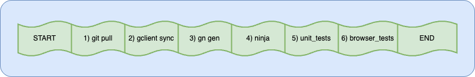
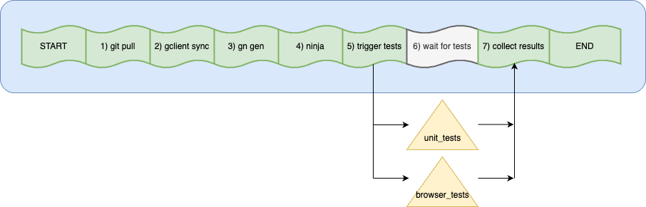
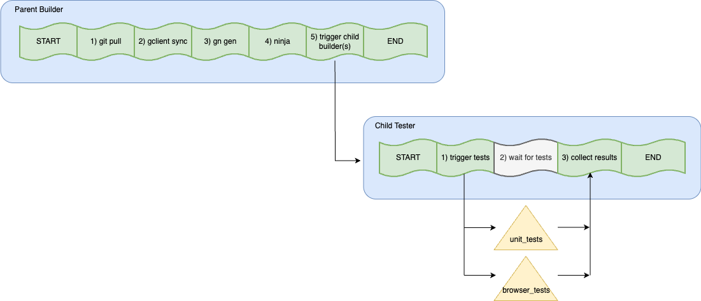
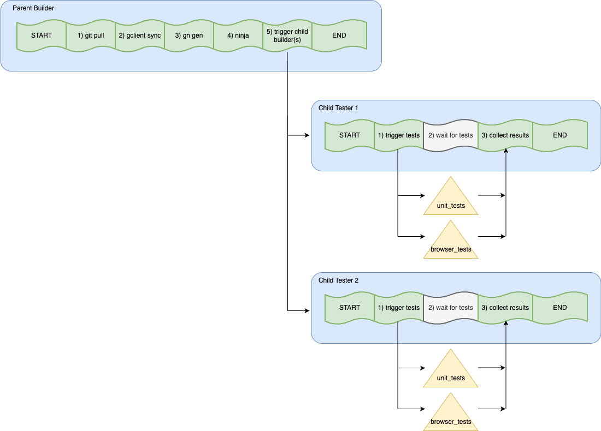
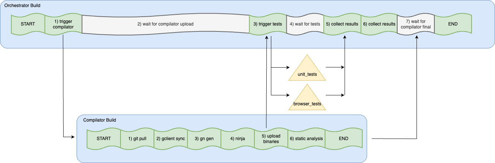

<!--
For Googlers, sources for these diagrams can be found at
http://shortn/_NVrAIFrMsw.
-->

# Builder types

Throughout Chromium's infra, there are a few different patterns of builder
designs. This doc describes the most commonly-used ones, and is intended to
be used as a reference when discussing or designing proposals for builders.

[TOC]

## Background

Before diving into the different types of builders, we need to first lay down
the definitions of key technologies. The infra [glossary](glossary.md)
contains definitions of terms used within this document.

### Swarming tasks

The lowest-level of task execution in Chromium's infra is a Swarming task. As
of writing (Q2 2025), nearly 100% of all workloads in Chromium's infra run as
Swarming tasks. However, certain types of workloads may have a varying amount
of abstractions around the base Swarming task (see [Builds](#Builds) below).

A Swarming task request is essentially comprised of the following:
- a single command to run
- a description of the dependencies that command needs before running (e.g.
  CIPD packages, CAS bundles)
- a description of the machine that should run that command (e.g. OS version,
  attached devices)

We use the phrase "raw Swarming task" to refer to any instance of a Swarming
task used without a layer of abstraction around it. Such raw tasks will be
identified in this doc's diagrams by the following component:

### Builds

Buildbucket builds (or just "builds" as they are often referred to) are a
level removed from Swarming tasks, and have many additional features that make
them more suitable for complex CI workloads. This includes things like better
UI support (integration with Milo) and libraries for common utilities, such as
checking-out code, applying a patch, compiling code, etc (a.k.a. "recipes"). The
execution of a build's recipe is rendered as discreet steps in the build UI
(a.k.a. Milo). As of writing (Q2 2025), nearly every build on Chromium's infra
is backed by a Swarming task

Consequently, it's not inaccurate to conceptualize a Buildbucket build simply
as a Swarming task whose command is its "recipe".

Buildbucket builds will be identified in this doc's diagrams by the following
component:

A recipe's steps within a build will be identified in this doc's diagrams by the
following component:

## Builder patterns

How one build or task triggers another is where much of the variance in builder
patterns emerges. The following are the most commonly-used builder patterns.

---

### All-in-one builder (local tests)

This is the most basic type of builder. It does everything within a single
build sequentially, without ever triggering a separate build or task. The
diagram below demonstrates this basic pattern: steps #1-2 check out the code,
steps #3-4 compile the code, and steps #5-6 test the code. Every step here
runs on the same machine running the build, even the tests. So we refer to
tests running in this patter as "local tests". (Note that even the most basic
build will have many more steps. They're elided here for simplicity.)

Adding new "local tests" onto Chromium builders is strongly discouraged these
days unless absolutely necessary, as they can inflate build cycle time. See the
following pattern for the alternative to local tests.

---

### All-in-one builder (swarmed tests)

In the prev pattern, we run every test suite sequentially. This next pattern
improves upon that by running each suite in parallel as raw Swarming tasks,
which leads to dramatic build cycle time improvements. In this new pattern, the
build starts out the same, but when it comes time to run the tests, it instead
makes Swarming RPCs to trigger raw tasks for the test suites. These suites run
in parallel, often times with the larger suites being sharded such that instead
of running the whole suite in one task, N tasks each run 1/Nth of the suite,
leading to even further speed-up. While all these raw test tasks run, the build
simply sleeps and waits for them to complete, after which it collates their
results. Given that swarmed tests are **much** faster than local tests due to
the parallelization, you'll find many more builders using this pattern than the
prev pattern.

Since this pattern experiences significant speed-up from its test
parallelization while still being somewhat simple, it's the suggested pattern
for most new builders. But if the requirements for a builder warrant it, there
are more complex patterns to choose from below.

---

### Parent-child split (a.k.a. "builder-tester split")

To reduce the compile time of bots (i.e. the `ninja` step in the diagrams here),
we will often provision the builder machines with increased CPU and RAM
resources. However, when doing so in the prev pattern, this over-provisioned
machine ends up sleeping for an extended period of time while waiting for the
test tasks. This is somewhat of a waste, since we'd have a 32-core or 64-core
machine stuck in a busy-waiting phase.

To avoid that waste, this next pattern divides these two phases (compiling
and testing) into two separate builders. The compiling phase gets confined to
the over-provisioned machine in the first build. Then, when compiling is
finished, the first build simply triggers a second build that picks up where
the first build left off. Importantly, the first build does not wait around for
the second after triggering. It can instead immediately pick up a new build,
which ensures its over-provisioned machine is kept on a tight loop of
CPU-intensive workloads. If the situation arises where the first builder is
cycling faster than the second and piling on build triggers, the child builder
will often take only the most recent trigger, and discard the rest. This helps
prevent slower child testers from lagging behind indefinitely. Furthermore,
since the second builder computationaly does very little (i.e. mostly just
Swarming RPCs & the busy-wait step), we can run it on very _under_-provisioned
machines with just 2 or 4 cores. This pattern gives us the speed-up of running
all tests remotely in parallel, while avoiding wasting machine resources.

The parent builder isn't restricted to just triggering a single child. If the
parent builder compiles binaries applicable for different platforms, it can
trigger one child builder for each of those platforms. For example, the
[Mac Builder](https://ci.chromium.org/ui/p/chromium/builders/ci/Mac%20Builder)
compiles one set of binaries, and hands these off to multiple child builders
for testing, one for each Mac version:
[Mac12 Tests](https://ci.chromium.org/ui/p/chromium/builders/ci/Mac12%20Tests),
[Mac13 Tests](https://ci.chromium.org/ui/p/chromium/builders/ci/Mac13%20Tests),
and
[mac14-tests](https://ci.chromium.org/ui/p/chromium/builders/ci/mac14-tests).

In this model, the builder that first compiles is often referred to as the
**parent** , **parent builder**, or (confusingly) just the **builder**. The
builder that then gets triggered and runs the tests is often referred to as
the **child**, **tester**, **child tester**, or sometimes **thin tester**.

---

### Orchestrator-compilator

One downside of the builder-tester split is that it roughly doubles the amount
of builds at-play, which would double the amount of results that may need
inspecting. This UX concern applies especially to builds on the CQ, as this is
where the majority of folk's exposure to Chromium's infrastructure occurs.

As such, to impart the same cycle time and machine-utilization benefits of the
previous patterns to the CQ, a new pattern was developed called the
"orchestrator-compilator" split, or just "orchestrator". (For Googlers, you can
read more about the decision to use orchestrator
[here](http://shortn/_FeiZDd54up), including additional benefits.)

In this model, a single builder called the "orchestrator" runs for the entire
duration and is the sole/primary user-facing build. However, upon running it
immediately triggers a second builder called the "compilator". This compilator
builder handles all compilation while the original orchestrator is simply
sleeping. Once the compilator has finished compiling, it uploads those binaries
and signals to the orchestrator that it can use those binaries to proceed with
the test phase. One important note is that some tests (like static analysis
checks) need the entire checkout to run. By keeping these tests confined to the
compilator (its step #6 in the diagram below), we can avoid the need to sync
an entire checkout on the orchestrator. This keeps the orchestrator very
lightweight, which lets it run on 2 or 4 core machines. And similar to the
builder-tester split, we're able to provision the compilator machines with
extra machine resources since once it's done compiling + running the static
analysis tests, it can immediately move on to pick up a new build.

