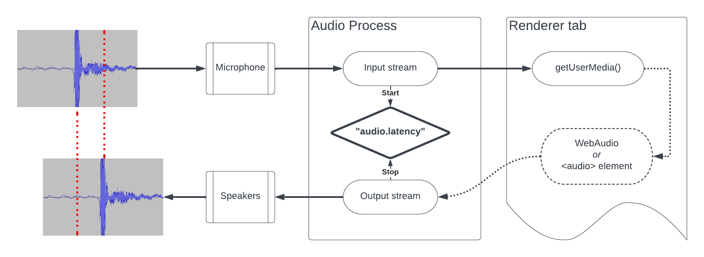
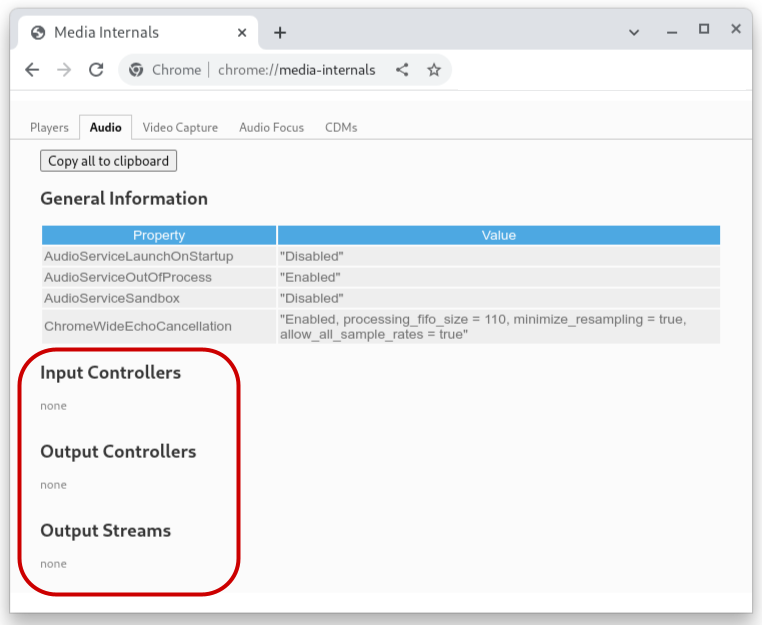
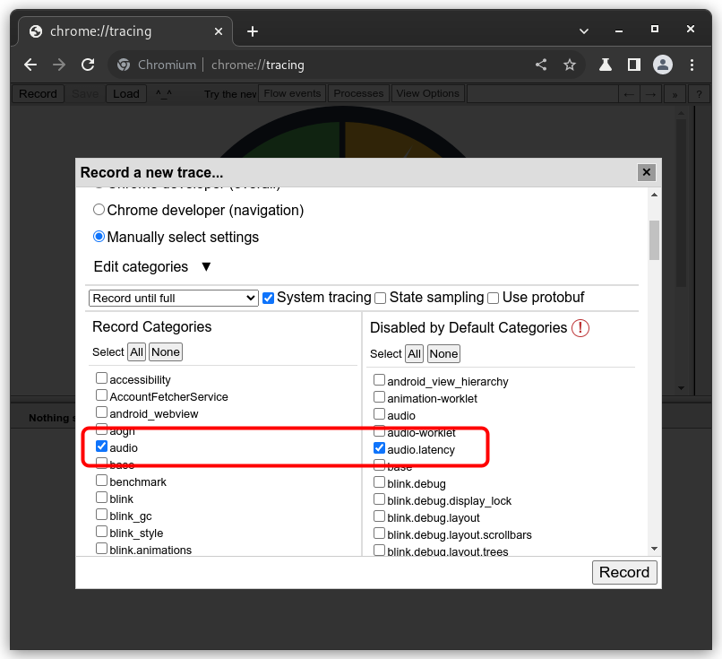
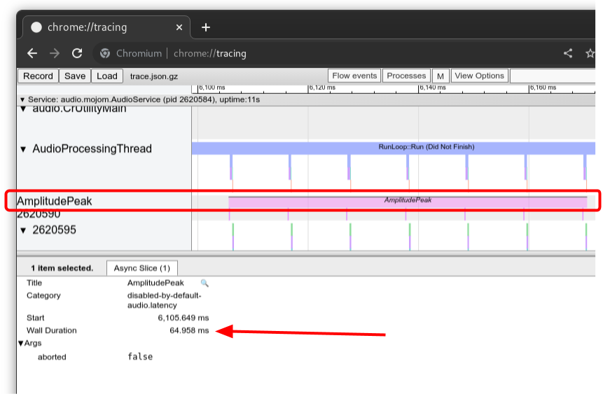
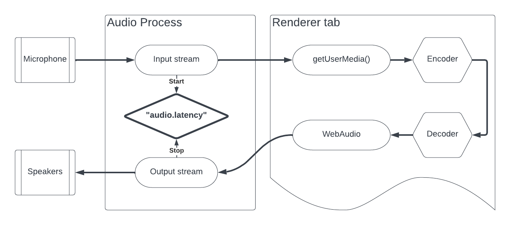
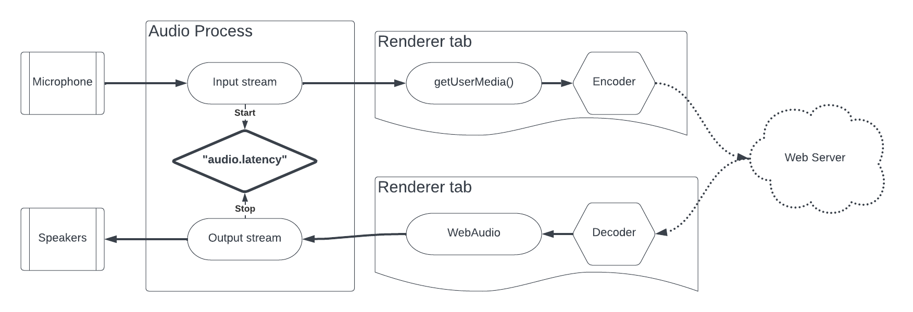

# Audio Latency Tracing

The `“audio.latency”` tracing category is a tool to measure internal chromium
audio latency, without any hardware dependencies. This document outlines how
to record and analyse a latency trace, and offers suggestions as to how to
construct test pages.

[TOC]

## Overview

When an input stream detects an audio signal peak (e.g. clapping hands in front
of microphone), we start an “audio.latency” trace event. When the output stream
detects an audio peak, we stop the tracing event. The duration of the trace
event should give us the total internal Chrome latency. **This excludes any
latency incured from hardware** such as a microphone or sound card's internal
buffers.

## Measuring Latency

### Prerequisites

* The computer must have a microphone input accessible through `getUserMedia()`
* Only the test page and `chrome://tracing` should be open.
* The test page must have one call to `getUserMedia()` + one audio output
  (e.g. one media element OR one WebAudio graph).
* The surrounding area should be relatively quiet.
* If echo cancellation is disabled, consider lowering speaker volume or OS
  volume.
* **Trace recording must be started before any streams are created** by the test
  page, or there will be no traces. One can check that there are no `Input
  Controllers` or `Output Streams` in the chrome://media-internals audio tab, as
  pictured below.
  

### Steps

* Open the latest version of Chrome (114.0.5695.0 or later).
* Open chrome://tracing.
* Record a new trace selecting the “audio” and the “audio.latency” categories.
  
* In a separate tab, open the [test page](#Test-pages).
* Initialize the test page, so that it is capturing audio using `getUserMedia()`
  and playing out the captured stream.
* Repeatedly clap next to the microphone, clearly and loudly, waiting roughly 1
  second between claps.
* Stop the trace.
* Look for the `AmplitudePeak` trace event: the wall duration corresponds to the
  measured latency
  

## Test pages

### Baseline latency test page

The simplest latency test page involves directly routing a `getUserMedia()`
MediaStream to an `<audio>` element or WebAudio. Such a web page should
allow us to measure the round trip latency within Chrome, between the audio
service and the renderer process. For convenience, a simple test page is checked
in under
[`third_party/blink/manual_tests/audio_latency.html`](/third_party/blink/manual_tests/audio_latency.html).
The audio signal flow for this test pages matches the diagram in the
[overview](#Overview).

### Codec latency test page

Adding an encoding and decoding step to a simple baseline test web page should
allow us to measure the extra latency incurred by encoding and decoding audio.
No such test page is provided, but the signal flow should follow this diagram:

### Network end-to-end latency test

Adding a network round trip to a codec latency test page should simulate the
expected end-to-end latency in real-world scenarios. The sender and receiver
test pages can live in two tabs, if only one page calls `getUserMedia()` and one
page plays out audio. Again, no example test page is provided, but the signal
flow should follow this diagram:

