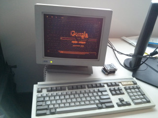

# Ozone Overview

Ozone is a platform abstraction layer beneath the Aura window system that is
used for low level input and graphics. Once complete, the abstraction will
support underlying systems ranging from embedded SoC targets to new
X11-alternative window systems on Linux such as Wayland or Mir to bring up Aura
Chromium by providing an implementation of the platform interface.

## Guiding Principles

Our goal is to enable chromium to be used in a wide variety of projects by
making porting to new platforms easy. To support this goal, ozone follows the
following principles:

1. **Interfaces, not ifdefs**. Differences between platforms are handled by
   calling a platform-supplied object through an interface instead of using
   conditional compilation. Platform internals remain encapsulated, and the
   public interface acts as a firewall between the platform-neutral upper
   layers (aura, blink, content, etc) and the platform-specific lower layers.
   The platform layer is relatively centralized to minimize the number of
   places ports need to add code.
2. **Flexible interfaces**. The platform interfaces should encapsulate just what
   chrome needs from the platform, with minimal constraints on the platform's
   implementation as well as minimal constraints on usage from upper layers. An
   overly prescriptive interface is less useful for porting because fewer ports
   will be able to use it unmodified. Another way of stating is that the
   platform layer should provide mechanism, not policy.
3. **Runtime binding of platforms**. Avoiding conditional compilation in the
   upper layers allows us to build multiple platforms into one binary and bind
   them at runtime. We allow this and provide a command-line flag to select a
   platform (`--ozone-platform`) if multiple are enabled. Each platform has a
   unique build define (e.g. `ozone_platform_foo`) that can be turned on or off
   independently.
4. **Easy out-of-tree platforms**. Most ports begin as forks. Some of them
   later merge their code upstream, others will have an extended life out of
   tree. This is OK, and we should make this process easy to encourage ports,
   and to encourage frequent gardening of chromium changes into the downstream
   project. If gardening an out-of-tree port is hard, then those projects will
   simply ship outdated and potentially insecure chromium-derived code to users.
   One way we support these projects is by providing a way to inject additional
   platforms into the build by only patching one `ozone_extra.gni` file.

## Ozone Platform Interface

Ozone moves platform-specific code behind the following interfaces:

* `PlatformWindow` represents a window in the windowing system underlying
  chrome. Interaction with the windowing system (resize, maximize, close, etc)
  as well as dispatch of input events happens via this interface. Under aura, a
  `PlatformWindow` corresponds to a `WindowTreeHost`. Under mojo, it corresponds
  to a `NativeViewport`. On bare hardware, the underlying windowing system is
  very simple and a platform window corresponds to a physical display.
* `SurfaceFactoryOzone` is used to create surfaces for the Chrome compositor to
  paint on using EGL/GLES2 or Skia.
* `GpuPlatformSupportHost` provides the platform code
  access to IPC between the browser & GPU processes. Some platforms need this
  to provide additional services in the GPU process such as display
  configuration.
* `OverlayManagerOzone` is used to manage overlays.
* `InputController` allows to control input devices such as keyboard, mouse or
  touchpad.
* `SystemInputInjector` converts input into events and injects them to the
  Ozone platform.
* `NativeDisplayDelegate` is used to support display configuration & hotplug.
* `PlatformScreen` is used to fetch screen configuration.
* `ClipboardDelegate` provides an interface to exchange data with other
applications on the host system using a system clipboard mechanism.

## Ozone in Chromium

Our implementation of Ozone required changes concentrated in these areas:

* Cleaning up extensive assumptions about use of X11 throughout the tree,
  protecting this code behind the `USE_X11` ifdef, and adding a new `IS_OZONE`
  path that works in a relatively platform-neutral way by delegating to the
  interfaces described above.
* a `WindowTreeHostOzone` to send events into Aura and participate in display
  management on the host system, and
* an Ozone-specific flavor of `GLSurfaceEGL` which delegates allocation of
  accelerated surfaces and refresh syncing to the provided implementation of
  `SurfaceFactoryOzone`.

## Porting with Ozone

Users of the Ozone abstraction need to do the following, at minimum:

* Write a subclass of `PlatformWindow`. This class (I'll call it
  `PlatformWindowImpl`) is responsible for window system integration. It can
  use `MessagePumpLibevent` to poll for events from file descriptors and then
  invoke `PlatformWindowDelegate::DispatchEvent` to dispatch each event.
* Write a subclass of `SurfaceFactoryOzone` that handles allocating accelerated
  surfaces. I'll call this `SurfaceFactoryOzoneImpl`.
* Write a subclass of `CursorFactory` to manage cursors, or use the
  `BitmapCursorFactory` implementation if only bitmap cursors need to be supported.
* Write a subclass of `OverlayManagerOzone` or just use `StubOverlayManager` if
  your platform does not support overlays.
* Write a subclass of `NativeDisplayDelegate` if necessary or just use
  `FakeDisplayDelegate`, and write a subclass of `PlatformScreen`, which is
  used by aura::ScreenOzone then.
* Write a subclass of `GpuPlatformSupportHost` or just use
  `StubGpuPlatformSupportHost`.
* Write a subclass of `InputController` or just use `StubInputController`.
* Write a subclass of `SystemInputInjector` if necessary.
* Write a subclass of `OzonePlatform` that owns instances of
  the above subclasses and provide a static constructor function for these
  objects. This constructor will be called when
  your platform is selected and the returned objects will be used to provide
  implementations of all the ozone platform interfaces.
  If your platform does not need some of the interfaces then you can just
  return a `Stub*` instance or a `nullptr`.

## Adding an Ozone Platform to the build (instructions for out-of-tree ports)

The recommended way to add your platform to the build is as follows. This walks
through creating a new ozone platform called `foo`.

1. Fork `chromium/src.git`.
2. Add your implementation in `ui/ozone/platform/` alongside internal platforms.
3. Patch `ui/ozone/ozone_extra.gni` to add your `foo` platform.

## Building with Ozone

### Chrome OS - ([waterfall](https://build.chromium.org/p/chromium.chromiumos/waterfall?builder=Linux+ChromiumOS+Ozone+Builder&builder=Linux+ChromiumOS+Ozone+Tests+%281%29&builder=Linux+ChromiumOS+Ozone+Tests+%282%29&reload=none))

To build `chrome`, do this from the `src` directory:

``` shell
gn args out/OzoneChromeOS --args="use_ozone=true target_os=\"chromeos\""
ninja -C out/OzoneChromeOS chrome
```

Then to run for example the X11 platform:

``` shell
./out/OzoneChromeOS/chrome --ozone-platform=x11
```

### Embedded

**Warning: Only some targets such as `content_shell` or unit tests are
currently working for embedded builds.**

To build `content_shell`, do this from the `src` directory:

``` shell
gn args out/OzoneEmbedded --args="use_ozone=true toolkit_views=false"
ninja -C out/OzoneEmbedded content_shell
```

Then to run for example the headless platform:

``` shell
./out/OzoneEmbedded/content_shell --ozone-platform=headless \
                                  --ozone-dump-file=/tmp/
```

### Linux Desktop - ([X11 waterfall](https://ci.chromium.org/p/chromium/builders/try/linux-rel) &&
[Wayland waterfall](https://ci.chromium.org/p/chromium/builders/try/linux-wayland-rel))

By default, Linux enables the following Ozone backends - X11, Wayland and Headless.

If you want to disable Ozone/X11 in the build, do this from the `src` directory:

``` shell
gn args out/OzoneLinuxDesktop --args="ozone_platform_x11=false"
ninja -C out/OzoneLinuxDesktop chrome
```

If you want to disable all, but Wayland Ozone backend, do this from the `src` directory:

``` shell
gn args out/OzoneLinuxDesktop --args="ozone_auto_platforms=false ozone_platform_wayland=true"
ninja -C out/OzoneLinuxDesktop chrome
```

Chrome/Linux uses X11 Ozone backend by default. Thus, simply start the browser without any parameters:

``` shell
./out/OzoneLinuxDesktop/chrome
```

Or run for example the Wayland platform:

``` shell
./out/OzoneLinuxDesktop/chrome --ozone-platform=wayland
```

It is also possible to choose an Ozone backend via the chrome://flags/#ozone-platform-hint.
The following options are available - Default, X11, Wayland, and Auto. "Auto"
selects Wayland if possible, X11 otherwise.


### GN Configuration notes

You can turn properly implemented ozone platforms on and off by setting the
corresponding flags in your GN configuration. For example
`ozone_platform_headless=false ozone_platform_drm=false` will turn off the
headless and DRM (GBM) platforms.
This will result in a smaller binary and faster builds. To turn ALL platforms
off by default, set `ozone_auto_platforms=false`.

You can also specify a default platform to run by setting the `ozone_platform`
build parameter. For example `ozone_platform="x11"` will make X11 the
default platform when `--ozone-platform` is not passed to the program.
If `ozone_auto_platforms` is true then `ozone_platform` is set to `headless`
by default.

## Running with Ozone

Specify the platform you want to use at runtime using the `--ozone-platform`
flag. For example, to run `content_shell` with the DRM (GBM) platform:

``` shell
content_shell --ozone-platform=drm
```

Caveats:

* `content_shell` always runs at 800x600 resolution.
* For the DRM (GBM) platform, you may need to terminate your X server (or any other
  display server) prior to testing.
* During development, you may need to configure
  [sandboxing](linux/sandboxing.md) or to disable it.

## Ozone Platforms

### Headless

This platform
draws graphical output to a PNG image (no GPU support; software rendering only)
and will not output to the screen. You can set
the path of the directory where to output the images
by specifying `--ozone-dump-file=/path/to/output-directory` on the
command line:

``` shell
content_shell --ozone-platform=headless \
              --ozone-dump-file=/tmp/
```

### DRM/GBM

This is Linux direct rending with acceleration via mesa GBM & linux DRM/KMS
(EGL/GLES2 accelerated rendering & modesetting in GPU process) and is in
production use on [Chrome OS](https://www.chromium.org/chromium-os).

Note that all Chrome OS builds of Chrome will compile and attempt to use this.
See [Building Chromium for Chromium OS](https://www.chromium.org/chromium-os/how-tos-and-troubleshooting/building-chromium-browser) for build instructions.

### Cast

This platform is used for
[Chromecast](https://www.google.com/intl/en_us/chromecast/).

### X11

This platform provides support for the [X window system](https://www.x.org/).

X11 is the default Ozone backend. You can try to compile and run it with the following
configuration:

``` shell
gn args out/OzoneX11
ninja -C out/OzoneX11 chrome
./out/OzoneX11/chrome
```

### Wayland

This platform provides support for the
[Wayland](http://wayland.freedesktop.org/) display protocol. It was
initially developed by Intel as
[a fork of chromium](https://github.com/01org/ozone-wayland)
and then partially upstreamed.

Currently, the Ozone/Wayland is actively being developed by Igalia in
the Chromium mainline repository with some features missing at the moment. The
progress can be tracked in the [issue #578890](https://crbug.com/578890).

Below are some quick build & run instructions. It is assumed that you are
launching `chrome` from a Wayland environment such as `weston`. Execute the
following commands (make sure a system version of gbm and drm is used, which
are required by Ozone/Wayland by design, when running on Linux platforms.):

Please note that the Wayland Ozone backend is built by default unless
`ozone_auto_platforms=false` is set (the same as the X11 Ozone backend).

``` shell
gn args out/OzoneWayland
ninja -C out/OzoneWayland chrome
./out/OzoneWayland/chrome --ozone-platform=wayland
```

Native file dialogs are currently supported through the GTK toolkit. That
implies that the browser is compiled with glib and gtk enabled. Please
append the following gn args to your configuration:

``` shell
use_ozone=true
use_system_minigbm=true
use_system_libdrm=true
use_xkbcommon=true
use_glib=true
use_gtk=true
```

Running some test suites requires a Wayland server. If you're not
running one you can use a locally compiled version of Weston. This is
what the build bots do. Please note that this is required for
interactive_ui_tests, as those tests use a patched version of Weston's
test plugin. Add this to your gn args:

``` shell
use_bundled_weston = true
```

Then run the xvfb.py wrapper script and tell it to start Weston:

``` shell
cd out/debug  # or your out directory
../../testing/xvfb.py --use-weston --no-xvfb ./views_unittests --ozone-platform=wayland
```

Feel free to discuss with us on freenode.net, `#ozone-wayland` channel or on
`ozone-dev`, or on `#ozone-wayland-x11` channel in [chromium slack](https://www.chromium.org/developers/slack).

### Caca

This platform
draws graphical output to text using
[libcaca](http://caca.zoy.org/wiki/libcaca)
(no GPU support; software
rendering only). In case you ever wanted to test embedded content shell on
tty.
It has been
[removed from the tree](https://codereview.chromium.org/2445323002/) and is no
longer maintained but you can
[build it as an out-of-tree port](https://github.com/fred-wang/ozone-caca).

Alternatively, you can try the latest revision known to work. First, install
libcaca shared library and development files. Next, move to the git revision
`0e64be9cf335ee3bea7c989702c5a9a0934af037`
(you will probably need to synchronize the build dependencies with
`gclient sync --with_branch_heads`). Finally, build and run the caca platform
with the following commands:

``` shell
gn args out/OzoneCaca \
        --args="use_ozone=true ozone_platform_caca=true use_sysroot=false ozone_auto_platforms=false toolkit_views=false"
ninja -C out/OzoneCaca content_shell
./out/OzoneCaca/content_shell
```

  Note: traditional TTYs are not the ideal browsing experience.<br/>
  

### drm
Ash-chrome client implementation.

### flatland
For fuchsia.

## Communication

There is a public mailing list:
[ozone-dev@chromium.org](https://groups.google.com/a/chromium.org/forum/#!forum/ozone-dev)
