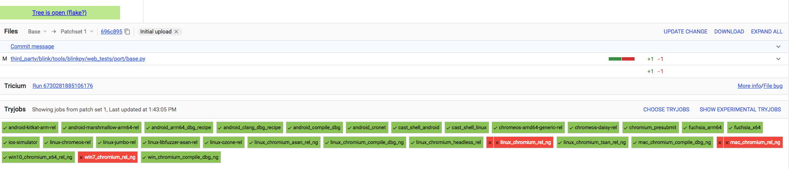
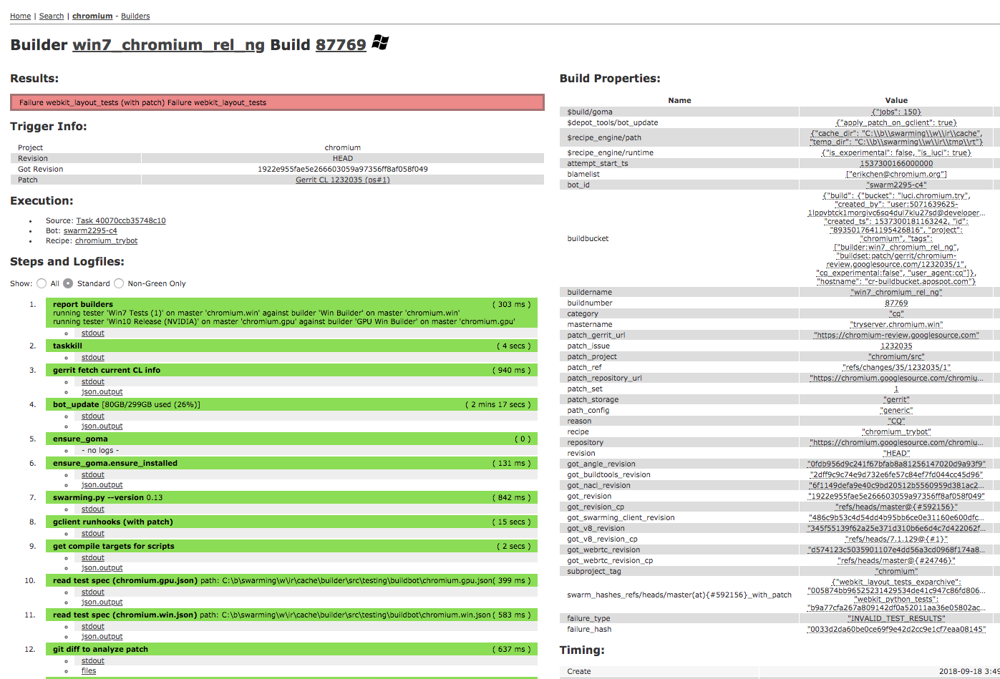

# Parsing Test Results

Chromium runs over 500,000 tests for each CL. There are many layers of UI for
parsing and interpreting these test results. This doc provides a brief guide
for navigating these UI layers.

## Polygerrit UI

Tests are segmented by build and test configurations. The segments are usually
referred to as *builds*. In the example below, each green and red rectangle
refers to a *build*.

The name of each build usually contains enough information to get a rough idea
of the configuration. Some examples:

* *android_compile_dbg* is a compile-only [no tests] build of Chromium for
  Android, using the *debug* configuration.
* *android-lollipop-arm-rel* builds and runs tests for Chromium for Android,
  using the *release* configuration on a lollipop device.
* *win7-rel* builds and runs tests for Chromium on Windows, using
  the release configuration on a Windows 7 device. *ng* stands for next
  generation, but this has no meaning as the previous generation was already
  phased out.

Green boxes refer to builds that passed. Red boxes refer to builds that failed.
Some failed builds get automatically retried by the CQ. In this example,
*linux-rel* and *mac-rel* were automatically retried [hence the two **X**s], but
*win7-rel* was not. The **X** on the left is the first build, and the **X** on the right
is the second build.

Each of these boxes is a link that provides more information about the build
failure.

## Build Results UI

Selecting any of the build results from the previous section will navigate to
the build results UI. Each build is implemented by a [recipe] --
effectively a Python script. Each recipe is divided into *steps*. Each *step*
represents a well-defined action, such as updating the repository to point to
tip of tree, or compiling the necessary build artifacts.

[recipe]: https://chromium.googlesource.com/external/github.com/luci/recipes-py/+/main/doc/user_guide.md

Under the **Steps and Logfiles** heading is a list of numbered *steps*. Each
*step* has a color (red, green or purple) which indicates whether the *step*
failed, succeeded, or encountered an unexpected condition. Failing steps are
also grouped into the **Results** section at the very top for convenience.

## Build Results UI -- Overview

Most builds follow a similar pattern. The key *steps* are listed here.

* **bot_update** Update the repository to point to tip of tree. Apply the CL
  as a patch.
* **analyze** Analyze dependencies of test suites to determine which test
  suites are affected by the patch.
* **compile (with patch)** Builds test suites and associated artifacts.
* **isolate tests** Archives test suite binaries and artifacts.
* **test_pre_run.[trigger] blink_web_tests (with patch)** Triggers a test
  suite on swarming [remote execution framework] -- in this case,
  blink_web_tests.
* **blink_web_tests (with patch)** Collects the results from swarming for a
  test suite.

If all test suites pass, then the *build* is marked as a success and no further
steps are run. If at least one test suite has failures, then the failing tests
are rerun with the patch deapplied. This allows the recipe to determine if the
test failure is due to the CL or due to a problem with tip of tree.

* **bot_update [without patch]** Deapplies the CL patch.
* **compile [without patch]** Compiles test suites.
* **isolate tests (2)** Archives test suite binaries and artifacts.
* **test_pre_run.[trigger] blink_web_tests (without patch)** Triggers test
  suite on swarming. Only failing tests are rerun.
* **blink_web_tests (without patch)** Collects results from swarming.

**Important safety notice**. When test suites are run with the patch applied,
each test is run up to N times -- any success will mark the test as a success.
When test suites are run without the patch, each failing test is run exactly N
times. Any failure will mark the test as a failure.

If there are tests that failed with the patch applied, but not with the patch
deapplied, then that implies that it's likely that the CL broke a test. Just to
confirm, the first suite of steps is run again, this time with the suffix
**(retry with patch)**.
