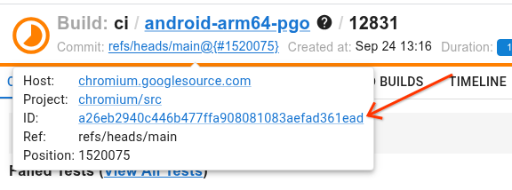
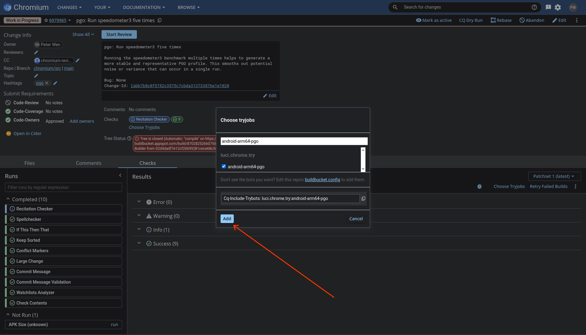
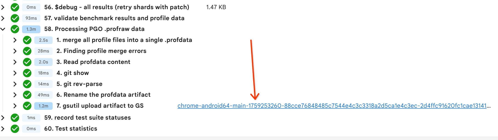
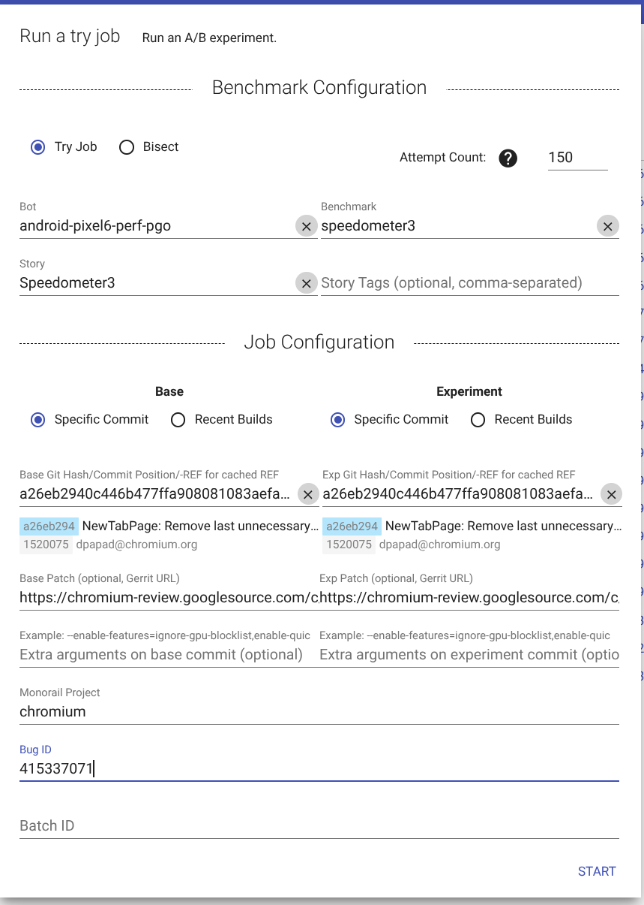

# Profile-Guided Optimization (PGO)

[TOC]

## Generating PGO Profiles via Bots

See
[Generating Profiles on Trybots and Using in Pinpoint](#Generating-Profiles-on-Trybots-and-Using-in-Pinpoint).

See also [go/chrome-pgo-internal](Googlers only and somewhat outdated).

## Generating PGO Profiles Manually

Normally devs don't need to worry about this and can use the default profile for
official builds. The default profile can be fetched by adding
`"checkout_pgo_profiles": True` to `custom_vars` in the gclient config and
running `gclient runhooks`.

To produce an executable built with a custom PGO profile:

- Produce the instrumented executable using the following gn args:

  ```
  chrome_pgo_phase = 1
  enable_resource_allowlist_generation = false
  is_official_build = true
  symbol_level = 0
  use_remoteexec = true
  ```

  For android you need these in addition:

  ```
  target_os = "android"
  target_cpu = "arm64"
  ```

- Run representative benchmarks to produce profiles

  `python3 tools/pgo/generate_profile.py -C out/builddir`

  If collecting profiles on an android device, add a browser name like one of
  [these][browser_names]:

  ```
  python3 tools/pgo/generate_profile.py -C out/builddir \
      --android-browser android-trichrome-chrome-google-bundle
  ```

  You can find available browsers using:

  ```
  tools/perf/run_benchmark run --browser=list
  ```

  By default, some benchmark replay archives require special access permissions.
  For more details and to request access, please refer to
  [Telemetry documentation][telemetry_docs]. You can also choose to run
  `generate_profile.py` without these benchmarks, using the
  `--run-public-benchmarks-only` flag. However, note that doing so may produce a
  profile that isn't fully representative.

  ```
  python3 tools/pgo/generate_profile.py -C out/builddir \
     --android-browser android-trichrome-chrome-google-bundle \
     --run-public-benchmarks-only
  ```

  If `generate_profile.py` fails with
  `ServiceException: 401 Anonymous caller does not have storage.objects.get access to the Google Cloud Storage object.`,
  then run `download_from_google_storage --config` (with your @google address;
  enter 0 as project-id).

  This will produce `out/builddir/profile.profdata`

- Produce the final PGO'd executable with the following gn args (and additional
  android args, if any):

  ```
  enable_resource_allowlist_generation = false
  is_official_build = true
  symbol_level = 0
  use_remoteexec = true
  pgo_data_path = "//out/builddir/profile.profdata"
  ```

## Using Custom PGO Profiles

To use a custom PGO profile, you need to specify the GCS bucket, path, and
filename of the profile. This can be done by setting the following GN args:

```
pgo_gs_bucket = "chrome-pgo-trybot-profiles"
pgo_gs_bucket_path = "pgo_profiles"
pgo_override_filename = "<full-filename-of-your-profile>.profdata"
```

## How It Works

`chrome_pgo_phase` is defined in [`build/config/compiler/pgo/pgo.gni`][pgo_gni].
This GN variable can be one of 0, 1, or 2, meaning "don't use profile",
"generating profile", and "use profile" respectively. See [pgo.gni][pgo_gni] for
details on platform-specific GN variables that determine which phase is used in
each build.

Which file under `//chrome/build/pgo_profiles/` gets used? It depends on both
the platform and [`_pgo_target`][pgo_target]. For example, for 64-bit android,
the file `//chrome/build/android-arm64.pgo.txt` contains the name of the
`*.profdata` file that is used as the PGO profile by default if no other profile
is specified via the GN arg `pgo_data_path`.

### Interaction with Orderfile Generation

On Android, the PGO profile generation process is tightly coupled with
[orderfile generation](./orderfile.md). The CI builders that generate PGO
profiles are configured to trigger the corresponding orderfile generation
builders upon successful completion.

This triggering mechanism is defined in the CI configuration files:

- The PGO builder configurations (in
  `//internal/infra/config/subprojects/chrome/ci/chrome.pgo.star`) specify which
  orderfile builders to trigger via the `builders_to_trigger` parameter.
- The custom recipe at
  [`build_internal/recipes/recipes/clank/pgo.py`](https://source.corp.google.com/h/chromium/infra/infra_superproject/+/main:build_internal/recipes/recipes/clank/pgo.py)
  reads this parameter and triggers the specified downstream builds.
- The orderfile builders are configured with a `triggered_by` parameter, which
  allows them to be triggered by the listed PGO builder.

This ensures that the orderfile, which helps optimize the binary layout, is
always built using the freshest profile data at the same Chromium commit that
the PGO profile is generated from. The `clank/pgo.py` recipe also passes the
Cloud Storage location of the newly generated PGO profile to the orderfile
builder as it would not have been rolled into trunk by Skia autorollers at this
point.

## Generating Profiles on Trybots and Using in Pinpoint

**Step 1**: pick an `android-arm64-pgo` build to benchmark against. In this
example I picked the latest:
https://ci.chromium.org/ui/p/chrome/builders/ci/android-arm64-pgo/12831/overview

**Step 2**: grab its chromium commit hash, your local CL should be rebased on
it:


In this case it is `a26eb2940c446b477ffa908081083aefad361ead`

**Step 3**: upload your change to gerrit and trigger the `android-arm64-pgo`
trybot:


See https://crrev.com/c/6979965?tab=checks

**Step 4**: find a successful run of `android-arm64-pgo` (you may need to do
this several times), and copy the gsutil artifact name:


For this one I got:
`chrome-android64-main-1759253260-88cce76848485c7544e4c3c3318a2d5ca1e4c3ec-2d4ffc91620fc1cae131415e81c8fed36dfabfaa.profdata`
(note that the second hash is not `a26eb2940c446b477ffa908081083aefad361ead`
because I had a single modification CL on top of it).

**Step 5**: create two new CLs that sets this and the one generated by the
original android-arm64-pgo CI bot in the default gn args file (**IMPORTANT**:
these **both** need to be based on the same original base commit that generated
them, in this case, both based on top of
`a26eb2940c446b477ffa908081083aefad361ead`).

In this case, the one generated by CI was
`chrome-android64-main-1758734180-32cedafa6ae7a837a72fd6da923a5463d45bbc9a-a26eb2940c446b477ffa908081083aefad361ead.profdata`

Trybot CL: https://crrev.com/c/7001460

CI CL: https://crrev.com/c/6998908 (note the different bucket for CI generated
profiles `chromium-optimization-profiles`)

**Step 6**: Create a pinpoint job comparing the two above CLs:
https://pinpoint-dot-chromeperf.appspot.com/ Example:


This used `android-pixel6-perf-pgo` and 150 attempts to make results less noisy.

This is the actual pinpoint run that worked (some tweaks were needed):
https://pinpoint-dot-chromeperf.appspot.com/job/118daa5a510000

**Step 7**: Analyze the pinpoint run as you would normally.

## Background Reading

https://clang.llvm.org/docs/UsersManual.html#profile-guided-optimization

https://source.android.com/docs/core/perf/pgo

[browser_names]: https://source.chromium.org/chromium/chromium/src/+/main:third_party/catapult/telemetry/telemetry/internal/backends/android_browser_backend_settings.py;l=400;drc=bf85e76dc3467385a623e9bf11ab950cf2889ca5
[go/chrome-pgo-internal]: https://goto.google.com/chrome-pgo-internal
[pgo_gni]: https://source.chromium.org/chromium/chromium/src/+/main:build/config/compiler/pgo/pgo.gni
[pgo_target]: https://source.chromium.org/chromium/chromium/src/+/main:build/config/compiler/pgo/BUILD.gn;l=88;drc=3d2e089ad74a30754376571531e00615de96061e
[telemetry_docs]: https://www.chromium.org/developers/telemetry/upload_to_cloud_storage/#request-access-for-google-partners
