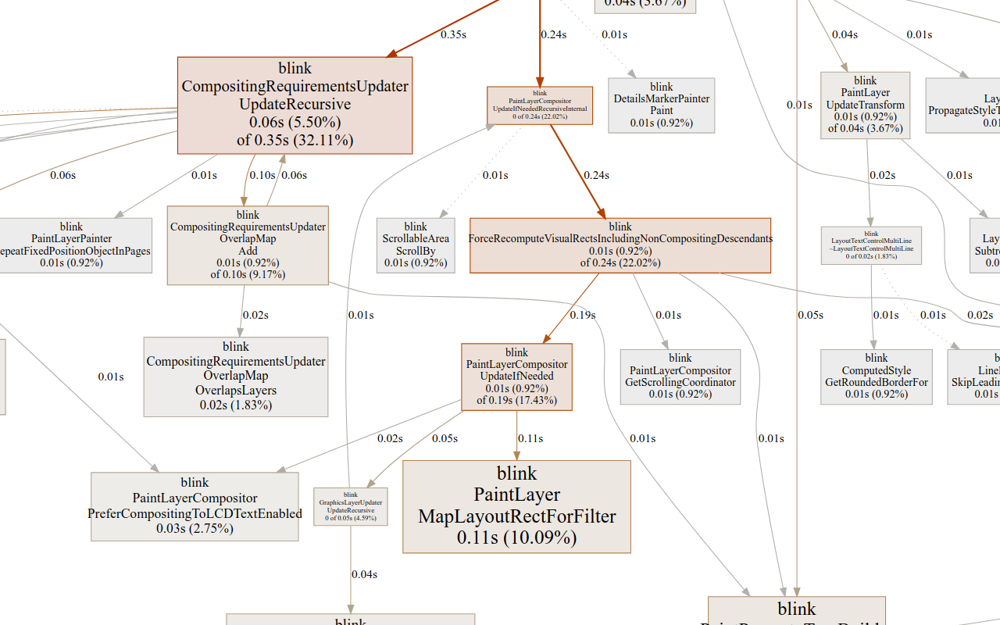

# CPU Profiling Chrome


[TOC]

## Introduction

These are instructions for collecting a CPU profile of chromium. All of the profiling methods described here produce output that can be view using the `pprof` tool. `pprof` is highly customizable; here's a screenshot of some example `pprof` output:



This doc is intended to be an authoritative one-stop resource for profiling chromium. At the time of writing, there are a number of existing docs with profiling instructions, in varying states of obsolescence:

* [./linux/profiling.md](./linux/profiling.md)
* [./profiling_content_shell_on_android.md](./profiling_content_shell_on_android.md)
* https://www.chromium.org/developers/profiling-chromium-and-webkit
* https://www.chromium.org/developers/telemetry/profiling

***promo
CPU profiling is not to be confused with tracing or task profiling:

* https://www.chromium.org/developers/how-tos/trace-event-profiling-tool
* https://www.chromium.org/developers/threaded-task-tracking
***

# Profiling on Linux

## General checkout setup
Profiling should preferably be done on an official build. Make sure the following appears in your `args.gn` file:

    is_official_build = true

## Profiling a process or thread for a defined period of time using perf

First, make sure you have the `linux-perf` package installed:

    $ sudo apt-get install linux-perf

After starting up the browser and loading the page you want to profile, press 'Shift-Escape' to bring up the task manager, and get the Process ID of the process you want to profile.

Run the perf tool like this:

    $ perf record -g -p <Process ID> -o <output file>

*** promo
To adjust the sampling frequency, use the `-F` argument, e.g., `-F 1000`.
***
*** promo
If this fails to collect any samples on a Cloudtop/VM (presumably while profiling tests),
try adding `-e cpu-clock`.
***

To stop profiling, press `Control-c` in the terminal window where `perf` is running. Run `pprof` to view the results, providing the path to the browser executable; e.g.:

    $ pprof -web src/out/Release/chrome <perf output file>

*** promo
`pprof` is packed with useful features for visualizing profiling data. Try `pprof --help` for more info.
***

*** promo
Tip for Googlers: running `gcert` first will make `pprof` run faster, and eliminate some useless spew to the terminal.
***

If you want to profile all renderer processes use the custom `--renderer-cmd-prefix` profiling script:

  $ src/out/Release/chrome --renderer-cmd-prefix="tools/profiling/linux-perf-renderer-cmd.sh"

If you want to limit the profile to a single thread, run:

    $ ps -T -p <Process ID>

From the output, find the Thread ID (column header "SPID") of the thread you want. Now run perf:

    $ perf record -g -t <Thread ID> -o <output file>

Use the same `pprof` command as above to view the single-thread results.

## Profiling the renderer process for a period defined in javascript

You can generate a highly-focused profile for any period that can be defined in javascript using the `chrome.gpuBenchmarking` javascript interface. First, adding the following command-line flags when you start chrome:

    $ chrome --enable-gpu-benchmarking --no-sandbox [...]

Open devtools, and in the console, use `chrome.gpuBenchmarking.startProfiling` and `chrome.gpuBenchmarking.stopProfiling` to define a profiling period. e.g.:

    > chrome.gpuBenchmarking.startProfiling('perf.data'); doSomething(); chrome.gpuBenchmarking.stopProfiling()

`chrome.gpuBenchmarking` has a number of useful methods for simulating user-gesture-initiated actions; for example, to profile scrolling:

    > chrome.gpuBenchmarking.startProfiling('perf.data'); chrome.gpuBenchmarking.smoothScrollByXY(0, 1000, () => { chrome.gpuBenchmarking.stopProfiling() });

## Profiling content_shell with callgrind

This section contains instructions on how to do profiling using the callgrind/cachegrind tools provided by valgrind. This is not a sampling profiler, but a profiler based on running on a simulated CPU. The instructions are Linux-centered, but might work on other platforms too.

#### Install valgrind

```
sudo apt-get install valgrind
```

#### Profile

Run `content_shell` with callgrind to create a profile. A `callgrind.<pid>` file will be dumped when exiting the browser or stopped with CTRL-C:

```
valgrind --tool=callgrind content_shell --single-process --no-sandbox <url>
```

Alternatively use cachegrind which will give you CPU cycles per code line:

```
valgrind --tool=cachegrind content_shell --single-process --no-sandbox <url>
```

Using single-process is for simple profiling of the renderer. It should be possible to run in multi-process and attach to a renderer process.

#### Install KCachegrind

Warning: this will install a bunch of KDE dependencies.

```
sudo apt-get install kcachegrind
```

#### Explore with KCachegrind

```
kcachegrind callgrind.<pid>
```

# Profiling on Android

Android (Nougat and later) supports profiling using the [simpleperf](https://developer.android.com/ndk/guides/simpleperf) tool.

Follow the [instructions](./android_build_instructions.md) for building and installing chromium on android. With chromium running on the device, run the following command to start profiling on the browser process (assuming your build is in `src/out/Release`):

    $ src/out/Release/bin/chrome_public_apk profile
    Profiler is running; press Enter to stop...

Once you stop the profiler, the profiling data will be copied off the device to the host machine and post-processed so it can be viewed in `pprof`, as described above.

To profile the renderer process, you must have just one tab open in chromium, and use a command like this:

    $ src/out/Release/bin/chrome_public_apk profile --profile-process=renderer

To limit the profile to a single thread, use a command like this:

    $ src/out/Release/bin/chrome_public_apk profile --profile-process=renderer --profile-thread=main

The `--profile-process` and `--profile-thread` arguments support most of the common process names ('browser', 'gpu', 'renderer') and thread names ('main', 'io', 'compositor', etc.). However, if you need finer control of the process and/or thread to profile, you can specify an explicit Process ID or Thread ID. Check out the usage message for more info:

    $ src/out/Release/bin/chrome_public_apk help profile


By default, simpleperf will collect CPU cycles. To collect other events, use a command like this:

    $ src/out/Release/bin/chrome_public_apk profile --profile-process=renderer --profile-events cpu-cycles,branch-misses,branch-instructions,cache-references,cache-misses,stalled-cycles-frontend,stalled-cycles-backend

# Profiling on ChromeOS

Follow the [simple chrome instructions](https://chromium.googlesource.com/chromiumos/docs/+/HEAD/simple_chrome_workflow.md), to build
and deploy chrome to your chromeos device.  These instructions will set up a
build directory for you, so be sure to `gn args out_${SDK_BOARD}/Release` to
edit them and add the gn args listed above.

The easiest way to get a profile is to ssh to your device, which here will
be referred to as `chromeos-box`, but replace that with whatever ip or hostname
your device is.  ssh to your device, create a folder in `/tmp` (which usually
has more space than `/`) and record performance for the entire device.  When
you're done, use scp to copy the perf.data back to your desk and use pprof
as per normal on that perf.data file.

Here's an example:

    $ ssh root@chromeos-box
    localhost ~ # export CPUPROFILE_FREQUENCY=3000
    localhost ~ # mkdir -p /tmp/perf
    localhost ~ # cd /tmp/perf
    localhost /tmp/perf # perf record -g -a -e cycles
    ^C
    [ perf record: Woken up 402 times to write data ]
    [ perf record: Captured and wrote 100.797 MB perf.data (489478 samples) ]
    localhost /tmp/perf # exit
    $ scp root@chromeos-box:/tmp/perf/perf.data .
    $ pprof -web out_${SDK_BOARD}/Release/chrome perf.data

Note: this will complain about missing chromeos symbols.  Even pointing
PPROF\_BINARY\_PATH at the expanded `debug-board.tgz` file that came along with
the chromeos image does not seem to work.  If you can make this work, please
update this doc!

# Profiling during a perf benchmark run

The perf benchmark runner can generate a CPU profile over the course of running a perf test. Currently, this is supported only on Linux and Android. To get info about the relevant options, run:

    $ src/tools/perf/run_benchmark help run

... and look for the `--interval-profiling-*` options. For example, to generate a profile of the main thread of the renderer process during the "page interactions" phase of a perf benchmark, you might run:

    $ src/tools/perf/run_benchmark run <benchmark name> --interval-profiling-target=renderer:main --interval-profiling-period=interactions --interval-profiling-frequency=2000

The profiling data will be written into the `artifacts/` sub-directory of your perf benchmark output directory (default is `src/tools/perf`), to files with the naming pattern `*.profile.pb`. You can use `pprof` to view the results, as described above.

# Googlers Only

If you use `pprof -proto chrome-profile-renderer-12345` to turn your perf data
into a proto file, you can then use that resulting file with internal tools.
See [http://go/cprof/user#fs-profiles](http://go/cprof/user#fs-profiles])
for instructions on how to go about this.

# macOS

## General tricks

### Using PIDs in commands

Many of the profiling tools expect you to provide the PID of the process to profile. If the tool used does not support finding the application by name or you would like to run the command for many processes it can be useful to use `pgrep` to find the PIDs.

Find the PID for Chromium (browser process):

    $ pgrep -X Chromium
Find the PID for all child processes of Chromium:

    $ pgrep -P $CHROMIUM_PID
Combine commands to run tool for Chromium and all its children:

    $ cat <(pgrep -x Chromium) <(pgrep -P $(pgrep -x Chromium)) | xargs $MY_TOOL --pid

## Checkout setup
Profiling should always be done on a build that represents the performance of official builds as much as possible. `is_official_build` enables some additional optimizations like PGO.

    is_debug = false
    is_component_build = false
    is_official_build = true

    # Most profiling techniques on macOS will work with minimal symbols for local builds.
    # You should try and use minimal symbols when starting out because most tools will take
    # an incredibly long time to process the symbols and in some cases will freeze the application
    # while doing so. symbol_level sets the level for all parts of Chromium. The
    # blink and v8 settings allow overriding this to set higher or lower levels
    # for those components.
    blink_symbol_level = 0
    v8_symbol_level = 0
    symbol_level = 0

## Viewing traces.
Once collected the traces produced by any tool in this section can be converted to pprof using [InstrumentsToPprof](https://github.com/google/instrumentsToPprof#instrumentstopprof).

## Tools

### Sample
#### Pros
* Ships with macOS.
* Traces can be symbolized after capturing.
#### Cons
* Has substantial observer impact and can interfere with the application, especially while loading symbols.
* Does not differentiate between idle and active stacks so filtering is needed. Also obscures CPU impact of functions that sleep.

#### Usage
Sample stacks of $pid for 10 seconds grabbing a stack every 1ms. [-maydie] to still have stacks if process exits.

    $ sample $pid 10 1 -mayDie -f ./output.txt

### Instruments
#### Pros
* Ships with macOS.
* Can produce much more than sampling profiles via different modes.
* Is low overhead.
* Only captures cpu-active stacks (In Time Profiler mode) so no idle stack filtering is needed.
#### Cons
* Cannot produce human-readable reports fully automatically. (Requires use of GUI)
* Built-in trace viewer is quite underpowered.

#### Usage
To get a trace use either the GUI in the "Time Profiler" mode or this command:

    $ xcrun -r xctrace record --template 'Time Profiler' --all-processes --time-limit 30s --output 'profile.trace'

### DTrace
#### Pros
* Ships with macOS.
* Can produce much more than sampling profiles via different probes.
* Supports scripting.
* Is low overhead.
* Only captures cpu-active stacks so no idle stack filtering is needed.
* Can be used fully from the command-line / script.
#### Cons
* Requires partially disabling SIP

#### SIP
By default `dtrace` does not work well with [SIP](https://support.apple.com/en-us/HT204899). Disabling SIP as a whole is not recommended and instead should be done only for DTrace using these steps:

* Reboot in recovery mode
* Start a shell
* Execute `csrutil enable --without dtrace --without debug`
* Reboot

#### Usage
To get sampled cpu stacks

    $ dtrace -p $PID -o $OUTPUT_FILE -n "profile-1001/pid == $PID/ {{ @[ustack()] = count(); }}"

To get stacks that caused wake-ups

    $ dtrace -p $PID -o $OUTPUT_FILE -n "mach_kernel::wakeup/pid == $PID/ {{ @[ustack()] = count(); }}"
