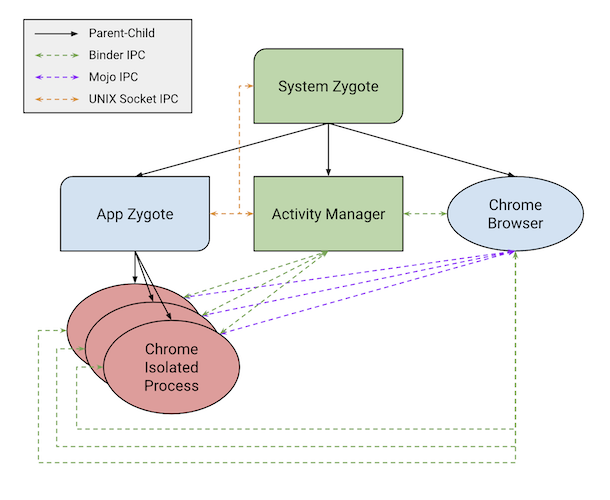

# Chrome Android Sandbox Design

This document discusses the sandbox and process architecture of Chrome on
Android. Like Chrome's desktop platforms, Android uses a sandbox to isolate and
de-privilege untrustworthy computing principals. However, the overall
architecture is materially different than on desktop platforms, while still
arriving close to the same end result.

## Overall Architecture

The Chrome Android browser process is the main trusted principal in the system,
it manages and communicates with a network of processes over inter-process
communication (IPC). The major features of the security architecture are:

- The browser process is protected by the [Android app
  sandbox](https://source.android.com/docs/security/app-sandbox), which isolates
  each installed application on the system.
- Chrome launches its helper processes as Android
  [Services](https://developer.android.com/reference/android/app/Service).
- For sandboxed helper processes, the sandbox follows a similar bilayer design
  as the desktop Linux sandbox. The layer-one sandbox is provided by the
  [`android:isolatedProcess`](https://developer.android.com/guide/topics/manifest/service-element#isolated)
  attribute on the Service's manifest definition.
- Chrome [applies](https://source.chromium.org/chromium/chromium/src/+/main:sandbox/linux/seccomp-bpf-helpers/seccomp_starter_android.h)
  a layer-two sandbox in the form of a Seccomp-BPF system call filter.

<!-- Source: https://docs.google.com/drawings/d/11oVsYx_TCrPMglMMW009IFFCStPrLPFbAIVNPp647Lw/edit -->

## Processes

The below sections discuss three IPC transport mechanisms: Binder, UNIX sockets,
and Mojo. Binder is Android's primary IPC mechanism, implemented with a kernel
driver and a user `ioctl` client. UNIX socket IPC is used between certain
Android OS components, and it underpins Chrome's Mojo IPC mechanism. [Mojo
IPC](../../mojo/README.md) is the main IPC system used in Chrome to communicate
between components.

### Browser Process

The Chrome browser process on Android is unique compared to the security
architecture of Chrome on other platforms. On desktop systems, all applications
typically run as the same user principal (UID), and each application often has
the same view of the global filesystem and equal access to the files within.

On Android, each installed application is given a distinct user ID (UID) and a
restricted, scoped storage location. Applications only interact with each other
using the high-level
[Intents](https://developer.android.com/guide/components/intents-filters) IPC
system.

The implications of this are that Chrome on Android should generally be
less trusting of data coming from other apps. Similarly, Chrome should either
trust or take care to sanitize data it sends to other apps. For more details see
[Android IPC Security Considerations](android-ipc.md).

### Helper Processes

Chrome uses helper processes to segment and isolate the work it performs on
behalf of websites and the user. On desktop platforms, Chrome's browser process
has a parent-child relationship to the helper processes. But on Android, all
process creation goes through the Activity Manager and a zygote. The entrypoint
in Chrome for these processes is the
[`ContentChildProcessService`](https://source.chromium.org/chromium/chromium/src/+/main:content/public/android/java/src/org/chromium/content/app/ContentChildProcessService.java;drc=4e1b7bc33d42b401d7d9ad1dcba72883add3e2af),
which has both privileged (un-sandboxed) and sandboxed subclass variants.

The zygote architecture is similar to the [one used on
Linux](../linux/zygote.md), but the Android OS uses it for all processes on the
system. This design exists because starting the Android JVM from scratch in each
new process would be expensive, and the zygote enables cloning the running JVM
to improve performance and reduce memory usage by sharing non-dirty memory
pages.

A consequence of this design is that process creation on Android is more
involved than on other operating systems. Rather than a system call (or two,
e.g. `fork()` + `execve()`), process creation in Android involves several IPCs
through the system:

1. Browser sends a Binder IPC to Activity Manager for [`Context.bindService()`](https://developer.android.com/reference/android/content/Context#bindService(android.content.Intent,%20android.content.Context.BindServiceFlags,%20java.util.concurrent.Executor,%20android.content.ServiceConnection))
2. Activity Manager sends the zygote an IPC over a privileged UNIX socket to fork a process
3. Zygote responds to Activity Manager with the forked process ID
4. New process sends a Binder IPC to Activity Manager to connect with it
5. Activity Manager sends a Binder IPC to the new process with information about the APK to load
6. Activity Manager sends a Binder IPC channel connecting the new process to the browser process
process for [`ServiceConnection.onServiceConnected`](https://developer.android.com/reference/android/content/ServiceConnection#onServiceConnected(android.content.ComponentName,%20android.os.IBinder))

In Chrome, after the process is created, the browser process sends a file
descriptor to the new process over Binder to establish Chrome's Mojo IPC. From
then on, Chrome primarily uses Mojo IPC between the browser and the helper
process. The Binder IPC channel is retained in order to control the lifetime of
the helper process.

### Zygote

Starting with Android API v29, the OS offers applications the ability to create
per-app zygotes. An `isolatedProcess <service>` can be declared with
[`android:useAppZygote`](https://developer.android.com/reference/android/R.styleable#AndroidManifestService_useAppZygote)
and provide a [`ZygotePreload`](https://developer.android.com/reference/android/app/ZygotePreload)
implementation. This instructs the OS to spawn a new zygote, from the system
zygote, that will be used to launch all instances of that Service. By giving the
application the ability to participate via `ZygotePreload`, the application can
acquire resources and perform initialization that is common to all future
processes. This extends the benefits of lower initialization time and greater
memory sharing from the system zygote to individual applications.

## Sandboxing

Similar to the [Linux sandbox design](../linux/sandboxing.md), which uses a
bilayer sandbox, Chrome on Android also uses two technologies to secure
low-privilege processes.

### SELinux

The Android OS applies an [SELinux policy](https://source.android.com/docs/security/features/selinux)
to every process on the system. A full explanation of SELinux is outside the
scope of this document, but at a high-level it is a [mandatory access control
mechanism](https://csrc.nist.gov/glossary/term/mandatory_access_control) that
enforces a capability sandbox. Every object represented in the kernel has an
associated security label, and the system policy specifies what subjects can do
to objects. For Chrome, SELinux acts as the layer-one sandbox.

System services have per-service policies, but applications and their components
are usually assigned to one of three domains:

- [**untrusted_app**](https://cs.android.com/android/platform/superproject/main/+/main:system/sepolicy/private/untrusted_app.te;drc=4aad91d920ad42a7374e7bbd4cb9a50de4e85efb)
  is the default policy for most user-installed apps
- [**priv_app**](https://source.android.com/docs/core/permissions/perms-allowlist)
  is the used for system applications that require powerful capabilities (e.g.
  backup/restore)
- [**isolated_app**](https://cs.android.com/android/platform/superproject/main/+/main:system/sepolicy/private/isolated_app.te;drc=941ba723baceac19151560e8a1d2830b9be6493c)
  is a restrictive sandbox that can be applied via the `<service
  android:isolatedProcess="true">` tag in an application's manifest

In Chrome, the browser process runs under the **untrusted_app** SELinux domain,
which enforces separation between distinct apps on the system.

Chrome's sandboxed helper processes (e.g. renderers, utility processes,
sandboxed Mojo services) run under **isolated_app**. When the Android OS starts
an **isolated_app** process, it also assigns the process to an ephemeral UID, to
separate it from other POSIX security principals. The **isolated_app** SELinux
domain prevents the process from accessing virtually all system services,
devices, the network, and most of the filesystem.

Chrome's un-sandboxed helper processes (e.g. GPU, un-sandboxed Mojo services)
run under **untrusted_app** and the same UID as the browser process. This means
there is no privilege separation between un-sandboxed helper processes and the
browser process.

A unique difference with Android compared to desktop platforms is that the
operating system controls the sandbox policy (as a result of it being a
mandatory access control mechanism). This means that Chrome cannot modify the
policy, nor create gradations of sandboxes as can be done on other operating
systems. A process on Android runs at either the same security principal as the
browser, or in the tightly sandboxed **isolated_app** domain.

### Seccomp-BPF

[Seccomp-BPF](https://www.kernel.org/doc/html/v4.19/userspace-api/seccomp_filter.html)
is the second layer of the sandbox, which performs kernel attack surface
reduction. By removing system calls, or filtering specific arguments of system
calls, some of the complexity provided by the Linux kernel can be walled off
from a low-privilege process.

The [policy applied to
Android](https://source.chromium.org/chromium/chromium/src/+/main:sandbox/linux/seccomp-bpf-helpers/baseline_policy_android.h;l=25;drc=f18d3489a59d34c92a8d96ef6a7e7279198a8ec6)
is based on the desktop Linux policy. But, additional system calls are permitted
compared to desktop Linux. The major differences are to allow the JVM to
function properly and to account for differences in Bionic (Android Libc) vs
Glibc (standard Linux).

Additionally, the Android OS applies a [seccomp-bpf filter to all
applications](https://cs.android.com/android/platform/superproject/main/+/main:bionic/libc/seccomp/seccomp_policy.cpp;l=305;drc=704772bda034448165d071f68b6aeca716f4220e).
This policy is necessarily looser (since it applies to all applications) than
the one applied by Chrome. But, seccomp-bpf policies stack and can only be made
more restrictive.
