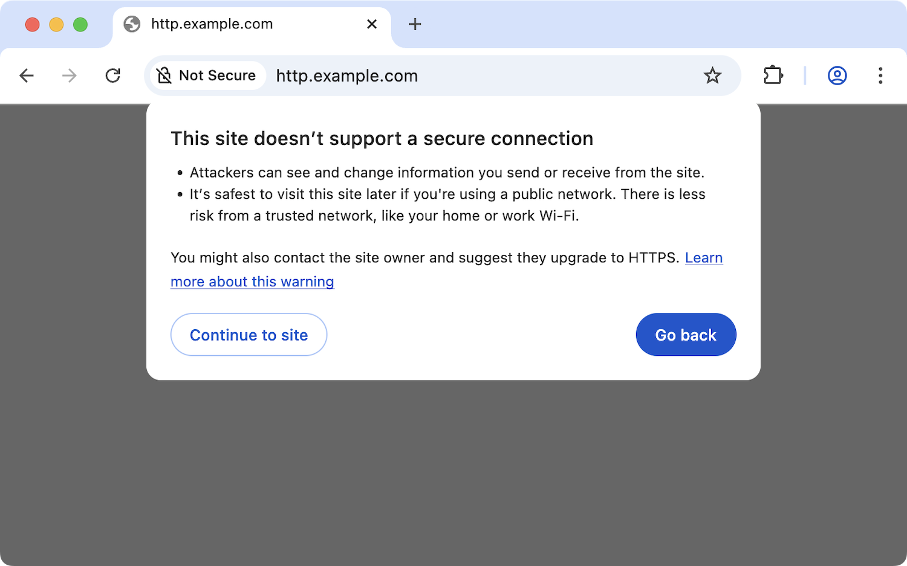

# Adapting your website for Chrome’s “Ask-before-HTTP” warning

**Chrome will start asking for users’ permission before navigating to HTTP pages
by default in Chrome 154.** For more background on Chrome’s “Always Use Secure
Connections” setting and the motivations for requiring user permission see our
[blog post](https://security.googleblog.com/2025/10/https-by-default.html).

If you have a website that is served over HTTP (either directly or for any
possible redirect steps a user may go through before reaching your site), this
document tries to answer common questions and provide guidance on how to adapt
your website to work in an HTTPS-first future.

The vast majority of websites are now using HTTPS and will continue working as
they do today.

Enterprises also have policy controls available for allowlisting HTTP on
specific websites. See the [Enterprise FAQs](#enterprise-faqs) below for more
information.

[TOC]

## FAQs

### What is the current scope of Ask-before-HTTP in Chrome?

The Ask-before-HTTP warning is triggered when Chrome was unable to connect to a
site via HTTPS but believes that it may be able to connect over HTTP. Chrome
will prompt the user before accessing the site via HTTP.

Chrome remembers a user's decision for 15 days, and the exception is renewed
whenever a user revisits that site – this means that if a user regularly uses an
HTTP site they may only ever see the warning once for that site.

If a user explicitly navigates to an HTTPS URL (either because a link specifies
https://, or the user enters an https:// URL in the omnibox) and the navigation
fails, the user will see a regular network error page and no fallback to HTTP is
attempted. Similarly,
[if a site has HSTS configured, Chrome does not try to fall back to HTTP](#how-does-this-relate-to-other-upgrade-mechanisms-like-hsts-and-https-rr).

### How can I personally opt out of these warnings?

We have tried to balance user friction with security when designing the
configuration that we will be shipping by default to all Chrome users, and we
would encourage you to give it a try. However, if you find it too cumbersome,
you can disable the “Always Use Secure Connections” setting in
chrome://settings/security.

If you have previously configured this setting in Chrome, Chrome will continue
to respect your previously chosen choice, even after the rollout of "Always Use
Secure Connections" by default in Chrome 154.

### How does this affect certificate errors?

In certain exceptional circumstances, users may see warnings alerting them that
they could not connect to a server using HTTPS – for example, if your HTTPS
certificate expires, or your server is misconfigured, or the user is actually
currently under network attack. These warnings are not changing, and no
additional warnings of this type will be shown.

### How can I test my site to identify pages that will trigger warnings?

We recommend you proactively enable “Always Use Secure Connections” for public
sites at chrome://settings/security. This can help identify any unexpected
usages of HTTP that cause warnings.

### How can I configure my site to avoid having my users see warnings?

If your site does not yet support HTTPS, you should migrate your site to HTTPS.

If you run your own server, the
[Mozilla SSL Configuration Generator](https://ssl-config.mozilla.org/) is a
helpful tool for generating sample TLS configurations for many different common
web servers. Many web server implementations, including
[Apache](https://httpd.apache.org/docs/trunk/mod/mod_md.html),
[Nginx](https://blog.nginx.org/blog/native-support-for-acme-protocol) and
[Caddy](https://caddyserver.com/), have integrated support for the
[ACME](https://www.acmeisuptime.com/) for automatically obtaining an HTTPS
certificate. Many certificate authorities now offer free HTTPS certificates, and
optional certificate lifecycle management software.

If you do not run your own web server, you may need to reach out to your hosting
provider for support. Modern hosting and cloud providers support HTTPS, but you
may need to enable it.

If your site uses redirects, such as from your apex domain to a www. subdomain,
you should ensure that _all_ steps are configured to support HTTPS. See the
[section on redirects](#why-am-i-getting-a-warning-even-though-i-end-up-at-an-https-site-after-i-click-through)
below for additional guidance on why it is crucial for every step to support
HTTPS and how to avoid warnings.

### Why am I getting a warning even though I end up at an HTTPS site after I click through?

If in the process of navigating to an HTTPS site there were any redirect steps
that do _not_ support HTTPS, Chrome will show an Ask-before-HTTP warning. After
clicking through that warning, the navigation will continue and proceed to the
HTTPS site. This exposure to insecure HTTP during redirects is a key risk that
Chrome is trying to address with these new warnings.

To avoid these warnings for your users, you should ensure that all inbound links
and redirect chains fully support HTTPS at every step along the way, not just at
the final destination page.

You can
[test your site with the new warnings enabled](#how-can-i-test-my-site-to-identify-pages-that-will-trigger-warnings)
and inspect the URL each time the Ask-before-HTTP warning is shown to identify
each host that needs to be configured to support HTTPS. You can also use the
[Network panel in Chrome DevTools](https://developer.chrome.com/docs/devtools/network/overview)
to inspect each redirect hop that occurs while navigating to the affected site,
to identify any that do not support HTTPS.

> **Example:**
>
> If you serve your site on `https://www.example.com` and have a redirect from
> `http://example.com` to `http://www.example.com`, and your server is _not_
> configured to support connections on <strong><code> style="text-decoration:underline;">https://example.com</code></strong>,
> your users will see warnings when navigating to `example.com`. You should
> update your server configuration to add HTTPS support to the apex domain
> (`example.com`) to avoid these warnings.

If your site uses additional redirects (such as for tracking inbound links), all
steps in the redirect chain must be configured to support connections over
HTTPS. Multiple insecure redirects could cause your users to see multiple
Ask-before-HTTP warnings while trying to navigate to your site.

If you use domain forwarding services, you may need to reach out to your service
provider to ask whether they support HTTPS and if there is any additional
configuration required. If your inbound domain is set up as a CNAME to your
service provider, then it should be possible for the service provider to acquire
HTTPS certificates on your behalf.

### How does this impact local website development?

If you are developing on a server that doesn’t support HTTPS but is using a
public hostname, you may see the Ask-before-HTTP warning. Clicking through the
warning will allow local development as today.

A common local development practice is to serve local files on
`http://localhost` -- this is considered secure and will not show warnings.

Another common development practice is to use local servers deployed to local
names such as `staging.local`. Non-unique hostnames, local IP addresses, and
single-label hostnames will also not show warnings.

There are some cases where you may need to run your local development site with
HTTPS. See our articles on
“[When to use HTTPS for local development](https://web.dev/articles/when-to-use-local-https)”
and
“[Use HTTPS for local development](https://web.dev/articles/how-to-use-local-https)”
for more information and our current recommended best practices.

### How does this affect automated testing with ChromeDriver / Selenium / etc.?

If you use automated browser testing and encounter issues with Chrome’s
Ask-before-HTTP warnings, you can add hosts to the HTTP allowlist using the
`--unsafely-treat-insecure-origin-as-secure` command-line flag, which takes a
comma-separate list of origins (e.g., `http://example.com`) or hostname
wildcards (e.g., `*.example.com`).

> **Example:**
>
> If your automated browser testing relies on navigating to `insecure.example`
> and various subdomains of `example.com` over HTTP, and your tests are running
> into issues due to Chrome’s Ask-before-HTTP warnings when navigating to these
> sites, you can pass the command-line flag to Chrome to allowlist these
> origins:
> `--unsafely-treat-insecure-origin-as-secure=http://insecure.example,*.example.com`

Prior to the full launch, you can also disable the default “Always Use Secure
Connections” feature using
`--disable-features=HttpsFirstBalancedModeAutoEnabled`. We’ll update this post
with any future capabilities and flags, and you can track updates on
[this bug](http://crbug.com/378022921).

### What about other browsers (Firefox / Safari / Edge/ etc.)?

Other browsers have similar features for opportunistically trying to upgrade
navigations to HTTPS, and for warning users before navigating to insecure HTTP
pages. Safari, Firefox, and Edge all currently upgrade HTTP navigations to
HTTPS, and have optional modes to warn users before falling back to HTTP.

### How does this relate to other upgrade mechanisms (like HSTS and HTTPS RR)?

A web server can indicate that it supports HTTPS and browsers should prefer (or
enforce) that connections use HTTPS:

*   [HTTP Strict Transport Security](https://developer.mozilla.org/en-US/docs/Glossary/HSTS)
    (HSTS) is a mechanism for websites to instruct web browsers that the site
    should only be accessed over HTTP, by sending a special
    [`Strict-Transport-Security` HTTP header](https://developer.mozilla.org/en-US/docs/Web/HTTP/Reference/Headers/Strict-Transport-Security).
    HSTS can provide stronger downgrade protection, as browsers like Chrome
    won’t fall back to HTTP. HSTS takes precedence over Chrome’s automatic HTTPS
    upgrades and Ask-before-HTTP warnings.
*   [HTTPS Resource Records](https://developer.mozilla.org/en-US/docs/Glossary/HTTPS_RR)
    (HTTPS RR) are a special type of DNS record that can indicate that the
    server supports HTTPS, signaling that clients should upgrade HTTP
    connections to HTTPS.
*   It is also common for websites to be configured to redirect HTTP connections
    to HTTPS using server-side redirects like a
    [301 Moved Permanently](https://developer.mozilla.org/en-US/docs/Web/HTTP/Reference/Status/301)
    status code.

Chrome’s automatic HTTPS upgrades and Ask-before-HTTP warning helps avoid the
user ever having to connect to a server using insecure HTTP for sites that
support HTTPS, regardless of whether the sites opt-in to stronger mechanisms
like HSTS.

Chrome (since 2020 with Chrome 86) also
[upgrades passive mixed content to HTTPS](https://blog.chromium.org/2019/10/no-more-mixed-messages-about-https.html).
This can make it easier for sites to migrate to HTTPS.

### How can I provide feedback or report bugs about Chrome’s Ask-before-HTTP feature?

Please file feedback and bug reports on the
[Chromium issue tracker](https://issues.chromium.org/issues/new?component=1457549).
We are actively monitoring bugs in the `HttpsUpgrades` component, so be sure to
set the correct component when filing feedback.

## Enterprise FAQs

### How can I allowlist certain HTTP sites for my users?

If you have specific sites that your users need to access over HTTP and you want
to suppress the warning on those sites, you can use the
[HttpAllowlist](https://chromeenterprise.google/policies/#HttpAllowlist)
enterprise policy. The policy takes a list of hostnames or hostname patterns
(such as “[\*.]example.com”) that will not be upgraded to HTTPS and will not
show a warning when navigating to them over HTTP. See the documentation for this
policy for more information.

### How can I enforce HTTP warnings for all websites for my users?

You can use the
[HttpsOnlyMode](https://chromeenterprise.google/policies/#HttpsOnlyMode)
enterprise policy to enforce a setting for the “Always Use Secure Connections”
setting in chrome://settings/security. For example, you can set the policy to
“force_balanced_enabled” to enforce that your users have the (upcoming) default
setting and can’t turn it off, or you could opt your users into “strict” mode
where warnings are also shown for private sites by setting the policy to
“force_enabled”. You can also disable the setting. See the documentation for
this policy for more information.

### How do I determine if any of my users will see warnings?

We recommend you proactively enable “Always Use Secure Connections” for public
sites at chrome://settings/security, and then go about your normal workflows.
This can help identify any unexpected usages of HTTP that cause warnings. In
advance of the default changing, you can either migrate any remaining HTTP you
identify to HTTPS, or you can proactively allowlist it for your organization.
This will enable a seamless transition for your users.
