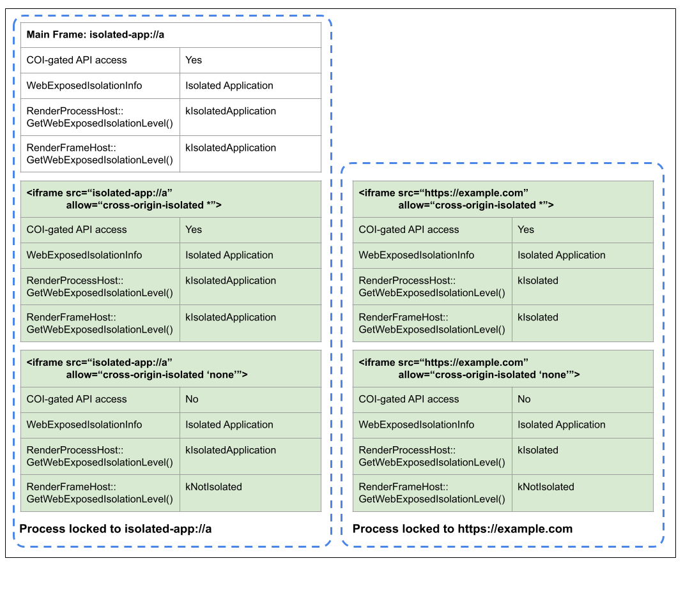

# Cross Origin Isolation

[TOC]

Cross-Origin Isolation aims to protect sites from side-channel attacks such as
[Spectre](https://spectreattack.com/) by defining opt-in rules that allow a
user agent to place pages in specially restricted origin-keyed processes. See [this
article](https://web.dev/articles/why-coop-coep) for more background.
Developers can enable Cross-Origin Isolation by setting both the
[Cross-Origin-Opener-Policy](https://developer.mozilla.org/en-US/docs/Web/HTTP/Headers/Cross-Origin-Opener-Policy)
and [Cross-Origin-Embedder-Policy](https://developer.mozilla.org/en-US/docs/Web/HTTP/Headers/Cross-Origin-Embedder-Policy)
headers.

This document will outline how Cross-Origin Isolation is represented in
specifications, and how that is translated into the Chromium codebase.

# Cross-Origin Isolation in Specifications

At the time that Cross-Origin Isolation (COI) was designed, all major browsers
could put top-level documents in dedicated processes, but not all browsers
supported out-of-process iframes. Because of this, COI had to be designed to
provide side-channel attack mitigation while cross-origin child frames were
running in the same process as the main frame. Much of its complexity comes
from this requirement.

The Cross-Origin Isolation state of [agents](https://tc39.es/ecma262/\#agent)
is represented by the “[cross-origin isolation
mode](https://html.spec.whatwg.org/multipage/document-sequences.html\#bcg-cross-origin-isolation)”
of their browsing context group (BCG), which can have one of [three
values](https://html.spec.whatwg.org/multipage/document-sequences.html\#groupings-of-browsing-contexts:cross-origin-isolation-mode):
none (non-isolated), logical, or concrete. “None” is the default value and will
be used in content that doesn’t set the headers needed to opt-in to COI. A BCG
will have the “logical” isolation mode if its agent clusters cannot have
dedicated processes due to resource or implementation constraints, and
“concrete” if they can. All restrictions imposed by the
Cross-Origin-Opener-Policy and Cross-Origin-Embedder-Policy headers will still
apply to documents in logically isolated BCGs, but they will not have the
cross-origin isolated capability (explained below). The remainder of this
document will ignore the logical isolation mode.

BCGs with logical or concrete Cross-Origin Isolation modes are considered to be
Cross-Origin Isolated, and will be referred to as Cross-Origin Isolated
Browsing Context Groups (COI BCGs) in this document. All top-level documents or
workers in a COI BCG must be same-origin.

If COI is enabled through the Cross-Origin-Opener-Policy and
Cross-Origin-Embedder-Policy headers, then the latter header requires any
cross-origin resource loaded within the COI BCG to opt-in to cross-origin
embedding via the [Cross-Origin-Resource-Policy](
https://fetch.spec.whatwg.org/\#cross-origin-resource-policy-header)
header. This header is needed because in browsers without out-of-process
iframes, cross-origin content embedded in a COI page would be vulnerable to
side-channel attacks from the embedding page. The header limitations ensure
that COI documents cannot use side-channel attacks (e.g., Spectre-related
vulnerabilities using high precision timer APIs) to leak cross-origin content,
unless that content has acknowledged the risk via the CORP header.

## Cross-Origin Isolated Capability

Concrete Cross-Origin Isolation guarantees that no cross-origin content is
running in a document's process unless it opted-in through the
Cross-Origin-Resource-Policy header. This allows user agents to safely expose
APIs that could be used to perform side-channel attacks because there is no
in-process cross-origin content for the document to leak.

Due to the issue described in
[github.com/whatwg/html/issues/5435](https://github.com/whatwg/html/issues/5435),
there’s also a policy-controlled feature required to grant access to COI-gated
APIs. Frames that are missing the “cross-origin-isolated” feature will not be
able to use COI-gated APIs, but COI-related restrictions will still apply to
them. Agents that are allowed to use COI-gated APIs have the “[cross-origin
isolated
capability](https://html.spec.whatwg.org/multipage/webappapis.html\#concept-settings-object-cross-origin-isolated-capability).”
To summarize [yhirano@’s
response](https://github.com/whatwg/html/issues/5435\#issuecomment-640517912)
on that issue, there are 3 concepts at play here:

* **Cross-Origin Isolation mode** \- this refers to whether the aforementioned
  COI restrictions are in place for a given browsing context group.
* **“cross-origin-isolated” feature** \- this refers to [“cross-origin-isolated”](
  https://html.spec.whatwg.org/multipage/infrastructure.html#policy-controlled-features)
  [policy-controlled feature](
  https://github.com/w3c/webappsec-permissions-policy/blob/main/permissions-policy-explainer.md).
  Top-level frames are granted this feature by
  default but may choose to deny it to child frames. Note that despite its name,
  this doesn’t actually control whether a frame can request or be given
  cross-origin isolation, only whether APIs that require cross-origin isolation
  can be enabled.
* **Cross-Origin Isolated capability / `window.crossOriginIsolated`** \- this is
  a boolean global property representing an agent’s COI capability, which
  controls whether COI-gated APIs are available. This is equal to `COI mode &&
  COI feature`.

COI-gated APIs are only available when the `window.crossOriginIsolated`
property is true, and can be blocked in child frames by not delegating the COI
feature.

All frames and workers within a BCG will have the same COI mode. Child
frames in a COI BCG will not have the COI capability (`self.crossOriginIsolated
=== false`) if the “cross-origin-isolated” feature was not delegated to them.
Two same-origin frames in the same BCG with different COI capabilities are
still synchronously scriptable. This means a same-origin child frame without
the COI capability could access COI-gated APIs via its parent document, which
is the intended behavior. This would be a security issue for most
policy-controlled features, which are intended to block access to capabilities,
but “cross-origin-isolated” is a bit more subtle. These APIs are not inherently
dangerous; they're only a threat to cross-origin content running in the same
process. The goal of the “cross-origin-isolated” feature is not to completely
block access to COI-gated APIs, but instead to allow blocking access to them
*in cross-origin iframes*, which in browsers without out-of-process iframes
would have to run in-process. This allows embedding frames to protect themselves
from side-channel attacks from cross-origin embedded content.

Worker behavior depends on the type of worker:

* Service Workers will have the COI capability if their worker script's response
  sets the appropriate Cross-Origin-Embedder/Opener-Policy headers for non-local
  schemes, or will inherit the COI capability of their creator for local
  schemes (about, blob, data, filesystem, etc…). Permissions Policy doesn’t
  apply to workers because it’s a document-level concept (see
  [github issue](https://github.com/w3c/webappsec-permissions-policy/issues/207)),
  so it can’t be taken into account here. See step 14.3.4 in section 10.2.4 of
  the [spec](https://html.spec.whatwg.org/multipage/workers.html\#worker-processing-model).
* Shared Workers and Shared Storage Worklets do not currently support COI.
* Dedicated Workers and Worklets have the COI capability if their
  hosting document does.

## Isolated Contexts

[Isolated Contexts](https://wicg.github.io/isolated-web-apps/isolated-contexts.html)
are environments which meet a minimum bar of isolation and integrity
verification, and are used to gate APIs that are too powerful to expose in
Secure Contexts, and require review/attestation. They are the security
foundation of [Isolated Web Apps](https://github.com/WICG/isolated-web-apps/blob/main/README.md).
Isolated Contexts require COI, but do not directly extend it at a specification
level.

## Document-Isolation-Policy

[Document-Isolation-Policy](https://source.chromium.org/chromium/chromium/src/+/main:content/browser/security/dip/README.md)
builds on and extends the concepts introduced by Cross-Origin Isolation to
allow documents to opt-in to COI without the restrictions imposed by COOP/COEP.
This document doesn't yet cover the specification or implementation details of
Document-Isolation-Policy.

# Cross-Origin Isolation in //content

## [WebExposedIsolationInfo](https://source.chromium.org/chromium/chromium/src/+/main:content/browser/web\_exposed\_isolation\_info.h)

WebExposedIsolationInfo (WEII) **represents a browsing context group’s
cross-origin isolation mode**, and does *not* take into account the
“cross-origin-isolated” policy-controlled feature. Note in the diagram below
that all iframes have the same WEII value regardless of their origin or
Permissions Policy.

WEII is a non-public class in //content, and is the source of truth for the COI
mode of a given BCG. It is a property of [BrowsingInstance](
https://source.chromium.org/chromium/chromium/src/+/main:content/browser/browsing\_instance.h)
(//content’s representation of a BCG) and
[ProcessLock](https://source.chromium.org/chromium/chromium/src/+/main:content/browser/process\_lock.h),
and can have a value of “not isolated”, “isolated”, or “isolated application.”
In the latter two cases it will also contain the origin representing the
isolation boundary. The origin is necessary to ensure that documents from the
same site embedded within two cross-origin COI pages will never be placed in
the same process.

As mentioned above, Isolated Contexts aren’t an extension of the Cross-Origin
Isolated mode at the specification level, but they are at the //content level.
The “isolated application” WEII represents Isolated Contexts. Long term the
“isolated application” WEII to Isolated Context mapping should be 1:1, but for
now Chrome Apps are also considered Isolated Contexts because they need access
to these APIs but predate Cross-Origin Isolation and often don't work with it
enabled.

## [WebExposedIsolationLevel](https://source.chromium.org/chromium/chromium/src/+/main:content/public/browser/web\_exposed\_isolation\_level.h)

WebExposedIsolationLevel (WEIL) is a public enum in //content that, like WEII,
has three values: kNotIsolated, kIsolated, and kIsolatedApplication. It
**represents the cross-origin isolated *capability* of a specific frame**
if accessed from RenderFrameHost::GetWebExposedIsolationLevel(), or
the **cross-origin isolated *mode* of a process** if accessed from
RenderProcessHost::GetWebExposedIsolationLevel(). Unlike kIsolated,
kIsolatedApplication will not propagate to cross-origin child frames; they will
have at most the kIsolated WEIL.

This means that WEIL and WEII will differ in workers or iframes if their
process is locked to a different origin than the WEII, and will differ in
frames if the “cross-origin-isolated” feature was not delegated to the frame.

<!-- Source: https://docs.google.com/drawings/d/1tCeworrk7qYkbyAbjeWVgmBrqe5XOenxJbLlNmm4lN8/edit -->

## Guarding APIs on Isolation Level

API access should be guarded on RenderFrameHost::GetWebExposedIsolationLevel(),
which takes permissions policy into account, when a RenderFrameHost is
available. Shared and Service Workers don’t have a RenderFrameHost, so they
need to use RenderProcessHost::GetWebExposedIsolationLevel() to check their
isolation mode. This does mean permissions policy will be ignored, which is the
expected behavior.

# Isolation Level Representation in Blink

The application isolation level maps to “Isolated Context” in Blink. APIs can
be limited to this isolation mode by adding the \[IsolatedContext\] IDL
attribute, which reflects the static
[Agent::IsIsolatedContext()](https://source.chromium.org/chromium/chromium/src/+/main:third_party/blink/renderer/core/execution_context/agent.h?q=%5CbIsIsolatedContext%5Cb),
which itself reflects the process’s WEIL. There’s also
[ExecutionContext::IsIsolatedContext()](https://source.chromium.org/chromium/chromium/src/+/main:third_party/blink/renderer/core/execution_context/execution_context.h?q=%5CbIsIsolatedContext%5Cb),
which maps to Agent::IsIsolatedContext(). Checking API availability in Blink
currently requires checking both ExecutionContext::IsIsolatedContext() and
[ExecutionContext::CrossOriginIsolatedCapability()](https://source.chromium.org/chromium/chromium/src/+/main:third_party/blink/renderer/core/execution_context/execution_context.h?q=%5CbCrossOriginIsolatedCapability%5Cb).

# Appendix
Other useful resources:
 * [COOP and COEP explained](https://docs.google.com/document/d/1zDlfvfTJ_9e8Jdc8ehuV4zMEu9ySMCiTGMS9y0GU92k/edit?usp=sharing)
 * [Notes on the threat model of cross-origin isolation](https://arturjanc.com/coi-threat-model.pdf)
 * [Post-Spectre Web Development](https://chromium.googlesource.com/chromium/src/+/main/docs/security/post-spectre-webdev.md)
