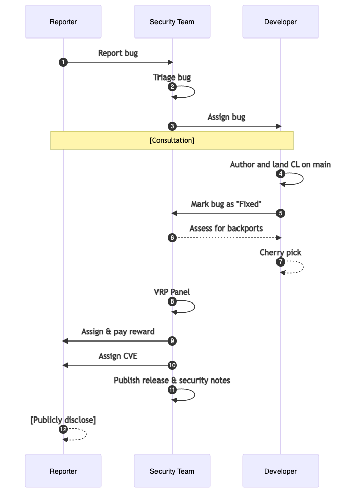

# Life of a Security Issue

This page will help you understand the life cycle of a manually-reported
external security bug in the Chromium project. Internally reported and
fuzzer-found bugs follow a similar lifecycle, though specific details vary. The
process can be visualized at a high level using the state diagram below, and
further explanation is provided in the paragraphs that follow.

<pre style="display:none" data-note="Source code for sequence diagram. Gitiles will not display this.">
<!--
https://mermaid.live/edit#pako:eNqNU71uwjAQfpWTh070BTJUqgKd2goBYiEdLvZBLBw79Q9thHj3OpAgklCJJUpy39_d2UfGjSCWMEffgTSnqcSdxTLTmcfgjQ5lTrb5qtB6yWWF2sOCKmP9-P-SeLDS17Cii8RtcUoHUqY6s2Kp03h-eenRklYd8rBrcL3iGLyyMTD9B756JvDqnNzpFhihn8YTmAPZazeTG_QmNdoF5dFLo78ujGt5IBx8YSygFqCaR_oORkOJckQaRP9Au2_yADrI2Jv8JZGxi1W_j1Ej5Bxso2eOfN9kd8OAfUZakLU1VJLv78mPgq0Xc5ijJnUP203rOtEnqLAGSz9oxUOEdD17IMQ85Eq6IgorQkfRxnUAHVfnBqeoZ7Q5k7mqQUjHlXEUV8gmrCQb9yLicT9mGuLQfUElZSyJr4K2GBfebOAUoaES6GkmpDeWJVtUjiasuRHLWnOWeBuoA7VXpkWd_gADszf5
-->

sequenceDiagram
	autonumber
	participant Reporter
	participant Security Team
	participant Developer

	Reporter->>Security Team: Report bug
	Security Team->>Security Team: Triage bug
	Security Team->>Developer: Assign bug

	Note over Reporter,Developer: [Consultation]

	Developer->>Developer: Author and land CL on main
	Developer->>Security Team: Mark bug as "Fixed"

	Security Team-->>Developer: Assess for backports

	Developer-->>Developer: Cherry pick

	Security Team->>Security Team: VRP Panel
	Security Team->>Reporter: Assign & pay reward
	Security Team->>Reporter: Assign CVE
	Security Team->>Security Team: Publish release & security notes

	Reporter-->>Reporter: [Publicly disclose]
</pre>

## 1. Report bug

A security bug begins when a reporter [responsibly
discloses](https://www.chromium.org/Home/chromium-security/reporting-security-bugs/)
a bug in the [Chromium issue
tracker](https://code.google.com/p/chromium/issues/entry?template=Security%20Bug).
The new bug is placed in a queue of other incoming security bugs, and it is
view-restricted to the reporter and select individuals on a need-to-know
basis.

Bug reports that include specific steps to reproduce, analysis, proofs of
concept, and/or suggested patches are encouraged. Please also check the
[FAQ](faq.md) to learn about issues that are frequently reported.

## 2. Triage bug

After the bug is filed, a [security sheriff](sheriff.md) will evaluate the
report. The sheriff does several tasks:

- Validate that the bug reproduces
- Searching for any duplicate reports
- Tag the bug with components
- Assess the bug's [severity](severity-guidelines.md)
- Determine the versions affected
- Assign the bug to a developer

## 3. Assign bug

The primary job of the sheriff is to route valid and actionable reports of
security bugs to the Chromium developer who is best poised to fix the issue.

After the issue is assigned, there may be discussion between the developer(s)
involved, members of the security team, and the original reporter.

## 4. Author and land a CL on `main`

The developer will author a fix and a regression test for the security issue
The CL description should mention the bug number in a
[`Bug:` or `Fixed:` footer](../contributing.md#cl-footer-reference).
Once the CL lands, it will not yet be widely available to users, since it is
only in the `main` branch. Unless further steps are taken (see below), the fix
will roll out as part of the normal [release
process](../process/release_cycle.md).

Reporters are welcome to include a suggested patch in the report or to [upload a
CL](../contributing.md) with the fix. In that case, the developer assigned to
the bug can help code review and land it.

## 5. Mark bug as *Fixed*

Once the CL has landed, the developer should set the bug's status to *Fixed*.
When the bug moves into the *Fixed* state, the security team's automation
systems begin processing the bug report. In particular, the tools will add
[merge request](../process/merge_request.md) labels, based on the severity and
impact assessed by the sheriff during triage.

## 6. Assess for backports

A member of the security team or a security technical program manager (TPM) will
make the [final
determination](https://www.chromium.org/Home/chromium-security/security-release-management/)
as to whether backports of the fix should occur to Stable and/or pre-Stable
Chrome release channels.

## 7. Cherry pick

If approved for backporting, the developer will [cherry
pick](../process/merge_request.md#landing-an-approved-merge) the CL to the
release branches identified by the security TPM.

## 8. VRP Panel

Members of the security team meet regularly as a panel to assess [vulnerability
rewards](vrp-faq.md) for externally reported security bugs. The individuals on
the panel will [take into account](https://g.co/chrome/vrp) the severity and
impact of the bug, the quality of the bug report, whether a patch/fix was
proposed with the report, and other mitigating circumstances. The VRP panel will
assign any reward amount for the bug.

## 9. Assign and pay reward

After the VRP panel meets, the reporter will be notified of the VRP reward
decision through the bug report, and a label will be applied with the VRP reward
amount.

## 10. Assign CVE

At the time that the security fix is shipped to a Stable channel release, a
security TPM will assign the issue a [CVE](https://www.cve.org/) number. CVE
numbers need to point to a publicly accessible artifact, and Chrome uses the
releases blog (see below) for this purpose.

## 11. Publish release & security notes

The Chrome Release team releases an update of Chrome containing the security
fix. If the fix is included in a Stable channel release of Chrome, it will be
listed and acknowledged in the security fix notes on the [Chrome Releases
blog](https://googlechromereleases.blogspot.com/). Security issues will be
highlighted with a short description, any reward amount, the CVE number, and
acknowledging the reporter as requested (if they have consented to such).

## 12. Publicly disclose

Except in rare circumstances where the bug report has been embargoed, 14 weeks
after the issue is marked *Fixed*, security automation opens the bug for public
disclosure. At that time, the reporter can consider their obligations under
responsible disclosure to be fulfilled.
