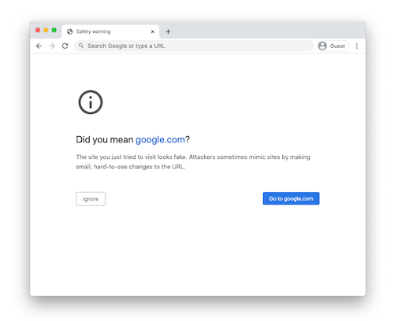
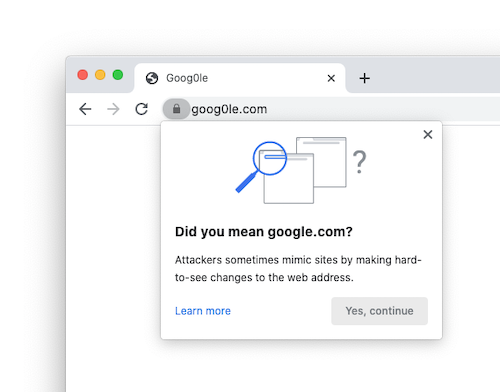

# "Lookalike" Warnings in Google Chrome

[TOC]

## What are lookalike warnings?

"Lookalike" domains are domains that are crafted to impersonate the URLs of
other sites in order to trick users into believing they're on a different site.
These domains are used in social engineering attacks, from phishing to retail
fraud.

In addition to [Google Safe Browsing](https://safebrowsing.google.com/)
protections, Chrome attempts to detect these lookalike domains by comparing the
URL you visited with other URLs that are either very popular, or that you have
visited previously. These checks all happen within Chrome -- Chrome does not
communicate with Google to perform these checks.

When Chrome detects a potential lookalike domain, it may block the page and show
a full-page warning, or it may show a pop-up warning, depending on how certain
Chrome is that the site is a spoof. These warnings typically have a "Did you
mean ...?" message.

| High-confidence warnings               | Low-confidence warning        |
|:--------------------------------------:|:-----------------------------:|
|  |  |

These warnings do not indicate that the site the user has visited is malicious.
The warnings indicate that the site looks like another site, and that the user
should make sure that they are visiting the site that they expected.

## Examples of lookalike domains

Chrome's checks are designed to detect spoofing techniques in the wild. Some
example "lookalike" patterns that trigger warnings include:

 * Domains that are a small edit-distance away from other domains, such as
   `goog0le.com`.
 * Domains that embed other domain names within their own hostname, such as
   `google.com.example.com`.
 * Domains that use IDN
   [homographs](https://chromium.googlesource.com/chromium/src/+/main/docs/idn.md),
   such as `goögle.com`.

This list is not exhaustive, and developers are encouraged to avoid using
domains that users without technical backgrounds may confuse for another site.


## Lookalike checks are imperfect

Chrome's lookalike checks are not always right. Chrome can not detect all
lookalike domains, and often lookalike domains are not malicious. Our
intent with Chrome's lookalike warnings is not to make spoofing impossible,
but to force attackers to use less convincing lookalikes, allowing users to
notice spoofs more easily.

While Chrome's checks sometimes label some benign pages as lookalikes, we use
several approaches to minimize mistakes:

 * Checks are tuned to minimize warnings on legitimate pages.
 * Users are never prohibited from visiting the site requested, and the warnings
   shown are designed to be helpful and informative, rather than scary.
 * We monitor what sites trigger the most warnings on a regular basis, and
   disable warnings when we identify mistakes.
 * For domains used in company environments, we provide an [Enterprise
   Policy](https://cloud.google.com/docs/chrome-enterprise/policies/?policy=LookalikeWarningAllowlistDomains)
   allowing businesses to selectively disable warnings as needed for their
   users.
 * For several months following the roll-out of new lookalike checks, we accept
   review requests from site operators whose sites have been flagged.
 * New lookalike checks launching in Chrome 88 or later will trigger a console
   message informing site owners of the issue for at least one release prior to
   triggering user-visible warnings.


## Not all users see all warnings

Chrome shows warnings in part based on a users' browsing history. This allows
Chrome to be both more helpful (by providing better recommendations) and make
fewer mistakes (by not flagging lookalikes for irrelevant sites).

Chrome only shows warnings on sites that the user has not used frequently.
Further, Chrome will only recommend sites that are either well-known (i.e. top)
sites, or the user has an established relationship.

Sites that show a warning to you may not show for another user, unless that user
has visited the same sites that you have.

## Removing Lookalike Warnings from a site

It is possible to remove warnings on sites where Chrome is incorrectly showing
a warning.
 * If you are the owner of both the site showing the warning and the site that
   Chrome thinks users should visit, you can use our
   [**automated warning removal process**](#automated-warning-removal).
 * If you are not the owner of both sites, or you can't follow the automated
   process, you can [**request a manual review**](#requesting-a-manual-review).


### Automated warning removal

If you own both the site where Chrome is showing a warning, as well as the site
that Chrome is recommending, you can suppress these warnings by proving that you
control both sites using a special form of 
[Digital Asset Links](https://developers.google.com/digital-asset-links).

#### Instructions
1.  Create a file named `assetlinks.json` containing the following:
```
[{
  "relation": ["lookalikes/allowlist"],
  "target" : { "namespace": "web", "site": "https://example.com"}
},{
  "relation": ["lookalikes/allowlist"],
  "target" : { "namespace": "web", "site": "https://example.net"}
}]
```
2. Replace `example.com` and `example.net` with the domain where the warning is
   shown, and with the domain that Chrome recommends users visit. Do not use
   subdomains (e.g. use "example.com", not "www.example.com").
3. Upload this file to both of your sites at `/.well-known/assetlinks.json`. For
   instance, in our example, you would upload the files at both
   `https://example.com/.well-known/assetlinks.json` and
   `https://example.net/.well-known/assetlinks.json`.
4. **Fill out an automated verification [request](https://forms.gle/DsoM64EmSZ5H4bNd8)**.
   Please provide an email address with a **valid Google account**, otherwise
   you won't get updates.

Once you submit the [request](https://forms.gle/DsoM64EmSZ5H4bNd8), please allow
a few days for all warnings to stop. If verification fails, you should be
notified via email within a few hours. If you don't get an email indicating
verification failure and your sites still show a warning after a week, please
submit a manual review using the process below.

Important notes:
 * You only need to submit the verification request form once with a single
   domain. All other domains are discovered automatically, since you should have
   listed them in the first domain's `assetlinks.json` file.
 * You must keep the `assetlinks.json` file in place so long as you wish to
   suppress the warnings. If you remove either file, Chrome may resume showing
   warnings.
 * You can extend the example `assetlinks.json` to support more than two
   domains, or to support additional Digital Asset Links entries, if needed.
   Please note that Chrome does not support `include` statements in
   `assetlinks.json` files.

### Requesting a manual review

If a site triggers erroneous lookalike warnings in Chrome,
you can ask for a manual review. Please only use this process if you are unable
to use the [Automated Process](#automated-warning-removal) above. In some
cases, we may require that you use the automated process to demonstrate that
you control both sites.

Requests for manual review are generally considered for six months following
after that warning would have started (i.e. after Chrome introduces the check).
After that time, we encourage developers to test their new sites in Chrome to
ensure that their new domain does not trigger warnings.

If you are unable to use the automated process above, and would like to request
a manual review, please fill out a manual review
[request](https://forms.gle/BxV3JGbCbRjucDxq6).
Please provide an email address with a **valid Google account**, otherwise
you won't get updates.

#### Reasons an appeal might be denied

There are several reasons that may lead us to deny your appeal. The following
are some of the most common reasons that don't qualify for manual appeals:

  * **Domains that are only used internally**, such as for testing or in
    enterprise settings. We recommend using the [Enterprise
    Policy](https://cloud.google.com/docs/chrome-enterprise/policies/?policy=LookalikeWarningAllowlistDomains)
    in this case.
  * **For new sites or where very few users are impacted**. We encourage domain
    owners to choose domains that do not look like domains used by other sites
    commonly visited by your users.
  * **For high-risk sites**. In some cases, some domains might be particularly
    vulnerable to spoofing attacks (for instance, where money exchange is
    involved). In these cases, we deny appeals that aren't from the site owner.

Please note that the [automated process](#automated-warning-removal) is not
subject to these restrictions.
