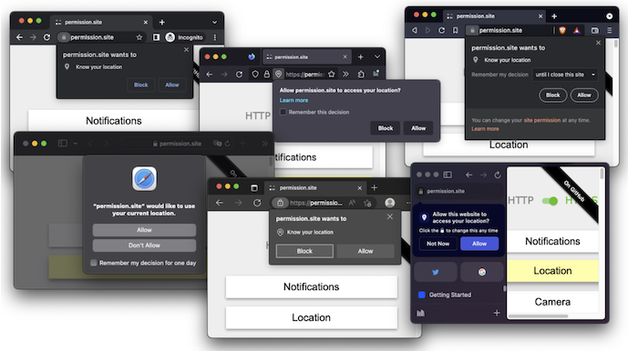
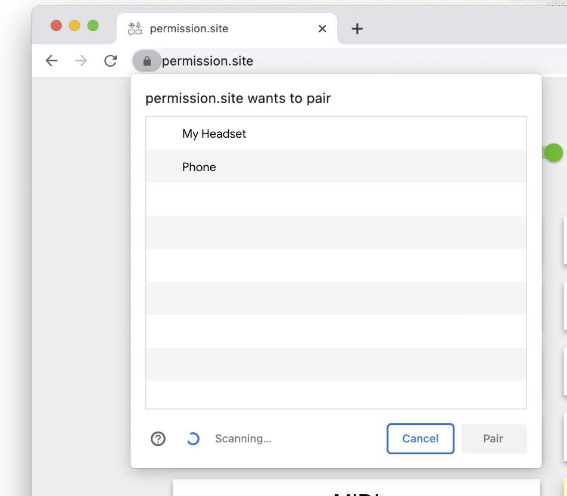
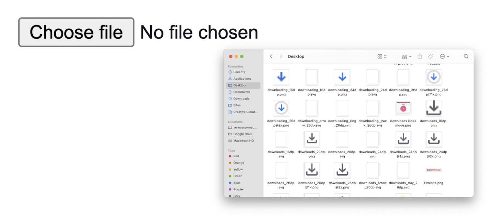
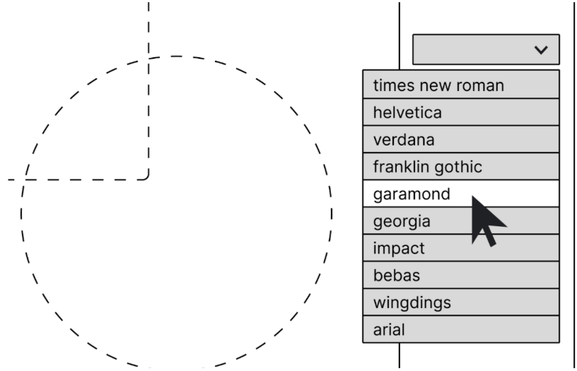
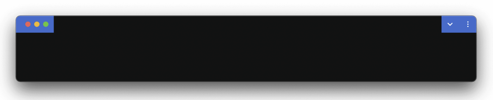

# You Probably Don’t Need a Permission Prompt

It’s an often repeated folklore that functionality and security are fundamentally at odds with each other, but this need not be the case. The tension between functionality and security occurs when we cannot accurately determine user intent. And indeed, this is what the purpose of permission prompts is: **to make sure capability access meets users’ intentions and expectations**, given the purpose for which they are using the site or web app.

Capabilities traditionally within the user mental model — for example, displaying text, images, forms — are expected, and thus the site need not ask for permission. When we *extend* the capability of the web — for example, bluetooth, web USB — behaviour can quickly become unexpected.

*“A system is secure from a given user’s perspective if the set of actions that each actor can do are bounded by what the user* believes *it can do.”*

—Ka-Ping Yee, “[User Interaction Design for Secure Systems](https://digitalassets.lib.berkeley.edu/techreports/ucb/text/CSD-02-1184.pdf)”

Permission prompts are a common solution when it comes to introducing or extending a web API. For mitigating potentially unexpected behaviour, we simply ask: example.com wants to do a thing; Allow or Don't Allow? This is fine on occasion, but as more websites use such protected APIs, we can overload people with what feels like the only tool in our toolbox.

# Pain points

Pain points arise when we over-rely on directly prompting the user, for the following reasons:

*First—* In the case of our current permissions UX, this prompt handling is offloaded onto the developer — it’s **a *developer-push* model**, where the site decides when to best request permissions, and how much context the user needs to make that decision. In an ideal world, the developer is best suited to decide upon the UX; in reality it is difficult to do this well without significant effort and consideration. What often ends up happening is the website prompting immediately after the user lands on the page, having almost zero context for what is going on. Our research suggests that this often happens because developers don't have sufficient resources to put consideration into permissions UX.

*Second—* Outside of the four most-used permission types (camera, microphone, location and notifications), permission-guarded capabilities are often technical and **difficult to explain**. Users must make a trade-off decision about the benefits and the risks, and they cannot do so if they don't understand what the prompt is for, and what the risks for that specific capability are. This is especially true when the capability and risks are completely unrelated; for example, with the Fonts API (where the capability is about accessing font files on their local disk, but the risk is about fingerprinting done from simply the list of installed fonts). Add to that how users are expected to understand and then make this decision during runtime, when they are likely in the middle of a primary task, makes this reasoning even more difficult.

*Third—* Users do not think in terms of technical capabilities. **Users think in terms of *utility***; i.e. what will I be able to *do* if I allow this permission? Prompts outside of the four most used-used permissions types can be especially removed from the context of the user’s goal. And even if a capability serves a primary purpose, risks unknown to the user can still arise.

*Fourth—* We are limited in the amount and kind of information we can reasonably expect the user to parse at prompt time. Due to the inherently interruptive nature, **prompts can only have limited detail**, and web APIs are more often general and not tailored to specific use-cases (which can make securing said API more difficult). Moreover, giving people more granular choice within the prompt comes at a significant complexity cost. It’s worth noting, however, that this cost is not always a bad thing if it is a cost the user deems reasonable to pay (see: User selection).

In general, these pain points can be summarised by a **lack of information necessary for [contextual integrity](https://www.computer.org/csdl/magazine/sp/2023/01/09990902/1J9z9wIXRao)**; i.e., the user either does not have enough information about the parameters of information flow (subject, sender, recipient, information type, transmission principle, purpose) or the user has enough information but deems it inappropriate.

# Reframing our approach

What might non-prompt based permission UX look like? We can start by reversing the problematic aspects of our current approach:

**User-pull over developer-push.** What if, instead of *pushing* the permission moment onto the user, we let the *user pull* when they wish to grant a permission or use a capability?

**Utility before capability.** What if, instead of asking about *capabilities*, we ask about *utility*? We should ask questions users can reasonably answer.

**No more single points of failure.** What if, instead of limiting to a single yes/no permission moment, we *spread out the decision* (and therefore the risk) by enabling people to grant less scary *subsets* of the capability they wish to use; for example in time (e.g. one-time grants), fidelity (e.g. coarse location), or granular access (e.g. a single font file, rather than all fonts on disk).

In general, our approach should be to **consider both usability *and* security during API design itself**, rather than mitigating risks with a permission afterwards. If we find ourselves putting a capability behind a permission where it is difficult to understand

* what it does,
* how it relates to what the user is trying to do on the website, or
* what the risks are and why they are risks at all,

then that’s a design smell that tells us perhaps this API’s risks should not be mitigated by a permission at all.

# Concepts for expanding our UX toolbox

Below, we list a set of approaches that can be leveraged instead of permission prompts and that help to avoid undue friction while preventing capability abuse.

## User selection

“Picker prompts” such as those for Bluetooth and WebUSB can make what is being shared more tangible through the act of device selection.

Even though this pattern is more complex and requires more cognitive load, it is welcomed rather than annoying because choosing a device to pair to is a reasonable and natural step for pairing a device.

Complexity and friction need not feel painful if we **align user needs with security needs**. If the interaction we require from them to clarify their intention is the same interaction that they would reasonably expect to do to complete their task — even regardless of security checks — the flow will feel natural and painless.

## Leverage existing models

Rather than teach people an entirely new UI paradigm, we can piggyback off known concepts and familiar UI, like the operating system’s own file explorer, to make it clear to people what is happening. In the file upload example, it’s obvious what information you’re exposing to the website, because you’ve interacted with files and folders in the same file explorer before.

## User agent to sandbox risks away from websites

Another way to address risks without a prompt is to leverage the user agent to draw richer UIs in content. This is especially useful to mitigate against fingerprinting risks. With fingerprinting, the problem is often rooted in exposing a set of options to the site only to choose one or a few of them to enable a capability. However, exposing that set of options already contributes significant entropy towards fingerprinting the client, even though knowing about all the options isn’t strictly necessary for the capability. By finding ways to not expose the full set of options to the site, we can reduce that entropy while still enabling the site to use the capability. For example, it would be a lot less risky to allow sites to use the client’s custom fonts if the site did not get to see **all** the fonts available. The user agent can render a picker and only expose the single selected font for the site to use. Notably, such an approach also reframes the problem from capability to utility and lets users pull for it. In the fonts example, the user is no longer asked to share all their fonts with a website but instead gets to pick a single font that is useful to them in that moment.

## Direct controls

Giving people direct control over the capability they might want to use switches the model from one that’s developer-push to one that’s user-pull. If we can design the feature intuitively, and surface the control in appropriate surfaces where people might need it the most, we can let the user decide for themselves whether they want this extra functionality, instead of the website interrupting to ask if they want it. Such direct controls are more straightforward to provide when they are located in trusted browser UI, such as the [window controls overlay](https://developer.mozilla.org/en-US/docs/Web/API/Window_Controls_Overlay_API) example above, but with a concept like permission elements (see below) they can also be provided in the content area at web developers’ discretion.

## Embedded elements

")

A user agent could guarantee a more confident signal of user intent by [embedding a controlled element on the webpage](https://github.com/WICG/PEPC/blob/main/explainer.md), where the user agent can guarantee that no deceptive content is shown in its place. Currently, it is possible for websites to frontload deceptive framing to people before and while showing them the browser’s permission prompt, tricking people into allowing capabilities that they otherwise would not have allowed. Common practices seen in the wild include asking people to “click allow to prove you are not a robot”, prompting people to blindly click “allow” when presenting with the permission prompt while being mislead about the prompt's purpose.

An embedded element with text that cannot be changed (e.g., “Use microphone”), and has legibility criteria such as minimum font size, colour contrast and visibility requirements, allows the user agent to be more confident of a user’s *intention* when that element is clicked and subsequent prompt gets confirmed.

# Epilogue: When are prompts okay?

Today, we find that several capabilities lend themselves well to permission prompts. We outline what we think makes them amenable to that treatment below.

**Users are able to judge usefulness of the capability for a given context**

Prompts work well when users can judge whether or not a given capability is useful for their context. We find that users often use value judgements in their decision making: do I get something in return for sharing my location or can I just as well type in my zip code? Will my experience be optimal for my purposes if I let this site access my camera?

If users can make useful decisions about utility in a given context, prompts will feel empowering to them. Put another way, if there are situations where users are reasonably declining the prompt while others allow it, we were asking useful questions.

**The abuse potential is obvious**

[Our research](https://dl.acm.org/doi/10.1145/3613904.3642252) finds that users often make rational decisions on the most used capabilities on the web today — notifications, geolocation, camera, and microphone. All of them have in common that there is little uncertainty about how these capabilities can be abused. In user interviews, we find that people have clear understanding of abuse potentials: notifications can be very annoying; geolocation can be used to track where one was and thus make more money off ads; and camera and microphone can be obviously used to spy on one’s life. Even though there might be even worse abuse scenarios, users aren't entirely clueless what could possibly go wrong.

If users are aware of potential abuse, they can factor that into their own decision making and trust assessments and thus benefit from being prompted. In other words, this comes back to the spread between the best case or expected and worst case outcome of a capability. When the worst case outcome is close to what people assume or expect, we can expect them to make reasonably good decisions on their own. However, this only applies when users are making intentional decision and are not being tricked into reacting to a permission prompt.

**There is clear feedback when the capability is being used**

When it becomes hard to overlook that a capability is being used, there is also less risk of users being surprised by unexpected access. Additionally, as we improve our indicators and access to management surfaces, it becomes more obvious and easier to then revoke a capability unexpectedly accessed.