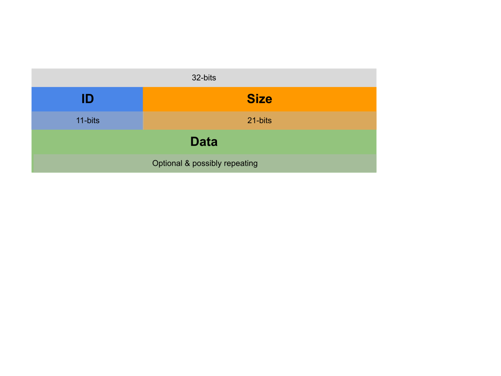

# GPU Command Buffer

Authors: chrome-offsec-team@google.com 
Last updated: April 10, 2023 

## Overview
The GPU Command Buffer is used to create and manage high throughput
communication paths using a combination of Mojo IPC and shared memory regions.
It is currently used by Chrome to support three distinct methods of
GPU-accelerated graphics: WebGL2, Skia rasterization, and WebGPU. Mojo IPC
messages are used to communicate the metadata necessary to establish new shared
memory regions and coordinate state among endpoints producing and consuming from
the memory region. Communication paths are between two endpoints: one client and
one service. Typically the service endpoint resides in the GPU process and
clients reside in the renderer process, but there is support for exceptions such
as when GPU functionality is forced to run as a thread in the browser process,
or unit tests where everything runs in a single process. A single renderer
process may host multiple clients, such as when web content utilizes both WebGL
and WebGPU features, where each context has an independent dedicated Command
Buffer.

The structure of Command Buffer data can be thought of as a layering of
protocols. Common functionality is shared by all client-service types and
specialized application-specific functionality is built on top. Core
functionality provides the mechanisms to establish and manage the communication
path, such as creating new shared memory regions and providing synchronization
primitives. Specialized functionality pertains to application-specific features,
such as shader configuration and execution.

### Security Investment Rationale
Isolating untrustworthy content within a sandboxed process is a cornerstone of
the Chrome security model. Communication paths that bridge the sandbox to more
trustworthy processes are a key part of the inter-process security boundary. The
separation of the signaling mechanism (i.e. Mojo IPC) from the data transfer
mechanism (i.e. shared memory) creates the potential for state inconsistencies.
The layered nature of communication creates the potential for nuanced,
cross-protocol dependencies. The use of shared memory creates the potential for
time-of-check-time-of-use issues and other state inconsistencies.

## Research Scope & Outcomes
The Command Buffer investigation was part of a broader effort to identify areas
of interest to attackers within the Chrome GPU acceleration stack. After
narrowing our focus to code supporting the WebGPU subsystem, we still found the
stack to be far larger and more complex than we could comprehensively audit in
one pass. To further narrow scope we identified discrete components of
functionality underpinning the WebGPU stack. The Command Buffer is one such
component. Investigation of the Command Buffer proceeded in parallel to analysis
of other GPU subsystems.

Command Buffer communication is structured in layers. The foundational or common
layer is shared by all higher layers. We chose to start analysis with the common
features because of their applicability to all higher layers. The Command Buffer
also supports application-specific features that behave like higher level
protocols. Examples of higher level layers include support for WebGL and WebGPU.
It is these higher level features - specifically the implications of
cross-protocol interactions with the low level features - that we believe
represent the bulk of complexity and attack surface. However, these are not yet
explored and give motivation to revisit this subsystem.

### Command Buffer Usage in Chrome
The Command Buffer is used in four different scenarios:

- [Proxy](https://source.chromium.org/chromium/chromium/src/+/main:gpu/ipc/client/command_buffer_proxy_impl.h;l=70;drc=93a273dd903e50a36011ea159fd9dc70c7000d87):
  Used by sandboxed processes to communicate with the CommandBuffer service in
  the GPU process.
- [Direct](https://source.chromium.org/chromium/chromium/src/+/main:gpu/command_buffer/service/command_buffer_direct.h;l=19;drc=93a273dd903e50a36011ea159fd9dc70c7000d87):
  Used by the CommandBuffer service within the GPU process.
- [In-process](https://source.chromium.org/chromium/chromium/src/+/main:gpu/ipc/in_process_command_buffer.h;l=88;drc=b8743ff466a0d0208841a8c1bd906f481fc7f9ec):
  Used when clients and services are all in the same process, such as unit tests
  and when Chrome is run in single-process mode.
- [Pepper](https://source.chromium.org/chromium/chromium/src/+/main:ppapi/proxy/ppapi_command_buffer_proxy.h;l=31;drc=821ca309ed94810aa52df2b31fc916806e207e0e)
  (deprecated): Used by plugins - and possibly also extensions and apps - to
  communicate with the CommandBuffer service in the GPU process.

Each client type implements at least one of two additional classes that each
provide a means of IPC signaling:

1. CommandBufferClient: Used by the service to send messages to clients.
   Implemented via
   [Mojo](https://source.chromium.org/chromium/chromium/src/+/main:gpu/ipc/common/gpu_channel.mojom;l=282;drc=0a3ae731632f6d414e0460ab6bc0bb6e452adfda)
   for multi-process use cases; the CommandBufferServiceClient is an equivalent
   variation to support single-process operation via direct
   [C++](https://source.chromium.org/chromium/chromium/src/+/main:gpu/command_buffer/service/command_buffer_service.h;l=50;drc=0a3ae731632f6d414e0460ab6bc0bb6e452adfda)
   API calls.
2. [GPUControl](https://source.chromium.org/chromium/chromium/src/+/main:gpu/command_buffer/client/gpu_control.h;l=37;drc=0a3ae731632f6d414e0460ab6bc0bb6e452adfda):
   Used by clients to send messages to the service. Implemented via
   [Mojo](https://source.chromium.org/chromium/chromium/src/+/main:gpu/ipc/common/gpu_channel.mojom;l=240;drc=0a3ae731632f6d414e0460ab6bc0bb6e452adfda)
   for multi-process clients and C++ for in-process use cases.

The Proxy use case is most interesting because it is the attack surface
available from a sandboxed renderer process as deployed in real Chrome
instances. However, we intended to pursue fuzzing and Chrome's primary fuzzer
framework is based on single-process unit tests, so it was necessary to instead
target the in-process implementation supported by unit tests even though it
stubs-out or emulates interesting features.

## Fuzzing
Existing fuzzers for the Command Buffer were developed by the GPU team and
predate our analysis. We studied these fuzzers - in particular how they
bootstrap the graphics subsystem for testing - and developed new fuzzers with
different generation strategies, finding one new high severity security
[bug](https://crbug.com/1406115) in the same narrow feature set already covered
by existing fuzzers. Much like our fuzzers from this first pass, the existing
fuzzers targeted specific portions of functionality. An emerging theme for
improving fuzzing Chrome at large applies here as well: layering and integration
of fuzzers is expected to increase reachability of complex state and therefore
increase aggregate fuzzer effectiveness.

In other words, the coverage resulting from a combination of individual fuzzers
is greater than the sum of its parts. Consequently, we intend to incrementally
extend and integrate fuzzers in order to exercise cross-feature complexity
during future work in the graphics subsystem. The next step is integration with
new and complementary fuzzer targeting the WebGPU Dawn Wire protocol.

We developed [one new fuzzer](https://crrev.com/c/4261996) tailored for the
Command Buffer. Its design is similar to an [existing
fuzzer](https://source.chromium.org/chromium/chromium/src/+/main:gpu/command_buffer/tests/fuzzer_main.cc;l=537;drc=c098bef2b9cb022ef1a037f28d3e3ee845c7a91a),
but the new fuzzer differs in a few ways:
- It uses [libprotobuf-mutator](https://github.com/google/libprotobuf-mutator)
  (LPM) for generation.
- The LPM
  [grammar](https://source.chromium.org/chromium/chromium/src/+/main:testing/libfuzzer/fuzzers/command_buffer_lpm_fuzzer/cmd_buf_lpm_fuzz.proto)
  targets
  [CommandBuffer](https://source.chromium.org/chromium/chromium/src/+/main:gpu/command_buffer/common/command_buffer.h;l=18;drc=e20bf9387f49c3a0b208bad26dc8efc0dc214e96)
  features that are common to all client-service types, making it suitable for
  combination with other LPM fuzzers targeting higher level client-service
  types, such as WebGPU.

It so happens that most of the CommandBuffer features targeted by the new fuzzer
also involve Mojo IPC.

## Higher Layers
Three types of CommandBuffer clients make direct use of its features: WebGL2,
Skia Raster, and WebGPU. This section characterizes how each client type makes
use of the CommandBuffer.

One renderer may act as many clients. For example, if web content makes use of
both WebGL2 and WebGPU, the renderer would have at least two separate
CommandBuffer sessions.

### CommandBuffer Protocol Structure
CommandBuffer commands all start with a header containing two fields: an 11-bit
command identifier and a 21-bit size. The header is followed by zero or more
data fields.

The structure allows for 11 bits of unique commands, each with customizable data
payloads. This is the mechanism used to implement the [common
commands](https://source.chromium.org/chromium/chromium/src/+/main:gpu/command_buffer/common/cmd_buffer_common.h;l=171;drc=05dfbc82b07e06f610b8f2fecaa4d272430cc451).

### WebGL2 and Skia Raster
Just like the common commands, Skia [Raster
commands](https://source.chromium.org/chromium/chromium/src/+/main:gpu/command_buffer/common/raster_cmd_ids_autogen.h)
and [WebGL2/GLES2
commands](https://source.chromium.org/chromium/chromium/src/+/main:gpu/command_buffer/common/gles2_cmd_ids_autogen.h;l=14;drc=4c9af88c669bd724a999193c8ffcff57f0cf6bbe)
are also implemented as native CommandBuffer commands; each new command is
assigned an identifier and their parameters are defined using CommandBuffer
conventions. All native CommandBuffer commands are validated at the
CommandBuffer level.

### WebGPU
WebGPU takes a different approach: a [few native CommandBuffer
commands](https://source.chromium.org/chromium/chromium/src/+/main:gpu/command_buffer/common/webgpu_cmd_ids_autogen.h;l=14;drc=b4bc946c63b2b95e1f05dec4e84adcadd10499c6)
support [many new Dawn
APIs](https://source.chromium.org/chromium/chromium/src/+/main:out/Debug/gen/third_party/dawn/include/dawn/dawn_proc_table.h;l=8;drc=b4bc946c63b2b95e1f05dec4e84adcadd10499c6).
In particular, a single CommandBuffer command called `DawnCommands` (code
pointer:
[client](https://source.chromium.org/chromium/chromium/src/+/main:gpu/command_buffer/client/webgpu_cmd_helper_autogen.h;l=14;drc=b4bc946c63b2b95e1f05dec4e84adcadd10499c6)
/
[service](https://source.chromium.org/chromium/chromium/src/+/main:gpu/command_buffer/service/webgpu_decoder_impl.cc;l=1710;drc=48f518a9bb701c5ef7315b5affad8987517eb234))
implements the bulk of the Dawn Wire protocol.

Unlike native CommandBuffer commands, which each have a unique id at the
CommandBuffer level, Dawn Wire commands are nested inside the data portion of
the `DawnCommands` CommandBuffer command. In the GPU process, the CommandBuffer
command handler reads the command data, which includes an identifier for the
Dawn command, then uses a switch statement to determine which Dawn command to
execute and how to further decode the data. Consequently, Dawn commands use an
entirely discrete set of serialization, deserialization and validation logic.

Notably, the [command
handler](https://source.chromium.org/chromium/chromium/src/+/refs/heads/main:third_party/dawn/src/dawn/wire/ChunkedCommandHandler.h;l=59;drc=2dfb6431910db3004672ccb94df3ce09d13e8770)
is platform specific,
[auto-generated](https://source.chromium.org/chromium/chromium/src/+/main:third_party/dawn/src/dawn/wire/BUILD.gn;l=46;drc=0ebe86d1ca46dd203e7c55577df6115fa527c1c3),
and its design allows individual handlers for Dawn commands (i.e. function
pointers) to be overridden when the WebGPU session is established.

Specific Dawn commands of interest are described in a dedicated document.

## Features of Particular Interest

This section describes high level feature operation to introduce the concepts.
Later documents go into more detail about specific use cases.

### `TransferBuffer`: Efficient Bulk Data Transfer

Enabling efficient bulk data transfer is a core CommandBuffer feature. GPU
clients - namely a renderer process - create a `gpu::TransferBuffer` that
includes a pointer to a memory region the client intends to share with the GPU
process. However, a pointer is only meaningful within a single process's address
space and the goal is cross-process sharing, so `gpu::TransferBuffer` also
contains a unique numeric identifier, `buffer_id_`, that will be consistent
across processes.

When a `gpu::TransferBuffer` is allocated and initialized, an important step is
"registration" with the GPU process. Registration is a Mojo IPC message
containing the `buffer_id_` of the newly created `gpu::TransferBuffer`, which
allows the GPU process to record an association between the `buffer_id_` and a
pointer to the shared buffer within its own address space. After registration
both client and service can refer to the same memory by its ID rather than a
pointer.

The `gpu::TransferBuffer` includes data structures that allow the client and
service to treat the shared memory region as a ring buffer. These data
structures include alignments and offsets within the shared buffer, as well as
features to let client and service indicate their respective positions of
production and consumption within the buffer. These structures must be kept in
sync across both the client and service to achieve intended operation, which
requires cooperation of both client and service. Notably, since the client
creates the shared memory it may also unilaterally reorganize or altogether
de-allocate the memory; this means the service must guard against a compromised
renderer that has many opportunities to manipulate state and shared resources.

### `SyncToken`: Foundation for Synchronization

The `SyncToken` is a CommandBuffer synchronization primitive. A token is
inserted into the command stream as a shared point of reference for both
producers and consumers. The shared point of reference allows building higher
level synchronization features. For example, client and server can communicate
expectations about the ordering of operations in the stream in relation to a
token.

Higher level several synchronization features such as `CHROMIUM_sync_point` and
`CHROMIUM_ordering_barrier` build on the `SyncToken` and are implemented as
[extensions](https://source.chromium.org/chromium/chromium/src/+/main:gpu/GLES2/extensions/CHROMIUM/)
to the CommandBuffer protocol.

Dedicated
[documentation](https://source.chromium.org/chromium/chromium/src/+/main:docs/design/gpu_synchronization.md)
goes into more detail about Chromium GPU synchronization features.

### `Mailbox`: A cross-process identity for shared resources

A `gpu::Mailbox` is a 16-byte random value that can be shared across GPU
contexts and processes. The `gpu::Mailbox` name is a single shared identifier
used to refer to the same object. Similar to a `gpu::TransferBuffer` ID, the
common identifier gives GPU clients and services in different processes a name
to refer to data across address spaces.

The key feature of the `gpu::Mailbox` is allowing producers and consumers to
associate *multiple* resources with a single name. After establishing a mailbox,
communicating endpoints can reference a collection of related resources using a
common name rather than managing many separate resources.

### `SharedImage`: Allowing many endpoints to operate on shared binary data

`SharedImage` is a complex collection of features to pass binary data between
producers and consumers. It's key feature is allowing multiple contexts of
potentially different types - e.g. Skia Raster, WebGL, and WebGPU - to operate
on the same object.

## Observations & Lessons Learned

Layering and integration of fuzzers is expected to increase reachable state and
therefore increase aggregate fuzzer effectiveness. Consequently, we intended to
incrementally extend and integrate fuzzers in order to exercise cross-protocol
complexity during future work in the graphics subsystem. Modest changes to
existing fuzzers can yield new bugs.

Layering Dawn on top of an independent communication mechanism has been a source
of security bugs (e.g. [1](crbug.com/1314754), [2](crbug.com/1393177),
[3](crbug.com/1373314), [4](crbug.com/1340654)) because operations at the lower
CommandBuffer level can violate assumptions made at the higher level.

### Prior Work
- [2020 Q2 WebGPU Security design
  doc](https://docs.google.com/document/d/1rrNBF8Ft8WZU3VzAgAUycrwlaesWWw6hvmIqJPiGRII)
  (Google only)
- [SwiftShader - A Chrome Security
  Perspective](https://docs.google.com/presentation/d/1nVmbrJikT_qfhMls4rK0txtPXLuRhrhGs-TICLyU3Wc/)
  (Google only)
