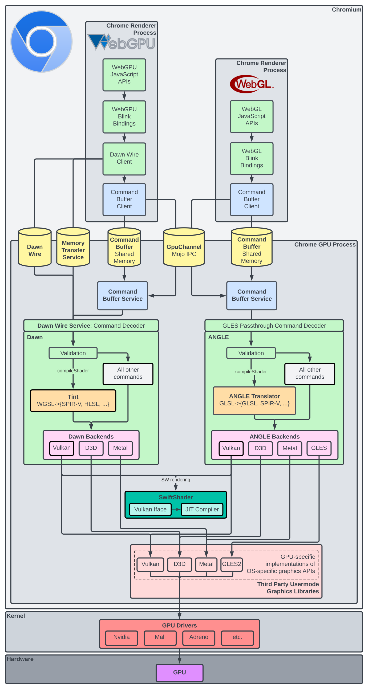

# Chromium Graphics

Authors: chrome-offsec-team@google.com 
Last updated: April 7, 2023 

## Overview

Chromium graphics features are among the most complex parts of the browser. This
document is a snapshot of our evolving understanding of graphics features from
an attacker perspective. Relevant and important pieces of the graphics stack are
omitted, but the intent is to give VRP contributors a boost when getting started
with unfamiliar graphics features.

## In Pictures: WebGL and WebGPU

The diagram below is a simplified view of WebGL and WebGPU with a focus on
components of particular interest to attackers.

Note: Skia and Canvas APIs are omitted and may be incorporated in a future
iteration.
