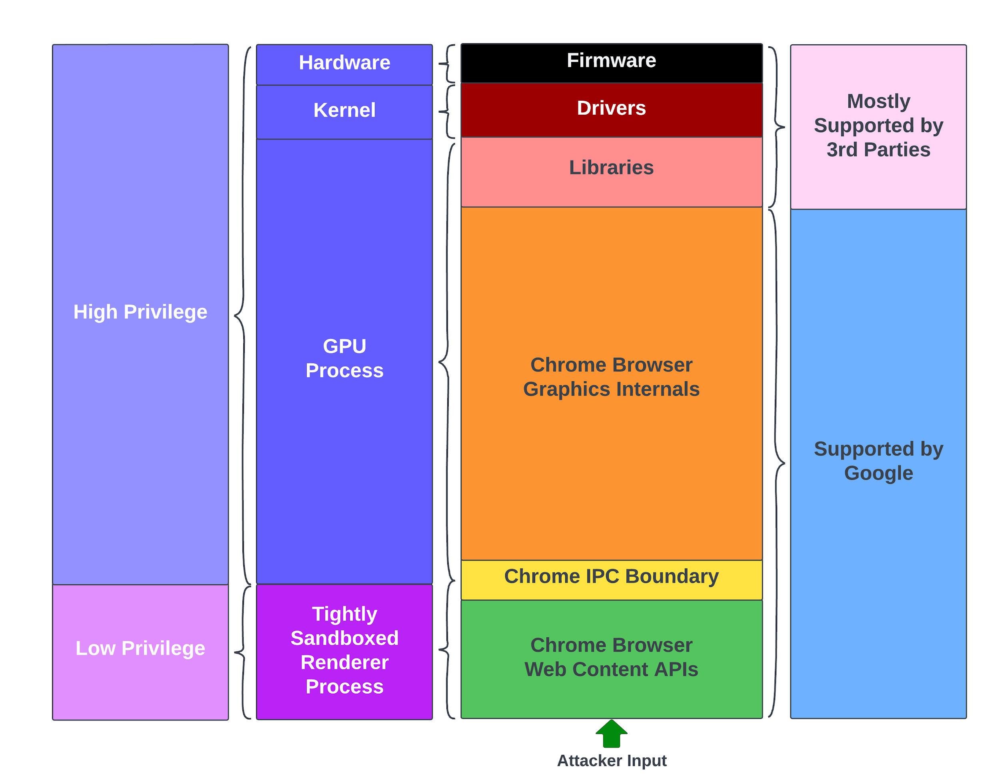
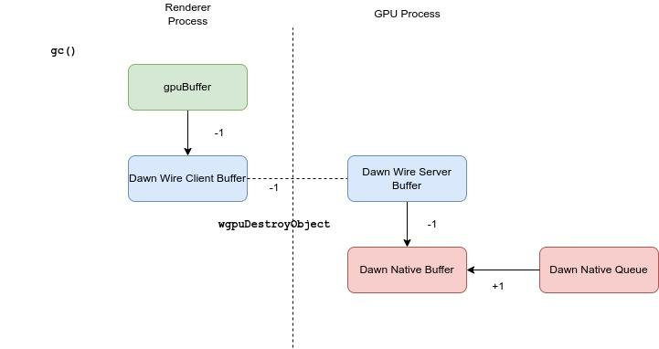
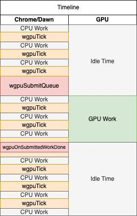

# WebGPU Technical Report

Authors: [tiszka@chromium.org](mailto:tiszka@chromium.org),
[bookholt@chromium.org](mailto:bookholt@chromium.org),
[mattdr@chromium.org](mailto:mattdr@chromium.org)

## Chrome Graphics as Seen By Attackers

In this document we outline how WebGPU works through the mind of an attacker,
our vulnerability research methodologies, and our thought processes in some of
the more difficult research areas. There are many interesting portions of Chrome
graphics that we omitted from review to keep scope manageable. While our primary
focus was WebGPU, we did explore a few attack surfaces shared by other graphics
features. We will interleave background information on WebGPU with descriptions
of the important bugs we found. We hope this report will give the security
community a deeper understanding of the shape of vulnerabilities we may come to
expect with the addition of WebGPU, along with a lens into the vulnerabilities
we might encounter in the future.

The graphics stack has long been an area of interest for Chrome Security. Before
we dive into WebGPU internals, consider the diagram below showing a simplified
view of the Chrome graphics architecture.



Show above: Attackers' perspective of Chrome graphics.

The Chrome process model uses sandboxing to create layered security boundaries
between untrusted content from the web and protected user data. However, the
rapid evolution and high complexity of Chrome's accelerated graphics features
coupled with their need to interface directly with drivers in the kernel, as
well as their implementation in memory-unsafe languages mean bugs in graphics
code are especially useful for bypassing Chrome sandbox boundaries. Furthermore,
although Chrome sets the industry standard for rapidly fixing security bugs and
quickly shipping updates to users, the presence and exposure of code supported
by third parties creates challenges to getting fixes to users rapidly that can
lengthen the period when a vulnerability may be viable for exploitation,
reducing the cost attackers must bear to sustain a capability.

## Enter WebGPU

WebGPU entered Origin Trial in mid-2022 marking the first time web developers
and users got to experience the new features. Coincidentally, the Chrome
Offensive Security team decided to look into WebGPU as our first major
research target.

According to the [WebGPU spec](https://www.w3.org/TR/webgpu/), "WebGPU exposes
an API for performing operations, such as rendering and computation, on a
Graphics Processing Unit". Unlike WebGL, its predecessor that set out with
similar goals, WebGPU isn't an existing native API ported to the Web; WebGPU is
a new API designed to surface the functionality of existing graphics APIs like
Vulkan, Metal, and Direct3D. In the context of this document we will only be
discussing Vulkan as it is ubiquitously reachable on every platform that WebGPU
supports either through the GPU rendering pipeline or the software rendering
pipeline.

WebGPU introduces two unique attack surfaces to Chrome that will come with their
own challenges:

+   the WebGPU API Implementation which was added to the GPU process & renderer
    process; and
+   the WGSL shader compiler added to the GPU process

While they are related and shader compilation is accessible via web-exposed
APIs, they pose two unique challenges so we will dig into both attack surfaces
separately.

To give you the big picture first, the diagram below shows the slice of the
Chrome graphics stack required for WebGPU. While WebGPU has many pieces and
inter-connections, we omitted a great many notable portions of Chrome's graphics
attack surface, including WebGL, Skia, Canvas2D, Widevine DRM, and video
decoding for the sake of avoiding complexity explosion.


Shown above: The full Chrome WebGPU stack.

## WebGPU API

The **WebGPU** API is exposed via JavaScript which calls into **Dawn**, the
library within Chrome that implements WebGPU.

**Dawn** is separated into two different libraries: **Dawn Wire** and **Dawn
Native**. **Dawn Wire** is a client-server implementation of **WebGPU**. When a
WebGPU API call is made from JavaScript the request is serialized in the
renderer process using the **Dawn Wire Client**, the serialized blob is passed
to the GPU process using WebGPU extensions to the Chrome GPU Command Buffer
([`WebGPUDecoderImpl`](https://source.chromium.org/chromium/chromium/src/+/main:gpu/command_buffer/service/webgpu_decoder_impl.cc;l=1768;drc=34ba1d95a41c614308175e932a2b121018891bbf))
, and then deserialized in the GPU process by **Dawn Wire Server**. **Dawn Wire
Server** then calls into **Dawn Native** which is the "native" implementation of
WebGPU that wraps the underlying platform's GPU APIs.

This portion of the review focused on the WebGPU API implementation from
**Blink** to **Dawn Backends**. We also chose to scope our review to Dawn's
**Vulkan Backend** because it is reachable on every WebGPU platform and it is
the only platform that's fuzzable with ClusterFuzz since most of the Vulkan
Backend code can be exercised without a physical GPU.


Shown above: The subset of the Chrome WebGPU stack we focused on during this
portion of the review, with out-of-scope portions de-emphasized in white.

### Finding: Incorrect State Tracking in Dawn Native leads to UAF

> _**tl;dr - Systemic Concerns**_
>
> Dawn has a pattern where objects hold a raw pointer to reference counted
> objects, assuming a reference is held elsewhere. This assumption can easily
> break with future changes to the code as we've seen in the browser process
> with Mojo handlers. Dawn should discourage this pattern to reduce
> use-after-free bugs.

Interacting with WebGPU begins with requesting an `adapter` which is an object
wrapping a single instance of WebGPU and then a `device` which is a logical
instantiation of the `adapter`.

```js
const gpuAdapter = await navigator.gpu.requestAdapter();
const gpuDevice = await gpuAdapter.requestDevice();

/* Call WebGPU APIs */
let buffer = gpuDevice.createBuffer();
```

As shown in the picture below, under the covers, `gpuDevice.createBuffer`
creates an Oilpan managed **WebGPU Buffer** object in Blink that holds a raw
pointer and a reference to a **Dawn Wire Client Object**.

This **Dawn Wire Client Object**, which lives in the renderer process, holds a
reference to a **Dawn Wire Server Object**, which lives in the GPU process,
implicitly incrementing and decrementing the reference count by sending a
`wgpuCreateObject` on construction and `wgpuDestroyObject` on destruction over
IPC to the GPU process.

This **Dawn Wire Server Object** holds a reference to the **Dawn Native
Object**. Finally, the **Dawn Native Object** holds a raw pointer to the
underlying Vulkan Object (or other graphics API platform object on non-Vulkan
platforms.)


Through this long chain of reference counted objects we hold a pointer to a
resource in the **Usermode Graphics Driver (UMD)** through our Oilpan managed
`gpuBuffer` object in JavaScript. This is a lot of state to track!

Interestingly, this means that it's possible to drop references and free objects
in the GPU process from an uncompromised renderer by garbage collecting the
corresponding WebGPU object in the renderer process.

```js
const gpuAdapter = await navigator.gpu.requestAdapter();
const gpuDevice = await gpuAdapter.requestDevice();

let buffer = gpuDevice.createBuffer();
buffer = null;
gc();
```

Under the covers, the destruction of an Oilpan object drops a reference to its
Dawn Wire Client object which when destructed sends a `wgpuDestroyObject` IPC
command to the GPU process.


Situations can arise where multiple objects within Dawn Native hold references
to the same object, so this destruction won't actually free the Dawn Native
Buffer.



When we began auditing these references we checked for many of the "classic"
reference counting implementation issues. For example, sending multiple
`wgpuDestroyObject` commands from a compromised renderer does not allow the
compromised renderer to decrement the reference indefinitely. Reference counted
objects use [64 bit integers
](https://source.chromium.org/chromium/chromium/src/+/refs/heads/main:third_party/dawn/src/dawn/common/RefCounted.cpp;l=69;drc=76be2f9f117654f3fe4faa477b0445114fccedda)for
tracking on all architectures which prevents integer overflow style bugs.
However, we did come across instances where raw pointers were being held without
taking a reference to the reference counted pointer.


#### What's happening inside WebGPU?

WebGPU gives developers an API to queue up operations and then run them in
batches using modern graphics APIs. Under the hood, a lot goes on to make this
work. The diagram below shows the simplified life cycle of creating and running
a compute shader.


The Dawn Native `GPUCommandBuffer` object, created by the step highlighted in
<span style="background-color:blue">Blue</span>, holds a pre-recorded set of
commands that can then be executed at an arbitrary time. Herein lies the magic
of WebGPU! It's possible to queue up thousands of GPU compute jobs and execute
them asynchronously.

> **_Note_**: The WebGPU
[`GPUCommandBuffer`](https://www.w3.org/TR/webgpu/#gpucommandbuffer) is
completely unrelated to the Chrome [GPU Command
Buffer](https://www.chromium.org/developers/design-documents/gpu-command-buffer).
This is an unfortunate name collision. The `GPUCommandBuffer` is a WebGPU object
and the Chrome GPU Command Buffer is a mechanism for communicating over shared
memory with the GPU process.

```js
const commandEncoder = device.createCommandEncoder();

// Encode commands for copying buffer to buffer.
commandEncoder.copyBufferToBuffer(
  source_buffer, /* source buffer */
  0, /* source offset */
  dest_buffer, /* destination buffer */
  0, /* destination offset */
  10 /* size */
);

// Create a GPUCommandBuffer
const gpuCommandBuffer = commandEncoder.finish();
...
// Execute the GPU commands asynchronously
device.queue.submit([gpuCommandBuffer, gpuCommandBuffer]);
```

The same interface is used to create **compute pipelines**. These pipelines
facilitate shader execution and create `GPUComputePassEncoder` objects which
hold references to objects - `GPUBuffer`s, `GPUTexture`s, etc - that the GPU
compute shaders will be modifying during execution.

```js
const commandEncoder = device.createCommandEncoder();

const passEncoder = commandEncoder.beginComputePass();
passEncoder.setPipeline(computePipeline);
passEncoder.dispatchWorkgroups(1, 1);
passEncoder.end();


const gpuCommand = commandEncoder.finish();
...
// Execute the GPU commands asynchronously
device.queue.submit([gpuCommand, gpuCommand]);
```

Under the covers, the `GPUCommandBuffer` holds references to **Dawn Native**
objects (in the example above the `source_buffer` and `dest_buffer`). A lot can
happen during execution of a sequence of commands within the `GPUCommandBuffer`
- `wgpuDispatchWorkGroups` is used to execute shaders, `wgpuCopyBufferToBuffer`
is used to copy one GPU buffer's content to another, `wgpuSetBindGroup` can be
used to change the bindings that a compute job is executing on - so it's very
important that the objects the `GPUCommandBuffer` holds references to are not
de-allocated until after the execution of the compute pipeline.

However, there are areas in **Dawn** where the code holds raw pointers with the
assumption that a reference is already held to an object such as at [1] in the
excerpt below.

```cpp
// Used to track operations that are handled after recording.
// Currently only tracks semaphores, but may be used to do barrier coalescing in the future.
struct CommandRecordingContext {
    ...
    // External textures that will be eagerly transitioned just before VkSubmit.
    // The textures are kept alive by the CommandBuffer so they don't need to be Ref-ed.
    std::set<Texture*> externalTexturesForEagerTransition;

    std::set<Buffer*> mappableBuffersForEagerTransition; // [1]
    ...
};
```

#### The Bug

Herein lies a bug, and likely a bug pattern that could cause issues in the
future. An assumption was made that raw pointers could not be added to
`mappableBuffersForEagerTransition` outside of `GPUCommandBuffer` execution. The
code also assumes that references would not be dropped within `GPUCommandBuffer`
execution.

Within Buffer initialization, there was a branch that called the function
`ClearBuffer` [1] if the size of the buffer being created was unaligned.

```cpp
MaybeError Buffer::Initialize(bool mappedAtCreation) {
  if (device->IsToggleEnabled(Toggle::LazyClearResourceOnFirstUse) && !mappedAtCreation) {
    uint32_t paddingBytes = GetAllocatedSize() - GetSize();
    if (paddingBytes > 0) {
      CommandRecordingContext* recordingContext = device->GetPendingRecordingContext();
      // [1]
      ClearBuffer(recordingContext, 0, clearOffset, clearSize);
    }
  }
}
```

The `ClearBuffer` call leads to many other state changing effects and function
calls. One of those code paths adds a Buffer's raw pointer to
`mappableBuffersForEagerTransition`.


This `TrackResourceAndGetResourceBarrier` call occurs outside of WebGPU
`GPUCommandBuffer` command execution, which is unexpected, so the only other
reference to the **Dawn Native Buffer** is the reference from the renderer
process.

From here it was possible to drop all other references to the **Dawn Native
Buffer** object in the GPU process held from the renderer process by garbage
collecting the WebGPU JavaScript buffer object, leading to a use-after-free the
next time `mappableBuffersForEagerTransition` was iterated.

Pointer lifetimes are difficult to get right. Taking a closer look at this
vulnerability we see that there are other raw pointers. These _appeared_ to be
safe, but they could easily be turned into vulnerabilities by future changes to
**Dawn**.

```cpp
// Used to track operations that are handled after recording.
// Currently only tracks semaphores, but may be used to do barrier coalescing in the future.
struct CommandRecordingContext {
    ...
    // External textures that will be eagerly transitioned just before VkSubmit.
    // The textures are kept alive by the CommandBuffer so they don't need to be Ref-ed.
    std::set<Texture*> externalTexturesForEagerTransition;

-    std::set<Buffer*> mappableBuffersForEagerTransition;
+    std::set<Ref<Buffer>> mappableBuffersForEagerTransition;

    ...
};
```

As the diff above shows, the fix was to add reference counting to accurately
track the Buffer life cycle. It appears that this vulnerability was introduced
because assumptions were made about `Buffer` lifetimes based on the earlier
comment about `GPUTexture` lifetimes. This shows us a problem: even when this
pattern is used <ins>correctly</ins>, it may too easily encourage other
<ins>incorrect</ins> uses. It is hard to verify that the raw pointers in
`externalTexturesForEagerTransition` aren't vulnerable in a similar way. It is
probably safer to avoid raw pointers altogether when working with **Dawn Native
Objects**.

### Finding: Unexpected State Change Before Callback leads to UAF

> _**tl;dr - Systemic Concerns**_
>
> WebGPU implements callbacks in the GPU process.Similar patterns in Mojo and
> JavaScript have consistently caused high severity issues in Chrome over the
> years. We believe a high bar of scrutiny should be applied to changes within
> existing **Dawn** callback handlers and for any new callback handlers being
> added to **Dawn**. Increasing complexity in this area would likely have a high
> cost to Chrome Security.

WebGPU was built to offload work from the CPU to the GPU. GPU execution is
asynchronous, so WebGPU was built to be entirely asynchronous. In the bug above
we learned that Dawn `GPUCommandBuffer` execution can execute
`GPUComputePipelines`. For example, `GPUComputePipelines` contain shader
programs that have no guarantees on when they terminate.

```
// WGSL Script
fn main() {
  loop {}
}
```

GPU Drivers implement Fences to signal the completion of GPU work. These Fences
are polled on every logical `wgpuTick` within **Dawn**. Once the work on the GPU
completes, **Dawn** will execute a callback in the GPU process that will then
change state within the GPU process and send any results to the renderer process
using **Dawn Wire**.



This creates a point of reentrancy during callback execution in `wgpuTick` when
the pending callbacks are executed. State can change in unexpected ways during
callback execution within `wgpuTick` and state can change in unexpected ways
before callback execution. This creates room for bugs similar to the classic
Javascript engine callback bugs that we've seen in the
[browser](https://googleprojectzero.blogspot.com/2019/04/virtually-unlimited-memory-escaping.html)
and [renderer](https://tiszka.com/blog/CVE_2021_21225.html) processes.


Luckily, as of May 2023, there aren't that many asynchronous calls in WebGPU and
these callbacks do not introduce unbounded re-entrancy (i.e. it is not possible
to call `ApiTick` within an `ApiTick`).


#### The Bug

The bug we're looking at occurred because of an unexpected state change between
callback registration and callback execution. WebGPU registers a callback
handler that executes whenever an error is encountered.

```cpp
void Server::SetForwardingDeviceCallbacks(ObjectData<WGPUDevice>* deviceObject) {
    ...
    mProcs.deviceSetUncapturedErrorCallback(
        deviceObject->handle,
        [](WGPUErrorType type, const char* message, void* userdata) {
            DeviceInfo* info = static_cast<DeviceInfo*>(userdata);
            info->server->OnUncapturedError(info->self, type, message);
        },
        deviceObject->info.get()); // [1.a]
    ...
}
```

A raw pointer to the `WGPUDevice`'s **Object's** `userdata` is fetched and
passed to the callback [1.a], which later stores the saved pointer into
`mUncapturedErrorUserdata` [1.b].

```cpp
void DeviceBase::APISetUncapturedErrorCallback(wgpu::ErrorCallback callback, void* userdata) {
    if (IsLost()) { // [2]
        return;
    }
    FlushCallbackTaskQueue();
    mUncapturedErrorCallback = callback;
    mUncapturedErrorUserdata = userdata; // [1.b]
}
```

When a Dawn Wire Server `GPUDevice` object is freed, `mUncapturedErrorCallback`
is set to null.

```cpp
void Server::ClearDeviceCallbacks(WGPUDevice device) {
    ...
    mProcs.deviceSetUncapturedErrorCallback(device, nullptr, nullptr);
    ...
}
```

However if the Device is put into a "Lost" state [2] after 1.a and before 1.b
when the `ClearDeviceCallbacks` is called it will not be nulled out, leading to
a dangling pointer. This creates room for an attacker to send a
`wgpuBufferDestroy` command to Dawn Wire Server before the callback is executed.

```cpp
void DeviceBase::APISetUncapturedErrorCallback(wgpu::ErrorCallback callback, void* userdata) {
    if (IsLost()) { // [2]
        return;
    }
    FlushCallbackTaskQueue();
    mUncapturedErrorCallback = callback;
    mUncapturedErrorUserdata = userdata; // [1.b]
}
```

After that the attacker can clear all references to the `WGPUDevice`, freeing
the userdata leading to a dangling pointer. On the next `wgpuTick`, if an error
callback is invoked it will lead to `mUncapturedErrorUserdata` being
dereferenced, causing a use-after-free (UAF).

This leads to the proof of concept below that uses the trick we mentioned
earlier where Garbage Collected objects created from JavaScript in the renderer
process can be used to drop a single reference to a Dawn Wire Server object in
the GPU process, opening the door for the use-after-free.

```js
async function trigger() {
    let adapter1 = await self.navigator.gpu.requestAdapter({
        forceFallbackAdapter: true
    });
    let device1 = await adapter1.requestDevice();

    // Request a second device.
    let adapter2 = await self.navigator.gpu.requestAdapter({
        forceFallbackAdapter: true
    });

    let buffer1 = device1.createBuffer(
        { mappedAtCreation: false,
          size: 128, usage:
          GPUBufferUsage.UNIFORM });

    // Set Device::mState to State::kDestroyed.
    device1.destroy();

    // Trigger an error by unmapping a buffer on a destroyed device,
    // which queues up an error callback
    buffer1.unmap();

    // Trigger GC to drop the renderer's reference to device, and free it
    buffer1 = null;
    adapter1 = null;
    device1 = null;
    try { new ArrayBuffer(31 * 1024 * 1024 * 1024); } catch(e) {}

    // Flush. Trigger UAF.
    await adapter2.requestDevice();
}
```

### Finding: Multiple vulnerabilities in WebGPU use of GPU Command Buffer

> _**Our Concerns - The Short Version**_
>
>The Chrome Command Buffer is prone to input validation issues, has many legacy
>undocumented footguns, and is difficult to fuzz effectively. Manual auditing is
>currently the best way to discover bugs in this area of the codebase. Snapshot
>fuzzing could help solve this problem.

**Dawn Wire** is a serialization/deserialization library. **Dawn Wire** does not
implement IPC mechanisms that can be used to transfer data between processes in
Chrome. Instead, within Chrome, **Dawn Wire** is built on top of the existing
[Chrome Command
Buffer](https://www.chromium.org/developers/design-documents/gpu-command-buffer/)
architecture to facilitate inter-process communication between the Renderer and
GPU processes. One of the WebGPU-specific GPU Command Buffer [IPC
handlers](https://source.chromium.org/chromium/chromium/src/+/main:gpu/command_buffer/service/webgpu_decoder_impl.cc;l=1768;drc=34ba1d95a41c614308175e932a2b121018891bbf)
receives serialized **Dawn Wire** data over shared memory and deserializes and
executes it using **Dawn Wire Server.**

```cpp
error::Error WebGPUDecoderImpl::HandleDawnCommands(...) {
  if (!wire_server_->HandleCommands(shm_commands, size)) {
    return error::kLostContext;
  }
  ...
}
```


WebGPU improved on the `GLES2CommandBuffer` implementation in many ways. For
example, the `GLES2CommandBuffer` has been plagued with
time-of-check/time-of-use (TOCTOU) [vulnerabilities](https://crbug.com/1422594)
[that](https://crbug.com/597636) [come](https://crbug.com/597625)
[with](https://crbug.com/468936) working directly on shared memory that can be
concurrently modified by a compromised renderer process. In direct response to
this bug class, the WebGPU usage of the Chrome GPU Command Buffer and Dawn Wire
Server always copy shared memory passed from the renderer process into a static
heap-allocated buffer within the deserializer in the GPU process, before calling
into **Dawn Native**.

There are still a few other footguns to avoid when building on top of the Chrome
GPU Command Buffer abstraction. [The](https://crbug.com/1373314)
[vulnerabilities](https://crbug.com/1340654)
[discovered](https://crbug.com/1393177) [in](https://crbug.com/1314754)
[the](https://crbug.com/1406115) WebGPU usage of the **Chrome GPU Command
Buffer** so far are good examples; such as not holding a `scoped_ptr` reference
to a `TransferBuffer` while holding a raw_ptr to its shared memory and not
validating buffer offsets/sizes received from a compromised renderer process.

While these vulnerabilities are in WebGPU's implementation within Chrome, they
are not unique to WebGPU.  The **Chrome GPU Command Buffer** had similar issues
in 2013, and it is notoriously difficult to fuzz effectively, so we will likely
introduce similar bugs that reach stable with future abstractions that build on
the **Chrome GPU Command Buffer**.

### More Bugs and Notes on WebGPU Implementation Complexity

+   **WebGPU** was the first web-exposed user to back an `ArrayBuffer` with a
    raw pointer. This led to [some](https://crbug.com/1336014)
    [issues](https://crbug.com/1326210).

+   The **WebGPU** specification states the `getMappedRange()` method returns an
    `ArrayBuffer`. Within Chrome, this `ArrayBuffer` is backed by shared memory.
    Concurrent modification of `ArrayBuffer` backing stores has led to
    [multiple](https://crbug.com/1174582) security vulnerabilities. Fortunately,
    it is not possible to modify the shared memory in the GPU process after the
    `ArrayBuffer` is created. However, if that ever becomes possible in the
    future it will be a security vulnerability.

    +   Interestingly, this also means that we have a well-defined way to
        compromise an uncompromised renderer that is colluding with a
        compromised GPU process.

+   Google do not control the underlying **Vulkan** implementation in the
    various third party **Usermode Graphics Driver** that **Dawn** calls into.
    Usermode Graphics Driver complexity could reach a point where it becomes
    indefensible.

+   Vulkan, Metal, and D3d are inherently insecure APIs. Dawn has the hefty
    responsibility of validating user input before calling into these APIs.

+   The current **Dawn** fuzzers -
    [DawnWireServerFuzzer](https://source.chromium.org/chromium/chromium/src/+/main:third_party/dawn/src/dawn/fuzzers/DawnWireServerFuzzer.cpp)
    and
    [DawnLPMFuzzer](https://source.chromium.org/chromium/chromium/src/+/main:third_party/dawn/src/dawn/fuzzers/lpmfuzz/)
    - fuzz the **Dawn** wire byte stream, and therefore all of the validation
    and everything the validation is protecting.

+   **Dawn** will one day be multithreaded, first as a standalone library and
    then within Chrome. This will increase its complexity.

## WebGPU Shaders

This section focuses on the portions of WebGPU that ingest and process shaders.
Refer again to the high level picture below for an illustration of the
components of interest in this section.


Show above: The subset of the Chrome WebGPU stack we focused on during this
portion of the review, with out-of-scope portions de-emphasized in white.

There is not much information out there about threats facing Chrome's existing
shader compilers for **WebGL** shaders, or how Chrome currently defends against
them. **WebGPU** introduced a new shader compiler pipeline that is defended in a
similar manner.

WebGPU moves away from WebGL's GLSL shader language entirely and implements
**WGSL**, a re-imagined high level shading language for the web.
**[Tint](https://dawn.googlesource.com/tint)** is Google's translator for
**WGSL**. **Tint** compiles **WGSL** into a platform dependent intermediate
language - **SPIR-V**, **HLSL**, **MSL** -  that the underlying Usermode
Graphics Drivers will further compile.


With the addition of **WebGPU**, Chrome now has two front-end compilers in the
GPU process that can compile some high-level language into **SPIR-V**: the
**ANGLE Translator** for WebGL shaders (not discussed here) and **Tint** for
WebGPU shaders. Interestingly, the **SPIR-V** emitted by **Tint** is not the
same subset of **SPIR-V** emitted by the **ANGLE Translator**. However, both
compilers end up passing their emitted **SPIR-V** to the same underlying
**Usermode Graphics Drivers** for further backend compilation.


### Integer Overflow in SwiftShader JIT leads to out-of-bounds read/write

> _**tl;dr - Systemic Concerns**_
>
> Vulnerabilities in the **SwiftShader JIT** compiler aren't being fixed in the
> **SwiftShader** codebase. Instead they are fixed by translating away code
> patterns using the higher-level front end compilers like the **ANGLE
> Translator**. This has led to bug variants. Furthermore, ANGLE and Tint
> sanitization happens on a representation of shaders that is distinct from the
> representation used by SwiftShader and Usermode Graphics Drivers, creating
> gaps in protection coverage. Finally, Chrome now has two front-end compilers
> that pass compiled code to **SwiftShader** for further compilation making this
> even more precarious.

We did dig into **SwiftShader's** shader execution pipeline. **SwiftShader**
emulates an entire GPU stack - the **Vulkan** Implementation within the
**Usermode Graphics Drivers**, shader compiler within the **Usermode Graphics
Drivers**, and the GPU hardware these call into - all on the CPU.

GPUs make heavy use of parallel shader computation. **SwiftShader** implemented
a **SPIR-V JIT compiler** to reach _near-GPU_ speeds that compiles to various
architectures (x86, x64, arm, arm64). After shader compilation, the JITTed code
is executed on multiple threads to emulate a GPU executing shaders.

#### SwiftShader's JIT

**SwiftShader's** JIT compiler is built on the Reactor API which acts as a
domain specific language and interface to the underlying JIT compiler. Reactor
emits LLVM-like IR which is then ingested by the JIT compiler backend for
Reactor,
[Subzero](https://swiftshader.googlesource.com/SwiftShader/+/refs/heads/master/docs/Subzero.md).

#### The Bug

The vulnerability is a classic integer overflow within a **SubZero**
optimization that collates multiple
[`alloca`](https://llvm.org/docs/LangRef.html#alloca-instruction) instructions
into a single `alloca` instruction.

```cpp
void Cfg::sortAndCombineAllocas(CfgVector<InstAlloca *> &Allocas,
                                uint32_t CombinedAlignment, InstList &Insts,
                                AllocaBaseVariableType BaseVariableType) {
 uint32_t CurrentOffset = 0; // [1]
 for (Inst *Instr : Allocas) {
   auto *Alloca = llvm::cast<InstAlloca>(Instr);
   uint32_t Alignment = std::max(Alloca->getAlignInBytes(), 1u);
   auto *ConstSize =
       llvm::dyn_cast<ConstantInteger32>(Alloca->getSizeInBytes());
   uint32_t Size = Utils::applyAlignment(ConstSize->getValue(), Alignment);
   CurrentOffset += Size; // [2]
 }
 uint32_t TotalSize =
    Utils::applyAlignment(CurrentOffset, CombinedAlignment);

 Operand *AllocaSize = Ctx->getConstantInt32(TotalSize);
 InstAlloca *CombinedAlloca =
 InstAlloca::create(
    this,
    BaseVariable,
    AllocaSize,
    CombinedAlignment
 ); // [3]
 ...
}
```

`CurrentOffset` is a 32 bit unsigned integer declared at [1]. By supplying a
SPIR-V shader that generates enough large `alloca` nodes, it's possible for the
repeated addition at [2] to overflow the 32-bit unsigned integer, leading to an
undersized `alloca` node being generated at [3].

`alloca` instructions are later lowered to stack allocations for the actual
variables in the shader program. Reading and writing into an undersized stack
allocation will lead to out-of-bounds reads/writes.

#### SwiftShader JIT Bugs: Reachable from WebGPU and WebGL

As we mentioned earlier, both **WebGPU** and **WebGL** shaders are compiled to
**SPIR-V** in **Vulkan** environments. SwiftShader implements the **Vulkan**
Graphics API.


We found a bug, but there are many many layers to dig through to figure out if
the bug is reachable. The **ANGLE Translator** will emit an
[`spv::Op::OpVariable`](https://source.chromium.org/chromium/chromium/src/+/main:third_party/angle/src/common/spirv/spirv_instruction_builder_autogen.cpp;l=567;drc=bec40d7684688eaf8a5ca4747341dcea4243c996)
SPIR-V instruction whenever it encounters a variable declaration within the
WebGL SL it is compiling. **Tint** will also emit an
[`spv::Op::OpVariable`](https://source.chromium.org/chromium/chromium/src/+/main:third_party/dawn/src/tint/writer/spirv/builder.cc;l=835;drc=9543f74739118a853dd5e5a46297f5442c3352f8)
**SPIR-V** instruction whenever it encounters a variable declaration within the
WGSL it is compiling.


When the **SwiftShader SPIR-V compiler** encounters the
[`spv::Op::OpVariable`](https://source.chromium.org/chromium/chromium/src/+/refs/heads/main:third_party/swiftshader/src/Pipeline/SpirvShader.cpp;l=1768;drc=004227a1fc7355a9080146c2621d072bd2327701)
instruction it will generate a Variable IR.


Whenever this Variable IR is being converted from Reactor IR into Subzero IR it
calls into
[`allocateStackVariable()`](https://source.chromium.org/chromium/chromium/src/+/refs/heads/main:third_party/swiftshader/src/Reactor/Reactor.cpp;l=106;drc=004227a1fc7355a9080146c2621d072bd2327701)
which emits a SubZero InstAlloca instruction.


```cpp
Value *Nucleus::allocateStackVariable(Type *t, int arraySize)
{
	Ice::Type type = T(t);
	int typeSize = Ice::typeWidthInBytes(type);
	int totalSize = typeSize * (arraySize ? arraySize : 1);

	auto bytes = Ice::ConstantInteger32::create(
             ::context, Ice::IceType_i32, totalSize);
	auto address = ::function->makeVariable(T(getPointerType(t)));
	auto alloca =
          Ice::InstAlloca::create(::function, address, bytes, typeSize); // [4]
	::function->getEntryNode()->getInsts().push_front(alloca);

	return V(address);
}
```

`allocateStackVariable()` generates the **SubZero** `InstAlloca` IR instruction
that `sortAndCombineAllocas` incorrectly optimizes.


When the assembly emitted by **SubZero** is executed on the CPU and the
undersized allocation is read/written to, it leads to out-of-bounds memory
accesses.

#### The Fix

Similar to other bugs in shader compilers, this vulnerability is prevented by
the front-end compilers and no changes were made to **SwiftShader**. For those
who don't follow the bug tracker closely, looking closer at the
[fix](https://chromium-review.googlesource.com/c/angle/angle/+/4377639) this is
a [variant](https://chromium-review.googlesource.com/c/angle/angle/+/4377639) of
a [variant](https://chromium-review.googlesource.com/c/angle/angle/+/3023033).
Integer overflows keep popping up in shader compilers and
[`ValidateTypeSizeLimitations()`](https://source.chromium.org/chromium/chromium/src/+/main:third_party/angle/src/compiler/translator/ValidateTypeSizeLimitations.cpp;l=34;drc=d0ee0197ddff25fe1a9876511c07542ac483702d)
is being used to further restrict the maximum size of variables within shaders
to prevent these vulnerabilities. It's unclear if this strategy will prevent
more variants from popping up in **SwiftShader**; [especially now that
**WebGPU** will also need to make similar fixes in their front-end
compiler.](https://bugs.chromium.org/p/chromium/issues/detail?id=1431761#c14)

> _**Note**_: When **Tint** emits an `OpVariable` it also emits an
[`OpConstantNull`](https://registry.khronos.org/SPIR-V/specs/unified1/SPIRV.html#OpConstantNull)
SPIR-V instruction. The `OpConstantNull` instruction causes SwiftShader, and any
other **SPIR-V** compiler, to zero-initialize variables allocations. [As noted
in the bug](https://crbug.com/1431761), it prevents the bug from triggering in a
convenient amount of time on WebGPU. This is an interesting inconsistency
between the two front-end compilers. We are also actively investigating if the
**ANGLE Translator's** lack of `OpConstantNull` leads to infoleaks. The
**WebGPU** team is considering a [separate
fix](https://bugs.chromium.org/p/chromium/issues/detail?id=1431761#c14) for this
bug.

### More Bugs and Notes on Shader Compiler Complexity

+   The front-end shader compilers - ANGLE Translator and Tint - break Chrome's
    [Rule of
    Two](https://chromium.googlesource.com/chromium/src/+/master/docs/security/rule-of-2.md)
    on platforms like Android, where the GPU process is un-sandboxed **and**
    parses complex attacker-controlled shaders as input. In addition, backend
    shader compilers in the Usermode Graphics Drivers have a high complexity,
    are closed source, and are evolving targets that are continuously adding new
    optimizations and functionality.

+   **WGSL Shader Compilers** are more expressive in general than **WebGL SL
    shader compilers**. Notably, **WGSL** supports both dynamic sized arrays and
    runtime-sized arrays which introduces complexity when handling. There is
    state tracking within Dawn to ensure that object types don't change between
    executions of the JIT compiler. However as complexity increases in both
    **Dawn** and **Tint** this could become harder to manage and lead to bugs.

+   We are currently fixing bugs in SwiftShader by making fixes in the front-end
    compilers. [This is likely a risky way to fix these
    vulnerabilities](https://bugs.chromium.org/p/chromium/issues/detail?id=1431761#c14)
    and leads to situations where variants can easily slip through the cracks.

+   We believe that Chrome owning the entire front-end compilation component in
    **Tint** is a net-positive win for security. The less attack surface we pass
    on to the Usermode Graphics Drivers the better.

+   We did not spend time digging into speculative execution vulnerabilities.
    However, we would be surprised if there are no Spectre gadgets in
    SwiftShader.

+   SwiftShader unifies the GPU process attack surface, and enables exploits
    that are reachable through the **Vulkan** API on all platforms. We
    encouraged the **WebGPU** team to consider shipping the
    `forceFallbackAdapter` adapter option behind a runtime flag.

+   We have not yet audited what any of this means at the Kernel level. We don't
    know what shader compiler execution looks like on a GPU and what the shape
    of a vulnerability in that area would look like.

## Summary of Findings

WebGPU introduces a significant amount of attack surface to Chrome's GPU process
both through the core WebGPU implementation which lives in **Dawn**, the
**WebGPU extensions to the GPU Command Buffer**, and transitively through the
third party Usermode Graphics Drivers and everything below.

The vulnerabilities in the document are meant to showcase attack surfaces and
patterns that demonstrate further complexity will likely lead to more
vulnerabilities.

WebGPU invested a significant amount of effort on validating renderer supplied
input before calling into drivers and reference counting pointers. This
investment paid off – we found precisely zero "low-hanging" vulnerabilities in
Dawn.

WebGPU also introduces a large amount of attack surface through the compilation
and execution of shader compilers in Chrome's privileged GPU process in
**Tint**, third party **Usermode Graphics Drivers**, and **SwiftShader**.

WebGPU has invested a significant amount of effort on fuzzing **Tint**. However
the fuzzing only targets the parsers and lexers within **Tint** and doesn't
exercise the code in SwiftShader or on **Usermode Graphics Drivers**. There is
room for Chrome to invest in fuzzing shader compilers with syntactically and
semantically correct code in the same way that we fuzz V8 with Fuzzilli to
exercise code in **SwiftShader's** **JIT** compiler. Like V8, shader compilers
will have bugs that are unfuzzable. Chrome Security will need to continue
manually auditing shader compiler implementations to correctly assess risk and
reduce bug density.  Furthermore, where we lack access to source code, such as
third party **Usermode Graphics Drivers**, expanding fuzzing support is our only
feasibly scalable approach to mitigating the risk of third party code within the
Chrome GPU process.

### Systemic Concerns

We found many one-off vulnerabilities in WebGPU during this exercise, and we
found some bugs that hinted at future problem areas:

+   **Dawn use-after-frees**: Dawn has a pattern where objects hold a raw
    pointer to reference counted objects, assuming a reference is held
    elsewhere. This assumption can easily break with future changes to the code
    as we've seen in the browser process with Mojo handlers. Dawn should
    discourage this pattern to reduce use-after-free bugs.

+   **Dawn Callbacks**: WebGPU implements callbacks in the GPU process. Similar
    patterns in Mojo and JavaScript have consistently caused high severity
    issues in Chrome over the years. We believe a high bar of scrutiny should be
    applied to changes within existing **WebGPU** callback handlers and for any
    new callback handlers being added to **Dawn**. Increasing complexity in this
    area would likely have a high cost to Chrome Security.

+   **Chrome Command Buffer**: The Chrome Command Buffer is prone to input
    validation issues, has many undocumented legacy footguns, and is difficult
    to fuzz effectively because feature coverage requires (a) a harness that
    supports Chrome in multi-process mode, (b) a stateful generator that can
    leverage context across test cases, and (c) can sometimes also require
    execution on a host with a physical GPU. Snapshot fuzzing may be useful to
    address some of these challenges, although manual auditing is currently the
    best way to discover bugs in this area of the codebase.

+   **SwiftShader JIT**: Vulnerabilities in the **SwiftShader JIT compiler**
    aren't being fixed in the **SwiftShader** codebase. Instead they are fixed
    by translating away code patterns using the higher-level front end compilers
    like the **ANGLE Translator**. This has led to bug variants. Furthermore,
    **ANGLE** and **Tint** sanitization happens on a representation of shaders
    that is distinct from the representation used by **SwiftShader** and
    **Usermode Graphics Drivers**, creating gaps in protection coverage.
    Finally, Chrome now has two front-end compilers that pass compiled code to
    **SwiftShader** for further compilation making this strategy more
    precarious.

## Glossary: Chrome Security GPU Terminology

The security relevance of GPU terms is hard to track. Here are a lot of them in
one place.

+   **Dawn Wire**: Client-Server implementation of
    [`webgpu.h`](https://github.com/webgpu-native/webgpu-headers/blob/main/webgpu.h).

    +   **Dawn Wire Client**: Lives in the renderer process.
    +   **Dawn Wire Server**: Lives in the GPU process

+   **Dawn Native**: Core implementation of WebGPU that calls into the Dawn
    backends.
+   **Dawn Backends**: Wrappers around the System Graphics Apis that Dawn Native
    needs to call into (Vulkan, Metal, & DirectX3D).
+   **Tint:** Google's OSS implementation of WGSL. Compiles WGSL to SPIRV, MSL,
    HLSL, & DXIL. Mostly a front-end compiler as of May 23, 2023.
+   **ANGLE**: Google's OSS implementation of OpenGL.
+   **ANGLE Translator**: Google's OSS implementation of WebGL SL. Compiles
    WebGL SL to GLSL or SPIR-V.
+   **SwiftShader**: Vulkan implementation and SPIR-V compiler built to run
    directly on the CPU. Emulates an entire GPU as well. Does so with JIT
    compiled SIMD shader compiler execution.
+   **SwiftShader JIT Compiler**: SwiftShader compiles SPIR-V shaders to
    X86/Arm/aarch64/etc using PNACL's old JIT compiler, SubZero.
+   **D3D12**:  Direct3D 12, Microsoft's newest System Graphics API. Implemented
    in Usermode Graphics Driver.
+   **OpenGL**:  WebGL is built on OpenGL. Implemented in Usermode Graphics
    Driver. SwiftShader no longer
+   **Vulkan**: Systems Graphics API on Linux (and some Windows devices™).
    WebGPU is built on top of Vulkan.

    +   WebGL can be run with a Vulkan backend natively. Currently enabled on
        50%  is built on top of Vulkan on 50% of Linux Desktop devices through a
        finch experiment.
    +   WebGL on SwiftShader uses the Vulkan backend on every platform.
    +   WebGPU on Linux uses Vulkan for 100% of Linux Desktop and Android
        devices
    +   WebGPU on SwiftShader uses the Vulkan backend on every platform.

+   **Metal**: Systems Graphics API on Mac.
+   **DXIL**:  DirectX Intermediate Language, essentially LLVM IR for shaders
    for D3D12
+   **HLSL**:  High Level Shading Language, Direct3D's shading language
    (including D3D12).
+   **MSL**:  Metal Shading Language (shading language that runs on apple
    hardware).
+   **SPIR-V**: Standard Portable Intermediate Representation - Vulkan. An SSA
    form bytecode shading language used for Vulkan. Both WebGL and WebGPU
    compile to SPIR-V on Vulkan.
+   **WGSL**: WebGPU Shading Language. WebGL's successor.
+   **GLSL**: OpenGL Shading Language.
+   **WebGL SL**: WebGL Shader language. A subset of GLSL that is safe for the
    web. Compiled and sanitized by the ANGLE translator.
+   **Usermode Graphics Driver (UMD)**: A shared library that ships with a
    kernel graphics driver (think Arm, Nvidia, AMD, Qualcomm). This is where
    shader compilation happens. This is where the system graphics APIs are
    implemented. SwiftShader emulates an entire GPU, so it is a Usermode
    Graphics Driver and more.
+   **GPU Command Buffer**: High level abstraction for transferring data over
    shared memory to the GPU process. Both the renderer process and browser
    process use various command buffers to do GPU operations in Chrome.
+   **WebGPU use of GPU Command Buffer (`WebGPUDecoderImpl`)**: An extension of
    the Chrome GPU Command Buffer abstraction that is used for transferring Dawn
    Wire data between the Renderer and GPU processes.
+   **Dawn Native `GPUCommandBuffer`**: An object within Dawn that has a name
    collision with the legacy Chrome GPU Command Buffer abstraction. They are
    not related.
