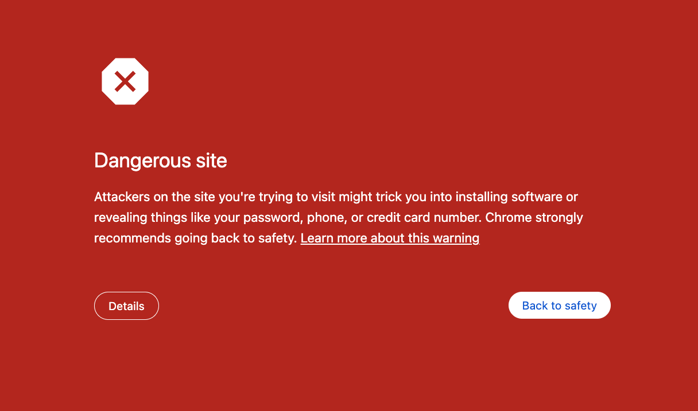
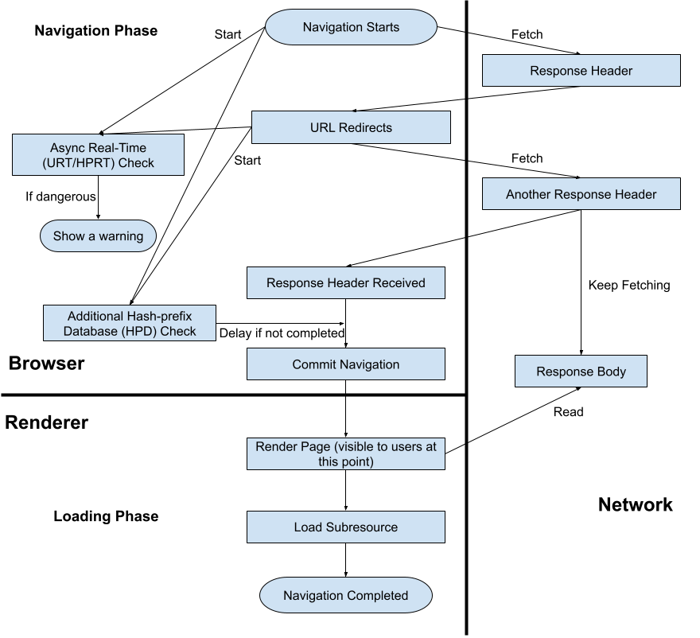

# How Safe Browsing Lookup Interacts with Navigation

## Overview

During navigation, Chrome checks the Safe Browsing reputation of each URL and
decides whether to show a warning to the user. This document describes how Safe
Browsing lookup interacts with navigation and how Safe Browsing lookups affect
the speed of navigation.

## Background

When a user navigates to a URL, Chrome checks the Safe Browsing reputation of
the URL before the URL is loaded. If Safe Browsing believes that the URL is
dangerous, Chrome shows a warning to the user:

Chrome can perform three types of Safe Browsing checks during navigation:

*   The well-known hash-based database check
    ([Safe Browsing Update API (v4)](https://developers.google.com/safe-browsing/v4/update-api)).
*   The [URL-based real-time check](https://source.chromium.org/chromium/chromium/src/+/main:components/safe_browsing/core/browser/realtime/).
*   The [hash-based real-time check](https://source.chromium.org/chromium/chromium/src/+/main:components/safe_browsing/core/browser/hashprefix_realtime/).

All of these checks are on the blocking path of navigation. Before the check is
completed, the navigation is not committed, the page body is not read by the
renderer, and the user won’t see any page content in their browser.

NOTE: There is another type of Safe Browsing check called Client Side Phishing
Detection (CSD). It also checks the reputation of the page. However, this check
is performed after the navigation is committed and it doesn’t block the
navigation, so it is out-of-scope for this doc.

## Navigation Basics

[Life of a Navigation](https://chromium.googlesource.com/chromium/src/+/main/docs/navigation.md)
gives a high level overview of a navigation from the time a URL is typed in the
URL bar to the time the web page is completely loaded. It breaks down a frame
navigation into two phases:

*   **Navigation phase**: From the time the network request is sent to the time
    the a navigation is committed. Note that at this point, nothing is rendered
    on the page.
    *   Any of the three Safe Browsing checks above may be performed in this
        phase, depending on user consent. The URL-based real-time check is only
        performed if the user has agreed to share URLs with Google. The
        hash-based real-time check is used in most other scenarios, but in
        incognito mode or other cases when the real-time checks are
        unavailable, the hash-based database check will be performed instead.
*   **Loading phase**: Consists of reading the response body from the server,
    parsing it, rendering the document so it is visible to the user, executing
    any script, and loading any subresources (images, scripts, CSS files)
    specified by the document.
    *   Safe Browsing doesn't check subresources, iframes or websocket
        connection.

[Navigation Concepts](https://chromium.googlesource.com/chromium/src/+/refs/heads/main/docs/navigation_concepts.md)
covers a set of important topics to understand navigation, such as:

*   Same-document and cross-document navigation. Same-document navigation keeps
    the same document and changes states associated with it. Some examples of
    same-document navigation are fragment navigation
    (`https://foo.com/1.html#fragment`) and using the
    [history.pushState](https://developer.mozilla.org/en-US/docs/Web/API/History/pushState)
    API.
    *   Same-document navigation can change the URL, but Safe Browsing doesn’t
        check these navigation. Same-document navigation doesn’t pose a security
        risk because no new content is loaded from the network.
*   Server redirects and client redirects. A server redirect happens when the
    browser receives a 300-level HTTP
    [response code](https://developer.mozilla.org/en-US/docs/Web/HTTP/Status#redirection_messages)
    before the document commits, telling it to request a different URL, possibly
    cross-origin. A client redirect happens after a document has been committed,
    when the HTML in the document instructs the browser to request a new
    document (e.g., via
    [meta tags](https://www.w3schools.com/tags/att_meta_http_equiv.asp) or
    [JavaScript](https://www.w3schools.com/howto/howto_js_redirect_webpage.asp)).
    *   Redirect URLs are all checked by Safe Browsing. Server redirects are
        checked in the navigation phase and client redirects are checked after a
        document is committed.

## Workflow

As illustrated above, Safe Browsing blocks navigation in the navigation phase.
It blocks the navigation before it is committed. Safe Browsing needs to finish
checking all URLs (including redirect URLs) before committing the navigation.
These checks are initiated from the browser process.

If one of the URLs (initial URL or redirect URLs) is classified as dangerous, a
warning page will be shown and the navigation will be cancelled.

## Speed

Safe Browsing checks and network requests are performed in parallel. Performing
a Safe Browsing check doesn’t block the start of network requests or the fetch
of response header and body. It doesn’t block redirects either.

However, completion of the Safe Browsing check does block the browser from
reading or parsing the response body. When the response header is received, Safe
Browsing will block the navigation if the check is not completed.

Safe Browsing won’t slow down the navigation if it is completed before the
response header is received. If Safe Browsing is not completed at this point,
the response body will still be fetched but the renderer won’t read or parse it.

SafeBrowsing.BrowserThrottle.TotalDelay2 is the metric to measure the speed of
Safe Browsing checks. 0 means that the Safe Browsing check is completed before
the response header is received -- it doesn't delay the navigation.

## Implementation Details

Safe Browsing blocks navigation by implementing the
[URLLoaderThrottle](https://source.chromium.org/chromium/chromium/src/+/main:third_party/blink/public/common/loader/url_loader_throttle.h;l=43;drc=0e45c020c43b1a9f6d2870ff7f92b30a2f03a458)
interface. This interface provides several phases to defer URL loading:

*   `WillStartRequest(request, defer)`
*   `WillRedirectRequest(request, defer)`
*   `WillProcessResponse(request, defer)`

The throttle can mark `defer` as true if it wants to defer the navigation and
can call Resume to resume the navigation.

The throttle class is
[BrowserUrlLoaderThrottle](https://source.chromium.org/chromium/chromium/src/+/main:components/safe_browsing/content/browser/browser_url_loader_throttle.h;drc=67847e1d488161fcc71acdfd3b77e1654f6e6121).
The throttle only marks `defer` as true in
[WillProcessResponse](https://source.chromium.org/chromium/chromium/src/+/main:components/safe_browsing/content/browser/browser_url_loader_throttle.cc;l=489;drc=710d8b1f851677cbdafb8f14d0a5bba26066aebe).

Safe Browsing doesn’t defer navigation forever. The current timeout is set to 5
seconds. If the check is not completed in
[5 seconds](https://source.chromium.org/chromium/chromium/src/+/main:components/safe_browsing/core/browser/safe_browsing_lookup_mechanism_runner.cc;l=14;drc=615be57df122442ad3c09558b7d7a7b8495c2360),
the navigation will resume.
