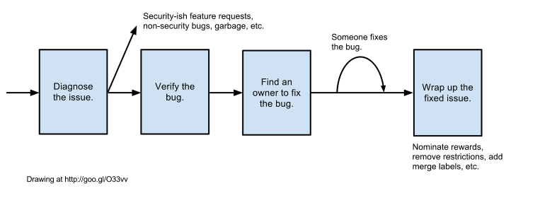

# Security Sheriff

[TOC]

## Important Links

[Chrome Open Security Bugs dashboard,
go/chrome-security-bugs](http://go/chrome-security-bugs).

[Vulnerability Severity Guidelines](severity-guidelines.md).

[Security Labels](security-labels.md).

[Current Sheriffs](http://go/whos-the-sheriff).

[Sheriff Handoff Log](http://go/chrome-security-sheriff-handoff).

You might also like the [HOWTO: Be A Security Sheriff
deck](https://docs.google.com/presentation/d/1eISJXxyv7dUCGUKk_rvUI9t9s2xb98QY4d_-dZSa7Wg/edit#slide=id.p).

The [Chrome Security FAQ](faq.md), [Extensions Security
FAQ](/extensions/docs/security_faq.md), and [Service Worker Security
FAQ](service-worker-security-faq.md) include commonly-raised questions about
security and what is or is not considered a security bug. When triaging new
bugs, you may want to reference these to see if there's an established stance.

## What Is A Security Sheriff Or Marshal?

A security sheriff (as well as a security marshal) is a member of a rotation
that occurs in 1-week time slots, starting on Tuesdays and ending the following
Monday. All sheriffs and marshals are Googlers and so some links on this page
might not be externally accessible (or indeed locked down to just Chrome
Security Googlers).

[Here is the rotation
schedule](https://docs.google.com/spreadsheets/d/10sLYZbi6QfLcXrhO-j5eSc82uc7NKnBz_o1pR9y8h7U/edit#gid=0).

Sheriffs and marshals ensure that all incoming security issues are triaged
quickly and correctly. We aim to have every bug triaged and assigned **within
two business days** (preferably one). This does not include weekends, but please
ensure you leave a clear queue before the weekend (i.e. on Friday, unless there
is a holiday) and check first thing after the weekend (i.e. on Monday morning,
unless there is a holiday).

## When Am I The Security Sheriff Or Marshal?

You should get a calendar invite. Please accept it to acknowledge. If you need
to swap shifts, ask around for a volunteer and then just update the
[rotation sheet](https://docs.google.com/spreadsheets/d/10sLYZbi6QfLcXrhO-j5eSc82uc7NKnBz_o1pR9y8h7U/edit#gid=0)
and wait 10 minutes for the calendar invites to be updated.

## I'm The Security Sheriff Or Marshal. What Do I Do?

Each week has a sheriff and marshal, and during their rotation both have
various important responsibilities:

### Sheriff

* Look at every incoming security bug report on the
  [dashboard](http://go/chrome-security-bugs). Ensure each is accurately
  triaged, and actively progressing towards getting fixed.
* Don't forget to fully triage the low severity bugs. Once a bug is labeled with
  `Security_Severity-Low `, it disappears from the first sheet and may slip
  under your radar.
* Keep the [Sheriff Handoff Log](http://go/chrome-security-sheriff-handoff) up
  to date.
* Shout for help if the incoming bug rate is too high ([suggested vocal
  exercises](https://youtu.be/5y_SbnPx_cE?t=37s)). The first person to ask is
  the marshal.
* Make sure all **new bug reports** are triaged completely. That means no red
  cells on the top of the dashboard. Double-check that OS flags are set
  properly. For most of the bugs, typically more than one OS is affected, but
  the dashboard will not highlight it in red.
* Stay sharp, keep in shape ([hand-stand
  pushups](https://www.youtube.com/watch?v=jZ1ZDlLImF8#t=50) are standard for
  the sheriff), and remember you may be [called upon during
  emergencies](https://www.youtube.com/watch?v=buHaKYL9Jhg).

### Marshal

* Ensure that all incoming queries to the
  [security@chromium.org](https://groups.google.com/a/chromium.org/forum/#!forum/security),
  [security-dev@chromium.org](https://groups.google.com/a/chromium.org/forum/#!forum/security-dev),
  and
  [chrome-security@google.com](https://groups.google.com/a/google.com/forum/#!forum/chrome-security)
  lists get a reply (by someone; not necessarily the marshal themselves). See
  [go/chrome-security-emails](https://goto.google.com/chrome-security-emails)
  for a dashboard.
  * Note: external emails will always come in on security@chromium.org or
    security-dev@chromium.org, as chrome-security@google.com is a Google-only
    list, but all need to be triaged.
  * When triaging an email to be handled off of the list, make sure to bcc: the
    list that it arrived on, so that other people including future marshals can
    see that it has been handled.
  * Some of these emails are requests for inclusion of third party code.
    By the time you hand over to the next Marshal, please
    ensure these are either completed or have been acknowledged by some other
    owner. If not, you may need to do them yourself. Please see
    [How to do Chrome Third-Party Security Reviews](https://goto.google.com/how-to-do-chrome-third-party-security-reviews)
    for hints.
* Look at the open security bug reports and check that progress is occurring.
  This does not apply to the **new bug reports** (these are handled by the
  sheriff). The rule of thumb is *if there is any red cell on the dashboard, it
  needs your attention*: that especially includes the "last updated" column.
  (Our [severity guidelines](severity-guidelines.md) contain the expected duration
  for shipping fixes, but remember, to get a fix to all users in - say - 60
  days may require us to land a fix in a week or two).
  Hints:
  * Don't just add a comment to the bug: sometimes they can disappear into spam.
    (Although a hand-crafted, meaningful comment can be effective).
  * Contact via chat or e-mail (ideally, also comment on the bug so other marshals
    can see you did so).
  * CC more people!
  * Think about what you can do to unblock the bug. What would _you_ do next?
    Perhaps you can bring in different experts, suggest a different way to
    reproduce the bug, or even write a fuzzer? Sometimes your security perspective
    can really help engineering see a different way forward.
  * Consider whether it's better for you to make meaningful steps forward on
    ten bugs than to add ignorable nag messages to twenty bugs.
  * You can't possibly hope to meaningfully move all bugs forward. As a rule of
    thumb, perhaps expect to spend a solid ten hours progressing bugs during
    your shift.
  * Use the 'last updated' column to avoid duplicating the work of the previous
    marshal.
* Stay sharp, keep in shape ([finger
  exercises](https://youtu.be/20elMaVZ9lg?t=47s) are standard for the marshal),
  and remember you may be called upon during emergencies.

## Life Of A Security Bug

Do as much as you can for the week to triage, shepherd, and wrap up open
security bugs. What follows are the details of what that entails, but it
practically means turning all the red cells in the dashboard to green. **If
you're ever stuck or in doubt, ask for help on #chrome-security! or the
[Chrome Security Chat](http://go/chrome-security-chat).**

[link](https://twitter.com/__apf__/status/728776130564526080)

### Diagnose The Issue

* **If the report is invalid**, remove the **Restrict-View-SecurityTeam** label
  and mark it **WontFix**.
* **If the report is a duplicate**, mark it **Duplicate**. If the issue this is
  a duplicate of is public, remove the **Restrict-View-SecurityTeam** label.
* **If the report is primarily a privacy issue**, send it to the privacy team:
  * Add the **Privacy** component so that it enters their triage queue.
  * Change **Type-Bug-Security** to **Type-Bug**.
  * CC any security team members, including yourself, who may be interested in
    the privacy issue.
	* Change the **Restrict-View-SecurityTeam** label to
  **Restrict-View-ChromePrivacy**.
    * Note that security team members don't automatically have privacy bug
      access, so this will probably make the issue inaccessible to you.
* **If the report is asking about why something is or is not on the Safe
  Browsing list:**
  * Close the bug and request the reporter submit the URL to SafeBrowsing.
  * See below for reporting URLs to SafeBrowsing.
* **If the report is a potentially valid bug but is not a security
  vulnerability:**
  * remove the **Restrict-View-SecurityTeam** label. If necessary, add one of
    the other **Restrict-View-?** labels:
    * **Restrict-View-Google** if this is a crash report.
    * **Restrict-View-EditIssue** if the bug can be abused (e.g. denial of
      service)
	* Change **Type-Bug-Security** label to **Type-Bug** (or whatever **Type-?**
    is appropriate).
  * Add appropriate component or CCs to ensure it does get triaged.
  * Add the **Security** component or the **Team-Security-UX** label if the
    security team should still track the issue (e.g. security features).
* **If the report doesn't have enough information**, ask the reporter for more
  information, add the **Needs-Feedback** label and wait for 24 hours for a
  response.
* The [security bug template](https://bugs.chromium.org/p/chromium/issues/entry?template=Security+Bug)
  asks reporters to **attach files directly**, not in zip or other archives, and
  not hosted at an external resource (e.g. Google Cloud Storage). If the report
  mentions an online demo hosted somewhere, make sure the reporters attach the
  source code for the demo as well.
* **If the bug is a security bug, but is only applicable to Chrome OS**:
	* The Chrome OS Security team now has their own sheriffing rotation. To get
    bugs into their triage queue, just set OS to the single value of "Chrome".
    No other steps or labels are needed.
	* If you need to ping or ask about Chrome OS bug, [ask their current
    sheriff](http://go/whos-the-chromeos-sheriff).
* **If the report smells like a vulnerability, keep going.**

### Verify And Label The Bug

#### Step 1. Reproduce legitimate-sounding issues.

Ideally, sheriffs should reproduce each bug before triaging, but being efficient
is also important. It's fine to delegate reproducing bugs in the following
cases:

* A bug comes from an automated infrastructure (such as ClusterFuzz or Vomit).
* A bug comes from a reporter with a solid track record of vulnerabilities (e.g.
  prolific external researchers or Google Project Zero team).
* A bug requires a particular device that you don't have available, or any other
  environment which you don't have ready but a potential code owner would have.

Mention explicitly in your comment that you didn't reproduce a bug before
assigning it to someone else.

A few components have their own triage processes or points of contact who can
help.

* **V8 ClusterFuzz bugs** can be assigned to the [V8 ClusterFuzz
  Sheriff](https://rotation.googleplex.com/status?id=5714662985302016) for
  triage. Note that V8 CHECK failure crashes can have security implications, so
  don't triage it yourself and instead assign it to V8 ClusterFuzz Sheriff. They
  can make an informed decision on whether it is a security vulnerability or not
  and whether it is safe to strip the security tags (**Type=Bug-Security**,
  **Restrict-View-SecurityTeam**).
* **V8 non-ClusterFuzz bugs** shouldn't be assigned to the V8 ClusterFuzz sheriff.
  Instead, Googlers should refer to [the V8 security bug triage instructions](http://go/v8-security-issue-triage-how-to)
  for lists of component owners.
* **Skia bugs** can be assigned to hcm@chromium.org. Be careful while triaging
  these! The place where we're crashing isn't necessarily the place where the
  bug was introduced, so blame may be misleading. Skia fuzzing bugs can be
  assigned to kjlubick@chromium.org, as Skia is heavily fuzzed on OSS-Fuzz and
  some issues reported in Chromium are already known or even fixed upstream.
* **URL spoofing issues**, especially related to RTL or IDNs? See
  [go/url-spoofs](http://go/url-spoofs) for a guide to triaging these.
* **SQLite bugs** can be assigned to mek@. CC drhsqlite@ for upstream issues.

Note that **even when you are handing off triage to another team or point of
contact**, it is your responsibility to ensure that the `Security_Severity` and
`FoundIn` fields are set as soon as possible (and definitely before the end of
your sheriffing shift). Work with your point of contact to set these. For
instance, you may want to set initial/provisional values for these fields and
ask them whether it matches their understanding.

Tips for reproducing bugs:

* Assume that test cases may be malicious. You should only reproduce bugs
  on your local machine if you're completely certain that you understand
  100% of the test case. If not, use a disposable virtual machine. If you're
  inside Google, a good way to do this is using
  [Redshell](https://goto.google.com/redshell-for-chrome-sheriffs).
* For any sort of a crash, CHECK/DCHECK or memory safety problem
  [use ClusterFuzz](clusterfuzz-for-sheriffs.md). As well as reproducing bugs,
  ClusterFuzz will help you with lots of subsequent bisection and labelling
  tasks. Currently ClusterFuzz cannot guard against malicious test cases,
  so be just as paranoid as if you were running a test case locally.
* [Instructions for using an Android emulator can be found
  here](/docs/android_emulator.md). If you're inside Google, we have a
  [guide for testing using Google infrastructure](https://goto.google.com/android-for-chrome-sheriffs).
* When you can't just build from a specific branch locally, check out
  [https://dev.chromium.org/getting-involved/dev-channel](https://dev.chromium.org/getting-involved/dev-channel)
  or
  [https://commondatastorage.googleapis.com/chromium-browser-asan/index.html](https://commondatastorage.googleapis.com/chromium-browser-asan/index.html)
  for the latest release of a specific version.
* There are many tools available to help you reproduce various memory issues
  reliably. If you aren't already familiar with them, check out
  [AddressSanitizer](https://www.chromium.org/developers/testing/addresssanitizer),
  [MemorySanitizer](https://www.chromium.org/developers/testing/memorysanitizer),
  [ThreadSanitizer](https://www.chromium.org/developers/testing/threadsanitizer-tsan-v2),
  and
  [UndefinedBehaviorSanitizer](https://www.chromium.org/developers/testing/undefinedbehaviorsanitizer).
* The [get_asan_chrome](https://source.chromium.org/chromium/chromium/src/+/main:tools/get_asan_chrome/get_asan_chrome.py)
  helper script is a handy way to download ASAN Chrome. The --help flag
  provides usage instructions, e.g. to fetch builds for various versions and
  platforms.
* If you run into issues with a reproducible ClusterFuzz test case (like
  missing symbols, or if anything else seems off), try uploading the test case
  again using a different job type with a more mature tool (e.g. ASan on Linux).
  It may give more complete information.

#### Step 2. Assess the severity.

[See the severity guidelines](severity-guidelines.md). If it's a critical
vulnerability, act quick! We aim to get users patched in < 30 days. Remember
that if something requires an unusual configuration or complicated user
interaction, the severity rating should be lowered.

Bug chains are typically composed of several individual security bugs and
should be split into a new bug for each potential fix required, so this allows
each team to work on fixing their part of the chain. In cases like this, leave
the main bug as the severity/priority of the full chain, and mark child bugs as
being blockers of the parent bug each with their own separate severity. Each
child bug can have its own priority. Examples of this in action are [issue
352369](https://crbug.com/352369) and [issue 453937](https://crbug.com/453937).

Even after initial triage, re-assess the severity while you're looking at a
security bug update: does it have new information in the bug that could change
the assessment? Be especially on the lookout for Highs that are really
Criticals, and Lows that are really Mediums (make sure to account for process
types and sandbox boundaries).

For V8 issues, it can be hard to identify the correct security severity.
Always set the severity to High unless there's strong evidence of an obvious
mitigation. Please add the `Security_Needs_Attention-Severity` label alongside
the regular `Security_Severity-*` label. If the bug is not exploitable, or is
mitigated, the V8 team will reduce the security severity (to avoid unnecessary
risk of merging the bug into stable branches).

If an issue is found that can't affect any users running a default configuration
of Chrome (e.g. an issue in code guarded by a command-line flag that is off by
default), the `Security_Severity-*` label should still be set as if the issue
is affecting users running a default configuration of Chrome (but see the next
section about `FoundIn` and `Security_Impact-None`).

#### Step 3. Set FoundIn

Identify the earliest affected branch (Extended Stable, Stable, Beta or Head)
and set the corresponding `FoundIn` label (for example `FoundIn-66` if the
extended stable milestone is 66 and you've confirmed it's reproducible on M66).
If you reproduced the bug with ClusterFuzz, it should do this on your behalf.

If you performed a bisection or were provided one with the commit that
introduced the problem, you can check which milestone has that commit by
navigating to https://chromiumdash.appspot.com/commit/COMMIT_HASH_HERE.

Sometimes Extended Stable is the same milestone as Stable; sometimes it
differs. If in doubt about the currently active milestones, check
[ChromiumDash](https://chromiumdash.appspot.com/releases?platform=Windows).
(It's fine to just check the Windows platform, via that link - there's no need
to look at all the different platforms). There's no need to check for
reproducibility on milestones earlier than the current Stable milestone.

If an issue is found that can't affect any users running a default configuration
of Chrome (e.g. an issue in code guarded by a command-line flag that is off by
default), then do not set the `FoundIn` label; instead, set the impact to
`Security_Impact-None` (but see
[here](security-labels.md#when-to-use-security_impact_none-toc_security_impact_none)
for additional nuances around using `Security_Impact-None`).

#### Step 4. [Check other labels](security-labels.md).

Much of Chrome's development and release process depends on bugs having the
right labels and components. Labels and components are vitally important for
merging the fix to the right releases, and ensuring reporters are credited
correctly. They also help with metrics and visibility.

Labels to **double-check** (the first two should already be there if the bug
was filed using the Security template):

* **Restrict-View-SecurityTeam**
* **Type-Bug-Security**
* If you want to prevent the bug from becoming unrestricted after it has been
  closed, add **Restrict-View-SecurityEmbargo**. This should be done if the
  reporter wishes to remain anonymous, if the description or comments contain
  PII, or if the bug contains malware samples.
* **Security_Severity** - your responsibility as Sheriff.
* **FoundIn** - your responsibility as Sheriff.
* **reward_to** - if the bug was filed internally on behalf of somebody
  external (for instance, a @chromium.org email reporting "I'm filing this on
  behalf of" and the like). This is also very important; please check.

You can expect Sheriffbot to fill in lots of other labels; for example,
the `M-` label to indicate the target milestone. It's best to allow
Sheriffbot to add the rest, as its rules have congealed from years of
accumulated security wisdom. See
[the Security Labels document](security-labels.md) for an explanation of what
the labels mean.

**If you change anything, add a comment which explains any status
changes.** Severity, milestone, and priority assignment generally require
explanatory text.

* Report suspected malicious URLs to SafeBrowsing:
  * Public URLs:
    * [Report malware](https://safebrowsing.google.com/safebrowsing/report_badware/?hl=en)
    * [Report phishing](https://safebrowsing.google.com/safebrowsing/report_phish/?hl=en)
    * [Report incorrect phishing warning](https://safebrowsing.google.com/safebrowsing/report_error/?hl=en)
  * Googlers: see instructions at [go/safebrowsing-escalation](https://goto.google.com/safebrowsing-escalation)
  * Report suspected malicious file attachments to SafeBrowsing.
* Make sure the report is properly forwarded when the vulnerability is in an
  upstream project, the OS, or some other dependency.
* For vulnerabilities in services Chrome uses (e.g. Omaha, Chrome Web Store,
  SafeBrowsing), make sure the affected team is informed and has access to the
  necessary bugs.

##### Labeling For Chrome On iOS

* Reproduce using iOS device or desktop Safari.
* Assign severity, impact, and component labels.
* Label **ExternalDependency**.
* Label **Hotlist-WebKit**. This label is monitored by Apple friends.
* File a security bug at [bugs.webkit.org](https://bugs.webkit.org), and CC
  chrome-ios-security-bugs@google.com. This alias is monitored by the iOS Chrome
  team so they can be notified when the WebKit bug is fixed.
* Note the WebKit bug ID in the crbug report.

### Find An Owner To Fix The Bug

That owner can be you! Otherwise, this is one of the more grey areas of
sheriffing. With experience, you'll figure out good goto people for certain
areas. Until then, here are some tips.

**Determine the correct component before continuing.** It's not enough on its
own, but it's a good starting point. Many components will automatically apply
some CCs who may be able to help you out. If it's a crash bug, see if
ClusterFuzz is able to provide one (will appear in the same card as the culprit
CL). You can also use `git hyper-blame` and check OWNERS files to see who might
own the relevant code.

**For crashes, check to see if ClusterFuzz provides a culprit CL.** Before you
assign a bug based on this, do a quick sanity check to ensure the CL could have
caused the bug. If the result seems wrong, apply the Test-Predator-Wrong label
to the bug and keep going.

If you're able to narrow this to a specific regression range, usually from
ClusterFuzz for crash bugs, do a quick pass over the git log to see if any CLs
stand out. If you aren't sure, don't be afraid to add CCs to the bug and ask!

At this point, you'll probably need to dive in and attempt to root cause the
bug, which is another complicated grey area that you'll figure out with
experience. Try not to spend too much time on this for any given bug, as some
cases will simply be too difficult without a deep understanding of certain
portions of the codebase.

* If you can narrow the bug to a specific file or block of code, or if something
  stands out as suspicious, try to assign an owner based on `git hyper-blame` or
  add some CCs based on OWNERS files.
* If not, consider searching in the issue tracker for people that fixed similar
  bugs or bugs in similar areas of the code base, such as issues with the same
  components, recently. For example, let's say you were trying to figure out a
  good person to assign a Content>Fonts issue. Look for `status=fixed,verified`
  and query by when the issues were closed after (i.e. w/ in the last 30 days ==
  `closed>today-30`).

Got stuck? Ask #chrome-security or someone from
[go/chrome-security-sheriff-mentors](https://goto.google.com/chrome-security-sheriff-mentors)
for help! That's why we're here. Don't be afraid to do this!

Make sure that the person you assign to handle a bug is not OOO. And, generally,
explicitly CC more than one person on the bug, if possible, and preferably
people from more than one geographic region. (See the OWNERS file(s) that
affect(s) the relevant area of code.)

**Sometimes, finding an owner isn't enough to ensure that a bug will get
fixed.** Check the stale bug list on the security dashboard and try resolve
some of the problems that might be blocking these issues. If you get in touch
with a bug owner off of the issue tracker, be sure to have them update the bug
so that future sheriffs are aware of the status.

> Q: Why isn’t setting the component alone good enough?
>
> A: CCs are critical because just assigning to a component is ineffective
> because the component’s team cannot see the issues unless they have the
> Security View permissions.

### Using The Permission API Kill Switch

If you find a vulnerability in a Permission API and need to use the Global
Permissions Kill Switch, then follow [the
instructions](https://docs.google.com/document/d/17JeYt3c1GgghYoxy4NKJnlxrteAX8F4x-MAzTeXqP4U)

### Wrapping Up The Fixed Issue

1. Check with the developer that the issue can be closed as Fixed to allow
   Sheriffbot to add the appropriate merge-review labels based on
   Security_Severity and Security_Impact.

## End Of Rotation

Update the [Sheriff Handoff Log](http://go/chrome-security-sheriff-handoff).
