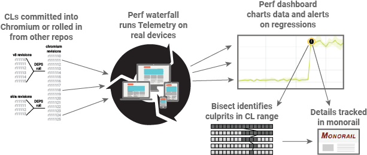

# Speed Operations: Speed Tooling

TL: dberris@chromium.org 
Team: simonhatch@chromium.org, dberris@chromium.org 
TPM: ushesh@chromium.org 

## Mission
The mission of the Chrome Speed Tooling team is to develop the tools and
infrastructure necessary for teams to detect, help diagnose, and follow through
on performance regressions in Chrome. We accomplish this through a set of
interconnected tools, which process data from the Chrome Benchmarking Team and
automate the Chrome Speed Releasing workflow:

  * The [Chrome Performance Dashboard](https://chromeperf.appspot.com) stores
    over 4 million performance timeseries, and monitors hundreds of thousands
    of them for performance regressions. It integrates with Chrome's bug
    tracker for follow-through.
  * Most of our automated builds take too long to get performance data on every
    revision, so we have [bisect bots](bisects.md) to narrow down regressions.
    These bots also support running performance try jobs on unsubmitted CLs.
  * Whether a performance test is run locally or in the lab, right now or last
    year, we want to make it easy to understand and share the results. We
    develop [data formats](https://github.com/catapult-project/catapult/blob/master/docs/histogram-set-json-format.md)
    and user interfaces that make it easy to dig deeply into performance
    regressions.

Here is a diagram of how our tooling fits into the chromium performance
continuous build:

