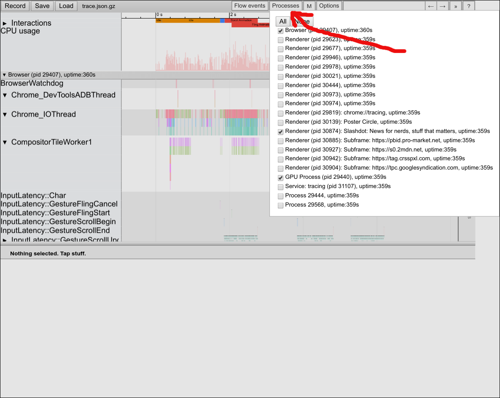

# Investigating scroll/animation jank

You are noticing janks when you are scrolling a page, or during an animation.
You want to investigate the jank. This document gives a quick overview of how
you can do this.

[TOC]

## Collecting a trace {#collecting-a-trace}

The best way to debug a janky scroll/animation is to collect a trace during the
event. There are detailed instructions for doing this
[here](http://www.chromium.org/developers/how-tos/trace-event-profiling-tool/recording-tracing-runs),
but briefly, to collect a trace:

*   Close as many tabs/windows as possible. When a trace is collected, it
    collects traces from _all_ running processes. Having a lot of tabs usually
    means there are a lot of processes too, and traces from all these processes
    can make it difficult to debug/investigate.
    *   If the jank can be reproduced reliably, then a good option is to start a
    new instance of chrome in a test-only temporary profile (using
    --user-data-dir command-line flag).
*   Open up chrome:tracing in a new tab (or in a new window).
*   Click ‘Record’:

* Select ‘Rendering’ in the dialog, and click ‘Record’:

*   Switch to the tab with the page in question.
*   Perform the action, e.g. scroll, or allow the animation to happen. Do this a
    few times to increase the chances of janks happening.
    *   Note that you cannot collect trace for too long, because the
        trace-buffer can fill up pretty quickly.
*   Once you have noticed a jank, you can switch back to the chrome:tracing
    page, and click on ‘Stop’.

*   Click ‘Save’ to save the trace. This step is optional, but can be useful
    when sharing the trace with other developers, or attaching to a crbug, etc..

## Quick tips for the trace-viewer {#quick-tips-for-the-trace-viewer}

This document does not explain all the ways of navigating the trace-viewer, but
some quick tips:

*   The trace includes trace-events from all the processes. This means the
    browser process, the gpu process, the utility processes, all the renderer
    processes, etc. Often, when you are investigating a jank, many of these
    processes are not particularly relevant. The most important processes to
    track are: the browser process, the gpu process, and the renderer process
    hosting the page you are investigating. You can click on ‘Processes’ to
    filter out the processes that are not interesting/relevant.

*   You can also click on the close-buttons for each process separately to hide
    them. You can always click on ‘Processes’ any time to show the process again
    if you want.

*   You can turn on ‘flow’ events, which are sometimes very useful (M79 or
    earlier; see more below).

*   In some cases, there can be too many types of flow events. In newer versions
    of chrome (M80+), there is a ‘Flow events’ button you can click to select
    which flow events you are interested in. For janks in animations, ‘viz’
    flow-events would be useful. For janks in touch/wheel scrolls, the ‘viz’ and
    ‘input’ flow-events would be useful.

## Find the Jank {#find-the-jank}

We have instrumented the code to record `FrameSequenceTracker` trace-events for
scrolling, or animations. There can be many `FrameSequenceTracker` events, but
each one carries the name of the sequence (e.g. TouchScroll, WheelScroll,
MainThreadAnimation, CompositorAnimation, RAF etc.)

In the trace you recorded, you will need to find the `FrameSequenceTracker`
corresponding to the janky scroll/animation. Each such event reports the number
of frames expected and the number of frames actually produced that became
visible.

From these numbers, you can determine how many frames were dropped during the
sequence. For example, in the above screenshot, the scroll lasted for almost 1
second (59 frames), but only 54 frames were produced. This means there were 5
dropped frames during this scroll.

The next step is to figure out when these frames were dropped during the
sequence. To find this, look for the `FramePresented` sub-events for the
`FrameSequenceTracker` event.

In the above screenshot, frames were presented at `A`, `B`, and `C`. Within this
duration, it appears a frame was presented every vsync. So there were no dropped
frames here. Contrast this with the following screenshot, where frames were
presented at `A`, `B`, `C`, `D`, `E`, `F` etc. The duration between `D` and `E`
is roughly double the duration between other `FramePresented` events as a result
of a dropped frame.

Now would be a good time to turn on flow events for `viz`. You can track the
flow events to see what may have caused the frame to be dropped. For example,
see the following screenshot:

A begin-frame is received at ~5828ms, and if we follow the flow-arrows, we see
that a corresponding compositor-frame is submitted at ~5837ms. However, for the
next begin-frame received at ~5842ms, we see that there is no outgoing flow
from there. Looking more closely at these trace-events:

We see that the frame was deliberately skipped over to recover latency (notice
the `SkipBeginImplFrameToReduceLatency` event). At this point, we would want to
look at what else is happening around that time. You can use the
timing-selection in the trace-viewer to help with this:

The interesting things to look for are usually the `Compositor` thread and
`CrRendererMain` threads under the same process, or the `CrGpuMain` thread and
`VizCompositorThread` threads under the GPU Process. The
`Graphics.Pipeline.DrawAndSwap` trace-events (in the GPU process) usually give a
good idea of what is happening in the GPU process. Similarly, the
`PipelineReporter` events in the renderer process also give a good overview of
how each begin-frame message is handled.

## Examples {#examples}

Let’s look at some examples of janks:

### Example 1: jank caused by main-thread {#example-1-jank-caused-by-main-thread}

In the above screenshot: the `FramePresented` event is ~62ms long, i.e.
there were 3 dropped frames here. Looking closely, we can see that the
compositor thread receives all the begin-frame messages, including for the
dropped frames. The main-thread is blocked running JavaScript (likely a
timer-callback) and can't handle the begin-frames before the frame deadlines. We
can assume there are no pending updates for the compositor-thread to handle
(i.e. there are no compositor-driven animations/scrolls in-progress at the
moment), so the compositor must wait on the main-thread before it is able to
submit a new frame. Following is the same screenshot with some annotations:

The begin-frames are received in `A`, `B`, `C`. The compositor is unable to
produce any updates for `A` and `B` because the main-thread is blocked running
some javascript code. Once the JS processing ends, the begin-frame received in
`C` is handled in the main-thread at `D`. After the main-thread is done handling
the begin-frame (note that it is called BeginMainFrame in the code to denote
that it is for the main-thread), the corresponding update is dispatched to the
display-compositor in `E`. However, the submitted frame misses the deadline in
the display compositor (not seen in this screenshot), and is therefore not
presented. A fourth begin-frame is received (`F`), and a frame is submitted in
response to that (`G`), which is then finally presented. Thus, there are three
dropped frames (no frames produced for `A` and `B`, and updated frame for `C` is
delayed and presented to the user with `F`) caused by the long-runner javascript
in the main-thread.

### Example 2: jank caused by gpu-process {#example-2-jank-caused-by-gpu-process}

In the above screenshot (from a different trace), you can see a begin-frame sent
from the display-compositor (`VizCompositorThread`) to the renderer in `A`, the
renderer receives the begin-frame in `B`, and submits a CompositorFrame in `C`,
received back in the display compositor in `D`. The display-compositor starts
drawing the frame in `E`, and the gpu-main thread does a swap at `F`. For the next
frame, the display-compositor sends a begin-frame at `G`, and receives the
compositor-frame from the renderer in `H`, and draws the frame in `I`. However, the
gpu-main thread is blocked doing other work (from the renderer, in this case,
notice the `FullImage` trace-event), and so the swap-request from the
display-compositor gets delayed (notice the long `WaitForSwap` trace-event), and
finally happens at `J`.

_Still have more questions? Please feel free to send questions to
[graphics-dev@chromium.org](mailto:graphics-dev@chromium.org)._

