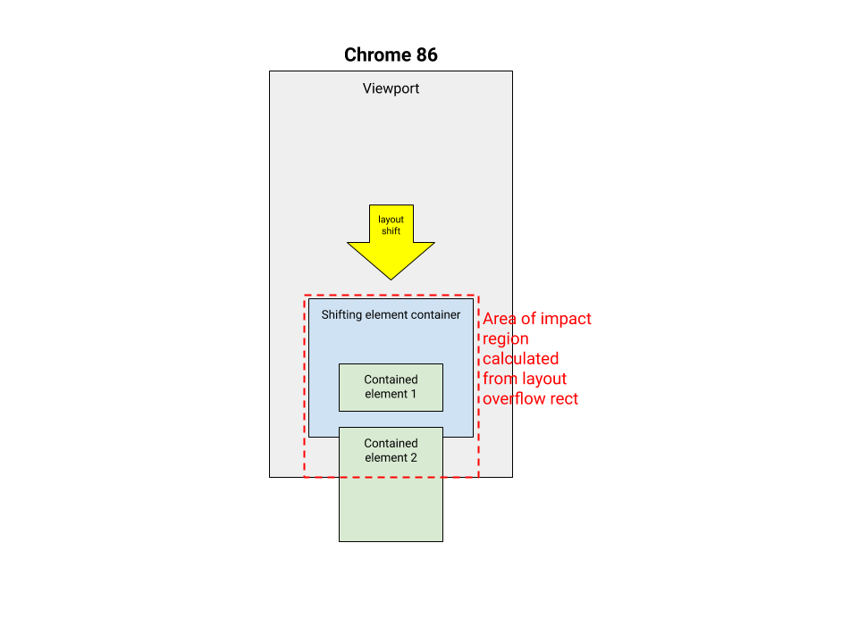
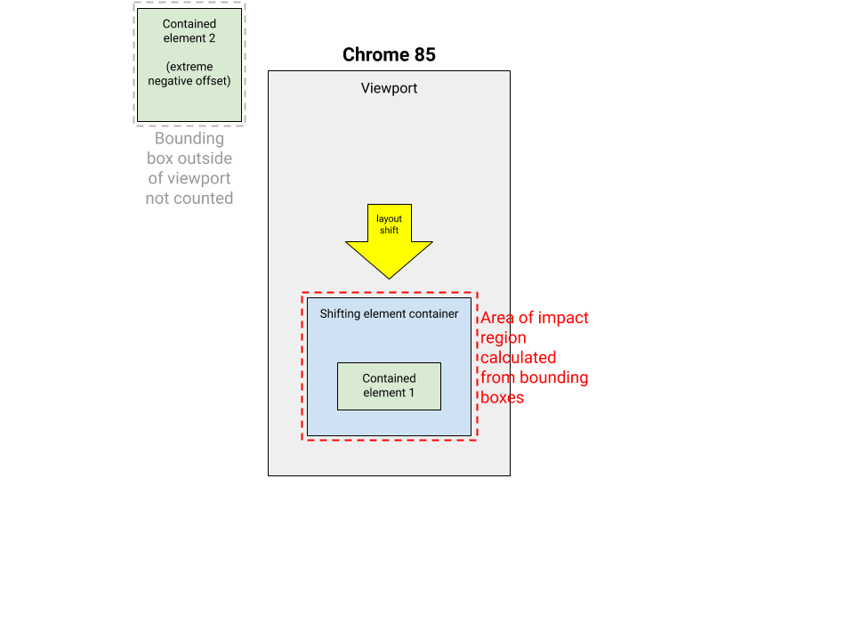
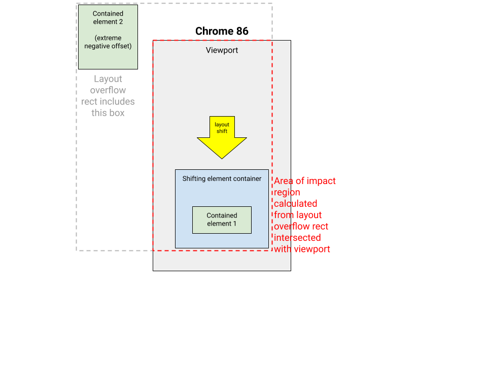

# Cumulative Layout Shift Changes in Chrome 86

## Changes in Chrome 86

A large change was made to the way Chrome records underlying layout shifts
which contribute to Cumulative Layout Shift in Chrome 86. The source code of the
change is [here](https://chromium-review.googlesource.com/c/chromium/src/+/2336301/).

The goal of the change was to better align the implementation to the
[specification](https://wicg.github.io/layout-instability/), which says:

> The visual representation of a Node N is defined as follows:
> * If N is an Element which generates one or more boxes, the visual representation of N is the set of all points that lie within the bounds of any fragment of any box generated by N, in the coordinate space of the viewport, excluding any points that lie outside of the viewport.
> * If N is a text node, the visual representation of N is the set of all points that lie within the bounds of any line box generated by N, in the coordinate space of the viewport, excluding any points that lie outside of the viewport.

This change has a few different impacts.

First, it no longer reports layout shifts from ink overflows, which should
improve Cumulative Layout Shift scores on pages with hover effects.

Second, when text shifts, the area shifted is the containing block starting from
the LayoutText moved, with the logical height of the text (source code for
using the logical height [here](https://chromium-review.googlesource.com/c/chromium/src/+/2386842)).
This will have a small impact on the score in some cases.

Third, there has been a change to how the area of the
[impact fraction](https://web.dev/cls/#impact-fraction) is computed. In Chrome
85 and below, when content overflowed the parent element, each descendant area
was counted separately, using each element's border box. As of Chrome 86, the
implementation has been updated to conform with the spec, by using the layout
overflow rect, which contains all points that lie in the bounds of any fragment
box. In both cases, the rects are still clipped to the viewport:

Before change | After
------------- | -----
 | 

### Problem in Chrome 86

Unfortunately, there is a problem in the specification that was only
uncovered as the change rolled out to stable. It occurs in cases
when a shifted node's positioned descendants overflow on the other side
of the viewport. The intersection of the viewport and the layout overflow rect
can be larger than the visible shift, as in this example below:

Before change | After
------------- | -----
 | 

The issue has been fixed on chromium trunk (source code [here](https://chromium-review.googlesource.com/c/chromium/src/+/2503330)), but the fix will not roll out to stable until Chrome 87.

## How does this affect a site's metrics?

Sites with hover effects can expect to see small improvements on their Cumulative
Layout Shift Scores.

Sites with absolutely positioned content with negative offsets outside the
viewport will see large regressions in their Cumulative Layout Shift scores
until the fix rolls out to stable.

### My CLS score regressed in M86. Is that a result of the above-mentioned issue?

You can test the fix on [Chrome Canary](https://www.google.com/chrome/canary/) version
88.0.4307.0 or later. You can navigate to `chrome://version` (by typing that in
the URL bar) to verify your browser's version. Either the
[JavaScript implementation](https://web.dev/cls/#measure-cls-in-javascript) or the
[Chrome Extension](https://chrome.google.com/webstore/detail/web-vitals/ahfhijdlegdabablpippeagghigmibma?hl=en)
can be used to check the Cumulative Layout Shift score on both canary and stable
channels.

If your CLS score returns to expected levels with the fix, there is no need to
make changes to your site to address the metric changes in Chrome 86.

## When were users affected?

Most users were updated to Chrome 86 the week of October 19, 2020.
