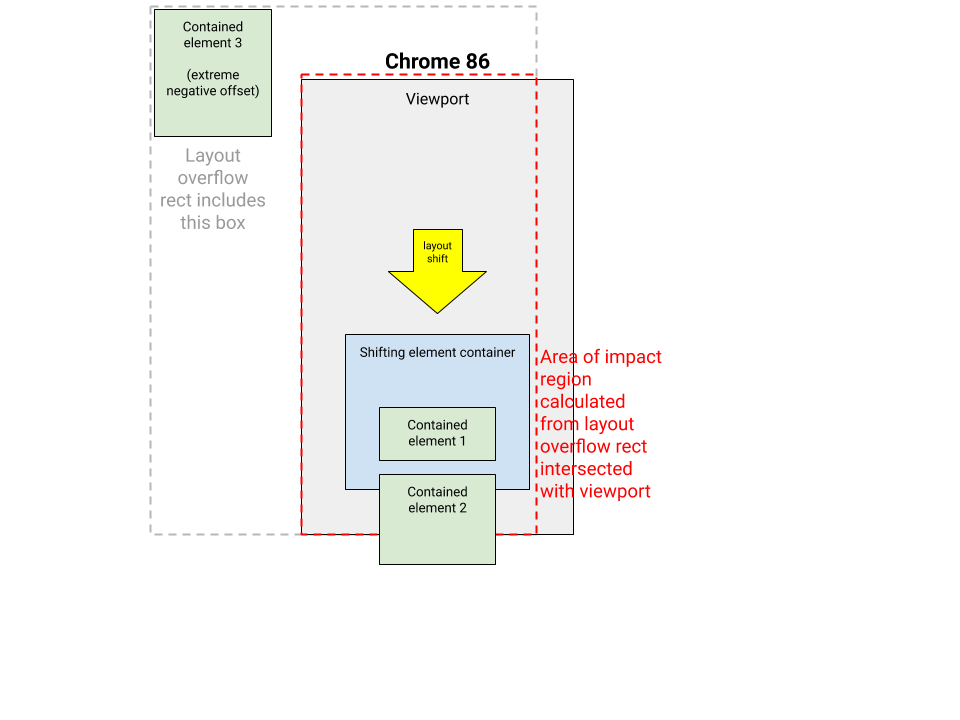
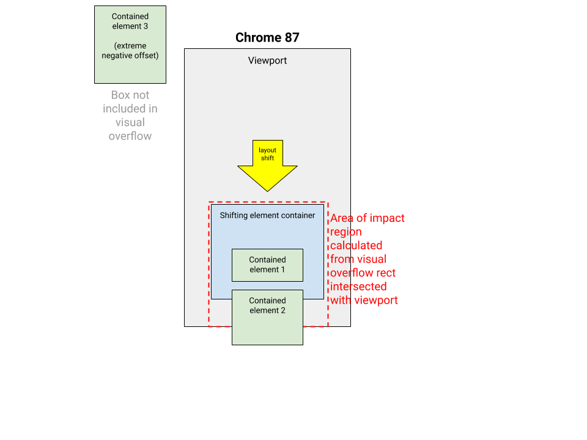

# Cumulative Layout Shift Changes in Chrome 87

## Changes in Chrome 87

### Bug fix to impact fraction calculation
In Chrome 86, a [problem was introduced](2020_10_cls.md) to the way the area of
the [impact fraction](https://web.dev/cls/#impact-fraction) is calculated
for layout shifts of nodes containing positioned content that overflows to the
other side of the viewport. In Chrome 87, the problem is fixed by using visual
rects to calculate the impact area instead of layout overflow rects (source code
for the change
[here](https://chromium-review.googlesource.com/c/chromium/src/+/2503330)).

Before change | After
------------- | -----
 | 

### Bug fix to elements with contain:paint styling

A bug fix was made to how the overflow of shifted elements inside a container
that is styled `contain:paint` is calculated, reducing the computed size of the
shift area for these nodes.
[Source code for this change](https://chromium-review.googlesource.com/c/chromium/src/+/2417061).

## How does this affect a site's metrics?

Sites whose CLS scores were negatively impacted by the
[regression in impact fraction calculation](2020_10_cls.md) in Chrome 86 should
return to accurate layout shift scores in Chrome 87. Developers can test in
Chrome 87.0.4280.51 and later to see the impact of this change.

Sites with contain:paint styling on elements may see an improvement in CLS
scores in Chrome 87.

## When were users affected?

Most users will be updated to Chrome 87 the week of November 17, 2020.
