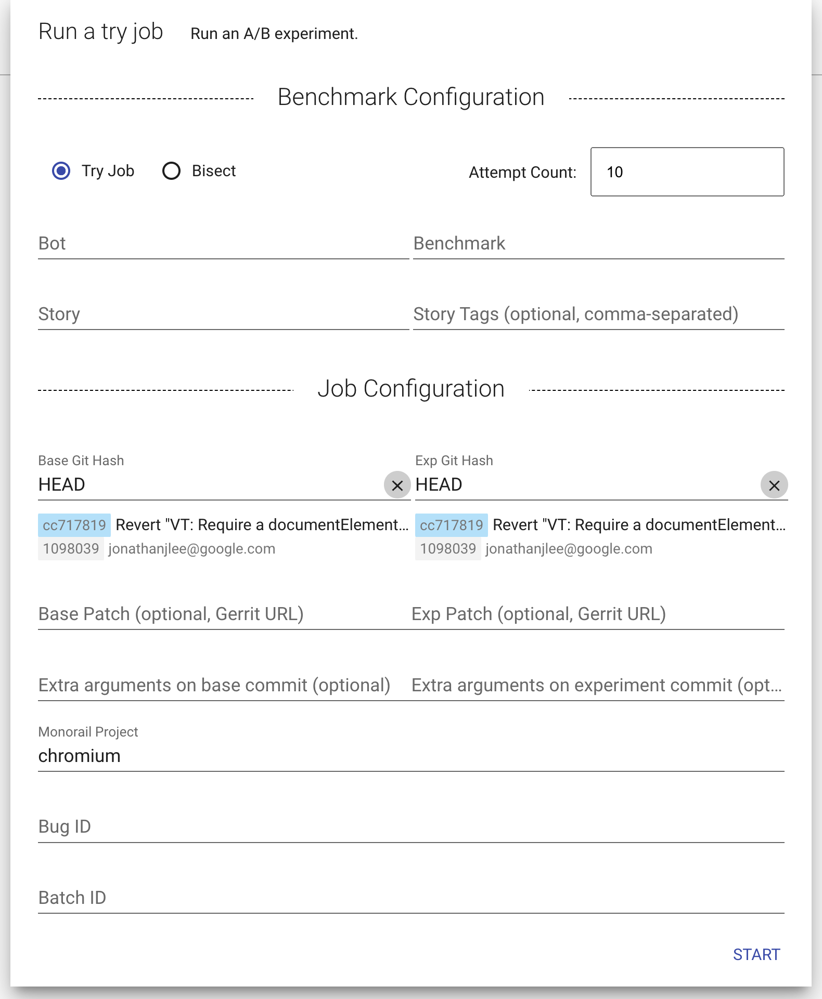
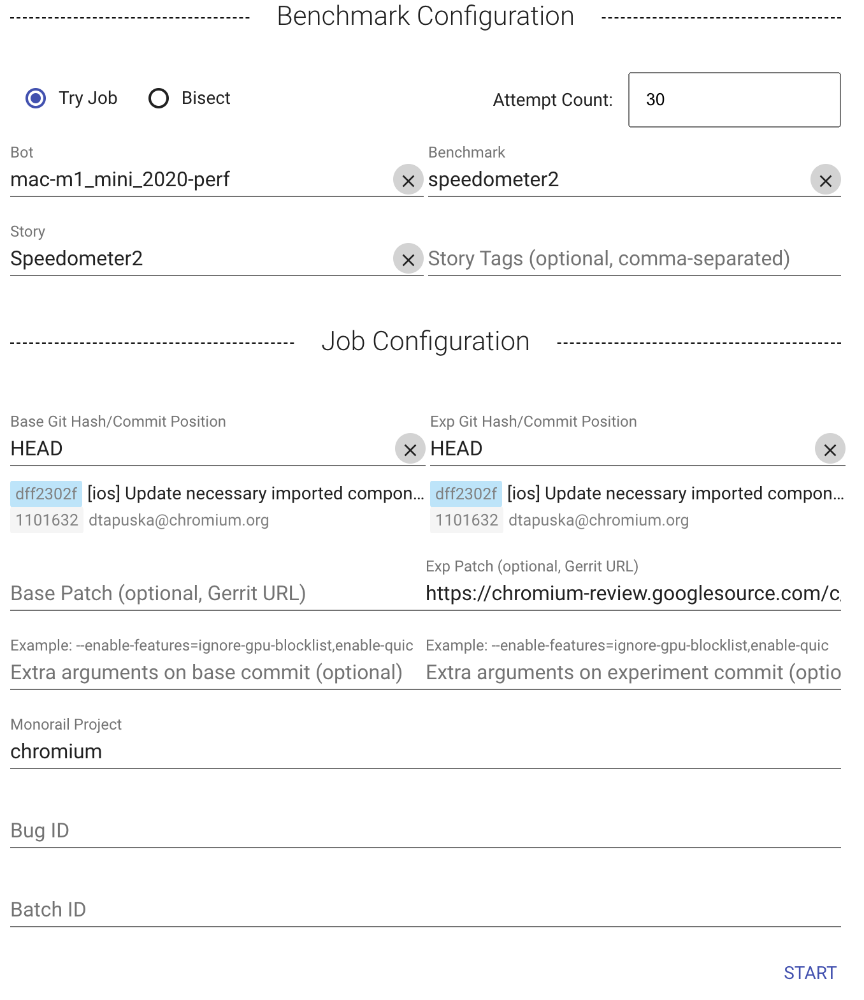
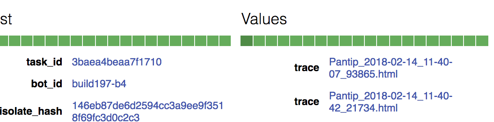

# Perf Try Bots

Chrome has a performance lab with dozens of device and OS configurations.
[Pinpoint](https://pinpoint-dot-chromeperf.appspot.com) is the service that lets
you run performance tests in the lab. With Pinpoint, you can run try jobs, which
let you put in a Gerrit patch, and it will run tip-of-tree with and without the
patch applied.

[TOC]

## Why perf try jobs?

* All of the devices exactly match the hardware and OS versions in the perf
  continuous integration suite.
* The devices have the "maintenance mutex" enabled, reducing noise from
  background processes.
* Some regressions take multiple repeats to reproduce, and Pinpoint
  automatically runs multiple times and aggregates the results.
* Some regressions reproduce on some devices but not others, and Pinpoint will
  run the job on multiple devices.
* Each iteration runs both arms on the same device, eliminating confounding factors like across-device variability

## Starting a perf try job

* Visit [Pinpoint](https://pinpoint-dot-chromeperf.appspot.com).
* Check the upper-right corner of the page. If you see a "Sign in" link,
  click it and sign in with an account that has trybot access.
  (If the link shows "Sign out", then you are already signed in.)
* Click the perf try button in the bottom right corner of the screen.

You should see the following dialog popup:

**Benchmark Configuration**| **Description**
--- | ---
Bot | The device type to run the test on. All hardware configurations in our perf lab are supported.
Benchmark | A telemetry benchmark. E.g. `system_health.common_desktop`  All the telemetry benchmarks are supported by the perf trybots. To get a full list, run `tools/perf/run_benchmark list`  To learn more about the benchmarks, you can read about the [system health benchmarks](https://docs.google.com/document/d/1BM_6lBrPzpMNMtcyi2NFKGIzmzIQ1oH3OlNG27kDGNU/edit?ts=57e92782), which test Chrome's performance at a high level, and the [benchmark harnesses](https://docs.google.com/spreadsheets/d/1ZdQ9OHqEjF5v8dqNjd7lGUjJnK6sgi8MiqO7eZVMgD0/edit#gid=0), which cover more specific areas.
Story | (optional) A specific story from the benchmark to run. Note that if the story you want isn't on the dropdown it could be because the story is new and so the Chromeperf dashboard database doesn't know about it yet. In that case you can still free-form type the exact story name into the field.
Story Tags | (optional) A list of story tags. All stories in the given benchmark that match any of the tags will be run.

Note that you must provide either a Story or a Story Tag for Pinpoint to run.
Per [this explanation](https://bugs.chromium.org/p/chromium/issues/detail?id=1017811#c6), running an entire benchmark on Pinpoint can cause significant problems if the benchmark is large. For this reason, some small benchmarks have an 'all' tag available that applies to all the stories in the benchmark, so please use that tag to run all the stories for a small benchmark. Please see [this bug](https://bugs.chromium.org/p/chromium/issues/detail?id=1023451) for details on work to add the 'all' tag to more benchmarks. If you want to run a large benchmark, consider choosing one of the tags that benchmark provides to select a subset of the available stories for that benchmark.

  

**Job Configuration**| **Description**
--- | ---
Attempt Count | The number of iterations Pinpoint will run on both arms. Pinpoint will spread iterations evenly across all available devices. Pinpoint will also randomize which arm runs first and ensure that the number of iterations going first are the same for both arms.
Base Git Hash | The Git Hash of the control arm. This git hash must have already landed on main or a release branch and cannot be the git hash associated with a gerrit CL in flight. Default is `HEAD`.
Exp Git Hash | Same as Base Git Hash for the experiment arm. Default is `HEAD`.
Base Patch | (optional) The patch you want the control arm to run the benchmark on. Patches in dependent repos (e.g. v8, skia) are supported. Pinpoint will also post updates on the Gerrit comment list. Must be entered as a URL.
Exp Patch | (optional) Same as Base Patch for the experiment arm.
Extra arguments on base commit | (optional) Extra arguments for the test. E.g. `--extra-chrome-categories=foo,bar` or`--enable-features=foo,bar`(shortening the args by omitting "--extra-browser-args" prefix)  To see all arguments, run `tools/perf/run_benchmark run --help`
Extra arguments on experiment commit | (optional) Same as base commit for the experiment arm. Note that some arguments will apply to both arms.
Monorail Project | The repo the Git hashes are from. Default is `chromium`.
Bug ID | (optional) A bug ID. Pinpoint will post updates on the bug.
Batch ID | (optional) A batch ID used to track relevant jobs for the Chrome Health Initiative. We recommend leaving this blank.

### Example: Evaluating a CL's impact on the performance of Speedometer2 on Mac M1

Here is an example of a try job that would evaluate the impact of a [patch CL](https://chromium-review.googlesource.com/c/chromium/src/+/3498915/1) at the tip of main on Speedometer2 on Mac M1. This experiment set up can also be used to see if the patch CL can address a performance regression as long as the regression is visible at HEAD.

## Interpreting the results

### Detailed results

On the Job result page, click the "Analyze benchmark results" link at the top. See the [metrics results UI documentation](https://github.com/catapult-project/catapult/blob/master/docs/metrics-results-ui.md) for more details on reading the results.

### Traces

On the Job result page, there is a chart containing two dots. The left dot represents HEAD and the right dot represents the patch. Clicking on the right dot reveals some colored bars; each box represents one benchmark run. Click on one of the runs to see trace links.

# Contact

* For more questions, email browser-perf-engprod@google.com
* Bugs on Pinpoint issues should have Component: [Speed>Bisection](https://bugs.chromium.org/p/chromium/issues/list?q=component:Speed%3EBisection).