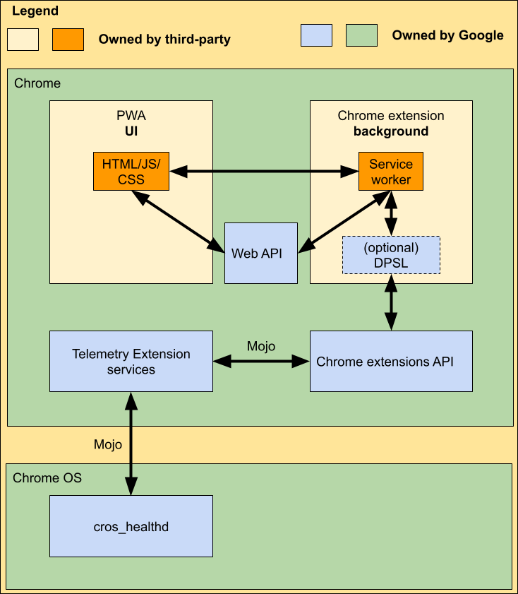

# Telemetry Extension API

This document describes the Architecture for the third-party Telemetry
Extensions Platform.

[TOC]

# Overview

The Telemetry Extension Platform provides means for accessing Telemetry and
Diagnostics data of a ChromeOS device. The Telemetry Extension Platform
consists of 2 parts:

1. A Chrome headless extension for API access, background data gathering and
processing (Telemetry Extension)

2. A companion [Progressive Web App (PWA)](https://web.dev/progressive-web-apps/)
to show UI to a user.

The Telemetry Extension uses
[Manifest V3](https://developer.chrome.com/docs/extensions/mv3/intro/) to
benefit from using
[Service Workers](https://developer.chrome.com/docs/workbox/service-worker-overview/)
instead of a background script. Only when the PWA is open, the Telemetry
Extension periodically receives user driven requests from the PWA to fetch
telemetry and run diagnostics routines. The PWA also has its own launch icon
and it doesn’t have direct access to the telemetry and diagnostics API, but it
communicates with the Telemetry Extension using message passing.

This image shows an overview of the architecture.
<br>
<br>


# Components

## Telemetry Extension

The Telemetry Extension's role is to handle requests from the UI and gather
telemetry and diagnostics data. The Telemetry Extension has a service worker
and does not have a launch icon. For this specific situation a new Chrome
extension type was declared, the ChromeOS System extension. In a ChromeOS
System extension, the service worker has direct access to normal
[web APIs](https://developer.mozilla.org/en-US/docs/Web/API). Most of the
[common Chrome Extension APIs](https://developer.chrome.com/docs/extensions/reference/)
are disabled (except `chrome.runtime` to communicate with the PWA) and access
to the Telemetry API is granted either directly through `os.` or via DPSL.js
the recommended way of using the API). Please note that each extension ID needs
to be allowlisted by Google in the Chrome codebase to have access to APIs.

## PWA

It is the role of the PWA to show UI to the user and communicate with the
Telemetry Extension to get telemetry and diagnostics data. The PWA has a
launch icon, UI, and access to web APIs.

## DPSL.js

*The Company Products defined in Exhibit A will be granted the ability to call
the Chrome OS Telemetry Extension APIs using the methods defined here.*

**(Update: Google provides clients with the ability to query the API by calling
chrome.os.\* directly. Migration guide can be found [here](dpsl_migration.md).)**
DPSL.js stands for Diagnostic Processor Support Library for Javascript, it’s a
JS wrapper around the underlying Telemetry Extensions APIs. It offers an
abstracted way for querying the API and is developed by Google. The library is
hosted on [Github](https://github.com/GoogleChromeLabs/telemetry-support-extension-for-chromeos)
and published to [npm](https://www.npmjs.com/package/cros-dpsl-js), please refer
to the documentation.
[These tables](https://github.com/GoogleChromeLabs/telemetry-support-extension-for-chromeos/tree/main/src#functions)
show an overview of all available API functions.

## Communication

A Chrome extension and a PWA can communicate with each other using message
passing. Only PWAs can initiate communication because a PWA is running only
when the user launches it.
The following example shows how the communication between the two components
could look like. The PWA uses `chrome.runtime.sendMessage` to communicate with
the Chrome extension:

```javascript
// PWA code

// The ID of the extension we want to talk to.
var editorExtensionId = "abcdefghijklmnoabcdefhijklmnoabc";

// Make a simple request:
chrome.runtime.sendMessage(
  /* extensionId */ editorExtensionId,
  /* message in JSON */ {openUrlInEditor: url},
  /* callback */ function(response) {
    if (!response.success)
      handleError(url);
  });
```

The extension side can handle incoming requests as follows:

```javascript
// Extension code

chrome.runtime.onMessageExternal.addListener(
 function(request, sender, sendResponse) {
   if (sender.url == blocklistedWebsite)
     return;  // don't allow this web page access
   if (request.openUrlInEditor)
     openUrl(request.openUrlInEditor);
 });
```

[//]: <> (This section is part of the API terms of use, internal version is)
[//]: <> (here go/telemetry-extension-tos. DO NOT EDIT unless changes in source)
## Permission to API Functionality Mapping

For an overview of all exposed function under `chrome.os.telemetry` and
`chrome.os.diagnostics`, please visit
[this page](https://github.com/GoogleChromeLabs/telemetry-support-extension-for-chromeos/blob/main/src/README.md#functions).
Some telemetry data requires special permissions to be accessed:

1. `VpdInfo.serialNumber` requires additional permission:
"os.telemetry.serial_number" with string
"Read Chrome OS device and component serial numbers"

2. `OemData.oemData` requires additional permission:
"os.telemetry.serial_number" with string
"Read Chrome OS device and component serial numbers"

3. `Batteryinfo.serialNumber` requires additional permission:
"os.telemetry.serial_number" with string
"Read Chrome OS device and component serial numbers"

4. MAC Address in `InternetConnectivity` requires additional permission:
“os.telemetry.network_info” with string “Read ChromeOS network information”

# The Chrome extension

In order for a Chrome extension to have access to telemetry and diagnostics
APIs, the following requirements need to be satisfied:

1. The user must be either:

    a. managed and the Telemetry extension was force-installed via policy, or

    b. The user is the device owner (the first user of the device).

    c. The user is in Shimless RMA flow.

2. The PWA UI associated with the Telemetry extension must be opened for the
extension to have access to APIs.

3. The device hardware must belong to the OEM associated with the Telemetry
extension (e.g. HP Support Assist only runs on HP devices).

4. Only an allowlisted extension ID can access Telemetry Extension APIs. Each
allowlisted extension ID can be connected to one PWA origin. It is mandatory
to declare one entry in `externally_connectable.matches` list.
An example can be found here:
```json
"externally_connectable": {
 "matches": ["https://third-party.com/*"]
}
```

The `externally_connectable` key determines whether or not a website (or other
Chrome extension) can initiate communication with a Telemetry Extension. A
Telemetry Extension can always choose to communicate with sites indirectly via
content scripts injected into a tab. Please note that no matter what,
extensions should always validate and sanitize messages.  An extension should
never have a listener that evals random code sent in a message. This helps
mitigate the damage a sender (whether untrusted or compromised) may be able to
perform. This is also critical because other Chrome extensions may be running
on the site that tries to connect to the Telemetry Extension and can initiate
that connection.

# Development / Testing support

## Overriding PWA origin (Since M98) / Manufacturer (Since M105)

Support for overriding the PWA origin and manufacturer to use while development
and testing was added in version M98 and M105. The PWA origin option overrides
the allowlisted PWA origin while the manufacturer overrides the actual device
manufacturer fetched from cros_config. Here is what you need to do in order to
access the flags (you can skip to step 3 if you already have read/write access
to rootfs):

1. On your testing device, make sure you enable developer mode.

2. Make sure you have write access to rootfs, if not run `/usr/share/vboot/bin/make_dev_ssd.sh --remove_rootfs_verification`

3. Open `/etc/chrome_dev.conf` and add these lines to the end:
```
--telemetry-extension-pwa-origin-override-for-testing=<new-pwa-origin>
--telemetry-extension-manufacturer-override-for-testing=<new-manufacturer>
```

<ol start="4">
<li>In your Telemetry Extension's manifest.json, set the
externally_connectable.matches entry to match <new-pwa-origin>.</li>
</ol>

After following those steps, the new PWA and the Telemetry Extension should be
able to communicate via message passing.

## A Note on Serial Number

The device serial number can be accessed using `dpsl.telemetry.getVpdInfo()`
and the battery serial number is accessed using `dpsl.telemetry.getOemDataInfo()`.
Because of the sensitive nature of serial numbers, this information is guarded
using a runtime permission: `os.telemetry.serial_number`.
For technical limitation, this is now a mandatory permission, meaning the
chrome extension’s manifest.json needs to include it in the permissions list in
order to have access to serial numbers.

## Setup a secure connection on localhost

The Telemetry Extension enforces `https` as the protocol for communicating with
the PWA. During development, this leads to a rejection of a PWA hosted under
`http://localhost/` or another origin that does not have a valid certificate
that is trusted by Chrome. The following steps describe how to set up a secure
development PWA under crostini (Linux on ChromeOS). For this guide we assume
`localhost` as the host. Please note that the `openssl` commands for this
guide were taken from
[this](https://www.section.io/engineering-education/how-to-get-ssl-https-for-localhost/)
blog post.

* Setup crostini (`Settings>Developers>Linux development environment`) and make
sure that "My Files" are shared with Linux (right click on the "My Files" folder
and then select "Share with Linux").
* Navigate to a shared folder under `mnt/chromeos/..` and run the following
command to create a root certificate:
```
openssl genrsa -out CA.key -des3 2048
```
* Using this key, generate a root certificate:
```
openssl req -x509 -sha256 -new -nodes -days 3650 -key CA.key -out CA.pem
```
* Next up, create a file named `localhost.ext` with the following content:
```
authorityKeyIdentifier = keyid,issuer
basicConstraints = CA:FALSE
keyUsage = digitalSignature, nonRepudiation, keyEncipherment, dataEncipherment
subjectAltName = @alt_names

[alt_names]
DNS.1 = localhost
IP.1 = 127.0.0.1
```
* Now create a key and a Certificate Signing Request (CSR) for localhost using
the following commands:
```
openssl genrsa -out localhost.key -des3 2048
openssl req -new -key localhost.key -out localhost.csr
```
* Finally generate a Certificate for localhost with the following command:
```
openssl x509 -req -in localhost.csr -CA ../CA.pem -CAkey ../CA.key -CAcreateserial -days 3650 -sha256 -extfile localhost.ext -out localhost.crt
```
* For your convenience create a decrypted version of your key for localhost.
This can be used by your development instance.
````
openssl rsa -in localhost.key -out localhost.decrypted.key
````

You can now use the generated key and certificate for localhost in your
development environment. In order for Chrome to trust the key used by your
application, you need to add the CA root certificate to Chrome.
Under `Settings>Privacy and security>Security>Manage certificates` you are
able to set the root CA. Just select the `Authorities` tab and click `Import`.
Select the generated `CA.pem` file and click open. Now your Chrome instance
and testing environment trust each other.

[//]: <> (This section is part of the API terms of use, internal version is)
[//]: <> (here go/telemetry-extension-tos. DO NOT EDIT unless changes in source)
# Restrictions on Data Use

Due to the powerful nature of this API there are limits on how the data can be
utilized:

1. This API can only be used to receive telemetry data and diagnostic
information from ChromeOS-based devices to provide Customer Support Services.

2. This API will only be used, access or otherwise process personal data or
device identifiers at the Customer’s express direction in each instance.

3. Company will not access the ChromeOS API on an ongoing basis, or at recurring
intervals, without express direction by the Customer.

4. Company will not store (on device or server), or use for geolocation
purposes, the device SSID or BSSID.

5. Company will not use data obtained through the API for marketing purposes.

6. Company will provide and adhere to a privacy policy that clearly and
accurately describes to Customers what data is collected and how the data is
used and shared.

# Further reads

For information around configuration of certain cros-config values please visit:

1. [Customization Guide - OEM Name](add_oem_name.md)

2. [Customization Guide - Fingerprint Diagnostics](fingerprint_diag.md)

3. [Telemetry Extension API overview](api_overview.md)

# FAQs

Q: I found a bug, how do I report it?<br>
A: Thank you for your contribution. Please create a new bug with the description
and logs (if possible) on our
[bugtracker](https://partnerissuetracker.corp.google.com/issues/new?component=1225577&template=1725782).
You need a partner account to do that.

Q: Have a question?<br>
A: Please reach out to chromeos-oem-services@google.com.
