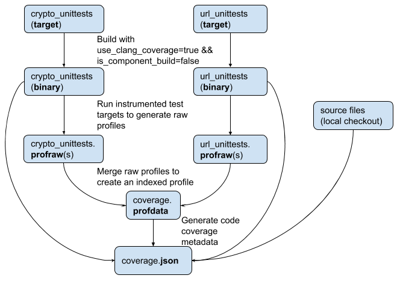

# Code Coverage in Chromium

### Coverage Dashboard: [link](https://analysis.chromium.org/coverage/p/chromium)

Table of contents:

- [Coverage Infrastructure](#coverage-infra)
  * [Coverage Builders](#coverage-builders)
  * [Coverage Service](#coverage-service)
  * [Coverage Clients](#coverage-clients)
- [Local Coverage Script](#local-coverage-script)
  * [Step 0 Download Tooling](#step-0-download-tooling)
  * [Step 1 Build](#step-1-build)
  * [Step 2 Create Raw Profiles](#step-2-create-raw-profiles)
  * [Step 3 Create Indexed Profile](#step-3-create-indexed-profile)
  * [Step 4 Create Coverage Reports](#step-4-create-coverage-reports)
- [Read The Artifact](#read-the-artifact)
  * [HTML report](#html-report)
  * [lcov report](#lcov-report)
- [Contacts](#contacts)
- [FAQ](#faq)


This document is divided into two parts.
- The first part introduces the code coverage infrastructure that
continuously generates code coverage information for the whole codebase and for
specific CLs in Gerrit. For the latter, refer to
[code\_coverage\_in\_gerrit.md](code_coverage_in_gerrit.md).
- The second part talks about how to generate code coverage locally for Clang-compiled languages like C++. Refer to [android code coverage instructions] for instructions for java code.

## Coverage Infrastructure

![coverage infra diagram]

There are 3 layers in the system:

### Coverage Builders

The first layer is the LUCI builders that
 - build instrumented targets,
 - run the instrumented tests,
 - merge the results into single streams,
 - upload data to cloud storage.

There are two types of builder:

CI Builder

The code coverage CI Builders periodically build all the test targets and fuzzer
targets for a given platform and instrument all available source files. Then
save the coverage data to a dedicated storage bucket.

CQ Builder

The code coverage CQ builders instrument only the files changed for a given CL.
More information about per-cl coverage info in [this
doc](code_coverage_in_gerrit.md).

### Coverage Service

The second layer in the system consists of an AppEngine application that
consumes the coverage data from the builders above, structures it and stores it
in cloud datastore. It then serves the information to the clients below.

### Coverage Clients

In the last layer we currently have two clients that consume the service:

#### Coverage Dashboard

The [coverage dashboard] front end is hosted in the same application as the
service above.
It shows the full-code coverage reports with links to the builds that generated
them, as well as per-directory and per-component aggregation, and can be drilled
down to the single line of code level of detail.

Refer to the following screenshots:

##### Directory View

See coverage breakdown by directories (default landing page).

![coverage dashboard directory view]

##### Component View

Use the view dropdown menu to switch between directory and component.

![coverage dashboard component view]

##### Source View

Click on a particular source file in one of the views above to see line-by-line
coverage breakdown, and it's useful to identify:
- Uncovered lines and code blocks that lack test coverage.
- Potentially dead code. See [dead code example].
- Hot spots in your code.

![coverage dashboard file view]

##### Project View

Click on "Previous Reports" to check out the coverage history of the project.

![coverage dashboard link to previous reports]

List of historical coverage reports are in reverse chronological order.

![coverage dashboard previous reports]

#### Gerrit Coverage View

The other client supported at the moment is the gerrit plugin for code coverage.

![gerrit coverage view]

See [this doc](code_coverage_in_gerrit.md) for information about the feature
that allows gerrit to display code coverage information generated for a given CL
by CQ bot. Or see this
[15-second video tutorial](https://www.youtube.com/watch?v=cxXlYcSgIPE).

## Local Coverage Script
This [documentation] explains how to use Clang’s source-based coverage
features in general. The [coverage script] automates the process described below and provides a
one-stop service to generate code coverage reports locally in just one command.

This script is currently supported on Android, Linux, Mac, iOS and ChromeOS
platforms.

Here is an example usage:

```
$ gn gen out/coverage \
    --args="use_clang_coverage=true is_component_build=false
    dcheck_always_on=true is_debug=false"
$ python tools/code_coverage/coverage.py \
    crypto_unittests url_unittests \
    -b out/coverage -o out/report \
    -c 'out/coverage/crypto_unittests' \
    -c 'out/coverage/url_unittests --gtest_filter=URLParser.PathURL' \
    -f url/ -f crypto/
```
The command above builds `crypto_unittests` and `url_unittests` targets and then
runs them individually with their commands and arguments specified by the `-c` flag.
For `url_unittests`, it only runs the test `URLParser.PathURL`. The coverage report
is filtered to include only files and sub-directories under `url/` and `crypto/`
directories.

Aside from automating the process, this script provides visualization features to
view code coverage breakdown by directories and by components, similar to the
views in the [coverage dashboard](#coverage-dashboard) above.

## Workflow
This section presents the workflow of generating code coverage reports using two
unit test targets in Chromium repo as an example: `crypto_unittests` and
`url_unittests`, and the following diagram shows a step-by-step overview of the
process.



### Step 0 Download Tooling
Generating code coverage reports requires llvm-profdata and llvm-cov tools.
You can get them by adding `"checkout_clang_coverage_tools": True,` to
`custom_vars` in the `.gclient` config and run `gclient runhooks`. You can also
download the tools manually ([tools link])

### Step 1 Build
In Chromium, to compile code with coverage enabled, one needs to add
`use_clang_coverage=true`, `is_component_build=false` and `is_debug=false` GN
flags to the args.gn file in the build output directory. Under the hood, they
ensure `-fprofile-instr-generate` and `-fcoverage-mapping` flags are passed to
the compiler.

```
$ gn gen out/coverage \
    --args='use_clang_coverage=true is_component_build=false is_debug=false'
$ gclient runhooks
$ autoninja -C out/coverage crypto_unittests url_unittests
```

### Step 2 Create Raw Profiles
The next step is to run the instrumented binaries. When the program exits, it
writes a raw profile for each process. Because Chromium runs tests in
multiple processes, the number of processes spawned can be as many as a few
hundred, resulting in the generation of a few hundred gigabytes’ raw
profiles. To limit the number of raw profiles, `%Nm` pattern in
`LLVM_PROFILE_FILE` environment variable is used to run tests in multi-process
mode, where `N` is the number of raw profiles. With `N = 4`, the total size of
the raw profiles are limited to a few gigabytes. (If working on Android, the
.profraw files will be located in ./out/coverage/coverage by default.)

Additionally, we also recommend enabling the continuous mode by adding the `%c`
pattern to `LLVM_PROFILE_FILE`. The continuous mode updates counters in real
time instead of flushing to disk at process exit. This recovers coverage data
from tests that exit abnormally (e.g. death tests). Furthermore, the continuous
mode is required to recover coverage data for tests that run in sandboxed
processes. For more information, see crbug.com/1468343.

```
$ export LLVM_PROFILE_FILE="out/report/crypto_unittests.%4m%c.profraw"
$ ./out/coverage/crypto_unittests
$ ls out/report/
crypto_unittests.3657994905831792357_0.profraw
...
crypto_unittests.3657994905831792357_3.profraw
```

### Step 3 Create Indexed Profile
Raw profiles must be indexed before generating code coverage reports, and this
is done using the `merge` command of `llvm-profdata` tool, which merges multiple
raw profiles (.profraw) and indexes them to create a single profile (.profdata).

At this point, all the raw profiles can be thrown away because their information
is already contained in the indexed profile.

```
$ llvm-profdata merge -o out/report/coverage.profdata \
    out/report/crypto_unittests.3657994905831792357_0.profraw
...
out/report/crypto_unittests.3657994905831792357_3.profraw
out/report/url_unittests.714228855822523802_0.profraw
...
out/report/url_unittests.714228855822523802_3.profraw
$ ls out/report/coverage.profdata
out/report/coverage.profdata
```

### Step 4 Create Coverage Reports
Finally, `llvm-cov` is used to render code coverage reports. There are different
report generation modes, and all of them require the following as input:
- Indexed profile
- All built target binaries
- All exercised source files

For example, the following command can be used to generate per-file line-by-line
code coverage report:

```
$ llvm-cov show -output-dir=out/report -format=html \
    -instr-profile=out/report/coverage.profdata \
    -compilation-dir=out/coverage \
    -object=out/coverage/url_unittests \
    out/coverage/crypto_unittests
```

If creating a report for Android, the -object arg would be the lib.unstripped
file, ie out/coverage/lib.unstripped/libcrypto_unittests__library.so

For more information on how to use llvm-cov, please refer to the [guide].

## Read The Artifact

The code coverage tool generates some artifacts, and it is good to
understand the data format to be used by automation tools.

### HTML Report

If the argument `--format=html` is used in the `llvm-cov export` command, it
generates a report in html format. In this html report, it shows the source
files, lists the functions and coverage metadata on whether the functions are
executed or not.

Reading a html report is straightforward: Just open up this html page with a
Chrome browser.

### lcov Report

If the argument `--format=lcov` is used in the `llvm-cov export` command, it
generates a report in lcov format.

In the lcov file, the meaning of these keywords are listed below.

* `SF`: source file name (typically beginning of one record)
* `FN`: mangled function symbol
* `FNDA`: functions execution
* `FNF`: functions found
* `FNH`: functions hit
* `DA`:  lines executed
* `BRH`: branches hit
* `BRF`: branches found
* `LH`: lines hit
* `LF`: lines found
* `end_of_record` end of one record

The number right after `FN` indicates the starting line number of this function.
The number right after `FNDA` indicates the total number of execution of this
function.

In the following example record, it means that function `_ZN4apps18AppLifetimeMonitorC2EPN7content14BrowserContextE` is defined at line
21 in file `app_lifetime_monitor.cc` and it is executed once.

```
SF:../../chromium/src/apps/app_lifetime_monitor.cc
FN:21,_ZN4apps18AppLifetimeMonitorC2EPN7content14BrowserContextE
FN:32,_ZN4apps18AppLifetimeMonitorD2Ev
FNDA:1,_ZN4apps18AppLifetimeMonitorC2EPN7content14BrowserContextE
FNF:7
FNH:1
DA:34,0
BRF:0
BRH:0
LF:5
LH:1
end_of_record
```

## Contacts

### Reporting problems
For any breakage report and feature requests, please [file a bug].

### Mailing list
For questions and general discussions, please join [code-coverage group].

## FAQ

### Can I use `is_component_build=true` for code coverage build?

Yes, code coverage instrumentation works with both component and non-component
builds. Component build is usually faster to compile, but can be up to several
times slower to run with code coverage instrumentation. For more information,
see [crbug.com/831939].

### I am getting some warnings while using the script, is that fine?

Usually this is not a critical issue, but in general we tend not to have any
warnings. Please check the list of [known issues], and if there is a similar
bug, leave a comment with the command you run, the output you get, and Chromium
revision you use. Otherwise, please [file a bug] providing the same information.

### How do crashes affect code coverage?

If a crash of any type occurs (e.g. Segmentation Fault or ASan error), the
crashing process might not dump coverage information necessary to generate
code coverage report. For single-process applications (e.g. fuzz targets), that
means no coverage might be reported at all. For multi-process applications, the
report might be incomplete. It is important to fix the crash first. If this is
happening only in the coverage instrumented build, please [file a bug].

### How do assertions affect code coverage?

If a crash is caused by CHECK or DCHECK, the coverage dump will still be written
on the disk ([crrev.com/c/1172932]). However, if a crashing process calls the
standard [assert] directly or through a custom wrapper, the dump will not be
written (see [How do crashes affect code coverage?]).

### Is it possible to obtain code coverage from a full Chromium build?

Yes, with some important caveats. It is possible to build `chrome` target with
code coverage instrumentation enabled. However, there are some inconveniences
involved:

* Linking may take a while, especially if you use a non-component build.
* The binary is huge (2-4GB).
* The browser may be noticeably slow and laggy.

For more information, please see [crbug.com/834781].

### Why do we see significantly different coverage reported on different revisions?

There can be two possible scenarios:

* It can be a one time flakiness due to a broken build or failing tests.
* It can be caused by extension of the test suite used for generating code
coverage reports. When we add new tests to the suite, the aggregate coverage
reported usually grows after that.

### How can I improve [coverage dashboard]?

The code for the service and dashboard currently lives along with findit at
[this location](https://chromium.googlesource.com/infra/infra/+/main/appengine/findit/)
because of significant shared logic.

The code used by the bots that generate the coverage data lives (among other
places) in the
[code coverage recipe module](https://chromium.googlesource.com/chromium/tools/build/+/main/scripts/slave/recipe_modules/code_coverage/).

### Why is coverage for X not reported or unreasonably low, even though there is a test for X?

There are several reasons why coverage reports can be incomplete or incorrect:

* A particular test is not used for code coverage report generation. Please
[file a bug].
* A test may have a build failure or a runtime crash. Please check the build
for that particular report (rightmost column on the [coverage dashboard]).
If there is any failure, please upload a CL with the fix. If you can't fix it,
feel free to [file a bug].
* A particular test may not be available on a particular platform. As of now,
only reports generated on Linux and CrOS are available on the
[coverage dashboard].

### Is coverage reported for the code executed inside the sandbox?

Yes!


[assert]: http://man7.org/linux/man-pages/man3/assert.3.html
[code-coverage group]: https://groups.google.com/a/chromium.org/forum/#!forum/code-coverage
[code-coverage repository]: https://chrome-internal.googlesource.com/chrome/tools/code-coverage
[coverage dashboard]: https://analysis.chromium.org/coverage/p/chromium
[coverage script]: https://cs.chromium.org/chromium/src/tools/code_coverage/coverage.py
[coverage infra diagram]: images/code_coverage_infra_diagram.png
[coverage dashboard file view]: images/code_coverage_dashboard_file_view.png
[coverage dashboard component view]: images/code_coverage_dashboard_component_view.png
[coverage dashboard directory view]: images/code_coverage_dashboard_directory_view.png
[coverage dashboard link to previous reports]: images/code_coverage_dashboard_link_to_previous_reports.png
[coverage dashboard previous reports]: images/code_coverage_dashboard_previous_reports.png
[crbug.com/821617]: https://crbug.com/821617
[crbug.com/831939]: https://crbug.com/831939
[crbug.com/834781]: https://crbug.com/834781
[crrev.com/c/1172932]: https://crrev.com/c/1172932
[clang roll]: https://crbug.com/841908
[dead code example]: https://chromium.googlesource.com/chromium/src/+/ac6e09311fcc7e734be2ef21a9ccbbe04c4c4706
[documentation]: https://clang.llvm.org/docs/SourceBasedCodeCoverage.html
[file a bug]: https://bugs.chromium.org/p/chromium/issues/entry?components=Infra%3ETest%3ECodeCoverage
[gerrit coverage view]: images/code_coverage_annotations.png
[guide]: http://llvm.org/docs/CommandGuide/llvm-cov.html
[How do crashes affect code coverage?]: #how-do-crashes-affect-code-coverage
[known issues]: https://bugs.chromium.org/p/chromium/issues/list?q=component:Infra%3ETest%3ECodeCoverage
[tools link]: https://storage.googleapis.com/chromium-browser-clang-staging/
[android code coverage instructions]: https://chromium.googlesource.com/chromium/src/+/HEAD/build/android/docs/coverage.md
