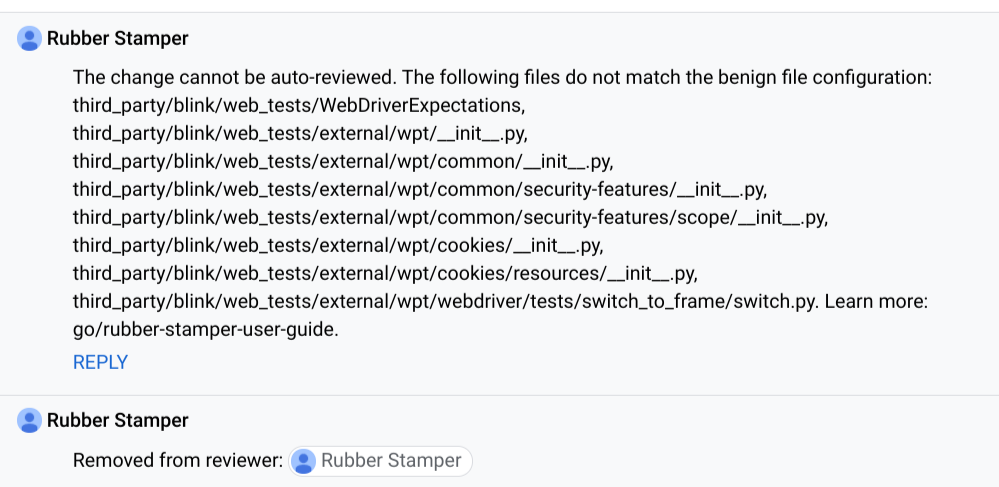

# web-platform-tests

Interoperability between browsers is
[critical](https://www.chromium.org/blink/platform-predictability) to Chromium's
mission of improving the web. We believe that leveraging and contributing to a
shared test suite is one of the most important tools in achieving
interoperability between browsers. The [web-platform-tests
repository](https://github.com/web-platform-tests/wpt) is the primary shared
test suite where all browser engines are collaborating.

Chromium has a 2-way import/export process with the upstream web-platform-tests
repository, where tests are imported into
[web_tests/external/wpt](../../third_party/blink/web_tests/external/wpt)
and any changes to the imported tests are also exported to web-platform-tests.

See https://web-platform-tests.org/ for general documentation on
web-platform-tests, including tips for writing and reviewing tests.

[TOC]

## Writing tests

To contribute changes to web-platform-tests, just commit your changes directly
to [web_tests/external/wpt](../../third_party/blink/web_tests/external/wpt)
and the changes will be automatically upstreamed within 24 hours.

Changes involving adding, removing or modifying tests can all be upstreamed.
Any changes outside of
[external/wpt](../../third_party/blink/web_tests/external/wpt) will not be
upstreamed, and any changes `*-expected.txt`, `OWNERS`, and `MANIFEST.json`,
will also not be upstreamed.

Running the web tests will automatically regenerate MANIFEST.json to pick up
any local modifications.

Most tests are written using testharness.js, see
[Writing Web Tests](./writing_web_tests.md) and
[Web Tests Tips](./web_tests_tips.md) for general guidelines.

### Write tests against specifications

Tests in web-platform-tests are expected to match behavior defined by the
relevant specification. In other words, all assertions that a test makes
should be derived from a specification's normative requirements, and not go
beyond them. It is often necessary to change the specification to clarify what
is and isn't required.

When implementation experience is needed to inform the specification work,
[tentative tests](https://web-platform-tests.org/writing-tests/file-names.html)
can be appropriate. It should be apparent in context why the test is tentative
and what needs to be resolved to make it non-tentative.

### Tests that require testing APIs

#### `testdriver.js`

[testdriver.js](https://web-platform-tests.org/writing-tests/testdriver.html)
provides a means to automate tests that cannot be written purely using web
platform APIs, similar to `internals.*` and `eventSender.*` in regular Blink
web tests.

If no testdriver.js API exists, check if it's a
[known issue](https://github.com/web-platform-tests/wpt/labels/testdriver.js)
and otherwise consider filing a new issue. For instructions on how to add a new
testing API, see [WPT Test Automation for
Chromium](https://docs.google.com/document/d/18BpD41vyX1cFZ77CE0a_DJYlGpdvyLlx3pwXVRxUzvI/preview#)

#### MojoJS

Some specs may define testing APIs (e.g.
[WebUSB](https://wicg.github.io/webusb/test/)), which may be polyfilled with
internal API like [MojoJS](../../mojo/public/js/README.md).  MojoJS is only
allowed in WPT for this purpose. Please reach out to
blink-dev@chromium.org before following the process below for adding a new
test-only API:

 1. Create a full list of `*.mojom.m.js` files that you need, including all
    dependencies. Generated modules load dependencies recursively by default,
    so you can check the network panel of DevTools to see the full list of
    dependencies it loads.
 2. Check [linux-archive-rel.json](../../infra/archive_config/linux-archive-rel.json) and add any
    missing `*.mojom.m.js` files to the `mojojs.zip` archive. Globs are
    supported in `filename`. Do not copy Mojom bindings into WPT.
 3. Meanwhile in Chromium, you can create a helper for your WPT tests to do
    browser-specific setup using
    [test-only-api.js](../../third_party/blink/web_tests/external/wpt/resources/test-only-api.js).
    See
    [webxr_util.js](../../third_party/blink/web_tests/external/wpt/webxr/resources/webxr_util.js)
    as an example. You can write tests using this helper right away, but they
    will not work upstream (i.e. on https://wpt.fyi ) until your change in step
    2 is included in official channels, as `mojojs.zip` is built alongside with
    Chrome.

#### `wpt_automation`

An alternative to the above options is to write manual tests that are automated
with scripts from
[wpt_automation](../../third_party/blink/web_tests/external/wpt_automation).
Injection of JS in manual tests is determined by `loadAutomationScript` in
[testharnessreport.js](../../third_party/blink/web_tests/resources/testharnessreport.js).

Such tests still require case-by-case automation to run for other browser
engines, but are more valuable than purely manual tests.

Manual tests that have no automation are still imported, but skipped in
[NeverFixTests](../../third_party/blink/web_tests/NeverFixTests); see
[issue 738489](https://crbug.com/738489).

### Contribution process

Changes made in
[web_tests/external/wpt](../../third_party/blink/web_tests/external/wpt) are
[automatically exported to GitHub](#exporting-tests).

It's still possible to make direct pull requests to web-platform-tests, see
https://web-platform-tests.org/writing-tests/github-intro.html.

### Adding new top-level directories

Entirely new top-level directories should generally be added upstream, since
that's the only way to add an OWNERS file upstream. After adding a new top-level
directory upstream, you should add a line for it in `W3CImportExpectations`.

Adding the new directory (and `W3CImportExpectations` entry) in Chromium and
later adding an OWNERS file upstream also works.

### `wpt_internal`

It is sometimes desirable to write WPT tests that either test Chromium-specific
behaviors, or that cannot yet be upstreamed to WPT (e.g. because the spec is
very nascent). For these cases, we maintain a separate directory,
[wpt_internal](../../third_party/blink/web_tests/wpt_internal) that runs under the
WPT testing infrastructure (e.g. uses wptserve, etc), but which is not
upstreamed to WPT.

Please see the `wpt_internal`
[README](../../third_party/blink/web_tests/wpt_internal/README.md) for more details.

**Note**: A significant downside of `wpt_internal` is that your tests may be
broken by upstream changes to the resources scripts (e.g. `testharness.js`), as
`wpt_internal` does not use the forked version of `testharness.js` used by all
other non-`external/wpt` tests. Use of [new failure
notifications](#new-failure-notifications) is recommended to ensure you are
notified of breakages.

## Running tests

Same as Blink web tests, you can use
[`run_web_tests.py`](web_tests.md#running-the-tests) to run any WPT test. This
will run WPT tests in Content Shell. You can also run [`run_wpt_tests.py`](run_web_platform_tests.md) to
run WPT tests with Chrome.

One thing to note is that glob patterns for WPT tests are not yet supported.

See [Running WPT tests in Content Shell](web_tests_in_content_shell.md#Running-WPT-Tests-in-Content-Shell)
for debugging etc.

## Reviewing tests

Anyone who can review code and tests in Chromium can also review changes in
[external/wpt](../../third_party/blink/web_tests/external/wpt)
that will be automatically upstreamed. There will be no additional review in
web-platform-tests as part of the export process.

If upstream reviewers have feedback on the changes, discuss on the pull request
created during export, and if necessary work on a new pull request to iterate
until everyone is satisfied.

When reviewing tests, check that they match the relevant specification, which
may not fully match the implementation. See also
[Write tests against specifications](#Write-tests-against-specifications).

## Importing tests

Chromium has a [mirror](https://chromium.googlesource.com/external/w3c/web-platform-tests/)
of the GitHub repo and periodically imports a subset of the tests to
run as part of the regular Blink web test testing process.

The goals of this process are to be able to run web-platform-tests unmodified
locally just as easily as we can run the Blink tests, and ensure that we are
tracking tip-of-tree in the web-platform-tests repository as closely as
possible, and running as many of the tests as possible.

### Automatic import process

There is an automatic process for updating the Chromium copy of
web-platform-tests. The import is done by the builder [wpt-importer
builder][wpt-importer].

The easiest way to check the status of recent imports is to look at:

-   Recent logs on LUCI for [wpt-importer builder][wpt-importer]
-   Recent CLs created by [WPT
    Autoroller](https://chromium-review.googlesource.com/q/owner:wpt-autoroller%2540chops-service-accounts.iam.gserviceaccount.com).

The import jobs will generally be green if either there was nothing to do,
or a CL was successfully submitted.

For maintainers:

-   The source lives in
    [third_party/blink/tools/wpt_import.py](../../third_party/blink/tools/wpt_import.py).
-   If the importer starts misbehaving, it can be disabled by landing a
    [CL to skip the update step](https://crrev.com/c/1961906/).

### New failure notifications

The importer automatically file bugs against a component when imported changes
introduce failures as long as test owners did not choose to opt-out the failure
notification mechanism. This includes new tests that fail in Chromium, as well
as new failures introduced to an existing test. Test owners are encouraged to
create an `DIR_METADATA` file in the appropriate `external/wpt/` subdirectory
that contains at least the `buganizer_public.component_id` field, which the
importer will use to file bugs.
For example, `external/wpt/css/css-grid/DIR_METADATA` looks like:

```
buganizer_public {
  component_id: 1415957
}
team_email: "layout-dev@chromium.org"
```

When tests under `external/wpt/css/css-grid/` newly fail in a WPT import, the
importer will automatically file a bug against the `Chromium>Blink>Layout>Grid`
component in [issues.chromium.org](https://issues.chromium.org/issues), with
details of which tests failed and the outputs.
The importer will also copy `layout-dev@chromium.org` (the `team_email`) and any
`external/wpt/css/css-grid/OWNERS` on the bug.

Failing tests are grouped according to the most specific `DIR_METADATA` that
they roll up to.

To opt-out of this notification, add `wpt.notify` field set to `NO` to the
corresponding `DIR_METADATA`.
For example, the following `DIR_METADATA` will suppress notification from tests
under the located directory:

```
buganizer_public {
  component_id: 1415957
}
team_email: "layout-dev@chromium.org"
wpt {
  notify: NO
}
```

### Skipped tests (and how to re-enable them)

We control which tests are imported via a file called
[W3CImportExpectations](../../third_party/blink/web_tests/W3CImportExpectations),
which has a list of directories to skip while importing.

In addition to the directories and tests explicitly skipped there, tests may
also be skipped for a couple other reasons, e.g. if the file path is too long
for Windows. To check what files are skipped in import, check the recent logs
for [wpt-importer builder][wpt-importer].

If you wish to un-skip some of the directories currently skipped in
`W3CImportExpectations`, you can modify that file locally and commit it, and on
the next auto-import, the new tests should be imported.

If you want to import immediately (in order to try the tests out locally, etc)
you can also run `wpt-import`, but this is not required.

Remember your import might fail due to GitHub's limit for unauthenticated
requests, so consider [passing your GitHub credentials](#GitHub-credentials) to
the script.

### Waterfall failures caused by automatic imports.

If there are new test failures that start after an auto-import,
there are several possible causes, including:

 1. New baselines for flaky tests were added (https://crbug.com/701234).
 2. Modified tests should have new results for non-Release builds but they weren't added (https://crbug.com/725160).
 3. New baselines were added for tests with non-deterministic test results (https://crbug.com/705125).

Because these tests are imported from the Web Platform tests, it is better
to have them in the repository (and marked failing) than not, so prefer to
[add test expectations](web_test_expectations.md) rather than reverting.
However, if a huge number of tests are failing, please revert the CL so we
can fix it manually.

[wpt-importer]: https://ci.chromium.org/p/infra/builders/luci.infra.cron/wpt-importer

## Exporting tests

If you upload a CL with any changes in
[third_party/blink/web_tests/external/wpt](../../third_party/blink/web_tests/external/wpt),
once your CL is ready to submit the exporter will create a provisional pull request with
those changes in the [upstream WPT GitHub repository](https://github.com/web-platform-tests/wpt/).
The exporter runs on [wpt-exporter builder][wpt-exporter].

Once you're ready to land your CL, please follow the link posted by the bot and
check the status of the required checks of the GitHub PR. If it's green, go
ahead landing your CL and the exporter will automatically merge the PR.

If GitHub status is red on the PR, please try to resolve the failures before
merging. If you run into any issues, or if you have a CL with WPT changes that
the exporter did not pick up, please reach out to blink-dev@chromium.org.

Additional things to note:

-   CLs that change over 1000 files will not be exported.
-   All PRs use the
    [`chromium-export`](https://github.com/web-platform-tests/wpt/pulls?utf8=%E2%9C%93&q=is%3Apr%20label%3Achromium-export) label.
-   All PRs for CLs that haven't yet been landed in Chromium also use the
    [`do not merge yet`](https://github.com/web-platform-tests/wpt/pulls?q=is%3Apr+is%3Aopen+label%3A%22do+not+merge+yet%22) label.
-   The exporter cannot create upstream PRs for in-flight CLs with binary files
    (e.g. webm files). An export PR will still be made after the CL lands.

### Will the exported commits be linked to my GitHub profile?

The email you commit with in Chromium will be the author of the commit on
GitHub. You can [add it as a secondary address on your GitHub
account](https://help.github.com/articles/adding-an-email-address-to-your-github-account/)
to link your exported commits to your GitHub profile.

If you are a Googler, you can also register your GitHub account at go/github,
making it easier for other Googlers to find you.

### What if there are conflicts?

This cannot be avoided entirely as the two repositories are independent, but
should be rare with frequent imports and exports. When it does happen, manual
intervention will be needed and in non-trivial cases you may be asked to help
resolve the conflict.

[wpt-exporter]: https://ci.chromium.org/p/infra/builders/luci.infra.cron/wpt-exporter

## Notes for WPT infra maintainers

### Importer

#### Rubber-Stamper bot

To allow the importer to land CLs without human intervention, it utilizes the
[Rubber-Stamper
bot](https://chromium.googlesource.com/infra/infra/+/refs/heads/main/go/src/infra/appengine/rubber-stamper/README.md)
to approve import CLs.

Adding the Rubber-Stamper as a reviewer is one of the last steps the importer
takes, once tests have been rebaselined and the CQ passes. If the Rubber-Stamper
cannot approve a CL, it will leave a comment on the CL explaining why - this
will also cause the importer to go red.



There are two possibilities when the Rubber-Stamper rejects an import: either it
is a valid rejection, because the import changes code files (`.py`, `.bat`,
`.sh`), or it is invalid and we're missing an allowlist rule for a file the
importer is allowed to modify.

For valid rejections, it is the job of the rotation sheriff to land the CL
manually. You need to un-abandon the import, `CR+1` it yourself, and `CQ+2` it.
If you don't have permission to do that (e.g. are not a committer), contact
blink-dev@chromium.org.

For invalid rejections, message blink-dev@chromium.org or add an exception
rule yourself. [This is an example
CL](https://chrome-internal-review.googlesource.com/c/infradata/config/+/3608170)
that adds an exception rule. (Note that you need internal access to access this
repository).

#### Manual import

To pull the latest versions of the tests that are currently being imported, you
can also directly invoke the
[wpt-import](../../third_party/blink/tools/wpt_import.py) script.

That script will pull the latest version of the tests from our mirrors of the
upstream repositories. If any new versions of tests are found, they will be
committed locally to your local repository. You may then upload the changes.

Remember your import might fail due to GitHub's limit for unauthenticated
requests, so consider [passing your GitHub credentials](#GitHub-credentials) to
the script.

### Exporter

-   The source lives in
    [third_party/blink/tools/wpt_export.py](../../third_party/blink/tools/wpt_export.py).
-   If the exporter starts misbehaving (for example, creating the same PR over
    and over again), put it in "dry run" mode by landing [this
    CL](https://crrev.com/c/462381/).

### GitHub credentials

When manually running the `wpt-import` and `wpt-export` scripts, several
requests are made to GitHub to query the status of pull requests, look for
existing exported commits etc. GitHub has a [fairly
low](https://developer.github.com/v3/#rate-limiting) request limit for
unauthenticated requests, so it is recommended that you let `wpt-export` and
`wpt-import` use your GitHub credentials when sending requests:

 1. Generate a new [personal access token](https://github.com/settings/tokens)
 1. Set up your credentials by either:
     * Setting the `GH_USER` environment variable to your GitHub user name
       and the `GH_TOKEN` environment variable to the access token you have
       just created **or**
     * Creating a JSON file with two keys: `GH_USER`, your GitHub user name,
       and `GH_TOKEN`, the access token you have just generated. After that,
       pass `--credentials-json <path-to-json>` to `wpt-export` and
       `wpt-import`.

### Debugging failed web platform tests

This section explains the way to debug web platform tests.
Please build `blink_tests` before running commands below.
It is explained in [Running Web Tests](./web_tests.md#running-web-tests).

#### Running test(s)

The way to run web tests is explained in [Running the
Tests](./web_tests.md#running-the-tests).

Assume that you are writing the test named `wpt_internal/fake/foobar.html`.
You may want to run only the tests and you do not want to run all tests under
`wpt_internal/fake`.  The following command narrows down the test to only
`wpt_internal/fake/foobar.html`.

```bash
third_party/blink/tools/run_web_tests.py -t Default \
third_party/blink/web_tests/wpt_internal/fake/foobar.html
```

#### Logging

During the debug, you may want to log what happens during the test.
You can use `console.log` in JavaScript to log arbitrary strings.

```
e.g.
console.log('fake has been executed.');
console.log('foo=' + foo);
```

Logs are written under `$root_build_dir/layout-test-results`.
If you have tested `wpt_internal/fake/foobar.html`, the log will be stored in
`$root_build_dir/layout-test-results/wpt_internal/fake/foobar-stderr.txt`.
You can change output directory with `--results-directory=<output directory>`.

#### Checking HTTP servers

For some test cases, you may use .headers file to set arbitrary HTTP headers.
To verify what is set to headers, you can run an HTTP server used for WPT
by yourself. The following command starts the HTTP server for you:

```bash
third_party/blink/tools/run_blink_wptserve.py
```

To see headers returned by the server, you can use `curl -v`.
`curl` will show headers in stderr. You may want to use `|& less` to
see output if it is too long.

```bash
curl -v http://localhost:8081/wpt_internal/fake/foobar.html |& less
```

#### Debugging with a debugger

You are able to debug the inside of Chromium with a debugger for particular
WPT tests. Refer to [Running web tests using the content shell](https://chromium.googlesource.com/chromium/src/+/refs/heads/main/docs/testing/web_tests_in_content_shell.md)
for details.
