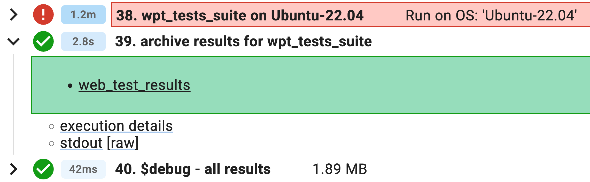

# Using wptrunner in Chromium (experimental)

[`wptrunner`](https://github.com/web-platform-tests/wpt/tree/master/tools/wptrunner)
is the harness shipped with the [web platform tests](web_platform_tests.md)
project for running the test suite. This user guide documents *experimental*
support in Chromium for `wptrunner` as a replacement for
[`run_web_tests.py`](web_platform_tests.md#Running-tests) for running WPTs.

For general information on web platform tests, see
[web-platform-tests.org](https://web-platform-tests.org/test-suite-design.html).

[TOC]

## Differences from run_web_tests.py

The main differences between `run_web_tests.py` and `wptrunner` are that:

1. `wptrunner` can communicate with a browser using the standard [WebDriver]
   protocol, whereas `run_web_tests.py` relies on `content_shell`'s [protocol
   mode] and [internal APIs].
1. Due to (1), `run_web_tests.py` can only test the stripped-down
   `content_shell`, but `wptrunner` can also test the full Chrome binary through
   `chromedriver`.
1. `wptrunner` should automatically support new upstream WPT features (e.g.,
   new `testdriver.js` APIs).

[WebDriver]: https://www.w3.org/TR/webdriver/
[protocol mode]: /content/web_test/browser/test_info_extractor.h
[internal APIs]: writing_web_tests.md#Relying-on-Blink_Specific-Testing-APIs

## Running Tests Locally

First, build the [ninja target][1] for the product you wish to test:

``` sh
autoninja -C out/Release chrome_wpt_tests
autoninja -C out/Release content_shell_wpt
autoninja -C out/Release system_webview_wpt   # `android_webview`
autoninja -C out/Release chrome_public_wpt    # `chrome_android` (Clank)
```

Then, from `//third_party/blink/tools/`, run the `wptrunner` wrapper script
[`run_wpt_tests.py`][0] with one of the following commands:

``` sh
run_wpt_tests.py [options] [test list]   # *nix
run_wpt_tests.bat [options] [test list]  # Windows
```

Like for `run_web_tests.py`:

* The test list may contain directories, files, or URLs (e.g.,
  `path/to/test.html?variant`).
* Providing a directory or file runs all contained tests.
* Prefixing a path with `virtual/<suite>/` runs that path's tests as virtual tests.
* Omitting the test list will run all tests and virtual suites, including
  [`wpt_internal/`][8]

Useful options:

* `-t <target>`: Select which `//out/` subdirectory to use. Defaults to `Release`.
* `-p <product>`: Select which browser (or browser component) to test.
  Defaults to `content_shell`.
* `-v`: Increase verbosity (may provide multiple times). `-v` will dump browser
  logs.
* `--help`: Show detailed usage and all available options.

## Builders

A set of FYI builders continuously run all WPTs (including `wpt_internal/`)
on different platforms:

* [`linux-wpt-content-shell-fyi-rel`](https://ci.chromium.org/p/chromium/builders/ci/linux-wpt-content-shell-fyi-rel)
  (also includes flag-specific suites run by `linux-rel`)
* [`win10-wpt-content-shell-fyi-rel`](https://ci.chromium.org/p/chromium/builders/ci/win10-wpt-content-shell-fyi-rel)
* [`win11-wpt-content-shell-fyi-rel`](https://ci.chromium.org/p/chromium/builders/ci/win11-wpt-content-shell-fyi-rel)
* [`mac10.15-wpt-content-shell-fyi-rel`](https://ci.chromium.org/p/chromium/builders/ci/mac10.15-wpt-content-shell-fyi-rel)
* [`mac11-wpt-content-shell-fyi-rel`](https://ci.chromium.org/p/chromium/builders/ci/mac11-wpt-content-shell-fyi-rel)
* [`mac12-wpt-content-shell-fyi-rel`](https://ci.chromium.org/p/chromium/builders/ci/mac12-wpt-content-shell-fyi-rel)
* [`mac13-wpt-content-shell-fyi-rel`](https://ci.chromium.org/p/chromium/builders/ci/mac13-wpt-content-shell-fyi-rel)
* [`mac11-arm64-wpt-content-shell-fyi-rel`](https://ci.chromium.org/p/chromium/builders/ci/mac11-arm64-wpt-content-shell-fyi-rel)
* [`mac12-arm64-wpt-content-shell-fyi-rel`](https://ci.chromium.org/p/chromium/builders/ci/mac12-arm64-wpt-content-shell-fyi-rel)
* [`mac13-arm64-wpt-content-shell-fyi-rel`](https://ci.chromium.org/p/chromium/builders/ci/mac13-arm64-wpt-content-shell-fyi-rel)
* [`linux-wpt-fyi-rel`](https://ci.chromium.org/p/chromium/builders/ci/linux-wpt-fyi-rel)
  (runs against Chrome; all others run against content shell)

Each builder has an opt-in try mirror with the same name.
To run one of these builders against a CL, click "Choose Tryjobs" in Gerrit,
then search for the builder name.
Alternatively, add a [CL description footer] of the form:

```
Cq-Include-Trybots: luci.chromium.try:<builder name>
```

to opt into select builders when submitting to CQ.

[CL description footer]: ../contributing.md#cl-footer-reference

## Test Results

Results from the most recent run are placed under
`//out/<target>/layout-test-results/`. The next test run will rename this
directory with a timestamp appended to preserve the results.

To view the test results locally, open `layout-test-results/results.html` in a
browser. This [`results.html`][9] is the same [results viewer] that
`run_web_tests.py` supports. On [builders](#Builders), `results.html` can be
accessed from the "archive results for ..." &rightarrow; `web_test_results`
link as an alternative to the built-in test results UI:

|||---|||
###### `results.html` build page link



###### `results.html`


|||---|||

The artifacts that `results.html` serves are stored under `layout-test-results/`
with the same directory structure as their tests.
`run_wpt_tests.py` produces similar kinds of artifacts as `run_web_tests.py`
does:

* `*-{expected,actual,diff}.txt, *-pretty-diff.html`: (Sub)test results in the
  text-based [WPT metadata](#Expectations) format and their diffs.
* `*-{expected,actual,diff}.png` (reftest only): Screenshots of the reference
  and test pages, and the diff produced by [`image_diff`](/tools/imagediff).
* `*-crash-log.txt`: Contains all logs from driver processes (e.g.,
  `chromedriver`, `logcat`). For `content_shell`, this also includes the
  protocol mode stdout.
* `*-stderr.txt`: (Sub)test results in unstructured form.

[results viewer]: web_tests_addressing_flake.md#Understanding-builder-results

## Testing Different Configurations

`run_wpt_tests.py` consumes the same [`VirtualTestSuites`][2],
[`FlagSpecificConfig`][3], and [`SmokeTests/*.txt`][4] files that
`run_web_tests.py` does. Other than the omission of non-WPT tests from test
lists, `run_wpt_tests.py` honors the format and behavior of these files exactly
as described for [web tests](web_tests.md#testing-runtime-flags).

`run_wpt_tests.py` also accepts the `--flag-specific` option to add a
flag-specific configuration's arguments to the binary invocation.

## Expectations

`wptrunner` uses [WPT metadata files] to specify which tests should run and what
results to expect.
Each metadata file is checked in with an `.ini` extension appended to its
corresponding test file's path:

```
external/wpt/folder/my-test.html
external/wpt/folder/my-test-expected.txt  <-- run_web_tests.py baseline
external/wpt/folder/my-test.html.ini      <-- wptrunner metadata
```

A metadata file is roughly equivalent to a [`run_web_tests.py`
baseline](writing_web_tests.md#Text-Test-Baselines) and the
test's lines in [web test expectation files].
As the extension implies, metadata follow an INI-like structured text format:

[WPT metadata files]: https://web-platform-tests.org/tools/wptrunner/docs/expectation.html
[web test expectation files]: web_test_expectations.md#Kinds-of-expectations-files

|||---|||
###### `TestExpectations`

```
# Flakily slow
crbug.com/3 external/wpt/a/reftest.html [ Pass Timeout ]
```

(This `TestExpectations` line is equivalent to the metadata file on the right.)

###### `external/wpt/a/reftest.html.ini`

```
[reftest.html]
  bug: crbug.com/3
  # Flakily slow
  expected: [PASS, TIMEOUT]
```
|||---|||

* The brackets `[...]` start a (sub)test section whose contents follow in an
  indented block.
* The section heading should contain either the subtest name or the test URL
  without the dirname (i.e., should contain basename and query parameters, if
  any).
* A section may contain `<key>: <value>` pairs. Important keys that `wptrunner`
  understands:
    * `expected`: A
      [status](https://firefox-source-docs.mozilla.org/mozbase/mozlog.html#data-format)
      (or list of possible statuses) to expect.
        * Common test statuses include `TIMEOUT`, `CRASH`, and either `OK/ERROR`
          for testharness tests to represent the overall harness status, or
          `PASS/FAIL` for non-testharness tests that only have a single result
          (e.g., reftests).
        * Common subtest statuses include `PASS`, `FAIL`, `TIMEOUT`, or
          `NOTRUN`.
        * For convenience, `wptrunner` expects `OK` or `PASS` when `expected` is
          omitted.
          Deleting the entire metadata file implies an all-`PASS` test.
    * `disabled`: Any nonempty value will skip the test or ignore the subtest
      result. By convention, `disabled` should contain the reason the (sub)test
      is disabled, with the literal `neverfix` for [`NeverFixTests`][5].
* `#` starts a comment that extends to the end of the line.

*** note
**Note**: For testharness tests, the harness statuses `OK/ERROR` are orthogonal
to `PASS/FAIL` and have different semantics:

* `OK` only means all subtests ran to completion normally; it does *not* imply
  that every subtest `PASS`ed. A test may `FAIL` subtests while still reporting
  the harness is `OK`.
* `ERROR` indicates some problem with the harness, such as a WebDriver remote
  end disconnection.
* `PASS/FAIL` represent passing or failing assertions against the browser under
  test.
***

`testharness.js` subtest expectations are represented by a section nested under
the relevant test:

|||---|||
###### `external/wpt/test-expected.txt`

```
This is a testharness.js-based test.
PASS passing subtest
FAIL failing subtest whose name needs an escape []
Harness: the test ran to completion.
```

###### `external/wpt/test.html.ini`

```
[test.html]
  [failing subtest whose name needs an escape [\]]
    expected: FAIL
```
|||---|||

### Conditional Values

`run_web_tests.py` reads platform- or flag-specific results from [platform
tags] in `TestExpectations`, [`FlagExpectations/*`][10], and [baseline
fallback](web_test_baseline_fallback.md).
WPT metadata uses a Python-like [conditional syntax] instead to store all
expectations in one file:

|||---|||
###### `TestExpectations`

```
[ Win Debug ] test.html [ Crash ]  # DCHECK triggered
[ Mac11-arm64 ] test.html [ Pass Timeout ]
```

###### `external/wpt/test.html.ini`

```
[test.html]
  expected:
    if os == "win" and debug: CRASH  # DCHECK triggered
    if port == "mac11-arm64": [PASS, TIMEOUT]
    # Resolves to this default value when no conditions
    # match. An `OK/PASS` here can be omitted because
    # it's implied by an absent value.
    PASS
```
|||---|||

`wptrunner` resolves a conditional value to the right-hand side of the first
branch whose expression evaluates to a truthy value.
Conditions can contain arbitrary Python-like boolean expressions that will be
evaluated against **properties**, variables detected from the [test
environment].
Properties available in Chromium are shown below:

| Property | Type | Description | Choices |
| - | - | - | - |
| `os` | `str` | OS family | `linux`, `mac`, `win`, `android`, `ios` |
| `port` | `str` | Port name (includes OS version and architecture) | See [`Port.ALL_SYSTEMS`][12] (e.g., `mac12-arm64`) |
| `product` | `str` | Browser or browser component | `chrome`, `content_shell`, `chrome_android`, `android_webview`, `chrome_ios` |
| `flag_specific` | `str` | Flag-specific suite name | See [`FlagSpecificConfig`][3] (the empty string `""` represents the generic suite) |
| `virtual_suite` | `str` | Virtual test suite name | See [`VirtualTestSuites`][2] (the empty string `""` represents the generic suite) |
| `debug` | `bool` | `is_debug` build? | N/A |

[platform tags]: /third_party/blink/web_tests/TestExpectations#1
[test environment]: https://firefox-source-docs.mozilla.org/build/buildsystem/mozinfo.html
[conditional syntax]: https://web-platform-tests.org/tools/wptrunner/docs/expectation.html#conditional-values

### Parameterized Tests

In WPT, [multiglobal `.any.js` tests][11] and [test variants] are forms of
parameterization where a test file may generate more than one test ID.
The metadata for these parameterizations live in the same `.ini` file, but under
different top-level sections.
For example, a test `external/wpt/a/b.any.js` that generates `.any.html` and
`.any.worker.html` scopes with variants `?c` and `?d` can express its expectations as:

|||---|||
###### `TestExpectations`

```
a/b.any.html?c [ Crash ]
a/b.any.html?d [ Crash ]
a/b.any.worker.html?c [ Timeout ]
a/b.any.worker.html?d [ Timeout ]
```

###### `external/wpt/a/b.any.js.ini`

```
[b.any.html?c]
  expected: CRASH
[b.any.html?d]
  expected: CRASH
[b.any.worker.html?c]
  expected: TIMEOUT
[b.any.worker.html?d]
  expected: TIMEOUT
```
|||---|||

[test variants]: https://web-platform-tests.org/writing-tests/testharness.html#variants

### Directory-Wide Expectations

To set expectations or disable tests under a directory without editing an `.ini`
file for every contained test, create a special `__dir__.ini` file under the
desired directory with top-level keys, which work identically to those for
per-test metadata:

|||---|||
###### `FlagExpectations/highdpi`

```
# Redundant coverage
external/wpt/a/* [ Skip ]
```

###### `external/wpt/a/__dir__.ini`

```
disabled:
  if flag_specific == "highdpi": redundant coverage
```
|||---|||

Metadata closer to affected test files take greater precedence.
For example, expectations set by `a/b/c.html.ini` override those of
`a/b/__dir__.ini`, which overrides `a/__dir__.ini` in turn.
The special value `disabled: @False` can selectively reenable tests or
directories disabled by an ancestor `__dir__.ini`.

### Updating Expectations

There are several ways to update metadata files:

1. Manually editing `.ini` files, which works best for simple edits:
    * Marking a timed out test.
    * Deleting `[subtest]` and `expected: FAIL` lines for a few subtests that
      pass after a change.
      (Absent subtests are implied to `PASS`.)
    * Deleting `.ini` files for tests that become all-pass.
2. Use `run_wpt_tests.py --reset-results`, which works best for
   platform-agnostic results.
3. Use the [`blink_tool.py update-metadata`][6] tool, which can trigger [try
   builds](#Builders) and update expectations from the results (similar to
   [`rebaseline-cl`][7]). This is slow but works best for platform-specific or
   complex expectation updates.

Using `update-metadata` is very similar to [rebaselining]:

```sh
# Create a CL, if one has not been created already.
git cl upload

# Trigger try builds against the current patchset.
./blink_tool.py update-metadata

# After the try builds complete, collect the results and update expectations
# for `external/wpt/css/CSS2/` (sub)tests that only failed unexpectedly. Any
# test section updated will be annotated with `bug: crbug.com/123`.
./blink_tool.py update-metadata --bug=123 css/CSS2/

# Commit and upload the staged `.ini` files.
git commit -m "Update WPT expectations" && git cl upload
```

`update-metadata` can also suppress failures occurring on trunk:

```sh
# Suppress tests that caused any `linux-wpt-fyi-rel` CI builds 3000-3005
# (inclusive) to fail.
./blink_tool.py update-metadata --build=ci/linux-wpt-fyi-rel:3000-3005
```

The [WPT autoroller](web_platform_tests.md#Automatic-import-process) uses
`update-metadata` to automatically suppress imported tests that exhibit new
failures.

[rebaselining]: web_test_expectations.md#Rebaselining-using-try-jobs

## Debugging Support

### Headful Mode

Passing the `--no-headless` flag to `run_wpt_tests.py` will pause execution
after running each test headfully.
You can interact with the paused test page afterwards, including with DevTools:


Closing the tab or window will unpause `wptrunner` and run the next test.

### Text-Based Debuggers

You can pass a wrapper command like `rr record` to `run_wpt_tests.py
--wrapper="cmd arg1 ..."`.
Note that the wrapper command must forward stdio from `content_shell` running in
[protocol mode], so `--wrapper` won't work with interactive debuggers.

To interactively debug WPTs, prefix the `run_wpt_tests.py` command with
[`debug_renderer`][13] to attach a debugger to a desired renderer.

For other use cases, see [these debugging tips].

[these debugging tips]: /docs/linux/debugging.md

## Known Issues

Please [file bugs and feature requests](https://crbug.com/new) against
[`Blink>Infra` with the `wptrunner`
label](https://bugs.chromium.org/p/chromium/issues/list?q=component%3ABlink%3EInfra%20label%3Awptrunner&can=2).

[0]: /third_party/blink/tools/run_wpt_tests.py
[1]: https://source.chromium.org/search?q=run_wpt_tests.py%20lang:gn
[2]: /third_party/blink/web_tests/VirtualTestSuites
[3]: /third_party/blink/web_tests/FlagSpecificConfig
[4]: /third_party/blink/web_tests/SmokeTests
[5]: /third_party/blink/web_tests/NeverFixTests
[6]: /third_party/blink/tools/blinkpy/tool/commands/update_metadata.py
[7]: /third_party/blink/tools/blinkpy/tool/commands/rebaseline_cl.py
[8]: /third_party/blink/web_tests/wpt_internal
[9]: /third_party/blink/tools/blinkpy/web_tests/results.html
[10]: /third_party/blink/web_tests/FlagExpectations
[11]: https://web-platform-tests.org/writing-tests/testharness.html#tests-for-other-or-multiple-globals-any-js
[12]: https://source.chromium.org/chromium/chromium/src/+/main:third_party/blink/tools/blinkpy/web_tests/port/base.py;l=152-163;drc=b35e75299a6fda0eb51e9ba3139cce216f7f8db0;bpv=0;bpt=0
[13]: /third_party/blink/tools/debug_renderer
