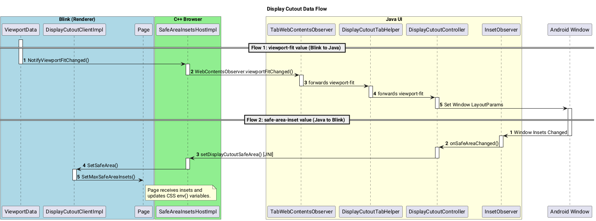

# Display Cutout and Safe Area Insets

This document outlines the architecture and data flow for handling display cutouts (i.e., "notches") and their associated safe area insets in Chromium. This mechanism allows web content to utilize the entire screen on devices with cutouts, using web standards like the `viewport-fit` meta tag and the `env()` CSS function.

Relevant classes:
* //content/browser/display_cutout/
* //components/browser_ui/display_cutout/
* //chrome/android/java/src/org/chromium/chrome/browser/display_cutout/
* //ui/android/java/src/org/chromium/ui/insets/

## Core Concepts

-   **Display Cutout**: A physical area on a display that is not available for rendering, typically housing cameras and sensors.
-   **Safe Area Insets**: The area of the screen that can be obstructed by device cutouts, status bars, or other system UI. The insets are provided as a set of distances from the edges of the viewport (top, left, bottom, right). Content can use this this inset to position themselves to ensure they are not blocked by system UI. [Read more](https://developer.mozilla.org/en-US/docs/Web/CSS/env)
-   **`viewport-fit`**: A CSS descriptor, specified via a `<meta>` tag, that controls how a web page is displayed relative to the safe area. [Read more](https://drafts.csswg.org/css-round-display/#viewport-fit-descriptor)
    -   `auto` (default): The web page is confined to the safe area.
    -   `contain`: The web page is scaled to fit entirely within the safe area.
    -   `cover`: The web page is scaled to fill the entire viewport, including the area "under" the cutout. This is used to create an "edge-to-edge" experience.
        -  For example, when the browser goes into fullscreen mode, pages with `viewport-fit=cover` will draw under the display cutout, while pages with other values will not.


Useful resources:

1. https://developer.android.com/develop/ui/views/layout/display-cutout#:~:text=Enable%20Developer%20options.,Select%20the%20cutout%20type.
2. https://developer.chrome.com/docs/css-ui/edge-to-edge#safe-area-insets


## Architecture Overview

The implementation spans three main layers of the Chromium stack: Blink, C++ browser, Java UI. The entire process involves a round trip of information. The sequence diagrams illustrating this data flow can be found below.



Source see [Data flow source](#data-flow-source).

### Blink (Renderer Process)

Parses the `viewport-fit` meta tag and uses the safe area insets provided by the browser to resolve the `env()` CSS function.

### C++ Browser Layer (`//content/browser/display_cutout`)

Acts as the central hub for display cutout information.
    -  From Blink to Java, it tracks the `viewport-fit` state for each web page and notifies the UI layer to adjust the Android window layout.
    -  From Java to Blink, it funnels the Android window inset data back to the renderer.

### Java UI Layer (`//chrome/android` and `//components/browser_ui`)
Interacts with the Android OS to get cutout information, sets the appropriate window flags to enable drawing under the cutout or into system bars, and provides the safe area inset values to the C++ layer.


## Viewport-fit flow

### Render (Blink)

[1] **[`blink::ViewportData`](https://source.chromium.org/chromium/chromium/src/+/main:third_party/blink/renderer/core/frame/viewport_data.h)**
-   Parses the `<meta name="viewport" content="viewport-fit=...">` tag.
-   Notifies the browser process of the value via the `DisplayCutoutHost` Mojo interface.

### C++

[2] **[`SafeAreaInsetsHostImpl`](https://source.chromium.org/chromium/chromium/src/+/main:content/browser/display_cutout/safe_area_insets_host_impl.h) (`//content/browser/display_cutout`)**

-   It is the Mojo endpoint for `blink::mojom::DisplayCutoutHost`, receiving `NotifyViewportFitChanged` calls from Blink.
-   It uses `DocumentUserData` to correctly associate a `viewport-fit` value with each document.
-   It determines the single "active" frame that should control the cutout settings (the fullscreen frame takes precedence over the primary main frame).
-   When the active frame's viewport-fit value is updated, it calls `WebContentsImpl::NotifyViewportFitChanged()` to notify observers of the change.

### Java UI

[3] **[`TabWebContentsObserver`](https://source.chromium.org/chromium/chromium/src/+/main:chrome/android/java/src/org/chromium/chrome/browser/tab/TabWebContentsObserver.java)**
-   Receives the signal from `WebContentObserver.viewportFitChanged()` and forwards the info to `DisplayCutoutTabHelper`.

[4] **[`DisplayCutoutTabHelper`](https://source.chromium.org/chromium/chromium/src/+/main:chrome/android/java/src/org/chromium/chrome/browser/display_cutout/DisplayCutoutTabHelper.java) (`//chrome/android/java/src/org/chromium/chrome/browser/display_cutout`)**
-   It is a `UserData` scoped to a `Tab`, and creates and owns the `DisplayCutoutController`.
-   Acts as glue code by implementing the `DisplayCutoutController.Delegate` to provide the controller with access to tab-specific objects like `WebContents` and `WindowAndroid`.
-   The viewport-fit data is forwarded to the `DisplayCutoutController`.

[5] **[`DisplayCutoutController`](https://source.chromium.org/chromium/chromium/src/+/main:components/browser_ui/display_cutout/android/java/src/org/chromium/components/browser_ui/display_cutout/DisplayCutoutController.java) (`//components/browser_ui/display_cutout`)**
    -   Calculates the appropriate `LayoutParams.layoutInDisplayCutoutMode` window flag based on the page's `viewport-fit` value and other states (e.g., fullscreen).
        -   `viewport-fit=cover` → `LAYOUT_IN_DISPLAY_CUTOUT_MODE_SHORT_EDGES`
        -   `viewport-fit=contain` → `LAYOUT_IN_DISPLAY_CUTOUT_MODE_NEVER`
    -   Applies this flag to the Activity window, telling Android to let the app draw behind the display cutout.

## Safe area inset flow

### Java UI

[1] **[`InsetObserver`](https://source.chromium.org/chromium/chromium/src/+/main:ui/android/java/src/org/chromium/ui/insets/InsetObserver.java) (`//ui/android/java/src/org/chromium/ui/insets/`)**
-   Observe the Android window insets and coordinate the inset consumption.
-   Translate the display cutout from window insets into safe area insets values based on whether the Activity is drawing edge to edge.
-   The safe-area-inset is dispatched from `WindowInsetObserver.onSafeAreaChanged()`

[2] **[`DisplayCutoutController`](https://source.chromium.org/chromium/chromium/src/+/main:components/browser_ui/display_cutout/android/java/src/org/chromium/components/browser_ui/display_cutout/DisplayCutoutController.java) (`//components/browser_ui/display_cutout`)**
-   Implements `WindowInsetObserver.onSafeAreaChanged()` to receive safe area updates calculated based on the Android Window Insets.
-   When it receives new insets from the `InsetObserver`, it scales the pixels into dips and pushes them to the C++ layer via a JNI call (`WebContents.setDisplayCutoutSafeArea()`).

### C++ Browser Layer (`//content/browser/display_cutout`)

[3] **[`SafeAreaInsetsHostImpl`](https://source.chromium.org/chromium/chromium/src/+/main:content/browser/display_cutout/safe_area_insets_host_impl.h)**:
-   When `SetDisplayCutoutSafeArea()` is called from the Java layer, it sends the inset values to the active frame in Blink via the `blink::mojom::DisplayCutoutClient` interface.
-   This class is also responsible for picking the correct "Active" frame that receives the `safe-area-inset-*`. At all times, only one frame will receive the safe-area-inset.
    - If the browser is not in fullscreen mode, the main frame of the current page will be seen as "active" frame.
    - If the browser is in fullscreen mode, the frame that requested fullscreen will be seen as "active" frame. This is even the case when a subframe requested fullscreen mode.
    - When active frame switches, the `safe-area-inset-*` values in the previous active frame will be reset to 0.


### Blink (Renderer)

[4] **[`blink::DisplayCutoutClientImpl`](https://source.chromium.org/chromium/chromium/src/+/main:third_party/blink/renderer/core/frame/display_cutout_client_impl.h) (`//third_party/blink/renderer/core/frame`)**
-  Receives safe area insets as `gfx::Insets` from the browser process via the `DisplayCutoutClient` interface.
-  It passes the `gfx::Insets` to the current `blink::Page::SetMaxSafeAreaInsets`.

[5] **[`blink::Page`](https://source.chromium.org/chromium/chromium/src/+/main:third_party/blink/renderer/core/page/page.h) (`//third_party/blink/renderer/core/page/`)**
-  The Page receives the `gfx::Insets` and stores them as `scaled_max_safe_area_insets_`.
-  If the `DynamicSafeAreaInsetsEnabled` setting is active, the final applied safe area can be adjusted dynamically. The function `UpdateSafeAreaInsetWithBrowserControls` calculates the effective bottom inset by considering the height and visibility of the browser's bottom controls (like a navigation bar). As the browser controls slide into view, the bottom safe area inset is reduced, and as they slide out, the inset is increased.
-  Once the final safe area insets are calculated, the `SetSafeAreaEnvVariables` function is called to update the CSS `env()` variables. This updates `safe-area-inset-*` and `safe-area-max-inset-*`.
    -  See [Dynamic safe area inset](#dynamic-safe-area-inset) for more details.


## End-to-End Example: `viewport-fit: cover`

1.  A web page loads with `<meta name="viewport" content="viewport-fit=cover">`.
2.  **Blink** parses the tag and sends `cover` to the browser process via a `DisplayCutoutHost` Mojo call.
3.  **`SafeAreaInsetsHostImpl` (C++)** receives the value. It stores `viewport-fit=cover` for the document and notifies `WebContentsImpl` of the change.
4.  `WebContentsImpl` propagates this notification to its Java observers.
5.  **`DisplayCutoutTabHelper` (Java)** receives the `cover` value and passes it to the `DisplayCutoutController`.
6.  **`DisplayCutoutController` (Java)**, seeing `cover` and assuming the tab is fullscreen, sets the Activity window's `layoutInDisplayCutoutMode` to `LAYOUT_IN_DISPLAY_CUTOUT_MODE_SHORT_EDGES`.
7.  The **Android OS** responds to the window flag change by sending new safe area insets (e.g., a 48px top inset) to the app's `InsetObserver`.
8.  `DisplayCutoutController`'s `onSafeAreaChanged` method is triggered. It calls `WebContents.setDisplayCutoutSafeArea()` with the new insets.
9.  This JNI call reaches **`SafeAreaInsetsHostImpl` (C++)**, which forwards the insets to the active `RenderFrameHost` in Blink.
10. **Blink** receives the insets. Any CSS on the page, such as `padding-top: env(safe-area-inset-top);`, is now correctly resolved, and the `env()` function returns `48px`. The page can now adjust its layout to avoid the display cutout.


## Dynamic Safe Area Inset ([Chrome status](https://chromestatus.com/feature/5174306712322048))

In certain scenarios, such as when Chrome renders [edge-to-edge](https://developer.chrome.com/blog/edge-to-edge) content outside of fullscreen mode, the safe area insets must be adjusted dynamically. This is necessary to account for the presence of browser controls (e.g., the top and bottom toolbars), which can overlay the web content.

As a user scrolls the page, the browser controls retract to offer a more immersive experience. This retraction changes the size of the viewport and, crucially, the safe area available to the web content. The `safe-area-inset-*` CSS environment variables are updated dynamically to reflect these changes.

For example, as the bottom browser toolbar slides into view, the `safe-area-inset-bottom` value decreases, ensuring that web content repositions itself to remain accessible. Conversely, as the toolbar slides out of view, the inset increases.

To provide web developers with a stable value for layout calculations, `safe-area-max-inset-*` has been introduced. This variable represents the maximum possible inset value, which is the state when the browser controls are fully retracted. This allows developers to design layouts against a consistent and predictable safe area boundary.

### References

*   For `safe-area-max-inset-*`, see the [CSSWG discussion](https://github.com/w3c/csswg-drafts/issues/11019) for more details.
*   For more on browser controls, see [`//docs/ui/android/browser_controls.md`](https://source.chromium.org/chromium/chromium/src/+/main:docs/ui/android/browser_controls.md).

## Appendix

### Data flow source

```
@startuml
title Display Cutout Data Flow

box "Blink (Renderer)" #LightBlue
    participant "ViewportData" as ViewportData
    participant "DisplayCutoutClientImpl" as CutoutClient
    participant "Page" as Page
end box

box "C++ Browser" #LightGreen
    participant "SafeAreaInsetsHostImpl" as InsetsHost
end box

box "Java UI" #LightYellow
    participant "TabWebContentsObserver" as TabObserver
    participant "DisplayCutoutTabHelper" as TabHelper
    participant "DisplayCutoutController" as CutoutController
    participant "InsetObserver" as InsetObserver
end box

participant "Android Window" as AndroidOS

== Flow 1: viewport-fit value (Blink to Java) ==

autonumber "<b>[1]"
activate ViewportData
ViewportData -> InsetsHost: NotifyViewportFitChanged()
deactivate ViewportData

activate InsetsHost
InsetsHost -> TabObserver: WebContentsObserver.viewportFitChanged()
deactivate InsetsHost

activate TabObserver
TabObserver -> TabHelper: forwards viewport-fit
deactivate TabObserver

activate TabHelper
TabHelper -> CutoutController: forwards viewport-fit
deactivate TabHelper

activate CutoutController
CutoutController -> AndroidOS: Set Window LayoutParams
deactivate CutoutController


== Flow 2: safe-area-inset value (Java to Blink) ==

autonumber "<b>[2]"
activate AndroidOS
AndroidOS -> InsetObserver: Window Insets Changed
deactivate AndroidOS

activate InsetObserver
InsetObserver -> CutoutController: onSafeAreaChanged()
deactivate InsetObserver

activate CutoutController
CutoutController -> InsetsHost: setDisplayCutoutSafeArea() [JNI]
deactivate CutoutController

activate InsetsHost
InsetsHost -> CutoutClient: SetSafeArea()
deactivate InsetsHost

activate CutoutClient
CutoutClient -> Page: SetMaxSafeAreaInsets()
note right of Page
  Page receives insets and
  updates CSS env() variables.
end note
deactivate CutoutClient

@enduml
```
