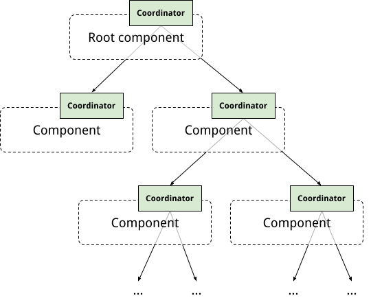
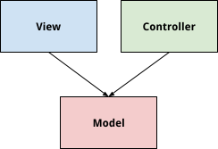
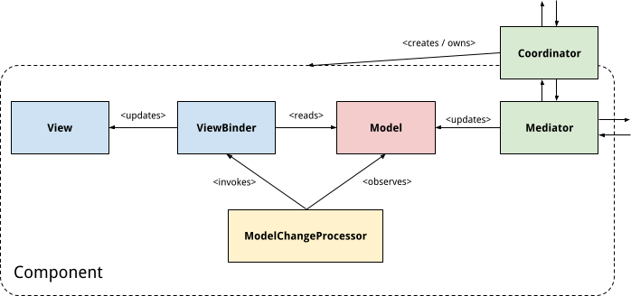

# Chrome Android MVC UI Architecture

### Goals and principles
1. **Use paradigms, not frameworks.** While there will be some amount of newly written general-purpose code, the intention is to introduce a standardized way of building UI in Chrome Android, not to introduce a framework (existing or newly-built).
2. **Fit in naturally with existing patterns.** In particular, [RecyclerView](https://developer.android.com/guide/topics/ui/layout/recyclerview.html) decouples views from the model, but also decouples the lifetime of objects by instantiating only a subset of views and reusing them.
3. **Separate and decouple view code from business logic (controllers).** Views and controllers are separated and only interact through the model. This allows testing view code on its own (without instantiating controllers or loading the native library), and allows testing business logic without spinning up the UI (which then makes it possible to run these tests on the host using [Robolectric](https://cs.chromium.org/chromium/src/base/test/android/junit/src/org/chromium/base/test/BaseRobolectricTestRunner.java)). In particular, view code would not be allowed to make any direct JNI calls.
4. **Decouple and encapsulate UI features.** The implementation of one UI feature should not depend on the implementation of other UI features. Instead, features should be defined by components that communicate with each other using defined APIs.

#### Long Term Goals
One of the long-term goals is to align and use controllers (mediators) across platforms. UI platform teams could focus on writing the UI, and it would be up to the respective feature team to ensure the controllers are listening to the right signals from the other parts of Chrome. As mediators don’t have any UI dependencies, they could be implemented in platform-independent (native) code, with a Java bridge on Android.

### Design

#### Components
The UI is structured into a hierarchy of components that are encapsulated: components only interact with other components and have dedicated objects that act as the point of contact (coordinators). Code inside of a component only interacts with other code inside of that component, or with its coordinator to reach outside of the component.

The code inside of a component is split into three parts: (UI) model, view, and controller. The view and controller are decoupled from each other and only interact through the model. The model does not depend on either, so the layering looks as follows:

(In the more detailed design, the controller is split up into the coordinator and the mediator, and the coordinator owns the rest of the component, but otherwise doesn’t directly interact with them.)
Separation between model, view, and controller should be enforced where possible (options are DEPS files, Java visibility, and/or separate build targets).

Additional tutorials can be found:
* [Simple MVC component](mvc_architecture_tutorial.md)
* [List backed MVC component](mvc_simple_list_tutorial.md)
* [RecyclerView backed MVC component](mvc_simple_recycler_view_tutorial.md)

#### Model

“Model” in this context refers to a UI model, which fully describes the state of the UI in a given component. They are independent from models in the native side (“backend”), but a UI model can potentially reflect the state of a native model and vice versa – it’s the job of the Mediator (see below) to ensure that if desired. Models are non-hierarchical and independent of each other; any hierarchy is only in the views or in the coordinators.

For a single component, [PropertyModel](https://source.chromium.org/chromium/chromium/src/+/main:ui/android/java/src/org/chromium/ui/modelutil/PropertyModel.java) provides a generic key/value model solution. For lists of objects, [PropertyListModel](https://source.chromium.org/chromium/chromium/src/+/main:ui/android/java/src/org/chromium/ui/modelutil/PropertyListModel.java) and associated helpers provide the ability to update lists of objects, which themselves can be updated via a PropertyModel.

#### Coordinator

The coordinator owns the component overall, i.e. it creates the other objects in the component, connects them, and destroys them according to the lifecycle of the Activity it lives in (through its parent coordinator). It decouples the implementation of the component from other components and acts as the point of contact between them. Any code in one component that needs to interact with another component does that through the respective coordinators.

#### Mediator

The mediator is responsible for the interaction with the coordinator and with the Chrome backend (including the native code). It reacts to changes in the backend (e.g. the canonical model for bookmarks or content suggestions, which lives in the native code) or other components and updates the model based on that, or receives events from th;e view and notifies the backend.

#### ModelChangeProcessor

The ModelChangeProcessor observes model changes and acts on them differently depending on the type of UI that is being used: for a RecyclerView, it notifies the adapter about the change and later gets called back to bind the model (using a ViewBinder). For other UI, it decides on its own when to bind the view to the model. In that case, it accumulates changes before binding, but it can either schedule a task to flush the accumulated changes on the next iteration of the message loop, or it can offer a method to force a flush right now. This allows both “fire and forget”-style updates that will happen asynchronously, or immediate updates (e.g. for security-sensitive UI). Because model change processors don’t have any domain-specific logic, they are feature-independent classes that will not need to be implemented as part of feature development.

#### ViewBinder

The view binder is stateless – it is called to bind a given model to a given view and can therefore operate on any instance of that particular model and view type. View binding code translates from the model domain into the view domain and should contain as little business logic as possible. For example, a boolean property “shown” on the model could be translated to setting the visibility on the View to VISIBLE or GONE. At some point in the future this could allow automatically generating it (e.g. from annotations on the view layout files).

#### View events

Events from the view arrive back at the mediator via callbacks defined by the model: The model can expose a property that is a callback, which the mediator provides, and the ViewBinder will connect that callback to the corresponding event on the view. The ViewBinder can also establish a two-way binding between the view and the model (i.e. make view events affect the model), so the mediator can observe the model.

### Testing

The separation between model, view, and controller allows testing different layers of the code individually: view tests can test the UI for a given state of the model, and controller tests can test the controller logic without spinning up the UI. Neither of these tests need to load the native library, and controller tests can even run on the host using Robolectric, as they don’t depend on view code either.

Read [So, you want to test MVC...](mvc_testing.md) for more detailed testing guidance.