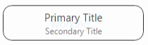

## Layer Animation Builder


### Purpose

Integrating animation and kinetic UI movements can be difficult to set up. Where to start and what to override (if anything) isn’t very clear. Making animations more declarative in nature rather than manually gluing all the lower-level animation subsystems together will simplify their use.

This system provides a programmatic model that is similar to how the UX team creates animations. This ensures more fidelity between the intent of the UX designer and the resulting code. The visual similarities between the presentation used by the UX and the actual code constructing those sequences will make maintenance and updates easier and quicker.


### Example

In order to better demonstrate how this system makes constructing animations easier an example should make this more clear.

The following code will create a repeating cross-fading animation shown below.

    

You can see this animation by running `views_examples` on Windows or Linux:

``` shell
$ autoninja -C out\Default views_examples
$ out\Default\views_examples --enable-examples="Fade Animation"
```

Traditionally this would be how the above animation would be created.


``` cpp
  auto primary_sequence = std::make_unique<ui::LayerAnimationSequence>();
  auto secondary_sequence = std::make_unique<ui::LayerAnimationSequence>();
  primary_sequence->set_is_repeating(true);
  secondary_sequence->set_is_repeating(true);

  primary_sequence->AddElement(ui::LayerAnimationElement::CreatePauseElement(
      ui::LayerAnimationElement::OPACITY, base::Seconds(2)));
  primary_sequence->AddElement(ui::LayerAnimationElement::CreateOpacityElement(
      0.0f, base::Seconds(1)));
  primary_sequence->AddElement(ui::LayerAnimationElement::CreatePauseElement(
      ui::LayerAnimationElement::OPACITY, base::Seconds(2)));
  primary_sequence->AddElement(ui::LayerAnimationElement::CreateOpacityElement(
      1.0f, base::Seconds(1)));

  secondary_sequence->AddElement(ui::LayerAnimationElement::CreatePauseElement(
      ui::LayerAnimationElement::OPACITY, base::Seconds(2)));
  secondary_sequence->AddElement(
      ui::LayerAnimationElement::CreateOpacityElement(
          1.0f, base::Seconds(1)));
  secondary_sequence->AddElement(ui::LayerAnimationElement::CreatePauseElement(
      ui::LayerAnimationElement::OPACITY, base::Seconds(2)));
  secondary_sequence->AddElement(
      ui::LayerAnimationElement::CreateOpacityElement(
          0.0f, base::Seconds(1)));

  primary_view_->layer()->GetAnimator()->StartAnimation(
      primary_sequence.release());
  secondary_view_->layer()->GetAnimator()->StartAnimation(
      secondary_sequence.release());
```


Using the new builder system described in this document, the above code could be done much simpler.


``` cpp
  AnimationBuilder()
      .Repeatedly()
      .Offset(base::Seconds(2))
      .SetDuration(base::Seconds(1))
      .SetOpacity(primary_view_, 0.0f)
      .SetOpacity(secondary_view_, 1.0f)
      .Offset(base::Seconds(2))
      .SetDuration(base::Seconds(1))
      .SetOpacity(primary_view_, 1.0f)
      .SetOpacity(secondary_view_, 0.0f);
```


The AnimationBuilder will handle proper insertion of pause elements into the timeline, so no specific need to insert them. It will also handle coordination of the animations across multiple [LayerOwner](https://source.chromium.org/chromium/chromium/src/+/main:ui/compositor/layer_owner.h;l=19)s or across specific [Layers](https://source.chromium.org/chromium/chromium/src/+/main:ui/compositor/layer.h;drc=af5bb21d9ee6585e4111fbc9089d1f5c7edde034;l=69).

It should be obvious that the above code is both shorter and more immediately clear what the intent of the code is doing along with how the animations interact across the two views.


### API Reference

Currently AnimationBuilder operates only on a LayerOwner or directly on a Layer. Since views::View is also a LayerOwner, it will also operate directly on Views. To animate a View, the View must first paint to it’s layer by calling View::SetPaintToLayer.

The AnimationBuilder is a scoped object that starts the animations after the AnimationBuilder goes out of scope. This can be done as a single statement (as shown above) or across multiple statements with local temps.

NOTE: It is generally _not_ recommended to hold onto an AnimationBuilder instance beyond the current scope or store it in instance variables. This could lead to UAFs or other undesirable behaviors. Simply construct the animation at the point at which it is needed.

To use AnimationBuilder include the following header:


``` cpp
#include "ui/views/animation/animation_builder.h"
```

The AnimationBuilder consists of the main object along with an inner AnimationSequenceBlock.

An AnimationSequenceBlock is a single unit of a larger animation sequence, which has a start time, duration, and zero or more (target, property) animations.
* There may be multiple properties animating on a single target, and/or multiple targets animating, but the same property on the same target may only be animated at most once per block. Animations can be added by calling SetXXX().
* Calling At(), Offset(), or Then() creates a new block. All animations in the same AnimationSequenceBlock will run in parallel. Create multiple AnimationSequenceBlocks to run animations in sequence.

Calls on AnimationBuilder affect the whole animations and calls on AnimationSequenceBlock affect only that particular block.

#### Setting callbacks
When setting callbacks for the animations note that the AnimationBuilder’s observer that calls these callbacks may outlive the callback's parameters.

The OnEnded callback runs when all animations created on the AnimationBuilder have finished. The OnAborted callback runs when any one animation created on the AnimationBuilder has been aborted. Therefore, these callbacks and every object the callback accesses needs to outlive all the Layers/LayerOwners being animated on since the Layers ultimately own the objects that run the animation. Otherwise developers may need to use weak pointers or force animations to be cancelled in the object’s destructor to prevent accessing destroyed objects. Note that aborted notifications can be sent during the destruction process. Therefore subclasses that own the Layers may actually be destroyed before the OnAborted callback is run.

#### API
``` cpp
class VIEWS_EXPORT AnimationBuilder {
 public:
  AnimationBuilder();
  ~AnimationBuilder();

  // Options for the whole animation

  AnimationBuilder& SetPreemptionStrategy(
      ui::LayerAnimator::PreemptionStrategy preemption_strategy);
  // Called when the animation starts.
  AnimationBuilder& OnStarted(base::OnceClosure callback);
  // Called when the animation ends. Not called if animation is aborted.
  AnimationBuilder& OnEnded(base::OnceClosure callback);
  // Called when a sequence repetition ends and will repeat. Not called if
  // sequence is aborted.
  AnimationBuilder& OnWillRepeat(base::RepeatingClosure callback);
  // Called if animation is aborted for any reason. Should never do anything
  // that may cause another animation to be started.
  AnimationBuilder& OnAborted(base::OnceClosure callback);
  // Called when the animation is scheduled.
  AnimationBuilder& OnScheduled(base::OnceClosure callback);

  // Creates a new sequence (that optionally repeats).
  AnimationSequenceBlock Once();
  AnimationSequenceBlock Repeatedly();

  // Returns a handle that can be destroyed later to abort all running
  // animations.
  // Caveat: ALL properties will be aborted, including those not initiated
  // by the builder.
  std::unique_ptr<AnimationAbortHandle> GetAbortHandle();
};


class VIEWS_EXPORT AnimationSequenceBlock {
 public:
  AnimationSequenceBlock(base::PassKey<AnimationBuilder> builder_key,
                         AnimationBuilder* owner,
                         base::TimeDelta start);
  AnimationSequenceBlock(AnimationSequenceBlock&& other);
  AnimationSequenceBlock& operator=(AnimationSequenceBlock&& other);
  ~AnimationSequenceBlock();

  // Sets the duration of this block.  The duration may be set at most once and
  // will be zero if unspecified.
  AnimationSequenceBlock& SetDuration(base::TimeDelta duration);

  // Adds animation elements to this block.  Each (target, property) pair may be
  // added at most once.
  // These property setter methods can also take in a ui::Layer as the target.
  AnimationSequenceBlock& SetBounds(
      ui::LayerOwner* target,
      const gfx::Rect& bounds,
      gfx::Tween::Type tween_type = gfx::Tween::LINEAR);
  AnimationSequenceBlock& SetBrightness(
      ui::LayerOwner* target,
      float brightness,
      gfx::Tween::Type tween_type = gfx::Tween::LINEAR);
  AnimationSequenceBlock& SetClipRect(
      ui::LayerOwner* target,
      const gfx::Rect& clip_rect,
      gfx::Tween::Type tween_type = gfx::Tween::LINEAR);
  AnimationSequenceBlock& SetColor(
      ui::LayerOwner* target,
      SkColor color,
      gfx::Tween::Type tween_type = gfx::Tween::LINEAR);
  AnimationSequenceBlock& SetGrayscale(
      ui::LayerOwner* target,
      float grayscale,
      gfx::Tween::Type tween_type = gfx::Tween::LINEAR);
  AnimationSequenceBlock& SetOpacity(
      ui::LayerOwner* target,
      float opacity,
      gfx::Tween::Type tween_type = gfx::Tween::LINEAR);
  AnimationSequenceBlock& SetTransform(
      ui::LayerOwner* target,
      gfx::Transform transform,
      gfx::Tween::Type tween_type = gfx::Tween::LINEAR);
  AnimationSequenceBlock& SetRoundedCorners(
      ui::LayerOwner* target,
      const gfx::RoundedCornersF& rounded_corners,
      gfx::Tween::Type tween_type = gfx::Tween::LINEAR);
  AnimationSequenceBlock& SetVisibility(
      ui::LayerOwner* target,
      bool visible,
      gfx::Tween::Type tween_type = gfx::Tween::LINEAR);

  // Creates a new block.
  AnimationSequenceBlock At(base::TimeDelta since_sequence_start);
  AnimationSequenceBlock Offset(base::TimeDelta since_last_block_start);
  AnimationSequenceBlock Then();
};
```

