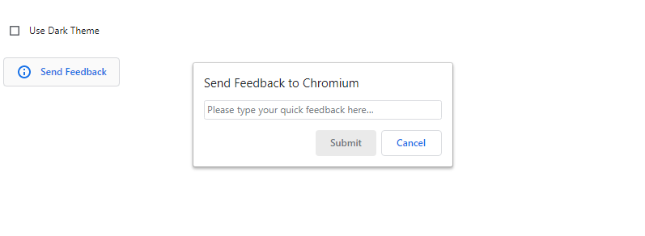
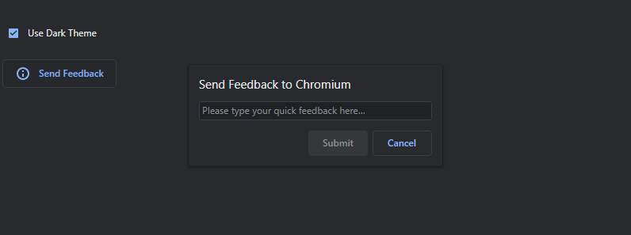

# Example: Theme-Aware UI

[TOC]

## Introduction

A common pitfall in UI development is failing to handle varying themes and
colors. A perfect looking UI may become illegible after a theme change or on a
different background color, which can happen when changing the Chrome or OS
theme.

This example shows you sample UI for a common scenario: click an icon to show
a dialog. A checkbox dynamically switches between light and dark themes to
demonstrate how the UI responds to theme changes. In this example, you can
learn a few common techniques to make UI handle theme changes correctly.

&nbsp;

|                                              |
|                :---:                         |
|      |
| Figure 1. Sample UI in light theme           |

&nbsp;

|                                              |
|                :---:                         |
|        |
| Figure 2. Sample UI in dark theme            |


## Prerequisites

This example assumes you are already familiar with Views toolkit fundamentals,
such as how to lay out UI elements and how to customize them.


## Run the example

The example code is in the file
[`ui/views/examples/colored_dialog_example.cc`](https://source.chromium.org/chromium/chromium/src/+/main:ui/views/examples/colored_dialog_example.cc)
and its corresponding header file. You can run it on Windows or Linux via
the `views_examples` application. Change the path accordingly based on your
platform and building environment:


``` shell
$ autoninja -C out\Default views_examples
$ out\Default\views_examples --enable-examples="Colored Dialog"
```


## Technique 1: use existing Views controls

The example's dialog consists of a title, a text field, and two buttons.
For all these components, you can use Views’ existing controls. The existing
controls were developed to be theme-aware and use correct colors by default.
When used appropriately, they should require no extra effort to handle dynamic
color changes.

The following code snippet shows the creation of all the UI elements in the
dialog. Note how no color-specific code or dynamic theme changing handling
is necessary.


``` cpp
  SetTitle(l10n_util::GetStringUTF16(IDS_COLORED_DIALOG_TITLE));

  SetLayoutManager(std::make_unique<views::FillLayout>());
  set_margins(views::LayoutProvider::Get()->GetDialogInsetsForContentType(
      views::DialogContentType::kControl, views::DialogContentType::kControl));

  textfield_ = AddChildView(std::make_unique<views::Textfield>());
  textfield_->SetPlaceholderText(
      l10n_util::GetStringUTF16(IDS_COLORED_DIALOG_TEXTFIELD_PLACEHOLDER));
  textfield_->GetViewAccessibility().SetName(
      l10n_util::GetStringUTF16(IDS_COLORED_DIALOG_TEXTFIELD_AX_LABEL));
  textfield_->set_controller(this);

  SetButtonLabel(ui::mojom::DialogButton::kOk,
                 l10n_util::GetStringUTF16(IDS_COLORED_DIALOG_SUBMIT_BUTTON));
  SetButtonEnabled(ui::mojom::DialogButton::kOk, false);
```


## Technique 2: override `OnThemeChanged()` in custom controls

The checkbox in the main UI overrides `OnThemeChanged()` to implement
customized behavior (in this case, automatically adjusting its visible state
to externally-triggered theme changes).  This method is called every time the
theme changes, including when a `View` is first shown.


``` cpp
class ThemeTrackingCheckbox : public views::Checkbox {
 public:
  explicit ThemeTrackingCheckbox(const std::u16string& label)
      : Checkbox(label, this) {}
  ThemeTrackingCheckbox(const ThemeTrackingCheckbox&) = delete;
  ThemeTrackingCheckbox& operator=(const ThemeTrackingCheckbox&) = delete;
  ~ThemeTrackingCheckbox() override = default;

  // views::Checkbox:
  void OnThemeChanged() override {
    views::Checkbox::OnThemeChanged();

    // Without this, the checkbox would not update for external (e.g. OS-driven)
    // theme changes.
    SetChecked(GetNativeTheme()->ShouldUseDarkColors());
  }

  void ButtonPressed() {
    GetNativeTheme()->set_use_dark_colors(GetChecked());

    // An OS or Chrome theme change would do this automatically.
    GetWidget()->ThemeChanged();
  }
};
```


When creating controls using custom colors, setting the colors in
`OnThemeChanged()` (instead of in the constructor or in a call from another
object) ensures they will always be read from an up-to-date source and reset
whenever the theme changes. By contrast, setting them in the constructor will
not handle theme changes while the control is visible, and (depending on how
the colors are calculated) may not even work correctly to begin with.


## Technique 3: use theme neutral icons and images

The button in the main UI contains an icon. Using a vector icon (as shown in
the example) makes it easy to re-rasterize to the correct color any time the
theme changes.


``` cpp
AddChildView(std::make_unique<TextVectorImageButton>(
      base::BindRepeating(&ColoredDialogChooser::ButtonPressed,
                          base::Unretained(this)),
      l10n_util::GetStringUTF16(IDS_COLORED_DIALOG_CHOOSER_BUTTON),
      views::kInfoIcon));
```

While it's possible to create theme-aware or theme-neutral UI with bitmap
images as well, it's generally more difficult. Since vector icons typically
also provide better support for different scale factors than bitmaps do,
vector imagery is preferable in most cases.

The following code snippet shows how to make the icon color adapt to the theme
change.

``` cpp
class TextVectorImageButton : public views::MdTextButton {
public:
 TextVectorImageButton(PressedCallback callback,
                       const std::u16string& text,
                       const gfx::VectorIcon& icon)
     : MdTextButton(std::move(callback), text), icon_(icon) {}
 TextVectorImageButton(const TextVectorImageButton&) = delete;
 TextVectorImageButton& operator=(const TextVectorImageButton&) = delete;
 ~TextVectorImageButton() override = default;

 void OnThemeChanged() override {
   views::MdTextButton::OnThemeChanged();

   // Use the text color for the associated vector image.
   SetImage(views::Button::ButtonState::STATE_NORMAL,
            gfx::CreateVectorIcon(icon_, label()->GetEnabledColor()));
 }
```


## Learn more

To experiment with all Views examples and controls, run the examples app
without any argument, which will show a list of all the examples and controls
you can try out:


``` shell
$ out\Default\views_examples
```

For more in-depth recommendations on working with colors in Views, read
[Best Practice: Colors](https://chromium.googlesource.com/chromium/src/+/HEAD/docs/ui/learn/bestpractices/colors.md).

