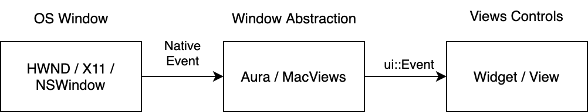
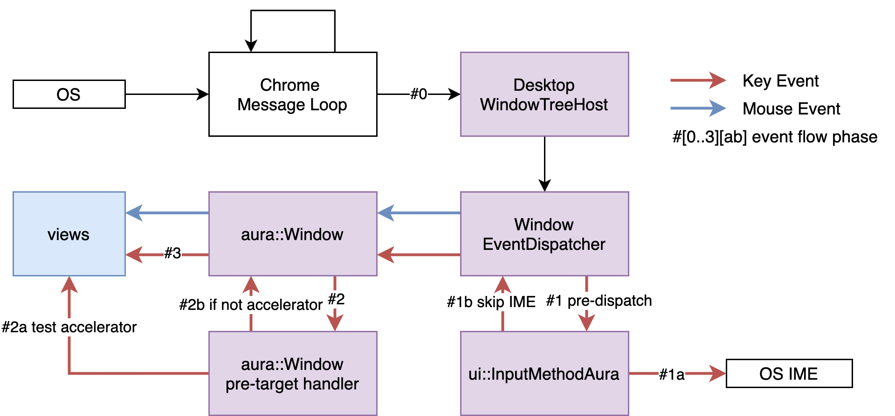
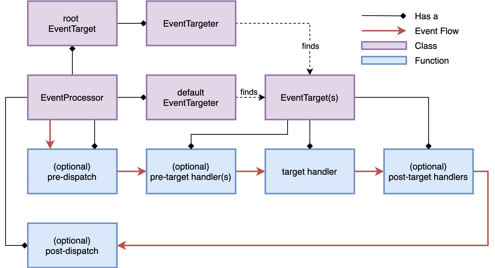
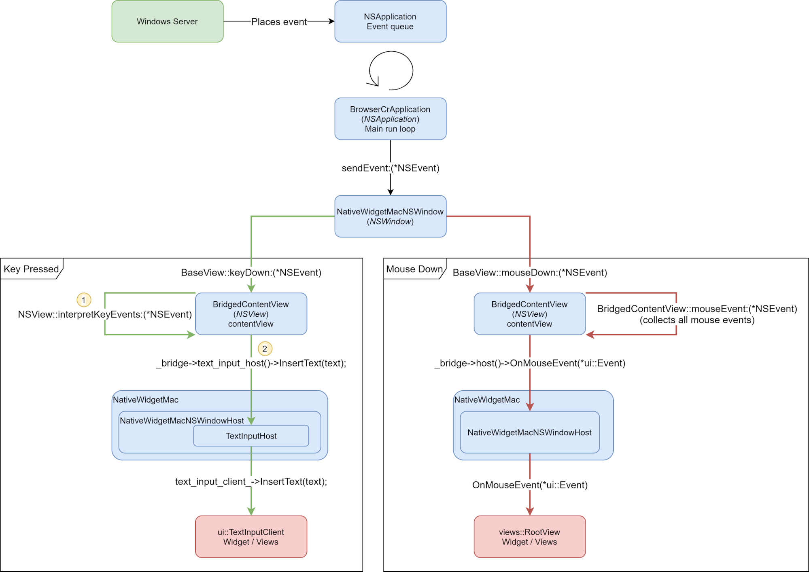
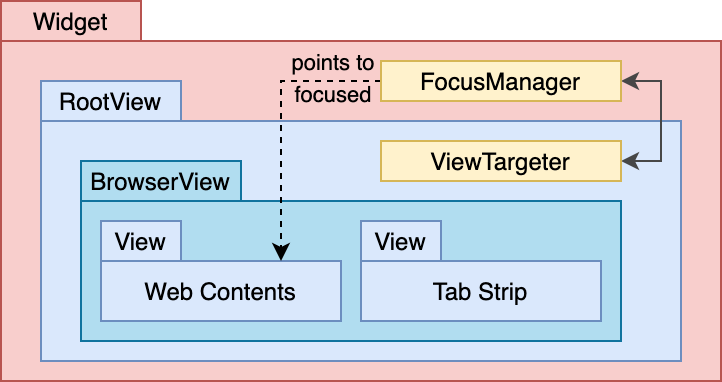
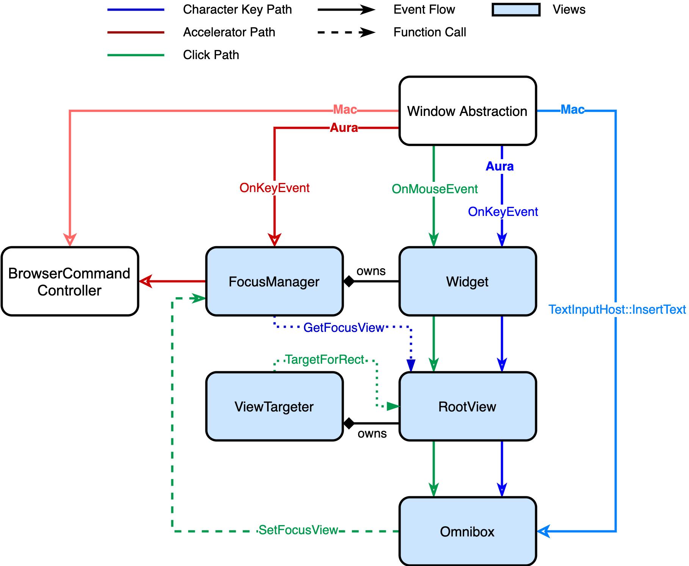

# The Life of an Input Event in Desktop Chrome UI

[TOC]

## Background

The goal of this document is to improve the understanding of the input event
system in the desktop Chrome UI.

## Overview

The Chrome UI system handles input events (typically key downs or mouse clicks)
in three stages:

- At the very beginning, the OS generates a native input event and sends it to a
  Chrome browser window.
- Then, the Chrome Windowing system receives the event and converts it into a
  platform-independent ui::Event. It then sends the event to the Views system. \
  The interaction with IME ([Input Method](https://en.wikipedia.org/wiki/Input_method),
  for non-English text input) is also handled at this stage.
- Lastly, the Views system sends the event to the control that expects to
  receive it. For example, a character key event will insert one letter to a
  focused textfield.

## Window Abstraction

### Aura

Aura is the window abstraction layer used on Windows, Linux, and ChromeOS. An
event goes through several phases in Aura and is eventually passed into views.

**Phase 0** - DesktopWindowTreeHost

After the user presses a key or clicks the mouse, the OS generates a low-level
input event and pumps it into a message loop. After some low-level os-specific
plumbing, the event is then delivered to a DesktopWindowTreeHost that hosts a
native window and handles events in DesktopWindowTreeHost::DispatchEvent().

**Phase 1** - EventProcessor pre-dispatch

Next, the event is passed to a WindowEventDispatcher which is an EventProcessor
owned by the DesktopWindowTreeHost. On ChromeOS, some ui::EventRewriters may
rewrite the event before passing.

An EventProcessor delivers the event to the right target. It provides a root
EventTarget and a default EventTargeter. EventTargeter is responsible for
finding the event target. An EventTarget can also provide an EventTargeter and
the EventProcessor prefers its root EventTarget’s targeter over the default
targeter.

The EventProcessor delivers the event to the first target found by the targeter.
If the event is not marked as handled, it will ask the targeter to find the next
target and repeat the procedure until the event is handled.

The EventProcessor can also have pre- and post-dispatch phases that happen
before and after the event is dispatched to the target.

In the case of WindowEventDispatcher, it has a pre-dispatch phase for different
types of events.

- For mouse move events, it may synthesize and dispatch a
  EventType::kMouseExited event to notify that mouse exits from previous UI
  control.
- For key events, it
  [forwards](https://source.chromium.org/chromium/chromium/src/+/main:ui/aura/window_event_dispatcher.cc;drc=d9fa208c0b5d3d454df1ff1cbc724b5fd708cf7a;l=1053)
  the key to ui::InputMethod::DispatchKeyEvent() and the event will be handled
  there. Depending on IME involvement, later phases of WindowEventDispatcher may
  be **SKIPPED**. Details are explained later.

If the event is not marked handled in the EventProcessor pre-dispatch phase, it
will be passed to the target. For key events, the target is the aura::Window
that owns the focus. For mouse events, the target is the aura::Window under the
cursor.

Each browser window comes with an aura::Window. It is worth noting that the web
content and dialog bubble live in their own aura::Windows. These different
aura::Windows treat accelerators differently and the detail will be explained
later.

**Phase 2** - EventTarget pre-target

Like EventProcessor, an EventTarget consumes the event in three phases. it owns
one target handler and optionally multiple pre-targets and post-target handlers.
An event will first be passed to pre-target handlers, and if not consumed by
them, then to the default target handler, and lastly to post-target handlers.

Non-content aura::Window uses pre-handler to forward key events to FocusManager
in views. If the key is an accelerator, the event will be intercepted and later
phases will be SKIPPED.

Mouse events at present are not processed in pre-handlers. Content aura::Window
does not have any pre-handlers, either.

**Phase 3** - EventTarget regular

At this phase, non-content aura::Window asks (Desktop)NativeWidgetAura::OnEvent()
to handle the event.

DesktopNativeWidgetAura is the native implementation of a top-level
Widget. Non top-level widgets, e.g. dialog bubble, use NativeWidgetAura instead.
The native widget then passes the event to Widget::OnMouseEvent(),
Widget::OnClickEvent(), or other Widget methods depending on the event type. The
event is then handled in views and is explained in a later section.

Content aura::Window instead asks RenderWidgetHostViewAura::OnEvent() to handle
the event. The event will be sent to Blink and then to BrowserCommandController
if not consumed by the webpage. Some important shortcuts, e.g. Ctrl+T, are
[preserved](https://source.chromium.org/chromium/chromium/src/+/main:chrome/browser/ui/browser_command_controller.cc;drc=02f28360f2f6588ca2428ef93c8129e0a8cc231c;l=210)
and will not be sent to the web page.

**Phase 4** - EventTarget post-target

This phase is not effective in window abstraction.

**Phase 5** - EventProcessor post-dispatch

For touch events, WindowEventDispatcher may
[recognize](https://source.chromium.org/chromium/chromium/src/+/main:ui/aura/window_event_dispatcher.cc;drc=d9fa208c0b5d3d454df1ff1cbc724b5fd708cf7a;l=574)
the event as a gesture event and dispatch it.

**Key event handling and IME interoperability**

We mentioned in phase 1 pre-dispatch that a key event may be consumed in _this_
phase and no later phases. This is because we need to interact with IME through
[InputMethod::DispatchKeyEvent()](https://source.chromium.org/chromium/chromium/src/+/main:ui/base/ime/input_method.h;drc=d9fa208c0b5d3d454df1ff1cbc724b5fd708cf7a;l=101)
in pre-dispatch.

If the IME accepts this key event, Chrome will stop any further event handling
because IMEs have their own interpretation to the event. Instead, Chrome
[exits](https://source.chromium.org/chromium/chromium/src/+/main:ui/base/ime/linux/input_method_auralinux.cc;drc=d9fa208c0b5d3d454df1ff1cbc724b5fd708cf7a;l=109)
phase 1 with a fake VKEY_PROCESSKEY event indicating the event has been
processed by IME, and waits for new events emitted by IME and handles them
accordingly. For example, Chrome on Linux
[listens](https://source.chromium.org/chromium/chromium/src/+/main:ui/gtk/input_method_context_impl_gtk.cc;drc=340909edba6daccd34d5875de93599551b218902;l=74)
for the GTK `preedit-changed` event that indicates a change in the composition
text.

If the IME does not accept this key event, WindowEventDispatcher will re-enter
phase 1 but with
[IME explicitly skipped](https://source.chromium.org/chromium/chromium/src/+/main:ui/aura/window_tree_host.cc;drc=d9fa208c0b5d3d454df1ff1cbc724b5fd708cf7a;l=277),
so that the event can be passed to phase 2 where accelerators are handled.

### MacViews

_MacViews_ is an umbrella term that covers the broader effort to adopt views in
Chrome Mac. Before this, Chrome Mac was using native Cocoa controls. In this
document, we use MacViews to refer to the windows abstraction part of Chrome
Mac.

Mac does not use Aura and is significantly different from Aura in that it hosts
native NSWindow in
[RemoteCocoa](https://source.chromium.org/chromium/chromium/src/+/main:components/remote_cocoa/)
that talks to views through a mojo interface. This design allows RemoteCocoa to
either live within the browser process or in a separate process for PWA mode.
This design is largely due to the requirement of PWAs on Mac.
[[ref](https://docs.google.com/document/d/1Cym6LpmrYZU6Jl1BYKhuWqzRJV_OL8LYYepGGAJw7oE/edit)]

Mac’s event handling borrows heavily from
[Cocoa’s Event architecture](https://developer.apple.com/library/archive/documentation/Cocoa/Conceptual/EventOverview/EventArchitecture/EventArchitecture.html)
but applies its own handling where appropriate.

During startup ChromeBrowserMainParts will kick off NSApp’s main run loop that
will continue to service Chrome application event messages for the life of the
program. These messages are picked up by BrowserCrApplication (NSApplication
subclass) and for the most part forwarded to the appropriate
NativeWidgetMacNSWindow (NSWindow subclass).

A key departure from how typical Cocoa applications are architected is that
Chrome uses a single root NSView (the BridgedContentView) as the contentView for
it’s NSWindow. This view is largely responsible for adapting native NSEvents and
funneling them through to the Views framework.

The below two examples demonstrate two key event flows through the Cocoa layers
of Chrome through to the Views framework.

#### Right mouse down event (clicking a button in the browser window)

The below diagram demonstrates points of interest during dispatch of a right
mouse down event on a Chrome browser window button.

Summary:

- The Window Server is responsible for determining which NSWindow a mouse event
  belongs to.
- Once the NSWindow has been identified the Window Server will place the mouse
  down event in Chrome’s
  [BrowserCrApplication ](https://source.chromium.org/chromium/chromium/src/+/main:chrome/browser/chrome_browser_application_mac.h)(NSApplication)
  event queue.
- BrowserCrApplication’s main run loop reads from the event queue.
- BrowserCrApplication delivers the event to the
  [NativeWidgetMacNSWindow ](https://source.chromium.org/chromium/chromium/src/+/main:components/remote_cocoa/app_shim/native_widget_mac_nswindow.h)(NSWindow)
  which delivers the mouseDown event to its root NSView
  [contentView](https://developer.apple.com/documentation/appkit/nswindow/1419160-contentview).
- [BridgedContentView](https://source.chromium.org/chromium/chromium/src/+/main:components/remote_cocoa/app_shim/bridged_content_view.h)
  aggregates all mouse related
  [NSResponder messages](https://source.chromium.org/chromium/chromium/src/+/main:ui/base/cocoa/base_view.mm;l=114;drc=3930cf3f0e2404a517b4580b21e598a3fc648ff0)
  (rightMouseDown, mouseMoved, leftMouseUp etc) into the mouseEvent: method.
- The
  [mouseEvent method](https://source.chromium.org/chromium/chromium/src/+/main:components/remote_cocoa/app_shim/bridged_content_view.mm;l=580;drc=dd5a8d8907f60050eeaaac0299be624fe36cad8a)
  performs NSEvent conversion into ui::Event and sends the event to the
  [NativeWidgetMacNSWindowHost](https://source.chromium.org/chromium/chromium/src/+/main:ui/views/cocoa/native_widget_mac_ns_window_host.h)’s
  [OnMouseEvent()](https://source.chromium.org/chromium/chromium/src/+/main:ui/views/cocoa/native_widget_mac_ns_window_host.mm;l=790;drc=d18ea8bb2c8089e74838b8f781ba5f08420b8516)
  method.
- BridgedContentView communicates to the NativeWidgetMacNSWindowHost via a
  bridge.
  - NativeWidgetMacNSWindowHost implements a Mojo remote
    [remote_cocoa::mojom::NativeWidgetNSWindowHost](https://source.chromium.org/chromium/chromium/src/+/main:components/remote_cocoa/common/native_widget_ns_window_host.mojom;l=41;drc=e6d7cbba3a95a52176a5d5ca37572296f9b9aaa8)
    such that the BridgedContentView and the NativeWidgetMacNSWindowHost can
    communicate via message passing (needed in the case these exist across
    process boundaries).
- [NativeWidgetMac](https://source.chromium.org/chromium/chromium/src/+/main:ui/views/widget/native_widget_mac.mm;l=118;drc=1748fd17d0e2b542b0051955a9cccb2153ff6ea7)
  owns a NativeWidgetMacNSWindowHost instance.

#### Key Down event (entering text into the browser’s omnibox)

The following demonstrates key points of interest in the event flow that occurs
when a user presses a character key with the intention to enter text into the
browser’s omnibox.

Summary:

- The Window Server will deliver key events to the
  [CrBrowserApplication’s ](https://source.chromium.org/chromium/chromium/src/+/main:chrome/browser/chrome_browser_application_mac.h)(NSApplication)
  event queue.
- Provided the keyDown event is not a key equivalent or keyboard interface
  control, the BrowserCrApplication sends the event to
  [NativeWidgetMacNSWindow ](https://source.chromium.org/chromium/chromium/src/+/main:components/remote_cocoa/app_shim/native_widget_mac_nswindow.h)(NSWindow)
  that is associated with the first responder.
- The window dispatches the event as a keyDown event to it’s first responder (in
  this case the
  [BridgedContentView ](https://source.chromium.org/chromium/chromium/src/+/main:components/remote_cocoa/app_shim/bridged_content_view.h)which
  serves as the NSWindow’s
  [contentView](https://developer.apple.com/documentation/appkit/nswindow/1419160-contentview)).
- BridgedContentView inherits from NSTextInputClient which is required for
  Chrome to interact properly with Cocoa’s text input management system.
- BridgedContentView forwards the keyEvent to
  [interpretKeyEvents](https://developer.apple.com/documentation/appkit/nsresponder/1531599-interpretkeyevents):
  method.
  - This invokes Cocoa’s input management system.
  - This checks the pressed key against all key-binding dictionaries.
  - If there is a match in the keybinding dictionary it sends a
    doCommandBySelector: message back to the view. (commands include insertTab,
    insertNewline, insertLineBreak, moveLeft etc).
  - If no command matches it sends an insertText: message back to the
    BridgedContentView.
- BridgedContentView
  [converts the NSString to UFT16 and sends it through to it’s TextInputHost](https://source.chromium.org/chromium/chromium/src/+/main:components/remote_cocoa/app_shim/bridged_content_view.mm;l=504;drc=dd5a8d8907f60050eeaaac0299be624fe36cad8a).
  - [TextInputHost ](https://source.chromium.org/chromium/chromium/src/+/main:ui/views/cocoa/text_input_host.h)implements
    the remote Mojo interface
    [remote_cocoa::mojom::TextInputHost](https://source.chromium.org/chromium/chromium/src/+/main:components/remote_cocoa/common/text_input_host.mojom;l=13;drc=4692fed3d7ff9afec997e3cd5fc5cc7050022cc7)
    and BridgedContextView communicates with the TextInputHost via Mojo message
    passing.
- The TextInputHost calls
  [InsertText()](https://source.chromium.org/chromium/chromium/src/+/main:ui/views/cocoa/text_input_host.mm;l=254;drc=7d9087d7348118b8ea5b12df100f4267dc56cadf)
  on it’s
  [ui::TextInputClient](https://source.chromium.org/chromium/chromium/src/+/main:ui/base/ime/text_input_client.h).
  - This should be the TextInputClient of the currently focused view.

## Views

The Window Abstraction layer will pass the input event to Views. Views is
Chrome’s (mostly) platform-independent UI framework that orchestrates UI
elements in a tree structure. Every node in the views tree is a
[View](https://source.chromium.org/chromium/chromium/src/+/main:ui/views/view.h;bpv=1;bpt=1),
which is a UI element similar to an HTML DOM element.

A
[Widget](https://source.chromium.org/chromium/chromium/src/+/main:ui/views/widget/widget.h;l=93;bpv=1;bpt=1?q=Widget&sq=&ss=chromium%2Fchromium%2Fsrc)
hosts the views tree and is a window-like surface that draws its content onto a
canvas provided by the underlying window abstraction. Every widget can have at
most one focused view which is tracked by a FocusManager owned by the widget.

The root of Views tree is a
[RootView](https://source.chromium.org/chromium/chromium/src/+/main:ui/views/widget/root_view.h;drc=62bf27aca5418212ceadd8daf9188d2aa437bfcc;l=52),
which is a special subclass of View that helps bridging between children views
and the wrapping Widget.

### Character Key Event

Suppose the omnibox is focused and the user presses down a key, say character
‘a’. How is this key routed through the system and delivered to the omnibox? We
will only study the stack after the Window Abstraction layer passes the event to
Views.

Surprisingly, the stack that the event needs to go through is not deep. On Aura,
it can be summarized as a path of Widget -> RootView -> focused View. RootView
will ask FocusManger for the focused view and the event will be directly
delivered to it. There is no tree traversal. The details can be broken down
into:

1. [Widget::OnKeyEvent()](https://source.chromium.org/chromium/chromium/src/+/main:ui/views/widget/widget.cc;drc=5b8933e94139a0ab5be46141666fdfcce0f624f6;l=1250):
   The key event will be passed from platform-dependent NativeWidget to Widget.
   \
   The event is then processed by [EventRewriter](https://source.chromium.org/chromium/chromium/src/+/main:ui/events/event_source.cc;drc=17cd6070f4da0bb1c0396778afba06910f98fd7b;l=139)(s)
   attached to the Widget. Rewriters are used **only** on ChromeOS.
2. [EventProcessor::OnEventFromSource()](https://source.chromium.org/chromium/chromium/src/+/main:ui/events/event_processor.cc;drc=0cd9a52effdb8f2a02b99e8044d680001ba8090f;l=16):
   The key event is then passed to the root view of the widget. Note that a
   RootView _is an_ EventProcessor. \
   An EventProcessor is a _multicaster_. It tries to deliver the event to multiple
   targets [until the event is marked as handled](https://source.chromium.org/chromium/chromium/src/+/main:ui/events/event_processor.cc;drc=5b8933e94139a0ab5be46141666fdfcce0f624f6;l=48):
   It delegates the target enumeration task to an EventTargeter. \
   In the case of RootView, the EventTargeter is a **ViewTargeter**. A
   ViewTargeter will return the currently focused view as the target for the key
   event.
3. [EventHandler::OnEvent()](https://source.chromium.org/chromium/chromium/src/+/main:ui/events/event_handler.cc;drc=5b8933e94139a0ab5be46141666fdfcce0f624f6;l=29):
   OmniboxViewViews receives the event. Every view is an EventHandler and
   OmniboxViewViews is no exception.
4. [OmniboxViewViews::HandleKeyEvent()](https://source.chromium.org/chromium/chromium/src/+/main:chrome/browser/ui/views/omnibox/omnibox_view_views.cc;drc=5b8933e94139a0ab5be46141666fdfcce0f624f6;l=2171):
   Eventually where the event is consumed and the text in the omnibox gets
   updated.

On Mac, the event will be funneled directly from the Window Abstraction layer to
the focused view, i.e. Widget and RootView are not involved in event routing.
This is achieved by having NativeWidgetMacNSWindowHost save a pointer to the
focused view in a
[TextInputHost](https://source.chromium.org/chromium/chromium/src/+/main:ui/views/cocoa/text_input_host.mm;drc=7d9087d7348118b8ea5b12df100f4267dc56cadf;l=268).
NativeWidgetMac
[registers](https://source.chromium.org/chromium/chromium/src/+/main:ui/views/widget/native_widget_mac.mm;drc=1748fd17d0e2b542b0051955a9cccb2153ff6ea7;l=895)
itself as an observer of focus change in FocusManager and updates
NativeWidgetMacNSWindowHost’s TextInputHost on focus change.

### Accelerator Key Event

In the case when the keystroke is an accelerator, for example, a Ctrl+T to open
a new tab, the focused view is not the expected view to handle it.

On Aura, when the focus is not on the web content, accelerators are handled by a
**[pre-handler](https://source.chromium.org/chromium/chromium/src/+/main:ui/views/widget/focus_manager_event_handler.cc;drc=df872ce8fcce25af51aa6b0f9fe8b1135b687524;l=17)**
that happens before the handler for character keys. This pre-handlers is hooked
on aura::Window in the Window Abstraction layer. If a key event is consumed as
accelerators, the character key handler path will be skipped.

In the accelerator path, the **FocusManager**
[relays](https://source.chromium.org/chromium/chromium/src/+/main:ui/views/widget/focus_manager_event_handler.cc;drc=df872ce8fcce25af51aa6b0f9fe8b1135b687524;l=26)
the event from Window Abstraction to views::AcceleratorManager, and finally to
chrome::BrowserCommandController.

Not all accelerators are handled by views::AcceleratorManager. A notable
exception is the Tab key which is used to switch the focused view and will be
[handled](https://source.chromium.org/chromium/chromium/src/+/main:ui/views/focus/focus_manager.cc;drc=df872ce8fcce25af51aa6b0f9fe8b1135b687524;l=70)
directly by the FocusManager.

If the focus is on the web content, the event will be handled by
RenderWidgetHostViewEventHandler where the web content has the priority to
receive most keys except for important navigation accelerators.

Mac interprets accelerators early in the event pipeline.
[Key Equivalents](https://developer.apple.com/library/archive/documentation/Cocoa/Conceptual/EventOverview/HandlingKeyEvents/HandlingKeyEvents.html#//apple_ref/doc/uid/10000060i-CH7-SW11)
like Cmd+T will be
[handled](https://source.chromium.org/chromium/chromium/src/+/main:components/remote_cocoa/app_shim/native_widget_mac_nswindow.mm;drc=6bf8746951f47dda5ce87be9a6218a1abfa064d0;l=291)
early in the Window Abstraction layer and the event never goes into Views.

### Mouse Click Event

Views like textfield will grab focus on a click event.

After the Widget has received the event from the window abstraction, the
RootView
[traverses](https://source.chromium.org/chromium/chromium/src/+/main:ui/views/widget/root_view.cc;drc=5b8933e94139a0ab5be46141666fdfcce0f624f6;l=387)
the views tree from leaf to root and looks for the first view that accepts the
click event. Here, the leaf view is the lowest descendant view that contains the
cursor location of the event. The task of searching for this view is delegated
to
[ViewTargeter](https://source.chromium.org/chromium/chromium/src/+/main:ui/views/view_targeter_delegate.cc;drc=df872ce8fcce25af51aa6b0f9fe8b1135b687524;l=33).

When the click event is dispatched to a Textfield, it will
[notify](https://source.chromium.org/chromium/chromium/src/+/main:ui/views/controls/textfield/textfield.cc;drc=281086aeca412de952c180411560c7ca68a5b97b;l=2172)
the FocusManager to update the focused view.

## Focus Management

A focused control receives keyboard events. Focus change can be triggered by
mouse click or pressing Tab key to switch to the next focusable view. Chrome
usually draws a
[FocusRing](https://source.chromium.org/chromium/chromium/src/+/main:ui/views/controls/focus_ring.h;bpv=1;bpt=1;l=30?q=FocusRing&ss=chromium&gsn=FocusRing&gs=kythe%3A%2F%2Fchromium.googlesource.com%2Fchromium%2Fsrc%3Flang%3Dc%252B%252B%3Fpath%3Dsrc%2Fui%2Fviews%2Fcontrols%2Ffocus_ring.h%23FocusRing%253Aviews%2523c%2523oPBiT3XRtlN&gs=kythe%3A%2F%2Fchromium.googlesource.com%2Fchromium%2Fsrc%3Flang%3Dc%252B%252B%3Fpath%3Dsrc%2Fui%2Fviews%2Fcontrols%2Ffocus_ring.h%23FocusRing%253Aviews%2523c%2523ljYID0QylaH)
around the focused view. Focus rings are drawn separate from its view drawing.

### Focusable Controls

On all desktop platforms other than Mac, all the controls should be focusable by
default. However, on Mac, by default, only TextField and List are focusable.
Other controls such as Button, Combobox are not focusable. Full keyboard access
in system settings needs to be enabled to have navigation of all controls on the
screen.

To comply with Mac’s behavior, Chrome sets
[kDefaultFocusBehavior](https://source.chromium.org/chromium/chromium/src/+/main:ui/views/style/platform_style.h?q=kDefaultFocusBehavior) in
the platform style to ACCESSIBLE_ONLY on Mac as opposed to ALWAYS on other
platforms. Controls that are
[marked](https://source.chromium.org/chromium/chromium/src/+/main:chrome/browser/ui/views/toolbar/toolbar_button.cc;drc=93819857a690b79b1524052513747846c068ca90;l=104)
as ACCESSIBLE_ONLY will be skipped in search of the next view to focus if the
Full keyboard access is off.

### Focus Handling in Window Abstraction

Windows and Linux have more resemblance to handling focus on the window level.
They both have a ‘top-level’ window concept. A top-level window is a window that
has no parent. Chrome uses only top-level windows and the focus changing event
is only triggered between top-level windows.

**Windows**

Chrome observes WM_ACTIVATE messages to monitor the active window change
[[ref](https://source.chromium.org/chromium/chromium/src/+/main:ui/views/win/hwnd_message_handler.cc?q=WM_ACTIVATE)].

The event is then routed up through the NativeWidget (DesktopNativeWidgetAura)
and eventually to Widget. Chrome then uses its own focus management to further
route those focus events to the view which is supposed to have the actual
keyboard focus.

**Linux**

Chrome on Linux observes the platform native focus change events FocusIn and
FocusOut
[[ref](https://source.chromium.org/chromium/chromium/src/+/main:ui/ozone/platform/x11/x11_window.cc?q=x11::Input::CrossingEvent::FocusIn)]
to respond to focus change events. Nevertheless, eventually just like on
Windows, the events will be interpreted as active window change.

**Mac**

On Mac, the ‘key window’ is the window that receives keyboard events. Chrome
observes the key status change by implementing
[windowDidBecomeKey](https://source.chromium.org/chromium/chromium/src/+/main:components/remote_cocoa/app_shim/views_nswindow_delegate.mm;drc=e6d7cbba3a95a52176a5d5ca37572296f9b9aaa8;l=115)
on an NSWindow and handles according
[[ref](https://source.chromium.org/chromium/chromium/src/+/main:ui/views/widget/native_widget_mac.mm?q=NativeWidgetMac::OnWindowKeyStatusChanged)],
which is similar to Windows’ active window change.

### Focus Handling in Views

We have almost identical focus handling in views across different platforms. In
views, a widget owns a FocusManager who manages the focus for all the widgets in
this tree. FocusManager handles proper routing of keyboard events, including the
handling of keyboard accelerators. The FocusManager also handles focus traversal
among child widgets in addition to between Views.
