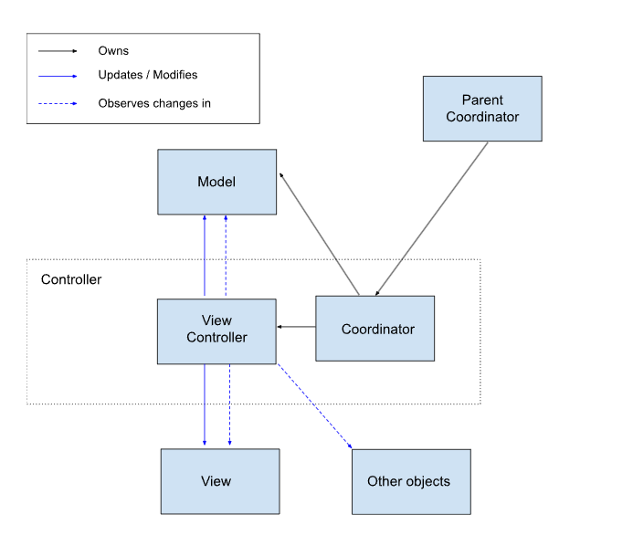

# Views MVC Developer Guide

## Components and Concepts

### Model:
* Contains data related to the display of the view
* Treat backend service as separate models
* Gets updated by the view controller

### View:
* Presentation of UI
* Receives and handles events from the user that don’t require model data
* Is called into by the View Controller and does not interact with the model
* The view should end up being pretty simple

### Controller:
We break up the traditional Controller into the Coordinator and View Controller. More complicated features where the View Controller gets unruly can also further split out a mediator object (Reach out to the views team for more details if your team would like to explore that option)

#### Coordinator:
* Public API of the component
* In charge of when features become active or inactive
* Owned by the coordinator of it’s parent component
* Creates and owns the view controller
* May create and own UI models or manage the models of it’s child coordinators

#### View Controller:
* Sets up views based on model data
    * This can often replace creating a new subclass
* Event processing for events that result in changes to model data
* Translates model data and decides how/what we want to show the data on the view
* Updates model data
* Observes model changes and changes in other relevant components and processes these changes to determine how they affect the view

# Visual of Components

Note: In this diagram the coordinator is owning the model, but the model can also be owned by the parent coordinator or outside components if it’s a backend model.

#### Concrete Examples
Simple example from the Chrome Labs feature.
* [Coordinator](https://source.chromium.org/chromium/chromium/src/+/main:chrome/browser/ui/views/toolbar/chrome_labs/chrome_labs_coordinator.h)
* [Model](https://source.chromium.org/chromium/chromium/src/+/main:chrome/browser/ui/toolbar/chrome_labs/chrome_labs_model.h)
* [View](https://source.chromium.org/chromium/chromium/src/+/main:chrome/browser/ui/views/toolbar/chrome_labs/chrome_labs_bubble_view.h)
* [View Controller](https://source.chromium.org/chromium/chromium/src/+/main:chrome/browser/ui/views/toolbar/chrome_labs/chrome_labs_view_controller.h)

More involved example with the Extensions Menu. This one deals with more complicated view controller responsibilities as well as integrating with existing model-esque objects and non MVC controllers.

* [Coordinator](https://source.chromium.org/chromium/chromium/src/+/main:chrome/browser/ui/views/extensions/extensions_menu_coordinator.h)
* Views:
    * [Main Page](https://source.chromium.org/chromium/chromium/src/+/refs/heads/main:chrome/browser/ui/views/extensions/extensions_menu_main_page_view.h)
    * [Site Permissions Page](https://source.chromium.org/chromium/chromium/src/+/refs/heads/main:chrome/browser/ui/views/extensions/extensions_menu_site_permissions_page_view.h)
* [View Controller](https://source.chromium.org/chromium/chromium/src/+/refs/heads/main:chrome/browser/ui/views/extensions/extensions_menu_view_controller.h)
