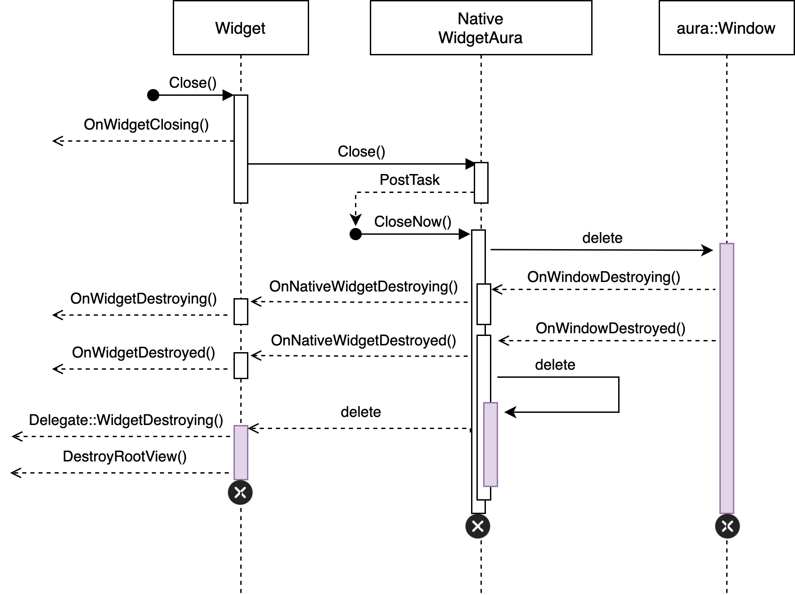
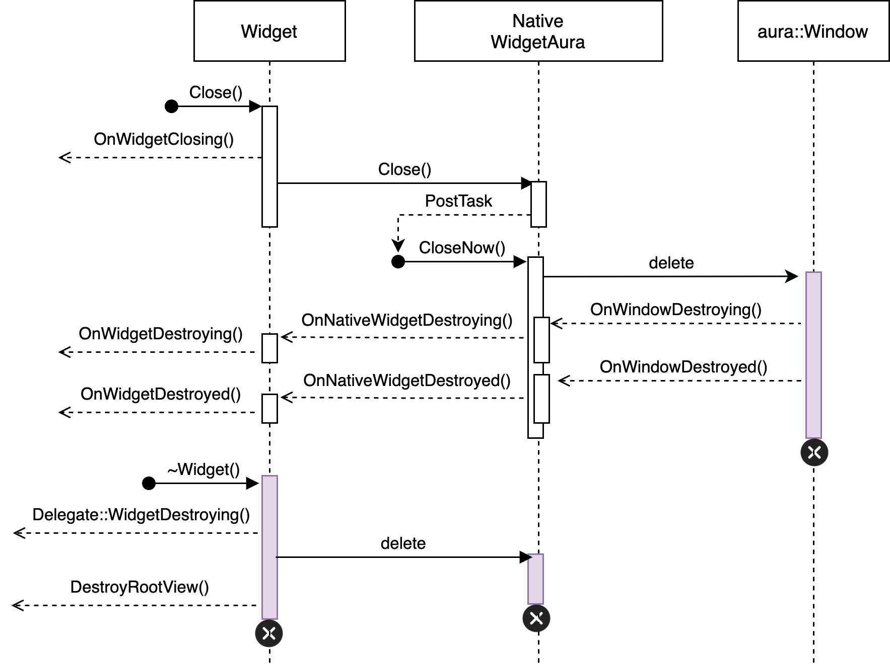

This document describes the destruction procedure of Widget related classes.

## Desktop Native Widget
### NativeWidgetOwnsWidget

### WidgetOwnsNativeWidget

## Native Widget
### NativeWidgetOwnsWidget

### WidgetOwnsNativeWidget

## MacViews
### NativeWidgetOwnsWidget

### WidgetOwnsNativeWidget

