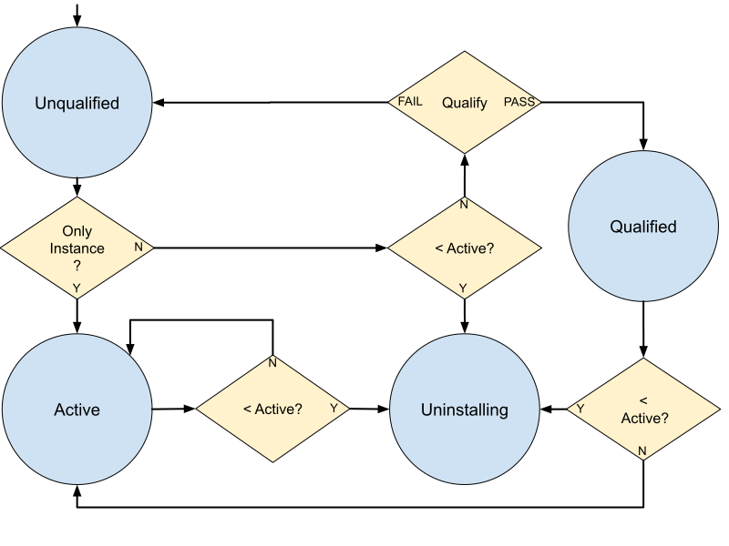

# Chromium Updater Design Document

This is the design document for [Chromium Updater](https://source.chromium.org/chromium/chromium/src/+/main:chrome/updater/).

[TOC]

## Overview
Chromium updater is an program that keeps itself and other programs up to date
by downloading new versions of software over the Internet. The updater is an
open-source drop-in replacement for Google Update/Omaha and can be customized
by 3rd party embedders for updating non-Google client software.

The updater is responsible for:
*   Installing applications.
*   Silently keeping those applications (and itself) up-to-date.
*   Providing those applications with services to manage their installation.
*   Providing update servers with anonymous telemetry about those applications.
*   Detecting the uninstallation of those applications, and automatically
    removing itself when all other applications have been uninstalled.

The updater is written for Windows, macOS, and Linux. The behavior of the
updater is mostly platform-independent. However, platform-specific modules
exist to translate cross-platform concepts (such as IPC interfaces) to
platform-specific technologies (such as COM). Additionally, some updater
behavior related to installs and uninstalls are tailored to platform
conventions.

The updater is layered atop //components/update\_client, which implements a
cross-platform mechanism to interact with an Omaha server for the purpose of
updating CRXs. //components/update\_client is also used by the component and
extension updaters in Chrome.

To keep applications up-to-date, the updater periodically polls an Omaha server,
communicating the state of installed applications, and receiving update
instructions. It applies updates the server instructs it to, and then reports
the results of the operation back to Omaha servers.

There is an [unofficial tutorial](https://omaha-consulting.com/chromium-updater-omaha-4-tutorial)
that gives a quick working overview of the updater. (Please note that it was
written by a third party, so its availability, accuracy and safety cannot be
guaranteed.)


## Updater Design
Once installed, the updater operates as a collection of processes that are
launched on-demand and orchestrate their operations over IPC. The *server
process* hosts an engine that conducts most of the work of updating software,
and it is driven by *client processes* that issue commands to it and potentially
display UI to the user.


The updater may be installed *per-user* or *system-wide*. If installed
per-user, the updater may lack permissions to update applications owned by
other users, whereas a system- wide updater can update applications owned by
any entity on the system. In multi-user systems, it is efficient for software
such as the browser to be installed system-wide, owned by root (or the system
user) and run by individual users, but this requires the updater to maintain
root privileges in order to update it. Therefore, in a system-wide
installation, the server process runs as root (or at high integrity). One
system-wide installation of the updater and any number of per-user
installations of the updater can coexist and operate independently on the same
system.

Different versions of the updater can coexist even within the same installation
of the updater, but only one such instance is *active*. Inactive versions of the
updater periodically attempt to *qualify* themselves by running self-tests and
(if they pass) take over as the active updater; or uninstall themselves as out
of date once a newer version of the updater has activated.

The functionality of the server process is split into two interfaces:
*   UpdateService, which is served only by the active instance and may be called
    by any client. When an instance activates, it replaces IPC registrations so
    that UpdateService routes to it.
*   UpdateServiceInternal, which is served by all instances but may only be
    called by updater clients of the same version.

Where necessary, the updater acquires a single cross-process lock to prevent
races between activations and ongoing update operations.

### Installing the Updater
Instances of the updater are installed in one of the following ways:
*   A user runs an installer for the updater with the intent of installing an
    application. The updater will install itself, and then use itself to install
    the application. (This is the primary flow on Windows.)
*   An application installs the updater as part of its own installation,
    first-run experience, or repair/recovery. (This is the primary flow on
    macOS.)
*   The updater downloads an update for itself and installs it.

The updater installer calls GetVersion to discover the active version. If it
gets no response or the response indicates the installed updater is a lower
version, it installs the updater. If it had gotten no GetVersion response
at all, it immediately wakes it.

Each updater instance is unpacked into a version-specific subdirectory of the
main updater installation path. If the installer discovers it is about to
install into a versioned directory that already exists, it deletes everything
except the `Crashpad/` subtree (if any) in that directory before unpacking
the new installation. This clears out any "broken" prior installation while
preserving crash reports and updater-specific crash-reporting opt-in flags.


#### Updater States


Only one instance per installation is `Active` at any time. Only the active
instance is allowed to update applications or modify any of the updater's state.
The state of the updater (including the list of applications registered for
updates, the time of the last update check, and more) is stored in a "global
prefs" file. Access to the global prefs file is protected by a global
(cross-process) lock.

Each instance of the updater also has its own separate local prefs file. Local
prefs store information specific to the instance that owns them.

##### Qualification
Instances are installed in the `Unqualified` state. Unqualified instances of
the updater perform a self-test before activating. Each instance registers a
"qualification app" with itself (using local prefs) and checks the Internet for
updates to that application. The Internet responds with an update, which the
updater downloads and applies. If this all succeeds, the updater transitions to
the `Qualified` state and exits.

The qualification app installer is a no-op installer that simply exits with no
error, but could be customized in the future to do additional checks.

The updater also performs other basic health checks during qualification, which
are detailed in the platform-specific sections.

Qualification is skipped (along with any other pre-active states) if there is
no active instance of the updater, or if this instance of the updater is active.

##### Activation
When an instance transitions to the active state, it acquires the updater's
lock on the global prefs file, writes and flushes the "swapping" bit to that
prefs file, and then replaces any non-side-by-side elements of the installation
(such as COM or launchd registrations, Omaha 3 or Keystone shims, and more)
with its own. Then, it clears the "swapping" bit, flushes the prefs file again,
and starts listening for instructions on the RPC channels. The swapping bit
ensures that the an updater will recover and restart activation if the program
is interrupted mid-activation.

After activating, the server resets its own qualification state to
"unqualified". If somehow the active version of the updater decreases (most
likely due to unexpected user intervention), the instance will have to qualify
itself again before reactivating.

##### Deactivation
When a newer instance of the updater activates, formerly active instances will
discover that they have been replaced when they start up. These instances
uninstall themselves.

##### Locking
Read and write access to the global prefs file is controlled by a lock. The lock
must also be held while the updater performs any non-side-by-side operation
(such as installing an update for a registered application). The lock is per-
process. The updater uses a polling strategy to acquire the lock, sleeping for
a short time between polls.

### Installing Applications
Applications are installed by the active updater instance primarily by
downloading application-specific installer executables from the Internet and
running them. The updater passes the installer certain arguments or environment
variables depending on the instructions received from the Internet and reads the
installer's exit code as an indicator of success or failure. On some platforms,
more sophisticated APIs to communicate installer progress or error codes are
available.

Fetching the application installer from the Internet ensures that the user gets
the latest version of the application. But in some cases it is better to install
applications without a dependency on the Internet. Therefore, some applications
offer "offline" installers. These offline installers are wrapped in an updater
installer. They install the updater, place the application installer on the
disk in a secure location, and then act as a client and instruct the updater
server to run the application installer.

During the installation process, the updater displays a UI that communicates
the installation progress to the user. The language of the UI is based on the
system's primary langague.

In some scenarios, the application has already been installed on the system by
another mechanism, but needs to register itself with the updater. The updater
exposes a registration API that allow applications to register themselves as
present on the system with the updater.

Regardless of how the application is installed or registered, at the end of the
process the updater knows the application's identity, current version, brand
code (if any), and has a means to check whether the application has been
uninstalled (an existence checker).

### Updating Applications
Each instance of the updater has its own timed scheduler that invokes the
updater to check for updates. The scheduler creates a `--wake` client every
hour, which invokes the `RunPeriodicTasks` RPC on the corresponding server.

If the server is inactive, it qualifies, activates, or uninstalls, as
described above. If the server is active, it checks that registered applications
are still installed, updates enterprise policies, and potentially checks for
updates. The updater will not check for updates if the last check was less than
five hours ago. (This period can be altered by enterprise policy and is
subject to some randomization to avoid synchronized load on the Internet.)

#### Telemetry
To keep the updater simple, the decision about whether to apply an update or not
is made remotely. Updaters contact Internet servers and provide them with
information about the registered applications, operating system, hardware
capabilities, and more, and trust the server's response about whether to apply
an update, using the [Omaha Protocol](protocol_3_1.md).

Applications may signal the updater when they are actively used using a
platform-specific "Actives API". Updaters will transmit to the server whether
or not each application has been actively used since the previous communication
in order to enable the server to compute aggregate and anonymous counts of the
population of users.

Updaters also report the outcome of any installations or updates, including
error codes, download attempts, and timing to the server. Servers may use this
information to detect problems with updates, cease serving bad installers, or
balance load among multiple download sources.

Some telemetry is guarded behind usage-stats opt-in. If the user has opted-in
to transmitting crash reports and usage stats for any software registered with
the updater, the updater will transmit its own usage stats and crash reports as
well.

### Uninstalling Applications
The updater detects the uninstallation of applications by using existence
checkers registered with the updater at installation or registration. When an
application is uninstalled, the updater transmits an uninstall ping to the
Internet recording the uninstallation.

When all managed applications are uninstalled, the updater will uninstall
itself, leaving behind only a log file. Applications may trigger immediate
uninstallation of the updater by running an updater `--wake` client.

Additionally, the updater can be uninstalled by hand using `--uninstall`, even
if registered applications are still present.

## Advanced Topics

### Recovering the Updater
To avoid a single point of failure in the update system, some applications have
a backup updater build into the application that is capable of reinstalling the
updater. Google Chrome contains a "Recovery Component" that is capable of
downloading and reinstalling a new version of the updater if a problem with the
updater is detected or if the version of Chrome becomes too old.

For system-wide installations, recovery must be performed at high integrity.
Google Chrome installs an
[elevator service](../../chrome/elevation_service/README.md) for this purpose.

## Testing
In addition to unit testing individual sections of code, the updater provides
integration tests that install and manipulate the updater on the system running
the test.

Testing is possible by programmatically controlling certain parameters of the
updater. These parameters are hardcoded in the production builds but they can
be modified in test builds. For this reason, the updater build scripts define
two separate set of targets. One target produces binaries suitable to
releasing. The other target produces test binaries, which are suffixed by
`_test`. The test binaries link the test hooks code, which slightly alters the
behavior of the updater to facilitate testing it.

Some tests require two versions of the updater. For this reason, an older
version of the updater is checked into `//third_party/updater/*/cipd`. Updaters
for each architecture and platform, Google-branded and Chromium-branded, are
available there. These versions of the updater are sourced from Chromium or
Google's official build output, brought in through CIPD and 3pp.

The updater has its own
[console page](https://ci.chromium.org/p/chromium/g/chromium.updater/console),
which describes the set of continuous integration builders.

## Release
The updater is built by Chrome's official builders and uploaded to the unsigned
builds bucket along with Chrome. The primary build output is `updater.zip`,
which contains the updater executables, the signing scripts, and other
updater-related artifacts.

Google's signing infrastructure unpacks the updater.zip and operates on it to
generate signed executables, which are then released through Omaha similar to
Chrome.

Because GoogleUpdater is built from Chromium source, it has version numbers
similar to Google Chrome's. However, GoogleUpdater is shipped from builds much
closer to the head of the repository, so its version numbers may be higher.
GoogleUpdater is released on an as-needed basis, in response to meaningful
changes in the updater, rather than at a regular weekly cadence.

When a new version of GoogleUpdater is released, a control version that is
functionally identical to the previous version is simultaneously released.
Google compares telemetry from two versions of the updater to gain confidence
that the new version of the updater is working well in the wild.

## Tools

### Tagger
`tag_exe` is a command-line tool for interacting with tagged binaries, capable
of getting or setting the tag of a binary.

### UpdaterUtil
UpdaterUtil is a command-line tool to interact with updaters of the same
version, triggering updates, listing apps, or listing policies.

### Keystone Ticketstore Tool
The Keystone Ticketstore Tool is a tool to read and convert Keystone-style
ticket stores.

### O4 Log Tool
The O4 Log Tool is a browser-based tool that displays log files generated by
ChromiumUpdater, splitting messages into columns based on process. To use it,
open it in a browser, copy the log to the system clipboard, and use the buttons
to load the log.

## Windows-Specific Notes

### Installer

#### Updater Installer Types
Windows updater installers come in two types:
*   Online Installers
*   Offline Installers

##### Online Installers
An online installer installs the updater and then acts as a client process that
commands the server process to install the application the user desired.

Online installers are composed of three parts: a *tag*, a *metainstaller*, and
an *updater resource*. The metainstaller is a lightweight executable that
uncompresses its updater resource into a safe temporary directory and then
launches the updater's setup client process (`--install`). It passes along the
tag, an unsigned (and untrusted) piece of data that is embedded in the
executable which communicates the installation parameters for the software the
user is trying to install.

###### Elevation
Online installers are typically run by the end user after being downloaded from
the Internet. When the installer is executed, the OS launches it at
[medium integrity](https://docs.microsoft.com/en-us/windows/win32/secauthz/mandatory-integrity-control).

However, depending on the tag, the updater and application may need to be
installed system-wide. To achieve this, the metainstaller must re-launch itself
at high integrity. This will result in an
[UAC prompt](https://docs.microsoft.com/en-us/windows/security/identity-protection/user-account-control/how-user-account-control-works)
on Windows.

The metainstaller determines whether to relaunch before unpacking the updater
resources, since unpacking to a user-writable temp directory is not secure for
a system-wide installation.

The metainstaller appends the `--expect-elevated` switch to the relaunch command
line, to allow the relaunched process to exit with an error if it is not running
at the correct integrity level.

###### De-elevation
The updater metainstaller re-launches itself at medium integrity if a per-user
installer is run at high integrity with UAC on. For example, if a per-user
Chrome installer is run by right-clicking it in Windows explorer and choosing to
`Run as administrator`.

De-elevation uses the Windows explorer token to run the child process using
`::CreateProcessWithTokenW`. The approach is adapted from the
[following article](https://learn.microsoft.com/en-us/archive/blogs/aaron_margosis/faq-how-do-i-start-a-program-as-the-desktop-user-from-an-elevated-app)
.

##### Offline Installers
Offline install performs the installation with no update check or file download
against the server in the process. All data is read from the files in the
specified directory instead.

An example offline install command line on Windows platform:

```
updater.exe /handoff "&appguid={8A69D345-D564-463C-AFF1-A69D9E530F96}&appname=MyApp&needsadmin=True&installdataindex =verboselog"
            /installsource offline
            /sessionid "{E85204C6-6F2F-40BF-9E6C-4952208BB977}"
            /offlinedir "C:\Users\chrome-bot\AppData\Local\ForgedPath"]
```
DOS style command line switches are also supported for backward compatibility.

##### Manifest file
The offline install process looks for `OfflineManifest.gup` in the
offline directory, and falls back to *`<app-id>`*`.gup` if needed.
The `.gup` file contains the update check response in XML format. An
example of the XML file:
```
<?xml version="1.0" encoding="UTF-8"?>
<response protocol="3.0">
  <app appid="{CDABE316-39CD-43BA-8440-6D1E0547AEE6}" status="ok">
    <updatecheck status="ok">
      <urls>
        <url codebase="http://dl.google.com/foo/install/1.2.3.4/"/>
      </urls>
      <manifest version="1.2.3.4">
        <packages>
          <package hash="abcdef" hash_sha256="sha256hash_foobar"
           name="my_installer.exe" required="true" size="12345678"/>
        </packages>
        <actions>
          <action event="install" needsadmin="false" run="my_installer.exe"
           arguments="--baz"/>
          <action event="postinstall" onsuccess="exitsilentlyonlaunchcmd"/>
        </actions>
      </manifest>
    </updatecheck>
    <!-- "system_level" is not included in any of the definitions. needsadmin
          controls this. -->
    <data index="verboselog" name="install" status="ok">
      {
        "distribution": {
          "verbose_logging": true
        }
      }
    </data>
  </app>
</response>
```
The manifest file is parsed to extract the installer command. The above
manifest leads to installation command:
 ```
 C:\Users\chrome-bot\AppData\Local\ForgedPath\my_installer.exe --baz
 ```

The example handoff install command line also specifies
`installdataindex=verboselog`, and the manifest has a matching install
data. That means the install data is extracted and passed to the app
installer. See [installdataindex](#installdataindex) below for details.

#### Dynamic Install Parameters

##### Steps to create a tagged metainstaller

A tagged EXE metainstaller can be created using the signing tool
[sign.py](https://source.chromium.org/chromium/chromium/src/+/main:chrome/updater/win/signing/sign.py)
and the metainstaller tagging tool
[tag.exe](https://source.chromium.org/chromium/chromium/src/+/main:chrome/updater/tools/BUILD.gn?q=%5C%22tag%5C%22).

Here are the steps to create a tagged metainstaller for the following tag:
`"appguid=FOO_BAR_APP_ID&appname=SomeName&needsadmin=prefers"`

The source file is the untagged metainstaller `out\Default\UpdaterSetup.exe`,
and the final tagged file will be `out\Default\Tagged_UpdaterSetup.signed.exe`.

* One-time step: from an elevated powershell prompt:
```
New-SelfSignedCertificate -DnsName id@domain.tld -Type CodeSigning
 -CertStoreLocation cert:\CurrentUser\My
```
* Note: all the steps below are run from a medium cmd prompt.
* One-time step: `python3 -m pip install pypiwin32`
* One-time step:
`set PYTHONPATH=C:\src\chromium\src\chrome\tools\build\win`
*
```
python3 C:\src\chromium\src\chrome\updater\win\signing\sign.py --in_file
 C:\src\chromium\src\out\Default\UpdaterSetup.exe
 --out_file C:\src\chromium\src\out\Default\UpdaterSetup.signed.exe
 --lzma_7z "C:\Program Files\7-Zip\7z.exe"
 --signtool c:\windows_sdk_10\files\bin\10.0.22000.0\x64\signtool.exe
 --identity id@domain.tld
 --tagging_exe C:\src\chromium\src\out\Default\tag.exe
```
*
```
C:\src\chromium\src\out\Default\tag.exe
 --set-tag="appguid=FOO_BAR_APP_ID&appname=SomeName&needsadmin=prefers"
 --out=C:\src\chromium\src\out\Default\Tagged_UpdaterSetup.signed.exe
 C:\src\chromium\src\out\Default\UpdaterSetup.signed.exe
```

For MSI installers (development in progress), the tagging is done using the same
`tag.exe` tool:
*
```
C:\src\chromium\src\out\Default\tag.exe
 --set-tag="appguid=FOO_BAR_APP_ID&appname=SomeName&needsadmin=prefers"
 --out=C:\src\chromium\src\out\Default\Tagged_UpdaterSetup.signed.msi
 C:\src\chromium\src\out\Default\UpdaterSetup.signed.msi
```


##### `needsadmin`

`needsadmin` is one of the install parameters that can be specified for
first installs via the
[metainstaller tag](#Steps-to-create-a-tagged-metainstaller).
`needsadmin` is used to indicate whether the application needs admin rights to
install.

For example, here is a command line for the Updater on Windows that includes:
```
UpdaterSetup.exe --install="appguid=YourAppID&needsadmin=False"
```

In this case, the updater client understands that the application installer
needs to install the application on a per-user basis for the current user.

`needsadmin` has the following supported values:
* `true`: the application supports being installed systemwide and once
installed, is available to all users on the system.
* `false`: the application supports only user installs.
* `prefers`: the application installation is first attempted systemwide. If the
user refuses the
[UAC prompt](https://docs.microsoft.com/en-us/windows/security/identity-protection/user-account-control/how-user-account-control-works)
however, the application is then only installed for the current user. The
application installer needs to be able to support the installation as system, or
per-user, or both modes.

When `UpdaterSetup` encounters `needsadmin`, it does the following, based on the
`needsadmin` value:
* `true`: runs the application installer as `system`, with any
[elevation prompts](https://docs.microsoft.com/en-us/windows/security/identity-protection/user-account-control/how-user-account-control-works)
that may be required to run as system first.
* `false`: runs the application installer as the current user.
* `prefers`: attempts to run the application installation as system first. If
elevation fails however, runs the application installer as the current user.

##### `installdataindex`

`installdataindex` is one of the install parameters that can be specified for
first installs on the command line or via the
[metainstaller tag](#Steps-to-create-a-tagged-metainstaller).

For example, here is a typical command line for the Updater on Windows:
```
UpdaterSetup.exe /install "appguid=YourAppID&appname=YourAppName&needsadmin=False&lang=en&installdataindex =verboselog"
```

In this case, the updater client sends the `installdataindex` of `verboselog` to
the update server.

This involves:
* [Parsing the tag](https://source.chromium.org/chromium/chromium/src/+/main:chrome/updater/tag.h)
into individual tag components, including install_data_index.
* Creating a CrxComponent with the install_data_index and providing it to the
[update_client](https://source.chromium.org/chromium/chromium/src/+/main:components/update_client/update_client.h).
* update_client sends the install_data_index to the update server.

This is how a [JSON](https://www.json.org/) request from update_client may look
like:

```
{
   "request":{
      "@os":"win",
      "@updater":"updater",
      "acceptformat":"crx3",
      "app":[
         {
            "appid":"YourAppID",
            "data":[
               {
                  "index":"verboselog",
                  "name":"install"
               }
            ],
            "enabled":true,
            "installsource":"ondemand",
            "ping":{
               "r":-2
            },
            "updatecheck":{
               "sameversionupdate":true
            },
            "version":"0.1"
         }
      ],
      "arch":"x86",
      "dedup":"cr",
      "domainjoined":true,
      "hw":{
         "avx":true,
         "physmemory":32,
         "sse":true,
         "sse2":true,
         "sse3":true,
         "sse41":true,
         "sse42":true,
         "ssse3":true
      },
      "ismachine":false,
      "lang":"en-US",
      "nacl_arch":"x86-64",
      "os":{
         "arch":"x86_64",
         "platform":"Windows",
         "version":"10.0.19042.1586"
      },
      "prodversion":"101.0.4949.0",
      "protocol":"3.1",
      "requestid":"{6b417770-1f68-4d52-8843-356760c84d33}",
      "sessionid":"{37775211-4487-48d5-845d-35a1d71b03bc}",
      "updaterversion":"101.0.4949.0",
      "wow64":true
   }
}
```

The server retrieves the data corresponding to `installdataindex=verboselog`
and returns it back to update_client.

This is how a JSON response from the update server may look like:

```
  "response":{
   "protocol":"3.1",
   "app":[
    {"appid":"12345",
     "data":[{
      "status":"ok",
      "name":"install",
      "index":"verboselog",
      "#text":"{\"logging\":{\"verbose\":true}}"
     }],
     "updatecheck":{
     "status":"ok",
     "urls":{"url":[{"codebase":"http://example.com/"},
                    {"codebasediff":"http://diff.example.com/"}]},
     "manifest":{
      "version":"1.2.3.4",
      "prodversionmin":"2.0.143.0",
      "run":"UpdaterSetup.exe",
      "arguments":"--arg1 --arg2",
      "packages":{"package":[{"name":"extension_1_2_3_4.crx"}]}}
     }
    }
   ]
  }
```

update_client provides this response data back to the Updater.

The updater client writes this data to a temporary file in the same directory as
the application installer. This is for security reasons, since writing the data
to the temp directory could potentially allow a man-in-the-middle attack.

The updater client provides the temporary file as a parameter to the application
installer.

Let's say, as shown above, that the update server responds with these example
file contents:
```
{"logging":{"verbose":true}}
```

The updater client will now create a temporary file, say `c:\my
path\temporaryfile.dat` (assuming the application installer is running from
`c:\my path\YesExe.exe`), with the following file contents:
```
\xEF\xBB\xBF{"logging":{"verbose":true}}
```

and then provide the file as a parameter to the application installer:
```
"c:\my path\YesExe.exe" --installerdata="c:\my path\temporaryfile.dat"
```

* Notice above that the temp file contents are prefixed with an UTF-8 Byte Order
Mark of `EF BB BF`.
* For MSI installers, a property will passed to the installer:
`INSTALLERDATA="pathtofile"`.
* For exe-based installers, as shown above, a command line parameter will be
passed to the installer: `--installerdata="pathtofile"`.
* For Mac installers, an environment variable will be set:
`INSTALLERDATA="pathtofile"`.
* Ownership of the temp file is the responsibility of the application installer.
The updater will not delete this file.
* This installerdata is not persisted anywhere else, and it is not sent as a
part of pings to the update server.


### Locking
On Windows, the global prefs lock is implemented as a kernel mutex.

### Application Commands

The Application Command feature allows installed Updater-managed applications to
pre-register and then later run command lines. This provides applications in a
system-wide installation a mechanism to silently elevate functionality. The
command lines can also include replaceable parameters substituted at runtime.

For legacy reasons:
* the interface is called `IAppCommandWeb` because it was meant to be used from
an ActiveX control on a webpage at one point, and
* it is derived from `IDispatch` for the same reason, to be used from script.

For more information, please see the
[functional spec](functional_spec.md#Application-Commands).

### Existence Checking
On Windows, programs create a key at
`(HKLM|HKCU)\\Software\\Company\\Update\\Clients\\AppID` during installation.
They remove this key when their uninstallers are run. If the key has been
removed, the updater considers the application to have been uninstalled.

### Periodic Task Scheduling
Windows utilizes the Task Scheduler and the Windows Task Scheduler API to create
a scheduler.

### COM on Windows

The COM client and server code are implemented in terms of the Windows Runtime
C++ (WRL) library provided by Windows SDK.

For system installs, the updater installs a COM service. The COM service is
started by the SCM when CoCreate is called on one of several CLSIDs that the
service supports. This is used as:
* The Server for the UI when installing Machine applications.
* The On-Demand COM Server for Machine applications.
* COM Server for launching processes at System Integrity, as an Elevator. See
[process launcher](functional_spec.md#process-launcher) and
[application commands](functional_spec.md#application-commands-applicable-to-the-windows-version-of-the-updater)
in the functional spec.

#### COM interface versioning

The COM interfaces are declared in `updater_idl.template`,
`updater_internal_idl.template`, and `updater_legacy_idl.template`.

* `updater_idl.template`:
  * contains the interfaces for the currently active updater version.
  * the interface IDs are `uuid5-generated` and are distinct based on branding.

* `updater_internal_idl.template`:
  * contains the side-by-side interfaces which allow each updater COM client to
    talk to the same version COM server.
  * the interface IDs are `uuid5-generated` and are distinct based on branding
    and version.

* `updater_legacy_idl.template`:
  * contains legacy interfaces for the currently active updater version.
  * the interface IDs are hardcoded and based on branding.

The interface ID generation and substitution can be seen in the
[build file](https://source.chromium.org/chromium/chromium/src/+/main:chrome/updater/app/server/win/BUILD.gn).

The `uuid5-generation` and substitutions are done via `midl.gni` using the
values provided via the `dynamic_guids` property.

`dynamic_guids` can contain hardcoded values, for instance, in the case of
`updater_internal_idl.template`. Or it can contain `uuid5:`-prefixed values, in
which case the IDs are `uuid5-generated`.

More information on how `uuid5-generation` works can be found
[here](http://crrev.com/825994).

#### COM Marshaling

Typelib marshaling is used to marshal the updater interfaces. Each interface is
registered with the typelib marshaler `{00020424-0000-0000-C000-000000000046}`
as the proxy/stub.

The type libraries are stored in three distinct typelibs
within `updater.exe` with resource index `1, 2, 3` respectively for the active,
side-by-side, and legacy interfaces respectively. The typelib registrations in
the registry are made accordingly with the complete path to updater.exe suffixed
with the typelib resource index.

For instance, the typelib registration for the active interfaces would be of the
form `C:\Path\To\updater.exe\1`.

##### Side-by-side user/system interface registration
The updater has marshaling and registration logic to make different (but
binary-identical) COM interfaces for user and system respectively to work
seamlessly.

The distinct interface IDs are suffixed with `User` and `System` respectively.
Most of the codebase uses the interface without the `User` or `System` suffix,
except for the code that does the marshaling.

The interfaces with `User` and `System` suffixes have (and always need to have)
the exact same vtable and parameter layout as the interfaces without the
suffixes, which is what makes it possible for the marshaling framework to think
that it is marshaling the distinct `User` or `System` interfaces, while the
majority of the codebase thinks it is working with the non-suffixed interfaces.

The `User` interfaces are only registered for the user case in HKCU, while
the corresponding `System` interfaces are only registered for the system case
in HKLM.

This isolates the installs from causing side-effects, and makes user and system
installs fully SxS.

Without this change, marshaling can load the typelib from `HKCU` for a system
install with UAC off, because when COM looks up registration, entries in `HKCU`
take priority over `HKLM` entries when UAC is off.

When introducing a new interface, or making an existing interface to be SxS,
the following steps need to be followed:
* Decorate interfaces with distinct user and system identities with
`BEGIN_INTERFACE` and `END_INTERFACE` in the `.template` IDL file.

`BEGIN_INTERFACE` takes the placeholder guid, the interface that needs distinct
identities, as well as any other items that need to be distinct for `user` and
`system` respectively.

Here is an example:

```
BEGIN_INTERFACE(
  {
    "uuid": {
      "user":"PLACEHOLDER-GUID-9AD1A645-5A4B-4D36-BC21-F0059482E6EA",
      "system":"PLACEHOLDER-GUID-E2BD9A6B-0A19-4C89-AE8B-B7E9E51D9A07"
    },
    "tokensToSuffix": ["ICompleteStatus"]
  }
)
[
  uuid(PLACEHOLDER-GUID-2FCD14AF-B645-4351-8359-E80A0E202A0B),
  oleautomation,
  pointer_default(unique)
]
interface ICompleteStatus : IUnknown {
  [propget] HRESULT statusCode([out, retval] LONG*);
  [propget] HRESULT statusMessage([out, retval] BSTR*);
};
END_INTERFACE
```

The example IDL above will produce the following output via the build:

```
[
  uuid(PLACEHOLDER-GUID-2FCD14AF-B645-4351-8359-E80A0E202A0B),
  oleautomation,
  pointer_default(unique)
]
interface ICompleteStatus : IUnknown {
  [propget] HRESULT statusCode([out, retval] LONG*);
  [propget] HRESULT statusMessage([out, retval] BSTR*);
};
[
  uuid(PLACEHOLDER-GUID-9AD1A645-5A4B-4D36-BC21-F0059482E6EA),
  oleautomation,
  pointer_default(unique)
]
interface ICompleteStatusUser : IUnknown {
  [propget] HRESULT statusCode([out, retval] LONG*);
  [propget] HRESULT statusMessage([out, retval] BSTR*);
};
[
  uuid(PLACEHOLDER-GUID-E2BD9A6B-0A19-4C89-AE8B-B7E9E51D9A07),
  oleautomation,
  pointer_default(unique)
]
interface ICompleteStatusSystem : IUnknown {
  [propget] HRESULT statusCode([out, retval] LONG*);
  [propget] HRESULT statusMessage([out, retval] BSTR*);
};
```

* List the interfaces with `User` and `System` suffixes that are
  binary-identical to the non-suffixed interface, to the `.template` IDL file's
  `library` section and `BUILD.gn` files.
* Code changes:
  * Derive the COM class that implements interface `Interface` from
    `DynamicIIDsImpl<Interface, iid_user, iid_system>`. `iid_user` and
    `iid_system` are the ids of the interface `Interface` for user and system
    installs respectively.

    Example: class `UpdaterInternalImpl` derives from
    `DynamicIIDsImpl<IUpdaterInternal, __uuidof(IUpdaterInternalUser),
    __uuidof(IUpdaterInternalSystem)>`

  * Use the distinct `User` or `System` IID when querying for the non-suffixed interface.

    Example:

    ```
        Microsoft::WRL::ComPtr<Interface> server_interface;
        REFIID iid = scope_ == UpdaterScope::kSystem ? iid_system : iid_user;
        hr = server.CopyTo(iid, IID_PPV_ARGS_Helper(&server_interface));
    ```
  * Register either the `User` or the `System` interface (but not both) with COM
    in setup. The non-suffixed interface is not registered with COM at all.

#### COM Security

The legacy COM classes in
[updater_legacy_idl.template](https://source.chromium.org/chromium/chromium/src/+/main:chrome/updater/app/server/win/updater_legacy_idl.template)
such as on-demand, application commands, and process launcher, allow non-admin
callers because the interfaces expose functionality that non-admin callers need
to use. These interfaces therefore only provide restricted functionality.

The new COM classes in
[updater_internal_idl.template](https://source.chromium.org/chromium/chromium/src/+/main:chrome/updater/app/server/win/updater_internal_idl.template)
and
[updater_idl.template](https://source.chromium.org/chromium/chromium/src/+/main:chrome/updater/app/server/win/updater_idl.template)
require the callers to be admin (enforced in `RuntimeClassInitialize()`). This
is because the corresponding interfaces allow for unrestricted functionality,
such as installing any app that the updater supports. For non-admins, COM
creation will fail with E_ACCESSDENIED.

#### COM System Service
The updater installs an `internal` SxS system service for the new version
alongside the existing `internal` service for the current version. This internal
service is named in the following format:

{ProductName}{InternalService/Service}{UpdaterVersion}.
For instance: ChromiumUpdaterInternalService92.0.0.1.

The internal service supports the SxS COM interfaces, but not the common COM
interfaces. The latter interfaces are hosted only by the active version in a
service that is named in the format ChromiumUpdaterService91.0.0.1.

Once the new version is deemed operational, it will install the new active
service, ChromiumUpdaterService92.0.0.1, and this service will take over the
common COM interfaces. The old version will now uninstall itself, including its
internal and active services.

Service installation uses the `InstallServiceWorkItem` for installing and
rolling back the service.

### Network
On Windows, the updater uses WinHTTP to implement the network.

## macOS-Specific Notes

### Installer
On macOS, the updater is most commonly bundled within an application's .app
bundle and installed on the first run of the application.

### Locking
On macOS, the global prefs lock is implemented using `bootstrap_check_in()`,
interpreting ownership of receive rights on a Mach service name as ownership of
a lock.

### Existence Checking
On POSIX, the most common means of uninstalling a program is to delete the
program's application bundle from disk. When a program registers itself with
the updater, it provides the path to the application bundle. If the bundle has
been removed (or is owned by root and the updater is a user-scope updater), the
updater considers it uninstalled and ceases attempting to update it.

### Periodic Task Scheduling
On Mac, the scheduler is implemented via LaunchAgents (for user-level installs)
and LaunchDaemons (for system-level installs). The scheduled task is defined by
the `org.chromium.ChromiumUpdater.wake.plist`, which contains a Label
corresponding to the name of the plist, program arguments, which contains the
path to the executable and the arguments it'll run with, and a StartInterval,
which denotes interval for when launchctl should invoke the program. An example:

```
<?xml version="1.0" encoding="UTF-8"?>
<!DOCTYPE plist PUBLIC "-//Apple//DTD PLIST 1.0//EN" "http://www.apple.com/DTDs/PropertyList-1.0.dtd">
<plist version="1.0">
<dict>
	<key>AbandonProcessGroup</key>
	<true/>
	<key>Label</key>
	<string>org.chromium.ChromiumUpdater.wake</string>
	<key>LimitLoadToSessionType</key>
	<string>Aqua</string>
	<key>ProgramArguments</key>
	<array>
		<string>/Users/user/Library/Chromium/ChromiumUpdater/1.2.3.4/ChromiumUpdater.app/Contents/MacOS/ChromiumUpdater</string>
		<string>--wake-all</string>
		<string>--vmodule=*/chrome/updater/*=2,*/components/update_client/*=2</string>
		<string>--enable-logging</string>
	</array>
	<key>StartInterval</key>
	<integer>3600</integer>
</dict>
</plist>
```

macOS 13 notifies the user each time a new task is created. Since it is not
useful to notify the user each time the updater sets up a new version of
itself, the scheduled task is not side-by-side on macOS 13. The task is
replaced during each activation of each new instance, and calls --wake-all for
the active version of the updater. --wakeall will then --wake every version of
the updater that is present in the base install directory.

### Legacy State
When installed, the updater will import data from existing Keystone tickets in
the appropriate scope. The tickets are not deleted, to avoid losing state in
the case of a failure to fully change from Keystone to ChromiumUpdater.

### IPC
On macOS, the updater uses mojo for IPC.

Mojo does not orchestrate process launches and connections. When using mojo,
the updater first attempts to connect to an existing process, and if this
fails, launches the server process and then repeatedly retries to connect.
During activation of a new instance of the updater, the updater creates a hard
link to a simple launcher program outside the versioned directories. This
program is used to launch UpdateService servers.

The launcher program's ability to launch an updater process is checked during
qualification. The program accepts a `--test` argument, that, when passed,
launches the updater executable with `--test` rather than `--server`. (An
unqualified updater must not launch the non-side-by-side server process.)

In the system case, the launcher program is a setuid executable owned by root.
This enables low-privilege clients to start a highly-privileged server to run
updates for system-scope applications.

Since Mojo's NamedPlatformChannel is not reusable for multiple connections, the
updater relies on NamedMojoIpcServer's utilities to bootstrap mojo connections
using multiple connections on a mach port, and for messages to that port to
contain a reply port.

The updater project provides a helper tool to the browser to promote an
installation of the browser from user-scope to system-scope. This process
entails the browser showing UI to the user on the About Page to prompt the user
to promote. When the user accepts, the browser will then ask the user to
elevate to allow root privileges so that a system-level updater can be
installed. Inside of the browser, there exists a Privileged Helper tool
executable. This is installed from the browser if promotion is selected via
SMJobBless. When the Privileged Helper tool is installed, the browser can make
an XPC connection to it and invoke a call to start the system-level updater
installation process.

### Network
On macOS, the updater uses NSURLSession to implement the network.

## Linux-Specific Notes

### Locking

The global preferences lock is implemented using a pthread mutex in shared
memory. Qualifying updaters will attempt to open a POSIX shared memory object
with a name known at compile time (e.g. `/ChromiumUpdater.lock`), creating the
object if it does not exist. The mutex will be configured with the
`PTHREAD_MUTEX_ROBUST` attribute to ensure that it remains recoverable if the
process holding the lock exits abnormally.

Due to the nature of the `shm_unlink` system call, it is impossible for any
updater process to determine if it is safe to destroy the shared memory object.
Consider the following sequence of updater processes A, B, and C

  1. A: Shared memory `foo` does not exist. Create the shared memory object.
  2. A: Creates and acquires the mutex lock in shared memory.
  3. B: Shared memory `foo` exists. Open the existing shared memory object.
  4. A: Release the mutex lock and `shm_unlink` “foo”. Note: Process B can
     still use the shared memory until it closes it. Future attempts to open
     `foo` will fail with ENOENT. `foo` can be recreated.
  5. C:  Shared memory `foo` does not exist. Create the shared memory object.
  6. B: Acquire the mutex lock in shared memory.
  7. C: Creates and acquires the mutex lock in shared memory.

In the sequence above, unlinking the shared memory created a situation in which
processes B and C are able to hold the lock simultaneously. Thus, by design,
the updater uses a leaky mutex in shared memory. The leak occurs once per
system per updater branding and is around 40 bytes.

### Persistent Storage

The updater is installed to subdirectories of `/opt/` for system-scope
installations and `~/.local` for user-scope. Subdirectory naming is determined
by updater branding. E.g. an unbranded user-scope updater will be installed to
`~/.local/chromium/chromium-updater.` The installation directory will contain
subdirectories for each installed updater version and data files.


### Networking

The updater needs to perform HTTP GET and POST requests for device management
and communication with the Omaha servers. Implementations of the network
fetcher on Mac and Windows use os-provided HTTP stacks. However no such service
exists on Linux. Instead, the updater is dynamically linked against
[libcurl](https://curl.se/libcurl/). Using //net would have been preferable to
reduce external dependencies, however using it outside of the browser is
infeasible and linking against it would dramatically increase binary size.

Libcurl is widely used, and we expect it to be present on most systems, however
we might consider statically linking against libcurl in the future.

### IPC

#### Interfaces

Each updater exposes two Mojo IPC interfaces: `UpdateService` and
`UpdateServiceInternal`. Client processes will create interface proxies, which
instantiate `mojo::Remote` objects. Server processes will create interface
stubs, which instantiate `mojo::Receiver` objects.

Callbacks provided by callers of the proxy will be wrapped by
`mojo::WrapCallbackWithDefaultInvokeIfNotRun` to ensure that client processes
don’t become deadlocked if a connection is dropped.

In the `UpdateService` class definition, some RPC calls expect two callback
methods: one to signal completion and another to post state change updates.
However, Mojo only allows messages to be replied to once. Instead, a
`StateChangeObserver` Mojo interface has been created with two messages:
OnStateChange and OnComplete. The server will respond to such RPC calls with a
`StateChangeObserver` pending receiver. The client can then bind this pending
receiver to receive the two callback types.

Client proxies handle the `StateChangeObserver` as an implementation detail,
allowing callers to provide two callback methods. Internally, a
`StateChangeObserverImpl` forwards IPC calls to the native callbacks using
`mojo::MakeSelfOwnedReceiver`. This binds the lifetime of the observer to the
lifetime of the receiver. Thus, when the remote is dropped by the server, the
observer is free’d in the client.

#### Bootstrapping

The Mojo library provides an invitation API for connecting two processes and
establishing a Mojo Remote/Receiver pair between them. However, as described in
the Mac section above, to allow a server process to continuously post
invitations for clients to receive, additional tooling was required.

The `NamedMojoIpcServer` component provides a helper to allow the server
process to handle multiple concurrent IPCs coming through a Mojo
`NamedPlatformChannel`.

On Linux, `NamedPlatformChannel` is a Unix domain socket. Socket files for IPC
are located in the base install directory. Each updater version creates a
versioned socket file which will be used for binding the
`UpdateServiceInternal` interface. The active version of the updater obtains
exclusive listening rights to an unversioned socket file, which is used for
binding the `UpdateService` interface.

The `NamedMojoIpcServer` for `UpdateService` is configured to provision two
different implementations depending on the caller’s permissions. If the caller
has the same UID as the server, a full implementation is provided. Otherwise,
an “untrusted” stub is returned which only allows for certain RPCs
(`GetVersion`, `GetAppStates`, `Update`) while returning an error code for all
others.

### Managing out-of-process services

The client-server architecture of O4 was predicated on os-provided subsystems
(e.g. COM, and previously on XPC on macOS) for starting and managing the
lifetime of out-of-process services. On Linux there is no universal system for
managing daemons. However, `systemd` is widely used and required by many of the
standard distributions (e.g. Debian, Arch Linux, Fedora, Ubuntu (after 16.10),
and others cannot run without `systemd`).

The updater service will be managed by `systemd`. When an updater is promoted,
it installs two `systemd` “units” to the user or system directory, depending on
installation scope. The first is a service definition which registers the non
side-by-side launcher (a hard link to a versioned updater executable placed in
the base install directory). The second is a socket which can be used to
activate the service. The activation socket file is in the same directory as
the updater launcher.

Thus, clients will be able to connect to the out-of-process server by 1)
attempting to connect to the updater socket and 2) connecting to the activation
socket if (1) fails. The advantage of a socket-activated design is that a
non-privileged user may connect to the activation socket which requests
`systemd` to start the update service as the appropriate user.

The server will manage its own lifetime by stopping when there are no active
tasks and a duration of inactivity is experienced.

The `UpdateServiceInternal` process can be started by clients by running the
launcher executable directly. It is not managed or activated by `systemd`.

### Certificate Tagging Mechanism

Tagging is a mechanism for adding arbitrary data to a Windows executable file at
build time or at download time that does not disturb any digital Authenticode
signature that has been attached, and allows for making the data tag readable by
the executable itself.

The updater uses certificate tagging to add extra data, known as a tag, to the
EXE and MSI installers when they are downloaded or run with no explicit
parameters on the command line. This is useful for passing user-selected options
on the web page through to the EXE or MSI, such as the app id to install,
opting-in to usagestats, or to specify a brand code.

The certificate writer writes the SignedData at the end of the MSI file in
contiguous bytes. Tag writers and readers can use this stipulation to simplify
processing of the files, since they will not need to decode the PE structure or
the MSI FAT or handle tag bytes that are not contiguous.

The data tag marker is embedded with the mock certificate, and consists of the
string `Gact2.0Omaha` along with the null terminator, followed by the length of
the tag in bytes, followed by the tag string.

For example, a tag string of `brand=QAQA` would be represented with the
following bytes:

```
`'G', 'a', 'c', 't',  '2',  '.', '0', 'O', 'm', 'a', 'h', 'a', '\0', '\x0a', 'b', 'r', 'a', 'n', 'd', '=', 'Q', 'A',  'Q',  'A', '\0'`.
```

`'\x0a' `is the length in bytes of `brand=QAQA`.

#### Design


##### MSI File Format

MSI binaries are in
[Compound File Binary Format](https://learn.microsoft.com/en-us/openspecs/windows_protocols/ms-cfb/50708a61-81d9-49c8-ab9c-43c98a795242).


The format is like a filesystem within a file. There is a directory structure as
well as "data streams" analogous to files. The data streams/files are allocated
in fixed-size sectors and managed via a File Allocation Table (FAT). Files may
span non-contiguous sectors.

The Authenticode signature is in a file called `"\x05DigitalSignature"` and is
formatted as a PKCS#7 container, as it is in PE32. The contents of
`"\x05MsiDigitalSignature"` are excluded from the signed hash.

##### Adding the mock certificate

The mock certificate is added by
[MSIBinary::SetTag](https://source.chromium.org/chromium/chromium/src/+/main:chrome/updater/certificate_tag.cc;l=933?q=MSIBinary::SetTag&sq=&ss=chromium%2Fchromium%2Fsrc).
It extends the SignedData container by the size of the tag.

* If the digital signature is at the end of the file, the existing data is
overwritten and extended, with an appropriate update to the FAT.
* If the digital signature is somewhere within the MSI file, the content there
is erased by marking the sectors as free, and the SignedData data stream is
moved to the end of the file, while also updating the FAT and updating the
directory entry for the signature to point to the new location.
