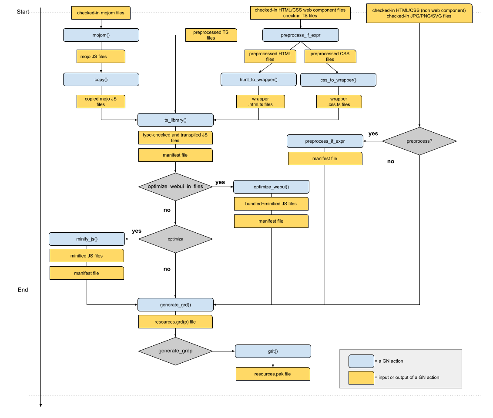
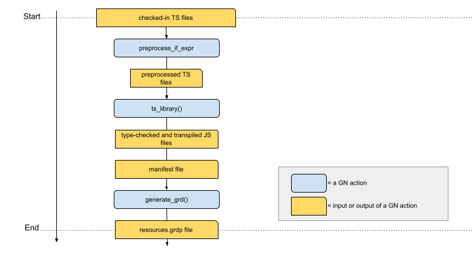

<style>
.doc h1 {
  margin: 0;
}

.doc h3,
.doc h4 {
  font-weight: bold;
}

.doc h4 {
  font-style: italic;
}
</style>

# WebUI Build Configuration

[TOC]

## WebUI BUILD.gn files
WebUI builds are configured using BUILD.gn files, which live in the top level
directory for a WebUI. For example, the BUILD.gn file for the Downloads page
is located at chrome/browser/resources/downloads/BUILD.gn.

These files specify the build steps necessary to convert the checked-in code to
the code that should be served at runtime.

## General guidance for using WebUI build rules
* WebUI build rules should typically only be used in WebUI-related folders
  (e.g. chrome/browser/resources, ui/webui/resources, and folders within
  components/ and content/ that contain WebUI code).

* WebUI build rules should only be used directly or via the wrapper rules
  documented here ([build_webui](#build_webui),
  [build_webui_tests](#build_webui_tests)). If you want to use any of the rules
  below from within another tool or script, please get a review from one of the
  cross-platform, non-backend WebUI [OWNERS](/ui/webui/PLATFORM_OWNERS).

## WebUI build rules

### **html_to_wrapper, css_to_wrapper**

These rules are used to inline HTML or CSS into a TypeScript file which can be
compiled by TS compiler and then imported with JS imports at runtime. This is
necessary when writing Web Components, which need to return their HTML in the
`template()` getter method.

By default, these rules accept input files from within the current directory.

By default, they output the wrapped `.html.ts` and `.css.ts` files to the target
generated directory (|target_gen_dir|).

#### **Arguments**
```
in_files: specifies the list of files to process with respect to the
          |in_folder|.
template: html_to_wrapper only. Valid values are:
          - "polymer" (default)
          - "native" (use when wrapping the HTML template of a non-Polymer web
             component)
          - "detect" (use when there are both Polymer and native web components)
in_folder: Specifies the input folder where files are located. If not specified,
           the current directory (of the BUILD.gn file) is used.
out_folder: Specifies the location to write the wrapped files. If not specified,
            |target_gen_dir| is used.
minify: Whether to minify HTML/CSS with
        third_party/node/node_modules/html-minifier. Defaults to false.
use_js: Whether to output .js files instead of .ts files. Defaults to false.
scheme: One of ['chrome', 'relative']. Defaults to 'relative'. Specifies whether
        dependencies of the generated wrapper file should be imported with
        "chrome://resources" or scheme-relative "//resources" URLs.
```

#### **Example**
```
import("//tools/polymer/html_to_wrapper.gni")
import("//tools/polymer/css_to_wrapper.gni")

# Generates "my_web_component.html.ts" in |target_gen_dir|.
html_to_wrapper("html_wrapper_files") {
  in_files = [ "my_web_component.html" ]
}

# Generates "my_style_module.css.ts" in |target_gen_dir|.
css_to_wrapper("css_wrapper_files") {
  in_files = [ "my_style_module.css" ]
}
```

### **preprocess_if_expr**

This rule is used to preprocess files containing `<if expr="*">`. These
expressions are most frequently used to enable code to only run on certain
platforms.

By default, reads input files from within the current directory and saves output
in |target_gen_dir|.

#### **Arguments**
```
in_folder: specifies the input folder, where all input files are located.
           Defaults to the folder where the BUILD.gn file resides.
out_folder: specifies the folder that the preprocessed files should be placed
            in. This must be a generated directory. Defaults to
            |target_gen_dir|.
in_files: specifies the list of input files to preprocess with respect to the
          |in_folder|.
out_manifest: Specifies a file where the list of output files and their
              directory should be written. This is most useful when the
              preprocessed files need to be listed in a grd file. Since
              preprocessed files are instead passed to ts_library in WebUIs
              that have been migrated to TypeScript, this is only used by
              WebUIs that have not been migrated to TypeScript yet.
defines: Optional parameter. Specifies additional variables that can be used in
         conditional expressions.
```
#### **Example:**
```
import("//tools/grit/preprocess_if_expr.gni")

# Preprocesses "my_web_component.html.ts" and my_style_module.css.ts in
# |target_gen_dir|, into "$target_gen_dir/preprocessed".
preprocess_if_expr("preprocess_generated") {
  # Depend on the targets that generates these files.
  deps = [
    ":css_wrapper_files",
    ":html_wrapper_files",
  ]
  in_folder = target_gen_dir
  in_files = [
    "my_style_module.css.ts",
    "my_web_component.html.ts",
  ]
  out_folder = "$target_gen_dir/$preprocess_folder"
  defines = [ "foo_enabled=false" ]
}

# Preprocess "my_web_component.ts" and "my_webui.ts" in the src dir into
# "$target_gen_dir/preprocessed".
preprocess_if_expr("preprocess_src") {
  in_folder = "."
  in_files = [
    "my_web_component.ts",
    "my_webui.ts",
  ]
  out_folder = "$target_gen_dir/$preprocess_folder"
  defines = [ "foo_enabled=true" ]
}
```

### **ts_library**

This rule is used to compile TypeScript code to JavaScript. It outputs JS files
corresponding to each TS file passed as an input into the designated output
directory, and generates a manifest listing all the files it has output named
$target_name.manifest in the target generated directory.

#### **Input File notes**
```
All input files must be valid TypeScript. This means, among other things, that
files shouldn't contain any `<if expr>`, i.e. they should already have been
preprocessed, if necessary. It also means that e.g. HTML or image files
shouldn't be passed to ts_library.

All files that aren't imported with an absolute path (e.g.
`import {assert} from 'chrome://resources/js/assert.js'; `) need to exist
inside the TypeScript root directory, at the expected location. For example,
if foo.ts in the top level directory contains the import statement
`import {Baz} from './bar/baz.js';`, then the folder structure when ts_library
is invoked should look like this:
  root_dir/
    foo.ts
    bar/
      baz.ts
```
#### **Arguments**
```
root_dir: This is the root directory where all TypeScript files to compile
          must reside (see note above).
out_dir: The directory where ts_library will write the compiled JavaScript
         files.
composite: Set this to "true" if the output needs to be used as a library by
           a different ts_library target (this frequently occurs when tests are
           compiled as a ts_library).
in_files: The input file paths to be compiled, with respect to the |in_folder|.
definitions: TypeScript definitions files used by the input TypeScript files,
             for example chrome.send or extension API definitions.
tsconfig_base: Specifies the tsconfig_base.json file to use. Necessary only
               if specifying configuration options for TS compiler that differ
               from the defaults in tools/typescript/tsconfig_base.json
deps: Specifies all other ts_library targets generating libraries that this
      target's library needs, for example the shared resources library at
      //ui/webui/resources/js:build_ts.
extra_deps: Used to specify build targets generating the input files for TS
            compiler.
path_mappings: Additional non-default path mappings for absolute imports. The
               absolute 'chrome://resources/' paths are already mapped for any
               resources in libraries that are listed in |deps|; for example
               adding "//ui/webui/resources/cr_elements:build_ts" in deps will
               automatically add the mapping for imports from that library
               (e.g. 'chrome://resources/cr_elements/cr_button/cr_button.js').
               Important: Adding path_mappings *does not* add the files mapped
               in |inputs| or the targets generating files to |deps|. To prevent
               flaky build errors, *always* do one of the following when adding
               a path_mapping:
               - Add the ts_library() target responsible for compiling .ts files
                 into the mapped generated directory to |deps|.
               - Add the ts_definitions(), copy(), preprocess_if_expr(), or
                 other target responsible for generating definitions files in
                 the mapped generated directory to |extra_deps|
               - Add all source .d.ts files your target uses from the mapped
                 source directory to |definitions|.
path_mappings_file: A .json file containing path mappings in the form
                    {url: [ dir1, dir2, ... ] } where dir* are relative to the
                   |target_gen_dir|.
manifest_excludes: List of input files to exclude from the output
                   the manifest file.
enable_source_maps: Defaults to the value of the enable_webui_inline_sourcemaps
                    GN flag. Setting it to "true" turns on TS compiler's
                    'inlineSourceMap' and 'inlineSources' flags. Non-inlined
                    source maps are currently not supported.
```

#### **Example**

```
import("//tools/typescript/ts_library.gni")

# Compiles and outputs my_webui.js, my_web_component.js and
# my_web_component.html.js, in the "$target_gen_dir/tsc" folder.
ts_library("build_ts") {
  root_dir = "$target_gen_dir/preprocessed"
  out_dir = "$target_gen_dir/tsc"
  in_files = [
    "my_webui.ts",
    "my_style_module.css.ts",
    "my_web_component.html.ts",
    "my_web_component.ts",
  ]
  # List other ts_library targets for libraries the UI needs here
  deps = [
    "//third_party/polymer/v3_0:library",
    "//ui/webui/resources/js:build_ts",
  ]
  definitions = [
    "//tools/typescript/definitions/chrome_send.d.ts",
  ]
  extra_deps = [
    ":copy_file",
    ":preprocess_src",
    ":preprocess_generated",
  ]
}
```

### **webui_path_mappings**

This rule generates a path mappings .json file named
'path_mappings_<target_name>.json' in |target_gen_dir| from a list of target
dependencies. Its output can be passed to ts_library's |path_mappings_file|
parameter.

Note that the rule only generates mappings for dependencies that are mapped
in path_mappings.py (e.g. //ui/webui/resources/ deps).

#### **Arguments**
```
ts_deps: List of ts_library() dependencies to generate path mappings for.
webui_context_type: What import scheme(s) should be mapped for the UI. Options:
                    'trusted': Maps chrome:// and scheme-relative imports.
                               Default value.
                    'untrusted': Maps chrome-untrusted:// and scheme-relative
                                 imports.
                    'relative': Maps scheme-relative imports only.
                    'trusted_only': Maps chrome:// imports only.
```

### **webui_ts_library**

This rule is a thin wrapper around ts_library() that defines 2 targets:
(1) a webui_path_mappings() ("path_mappings") target to generate a path mappings
    file from |deps|.
(2) a ts_library() target ("build_ts") that consumes the generated path
    mappings file along with all remaining arguments.

#### **Arguments**
webui_ts_library uses all the same arguments as ts_library, in addition to
the following:
```
webui_context_type: See |webui_context_type| in webui_path_mappings().
```

### **bundle_js**

This rule is used to bundle larger user-facing WebUIs for improved performance.
It is generally not needed for debug UIs or UIs that have very few files to
import.

#### **Arguments**
```
host: The WebUI host. If specified without a scheme, the assumed root location
      will be "chrome://<host>". If specified with a scheme (e.g.
      "chrome-extension://aaaaaaaaa") the full <host> argument will be the root.
input: The location of the input files to be bundled.
js_module_in_files: The names of the root files to bundle. These files should
                    import all other dependencies (directly or indirectly).
                    These should be specified with respect to |input|.
                    1 or 2 input files are supported. Each will result in one
                    output file named like the input with a new "rollup" suffix,
                    e.g. "foo/main.js" --> "foo/main.rollup.js". If 2 inputs are
                    specified, a third shared bundle file will also be created.
                    The shared bundle will be named "shared.rollup.js" and
                    located at the same relative path as the inputs.
out_manifest: File location to write the manifest of all output files created
              by bundle_js(). Useful for generating grds.
rollup_config: Optional parameter. The path to a custom Rollup configuration
               file. When specified it overrides the default auto-generated
               configuration file.
               Note: The custom configuration should not refer to other files
               (like plugin files), because such files are not automatically
               declared as `inputs`.
deps: Targets generating any files being bundled. Note that this should include
      targets generating shared resources that are expected to be bundled in
      the UI, e.g. //ui/webui/resources/js:build_ts.
excludes: Paths of files that are not bundled. Often used for large mojo files
          that would otherwise be in many bundles, and for cr.js which relies
          on global variables.
external_paths: Mappings between absolute URLs and paths where files imported
                from these URLs can be found. Used for files that are not in
                |input|. For example, the following external_path is
                automatically added for all targets:
                "chrome://resources/|$resources_path" where resources_path is
                the path to where ts_library()s within ui/webui/resources place
                their output (e.g. gen/ui/webui/resources/tsc).
                Note: all absolute URLs must either be listed in |excludes| or
                be mapped in |external_paths|, otherwise a build time error is
                raised.
out_folder: The location where bundled files will be placed in. Defaults to
            |target_gen_dir|.
```

#### **Example**
```
import("//ui/webui/resources/tools/bundle_js.gni")
import ("//chrome/common/features.gni")

# optimize_webui should generally only be called when the optimize_webui
# feature flag is enabled.
if (optimize_webui) {
  bundle_js("build") {
    host = "mywebui"
    js_module_in_files = [ "my_webui.js" ]  # will output my_webui.rollup.js
    input = rebase_path("$target_gen_dir/tsc", root_build_dir)
    out_manifest = "$target_gen_dir/build_manifest.json"
    # Assumes the JS files were generated by a ts_library target called
    # build_ts.
    deps = [
      ":build_ts",
      "//ui/webui/resources/js:build_ts",
    ]
    excludes = [
      "chrome://resources/js/cr.js",
      "chrome://resources/mojo/mojo/public/js/bindings.js",
    ]
  }
}
```

### **minify_js**

This rule is used to minify Javascript files to reduce build size.
This can be used alongside bundle_js(), if bundling and minifying is
desired.

#### **Arguments**
```
in_folder: The location of the input files to be minified.
in_files: The list of JS files to minify with respect to the |in_folder|.
out_folder: The location where minified files will be outputted.
out_manifest: The location to write the manifest file of all files
              outputted by minify_js(). Defaults to
              $target_gen_dir/${target_name}_manifest.json.
deps: Targets generating any files being minified.
```

#### **Example**
```
import("//ui/webui/resources/tools/minify_js.gni")
import ("//chrome/common/features.gni")

# minify_js should generally only be called when the optimize_webui
# GN flag is enabled.
if (optimize_webui) {
  minify_js("build") {
    in_files = [ "my_webui.js" ]
    in_folder = "$target_gen_dir/tsc"
    out_folder = "$target_gen_dir/minified"
    # Assumes the JS files were generated by a ts_library target called
    # build_ts.
    deps = [ ":build_ts" ]
  }
}
```

### **generate_grd**

This rule is used to list the WebUI resources that need to be served at runtime
in a grd file.

#### **Arguments**
```
input_files: Input file paths to list in the grd file.
input_files_base_dir: Directory in which |input_files| can be found.
deps: Lists any targets responsible for generating |input_files|,
      |grdp files|, or |manifest_files|.
manifest_files: List of manifest files listing additional files that should be
                added to the grd.
grdp_files: List of .grdp files that should be included in the grd. Generally
            such files are also created with generate_grd(). This option can
            only be used if a .grd file is produced, since .grdp files can't be
            nested.
grd_prefix: The prefix to use for the grd resource IDs. Resources will be named
            with the following pattern: IDR_GRD_PREFIX_INPUT_FILE_PATH
out_grd: The output grd file to write. Must end with either '.grd' or '.grdp'.
resource_path_prefix: Optional prefix to add to every path in input_files (after
                      the path has been processed by |resource_path_rewrites|).
                      Must not end in a `/` as it will automatically be added
                      when joining to each path.
resource_path_rewrites: Paths to rewrite. In general, the path in input_files,
                        or the path listed in a manifest, will be used as the
                        resource path, i.e. "foo/bar.js" will have that path
                        relative to the root "chrome://mywebui/" at runtime.
                        By specifying
                        resource_path_rewrites = [ "foo/bar.js|foo_bar.js" ],
                        the path will instead be "foo_bar.js". Usually only
                        needed in somewhat complicated cases.
```

#### **Example**
```
import("//ui/webui/resources/tools/generate_grd.gni")

generate_grd("build_grd") {
  input_files = [ "my_webui.html" ]
  input_files_base_dir = rebase_path(".", "//")
  deps = [ ":build_ts" ]
  manifest_files = filter_include(get_target_outputs(":build_ts"), [ "*_manifest.json" ])
  # Or, configure statically the manifest file name:
  # manifest_files = [ "$target_gen_dir/build_ts.manifest" ]
  grd_prefix = "my_webui"
  out_grd = "$target_gen_dir/${grd_prefix}_resources.grd"
}
```

### **grit**

This rule is used to create a pak file from the grd file that contains all the
listed resources, so that they can be included in the binary and served at
runtime. Without creating a grit rule (and hooking up the target to the build),
the WebUI will not load since the resources will not exist. This rule also
generates C++ header files that are used to add the files to a specific
WebUIController.

#### **Arguments**
```
defines: The defines that grit should use when making the pak file. Generally
         should include chrome_grit_defines.
enable_input_discovery_for_gn_analyze: If using generated grd files, this needs
                                       to be set to false.
source: The source grd file.
outputs: List of files to output. Should always include the name of the pak
         file, and should generally also list the C++ header file and C++ header
         and .cc files for the resources map.
output_dir: Location to put the pak file. Often "$root_gen_dir/chrome".
deps: Names of any targets generating the grd file, and names of any targets
      generating the files to be packed, if they are not already dependencies
      of the target generating the grd file (as is often, but not always, the
      case).
```

#### **Example**
```
import("//tools/grit/grit_rule.gni")

grit("resources") {
  defines = chrome_grit_defines

  enable_input_discovery_for_gn_analyze = false
  source = "$target_gen_dir/resources.grd"
  deps = [ ":build_grd" ]

  outputs = [
    "grit/my_webui_resources.h",
    "grit/my_webui_resources_map.cc",
    "grit/my_webui_resources_map.h",
    "my_webui_resources.pak",
  ]
  output_dir = "$root_gen_dir/chrome"
}
```

### **build_webui**

<!-- TODO(crbug.com/40230335): Elevate build_webui() to the top of this document
      after it has been deployed to a few places. -->

See the [go/build-webui-pipeline](http://go/build-webui-pipeline) design doc for
more info (internal only).

The flow diagram below shows a high level view of how a typical modern
user-facing WebUI is being built.



This umbrella rule captures the most common WebUI build pipeline configuration
and aims to hide the complexity of having to define all previously described
rules directly. Using build_webui() is the recommended approach for most modern
user-facing WebUIs that use WebComponents+TypeScript+Mojo.

The parameters passed to build_webui() are forwarded as needed to the other GN
rules described earlier.

Under the cover, build_webui() defines the following targets

* preprocess_if_expr("preprocess_ts_files")
* preprocess_if_expr("preprocess_html_css_files")
* create_js_source_maps("create_source_maps")
* html_to_wrapper("html_wrapper_files")
* css_to_wrapper("css_wrapper_files")
* copy("copy_mojo")
* webui_path_mappings("build_path_map")
* ts_library("build_ts")
* merge_js_source_maps("merge_source_maps")
* bundle_js("build_bundle")
* minify_js("build_min_js")
* generate_grd("build_grd")
* generate_grd("build_grdp")
* grit("resources")

Some targets are only conditionally defined based on build_webui() input
parameters.

Only ":build_ts", ":resources" and ":build_grdp" targets are public and can be
referred to from other parts of the build.

#### **Arguments**
```

List of files params:
static_files: Optional parameter. List of
              1) non Web Component HTML/CSS files (don't confuse with
                 |css_files| below). These are passed to preprocess_if_expr()
              2) JPG/PNG/SVG files. These are included in the build verbatim
                 without any preprocessing.

web_component_files:  List of TS files that hold Web Component definitions with
                      equivalent HTML template files. These can be either native
                      or Polymer Web Components. Optional parameter.

non_web_component_files:  List of TS files that are not Web Components, or
                          Web Component files that don't have a corresponding
                          HTML template (rare case). Optional parameter.

icons_html_files: List of HTML files that hold Polymer iron-iconset-svg
                  instances. Optional parameter.

css_files: List of CSS files that hold Polymer style modules, or CSS variable
           definitions. These are passed css_to_wrapper(). Optional parameter.

mojo_files: List of Mojo JS generated files. These will be copied to a temporary
            location so that they can be passed to ts_library() along with
            other files. Optional parameter.

mojo_files_deps: List of Mojo targets that generate |mojo_files|. Must be
                 defined if |mojo_files| is defined.

mojo_base_path: Specifies the directory under which Mojo files will be served at
                runtime. Optional parameter. Defaults to the top level folder
                '.', which results in Mojo files being served from
                'chrome://<webui_name>/foo.mojom-webui.js'.
                Example: Passing 'mojom-webui' would result in Mojo files being
                served from
                'chrome://<webui_name>/mojom-webui/foo.mojom-webui.js'.

TypeScript (ts_library()) related params:
ts_composite: See |composite| in ts_library(). Defaults to false, optional.
ts_out_dir: See |out_dir| in ts_library(). Optional parameter, defaults
            '$target_gen_dir/tsc'
ts_definitions: See |definitions| in ts_library(). Optional parameter.
ts_deps: See |deps| in ts_library(). Also used for webui_path_mappings().
         Optional parameter.
ts_extra_deps: See |extra_deps| in ts_library(). Optional parameter.
ts_path_mappings: See |path_mappings| in ts_library(). Optional parameter.
ts_tsconfig_base: The tsconfig file to use for ts_library(). Optional. Defaults
                  to "//tools/typescript/tsconfig_base_polymer.json" for UIs
                  that depend on Polymer (i.e. have
                  "//third_party/polymer/v3_0:library" in their |ts_deps|).
                  Defaults to "//tools/typescript/tsconfig_base_lit.json" for
                  UIs that do not depend on Polymer and depend on Lit (i.e. have
                  "//third_party/lit/v3_0:build_ts" in |ts_deps|). Defaults to
                  "//tools/typescript/tsconfig_base.json" for all other UIs.

HTML/CSS/JS optimization related params:
optimize: Specifies whether any optimization steps will be used. Defaults to the
          value of the optimize_webui GN flag.
          When true, html_to_wrapper() and css_to_wrapper() will be invoked with
          the |minify| flag on, to minify HTML/CSS code.
          When true, minify_js() will be invoked to minify JS code (using Terser).
          If |optimize_webui_in_files| is provided then bundle_js() will also be
          invoked to bundle JS code (using Rollup).
          |optimize_webui_host| must be specified if |optimize_webui_in_files|
          is provided.
optimize_webui_host: See |host| in bundle_js().
optimize_webui_excludes: See |excludes| in bundle_js(). Optional.
optimize_webui_external_paths: See |external_paths| in optimize_webui().
                               Optional.
optimize_webui_in_files: See |in_files| in bundle_js().

Other params:
webui_context_type: See |webui_context_type| in webui_path_mappings(). Optional,
                    defaults to "relative".
generate_grdp: Whether to generate grdp file instead of a grd file. Defaults to
               false.
grd_prefix: See |grd_prefix| in generate_grd(). Required parameter.
grd_resource_path_prefix: See |resource_path_prefix| in generate_grd(). Optional
                          parameter.
html_to_wrapper_template: See |template| in html_to_wrapper().
html_to_wrapper_scheme: See |scheme| in html_to_wrapper().
extra_grdp_deps: List of external generate_grd() targets that generate .grdp
                 files. These will be included in the final generated
                 resources.grd file. Optional parameter.
extra_grdp_files: Output .grdp files of external generate_grd() targets. Must be
                  defined if |extra_grdp_deps| is defined.
preprocessor_defines: Optional parameter. See |defines| in preprocess_if_expr().
grit_output_dir: See |output_dir| in grit(). Optional parameter, defaults to
                 "$root_gen_dir/chrome"
enable_source_maps: Defaults to "false". Incompatible with |optimize=true|.
                    Setting it to "true" turns on source map generation for a
                    few underlying targets. See ts_library()'s
                    |enable_source_maps| for more details.
```

#### **Example**
```
import("//ui/webui/resources/tools/build_webui.gni")

build_webui("build") {
  grd_prefix = "dummy-webui"

  static_files = [
    "index.html",
    "index.css",
  ]

  # Files holding a CustomElement element definition AND have an equivalent
  # .html template file.
  web_component_files = [
    "app.ts",
    "bar_view.ts",
    "foo_view.ts",
  ]

  # Files not holding a CustomElement element definition, or the CustomElement
  # does not have a corresponding HTML template.
  non_web_component_files = [
    "app_proxy.ts",
    "bar_proxy.ts",
    "foo_proxy.ts",
  ]

  # Files that are passed as input to css_to_wrapper().
  css_files = [
    "shared_style.css",
    "shared_vars.css",
  ]

  ts_definitions = [
    "//tools/typescript/definitions/chrome_send.d.ts",
    "//tools/typescript/definitions/metrics_private.d.ts",
  ]

  ts_deps = [
    "//third_party/polymer/v3_0:library",
    "//ui/webui/resources/cr_elements:build_ts",
    "//ui/webui/resources/js:build_ts",
  ]

  preprocessor_defines = [ "foo_enabled=false" ]
}

```

### **build_webui_tests**

The flow diagram below shows a high level view of how a typical modern user-facing
WebUI's tests are built.



This umbrella rule captures the most common WebUI test build pipeline
configuration and aims to hide the complexity of having to define multiple other
targets directly. Using build_webui_tests() is the recommended approach for most
modern user-facing WebUIs tests that reside under
chrome/test/data/webui/<webui_name>/ and are served from
chrome://webui-test/<webui_name>/

Under the cover, build_webui_tests() defines the following targets

* preprocess_if_expr("preprocess")
* webui_ts_library("build_ts")
* generate_grd("build_grdp")

The parameters passed to build_webui_tests() are forwarded as needed to
the targets above. Only the ":build_grdp" target is public and can be referred
to from other parts of the build.

#### **Arguments**
```
is_chrome_untrusted: Set to true if testing a chrome-untrusted:// UI. Optional
                     parameter. Allows importing shared test files from
                     chrome-untrusted://webui-test/ instead of
                     chrome://webui-test. Passing true will set
                     |webui_context_type| to 'untrusted' rather than 'trusted'
                     for webui_ts_library().

List of files params:
files: Required parameter. List of all test related files.

TypeScript (ts_library()) related params:
ts_tsconfig_base: See |tsconfig_base| in ts_library(). Optional parameter. If
                  not provided the default configuration at
                  '//chrome/test/data/webui/tsconfig_base.json' is used.
ts_composite: See |composite| in ts_library(). Defaults to false, optional.
ts_definitions: See |definitions| in ts_library(). Optional parameter.
ts_deps: See |deps| in ts_library(). Required parameter.
ts_path_mappings: See |path_mappings| in ts_library(). Optional parameter.

Grit (generate_grd()) related params:
resource_path_prefix: See |resource_path_prefix| in generate_grd(). Optional
                      parameter. Only specify it for targets residing outside of
                      //chrome/test/data/webui.
```

#### **Example**
```
import("//chrome/test/data/webui/settings/tools/build_webui_tests.gni")

build_webui_tests("build") {
  files = [
    "checkbox_tests.ts",
    "collapse_radio_button_tests.ts",
    "controlled_button_tests.ts",
    "controlled_radio_button_tests.ts",
    "dropdown_menu_tests.ts",
  ]

  ts_path_mappings =
      [ "chrome://settings/*|" +
        rebase_path("$root_gen_dir/chrome/browser/resources/settings/tsc/*",
                    target_gen_dir) ]

  ts_definitions = [
    "//tools/typescript/definitions/chrome_send.d.ts",
    "//tools/typescript/definitions/settings_private.d.ts",
  ]

  ts_deps = [
    "//chrome/browser/resources/settings:build_ts",
  ]
}

```

## Example build configurations

### **Simple UI with no web components**

```
This UI has only a single checked in TypeScript file, my_debug_page.ts, and a
checked in HTML file my_debug_page_index.html that imports the compiled JS
file using a script tag with `src="my_debug_page.js"` Neither of these files
use any `<if expr>`.
```

#### **BUILD.gn file**
```
import("//chrome/common/features.gni")
import("//tools/grit/grit_rule.gni")
import("//tools/typescript/ts_library.gni")
import("//ui/webui/resources/tools/generate_grd.gni")

# This UI has only a single TypeScript input file that does not define a Web
# Component. TS compiler will write out "$target_gen_dir/tsc/my_debug_page.js".
ts_library("build_ts") {
  root_dir = "."
  out_dir = "$target_gen_dir/tsc"
  in_files = [ "my_debug_page.ts" ]
  deps = [ "//ui/webui/resources/js:build_ts" ]
}

# Both the HTML file and the JS file created by ts_library need to be listed in
# the grd. The JS file is already listed in the build_ts.manifest generated by
# ts_library(). Pass the HTML file via |input_files|.
generate_grd("build_grd") {
  deps = [ ":build_ts" ]
  grd_prefix= "my_debug_page"
  out_grd = "$target_gen_dir/resources.grd"
  input_files = [ "my_debug_page_index.html" ]
  input_files_base_dir = rebase_path(".", "//")
  manifest_files = filter_include(get_target_outputs(":build_ts"), [ "*_manifest.json" ])
}

# Create the pak, header, and resource map files.
grit("resources") {
  defines = chrome_grit_defines

  # This arguments is needed since the grd is generated at build time.
  enable_input_discovery_for_gn_analyze = false
  source = "$target_gen_dir/resources.grd"
  deps = [ ":build_grd" ]
  outputs = [
    "grit/my_debug_page_resources.h",
    "grit/my_debug_page_resources_map.cc",
    "grit/my_debug_page_resources_map.h",
    "my_debug_page_resources.pak",
  ]
  output_dir = "$root_gen_dir/chrome"
}
```

### **Non-Polymer UI with Web Components**
```
This UI has a top level TypeScript file that imports a single Web Component,
my_debug_app.ts. It has a corresponding HTML file for the app and a HTML file
for the top level index. None of these files use any `<if expr>`.
```

#### **BUILD.gn file**
```
import("//chrome/common/features.gni")
import("//tools/grit/grit_rule.gni")
import("//tools/typescript/ts_library.gni")
import("//ui/webui/resources/tools/generate_grd.gni")
import("//tools/polymer/html_to_wrapper.gni")

# Generate the wrapper file. This UI isn't using Polymer, so it needs to set
# the |template| argument.
html_to_wrapper("html_wrapper_files") {
  in_files = [ "my_debug_app.html" ]
  template = "native"
}

# Copy the checked-in files to the same directory. This is needed so that the
# TypeScript compiler can find all the files in the expected location.
copy("copy_files") {
  sources = [
    "my_debug_app.ts",
    "my_debug_page.ts",
  ]
  outputs = [ "$target_gen_dir/{{source_file_part}}" ]
}

# This UI has 3 TypeScript input files. One is the generated
# my_debug_app.html.ts, two are checked in: my_debug_page.ts and
# my_debug_app.ts. TS compiler will write out:
# "$target_gen_dir/tsc/my_debug_app.html.js",
# "$target_gen_dir/tsc/my_debug_app.js", and
# "$target_gen_dir/tsc/my_debug_page.js".
ts_library("build_ts") {
  root_dir = target_gen_dir
  out_dir = "$target_gen_dir/tsc"
  in_files = [
    "my_debug_app.ts",
    "my_debug_app.html.ts",
    "my_debug_page.ts",
  ]
  deps = [ "//ui/webui/resources/js:build_ts" ]
  extra_deps = [
    ":copy_files",
    ":html_wrapper_files",
  ]
}

# The HTML file and the JS files created by ts_library need to be listed in
# the grd. The JS files are already listed in the build_ts.manifest generated by
# ts_library(). Pass the HTML file via |input_files|.
generate_grd("build_grd") {
  deps = [ ":build_ts" ]
  grd_prefix= "my_debug_page"
  out_grd = "$target_gen_dir/resources.grd"
  input_files = [ "my_debug_page_index.html" ]
  input_files_base_dir = rebase_path(".", "//")
  manifest_files = filter_include(get_target_outputs(":build_ts"), [ "*_manifest.json" ])
}

# Create the pak, header, and resource map files.
grit("resources") {
  defines = chrome_grit_defines

  # This arguments is needed since the grd is generated at build time.
  enable_input_discovery_for_gn_analyze = false
  source = "$target_gen_dir/resources.grd"
  deps = [ ":build_grd" ]
  outputs = [
    "grit/my_debug_page_resources.h",
    "grit/my_debug_page_resources_map.cc",
    "grit/my_debug_page_resources_map.h",
    "my_debug_page_resources.pak",
  ]
  output_dir = "$root_gen_dir/chrome"
}
```
