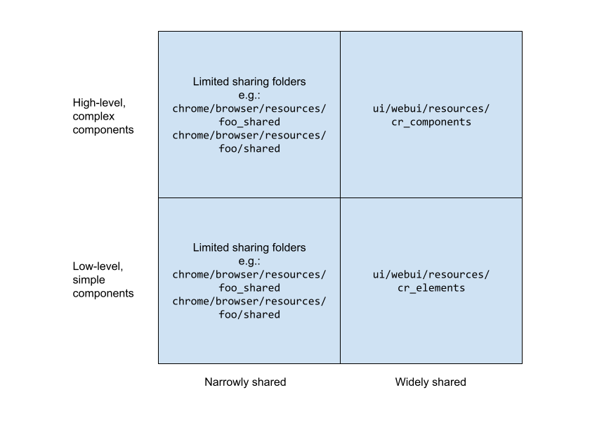

<style>
.doc h1 {
  margin: 0;
}

.doc h3,
.doc h4 {
  font-weight: bold;
}

.doc h4 {
  font-style: italic;
}
</style>

# **Sharing Code in WebUI**

## **Summary Diagram**

The following diagram summarizes the correct location for TypeScript/CSS/HTML
WebUI code that is used by 2 or more WebUIs. Details on how to determine which
category a specific piece of code belongs to follow.



## **Step 1: Determine whether the code should be widely or narrowly shared.**

**Widely shared code** should be located in `ui/webui/resources/` and will be
served from `chrome://resources` and `chrome-untrusted://resources` at runtime.
Code in these folders can be used by all UIs in Chrome (trusted and untrusted).
As a result, code in these folders **should be general purpose, and make sense
for any Chrome UI to use, not just UIs with specific properties**.

**Examples of general purpose code:**

*   Core UI elements like `cr_checkbox.ts` (lots of UIs have use for checkboxes)
*   Widely useful utilities like `assert.ts` (lots of UIs need to
    `assert(<some condition>) `or `assertNotReached()`)

***Rule of thumb: If code is needed by 3+ different WebUI surfaces, this
is often a good indicator that it is sufficiently general purpose to be widely
shared.***

**Narrowly shared code** should live in a specific folder that is a sibling of
folders that need to use it. For example, code in
`chrome/browser/resources/settings_shared` is used by `c/b/resources/settings`
and `c/b/resources/password_manager`. Narrowly shared libraries are packaged
with a `build_webui()` rule. UIs that need these libraries add a dependency on
the generated `ts_library()` target, and add the files from the generated `.grd`
to their data source.  Narrowly shared code is served from a designated path
from the individual UIs that use it (e.g. `chrome://settings` and
`chrome://password-manager` both serve code from `settings_shared` from
`/shared/settings/`) and it is only available to these UIs, and not to all
WebUIs in Chrome.

**Examples of code that multiple UIs use, but is not general purpose and
therefore is narrowly shared:**

*   UI code that is only useful for UIs that are in the Side Panel (belongs in
    `chrome/browser/resources/side_panel/shared`)
*   UI code that is only useful for UIs that have access to the
    `settingsPrivate` API and use the settings “prefs” mechanism (belongs in
    `chrome/browser/resources/settings_shared`)
*   UI code for viewing a PDF document (belongs in
    `chrome/browser/resources/pdf`)

## **How to add widely shared code**

The organization of `ui/webui/resources` subfolders is as follows:

**`js`**:
Used for general purpose utilities and some browser proxies.
Not for UI elements; should not depend on Polymer or Lit.

**`cr_elements`**:
Used for UI elements, styles, and mixins that meet the following requirements:
* Do not use `$i18n` replacements or the `I18nMixin`.
* Do not use `chrome.send`, Mojo, or extension APIs
For more details see the [cr_elements README](https://chromium.googlesource.com/chromium/src/+/main/ui/webui/resources/cr_elements/README.md)

**`cr_components`**:
Used for more complex UI elements or components that are widely shared, but
don’t fit the requirements for cr_elements. For more details see the
[cr_components README](https://chromium.googlesource.com/chromium/src/+/main/ui/webui/resources/cr_components/README.md)

**Note: All widely shared code in `ui/webui/resources` should have unit tests
at the time it is added to this folder**. Since the code is widely shared, it
is likely many developers from different teams will need to make changes, and
unit tests reduce the chance of such changes introducing regressions.
Regressions in shared code are also more likely to be high impact, since they
can impact many different UIs.

## **How to add narrowly shared code**

First, you will need to **create a folder for your narrowly shared code to
reside in**. This folder should be a sibling of the highest level folder(s)
that need to use it. Examples:

*   `chrome/browser/resources/settings/` and
    `chrome/browser/resources/password_manager/` share code in
    `chrome/browser/resources/settings_shared/`.
*   `chrome/browser/resources/side_panel/customize_chrome/` and
    `chrome/browser/resources/side_panel/bookmarks/` share code in
    `chrome/browser/resources/side_panel/shared`.

Second, you need to **set up a `build_webui()` target in your new shared
library folder**. This is largely the same as setting up a `build_webui()`
target in any other folder, with some important possible differences below:

*    `grd_resource_path_prefix` should be set to a path that you want all
     UIs sharing the code to import these files from at runtime. For example,
     the target in `settings_shared` sets this to `shared/settings`, and all
     settings code importing these files imports them from
     `/shared/settings/`.
*    `ts_composite` must be set to true, because other library targets will
     depend on the shared code.
*    `webui_context_type` should be set based on all UIs using the code. In
     particular, if both trusted and untrusted UIs will use the shared
     library, this should be set to `relative` so that no absolute `chrome://`
     or `chrome-untrusted://` paths are allowed (since such paths will not
     work in both trusted and untrusted contexts).

Third, **add dependencies and corresponding path mappings** in the build
targets that depend on the new shared library. This is best demonstrated with
an example:

```
build_webui("build_my_webui") {
  grd_prefix = "my_webui"
  # Other params here
  ts_deps = [
    "../foo_shared:build_ts",  # Limited shared library at ../foo_shared
    "//ui/webui/resources/js:build_ts",
  ]
  # Map to the output directory of the `ts_library` build rule for
  # chrome/browser/resources/foo_shared.
  ts_path_mappings = [
    "/foo_shared/*|" + rebase_path(
        "$root_gen_dir/chrome/browser/resources/foo_shared/tsc/*",
        target_gen_dir) ]
  # other stuff goes here
}
```

Fourth, **ensure that any UIs using the shared library will have access to the
resources at runtime**. This has a few steps:
*   Update `tools/gritsettings/resource_ids.spec` with an entry for the new
    generated shared `.grd` file.
*   Add a dependency on the shared library's generated `resources` target.
    This should typically be added in the same target or group that depends
    on the `resources` target(s) of the code relying on the library (often
    in `chrome/browser/resources/BUILD.gn`).
*   Add the generated `.pak` file in `chrome_paks.gni`.
*   Register the shared library's resources in any data source that needs to
    serve them at runtime (see example code below) using
    `WebUIDataSource::AddResourcePaths()`.

```cpp
#include "chrome/grit/foo_shared_resources.h"
#include "chrome/grit/bar_shared_resources.h"
// ...
HelloWorldUI::HelloWorldUI(content::WebUI* web_ui) {
  // ...
  // Add selected resources from foo_shared
  static constexpr webui::ResourcePath kResources[] = {
      {"foo_shared/foo_shared.css.js", IDR_FOO_SHARED_FOO_SHARED_CSS_JS},
      {"foo_shared/foo_shared_vars.css.js",
       IDR_FOO_SHARED_FOO_SHARED_VARS_CSS_JS},
  };
  source->AddResourcePaths(kResources);

  // Add all shared resources from bar_shared
  source->AddResourcePaths(
      base::make_span(kBarSharedResources, kBarSharedResourcesSize));
}
```
