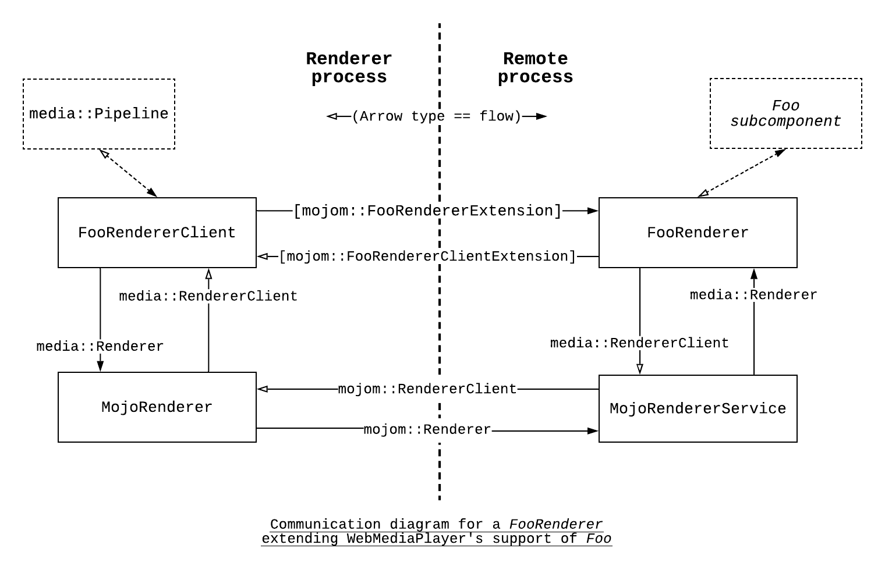

# media/mojo

This folder contains mojo interfaces, clients and implementations that extend
the core "media" target to support most out-of-process use cases, including
Media Player, Metrics (WatchTime), etc.

Currently the “media” target does not depend on mojo, so that other applications
can use the “media” target without having to pull in mojo dependency.

[TOC]

## Media Player

### Media Components

Media Player (`WebMediaPlayer`) supports HTML5 \<video\> playback in Chromium.
Internally, it depends on many **media components** to perform some specific
tasks, e.g. **media renderer**, **audio decoder**, **video decoder**, and
**content decryption module** (CDM). A CDM is required for a *media renderer*,
*audio decoder* or *video decoder* to handle protected content. See more details
in the general [media documentation](/media).

While most of HTML5 media player stack and Encrypted Media Extensions (EME)
stack live in the sandboxed render process (e.g. for security reasons), there
are some cases where some media components must live in a different process.
For example:

* A hardware-based media renderer, where all audio/video decoding and rendering
  happens in hardware, which is not accessible in the sandboxed render process.
* A hardware based video decoder, where the hardware decoding libraries are not
  accessible in the sandboxed render process.
* On Android, a media component depends on Android Java API, which is not
  accessible in the sandboxed render process.
* A CDM contains third-party code and should run in its own sandboxed process.

Here we provide a generic framework to support most out-of-process (OOP) media
component use cases in Chromium.

### Media Player Mojo Interfaces

We use mojom interfaces as the transport layer of each media component to
support hosting them remotely. These interfaces are called **media player mojo
interfaces**. They are very similar to their C++ counterparts:

* `media::Renderer` -> `media::mojom::Renderer`
* `media::AudioDecoder` -> `media::mojom::AudioDecoder`
* `media::VideoDecoder` -> `media::mojom::VideoDecoder`
* `media::ContentDecryptionModule` -> `media::mojom::ContentDecryptionModule`
* `media::Decryptor` -> `media::mojom::Decryptor`

### Enable Remote Media Components

Standard clients and implementations of these interfaces are provided. For
example, for `media::Renderer`, `MojoRenderer` implements `media::Renderer`, and
forwards calls to a `media::mojom::RendererPtr`. `MojoRendererService`
implements `media::mojom::Renderer`, and can host any `media::Renderer`
implementation.

Remote media components can be easily enabled and seamlessly integrated in the
current media pipeline. Simply set the gn argument `mojo_media_services` to
specify which remote media components you want to enable. For example, with the
following gn arguments, the media pipeline will enable `MojoRenderer` and
`MojoCdm`:
```
mojo_media_services = ["renderer", "cdm"]
```

### Media Mojo Interface Factory

`media::mojom::InterfaceFactory` has factory methods like `CreateRenderer()`,
`CreateCdm()` etc. It is used to request media player mojo interfaces.

In the render process, each `RenderFrameImpl` has a
`mojo::PendingRemote<media::mojom::InterfaceFactory>` which is used to request
 all media player mojo interfaces for that frame from the browser process. In
the browser process, each `RenderFrameHostImpl` owns a `MediaInterfaceProxy`,
which implements `media::mojom::InterfaceFactory`.

`MediaInterfaceProxy` is a central hub for handling media player mojo interface
requests. By default it will forward all the requests to the
[`MediaService`](#MediaService). But it also has the flexibility to handle some
special or more complicated use cases. For example:
* On desktop platforms, when library CDM is enabled, the
  `media::mojom::ContentDecryptionModule` request will be forwarded to the
  [`CdmService`](#CdmService) running in its own CDM (utility) process.
* On Android, the `media::mojom::Renderer` request is handled in the
  `RenderFrameHostImpl` context directly by creating `MediaPlayerRenderer` in
  the browser process, even though the `MediaService` is configured to run in
  the GPU process.
* On Chromecast, the `media::mojom::Renderer` and
  `media::mojom::ContentDecryptionModule` requests are handled by
  [`MediaRendererService`](#MediaRendererService) which runs in the browser
  process. The `media::mojom::VideoDecoder` request is handled by the default
  `MediaService` which runs in the GPU process.

Note that `media::mojom::InterfaceFactory` interface is reused in the
communication between `MediaInterfaceProxy` and `MediaService` (see
[below](#Site-Isolation)).

### Frameless Media Interface Factory

In addition to the main `MediaInterfaceProxy`, which handles requests from
ordinary media playback, `FramelessMediaInterfaceProxy` handles requests for
media cases that do not need or have a frame.

A frame is required for protected media playback because media decoding and
the CDM are associated within a frame.

The `FramelessMediaInterfaceProxy` is used by WebCodecs (which may be operating
in a worker context), by WebRTC, and for early querying of supported codecs.

### MediaService

The MediaService is a mojo `service_manager::Service` that provides media player
mojo interface implementations. It comes with some nice benefits.

#### Flexible Process Model

Different platforms or products have different requirements on where the remote
media components should run. For example, a hardware decoder typically should
run in the GPU process. The `ServiceManagerContext` provides the ability to run
a service in-process (browser) or in the GPU process. Therefore, by using a
`MediaService`, it’s very easy to support hosting remote media components
interfaces in most common Chromium process types (Browser/GPU). This can by set
using the gn argument  `mojo_media_host`,
e.g.
```
mojo_media_host = "browser" or “gpu”
```

MediaService is registered in `ServiceManagerContext` using `kMediaServiceName`.
`mojo_media_host` is checked to decide in which process the service is
registered to run.

#### Connects Different Media Components

Some remote media components depend on other components to work. For example, a
Renderer, an audio decoder or a video decoder needs a CDM to be able to handle
encrypted streams. Typically there's a `SetCdm()` call to connect the renderer
or decoder with the CDM. If, for example, a Renderer interface and a CDM
interface are hosted separately, then it will be hard to implement the
`SetCdm()` call. It would require an object or entity that are aware of both
sides to be able to connect them. `MediaService` handles this internally, and is
 actually serving as such an object or entity, so you don’t have to reinvent
 the wheel. See more details [below](#Using-CdmContext).

#### Customization through MojoMediaClient

`MediaService` provides everything needed to host an OOP media component, but
it doesn’t provide the media component itself. It’s up to the client of
`MediaService` to provide the concrete media component implementations.

The `MojoMediaClient` interface provides a way for `MediaService` clients to
provide concrete media components’ implementations. When `MediaService` is
created, a `MojoMediaClient` must be passed in so that `MediaService` knows how
to create the media components.

For example, ChromeCast uses `MediaService` to host a media Renderer and a CDM
in the browser process, and it provides the `CastRenderer` and `CastCdm` through
`CastMojoMediaClient`, a `MojoMediaClient` implementation. Note that this
overriding mechanism is not implemented everywhere. It’s trivial to add the
support and we’ll only add it when we need it.

#### Site Isolation

In Blink, both media element and EME MediaKeys belong to a `WebLocalFrame`. In
Chromium, this translates to media player and CDM belonging to a `RenderFrame`.
In the render process, this is clear. However, when hosting all remote media
components in a single `MediaService` (service manager only supports one service
instance per process), the Frame boundary could get fuzzy. This will be
especially dangerous for media components that interact with each other.
For example, a Renderer from foo.com lives in the same MediaService instance as
a CDM from bar.net. It would be  wrong if the bar.net CDM is set on the foo.com
Renderer to handle decryption.

To prevent this from happening, we introduce an additional layer to simulate
the `RenderFrame` boundary. A MediaService hosts multiple InterfaceFactory
(one per `RenderFrame`), and each InterfaceFactory creates and manages media
components it creates.

For this reason, `media::mojom::InterfaceFactory` interface is reused in the
communication between `MediaInterfaceProxy` and `MediaService`.

> Note: there are plans to split apart the responsibilities of
`media::mojom::InterfaceFactory` to make it clear which interfaces are used
where.

#### Specialized Out-of-Process media::Renderers

The `media::Renderer` interface is a simple API, which is general enough to
capture the essence of high level media playback commands. This allows us to
extend the functionality of the `WebMediaPlayer` via **specialized renderers**.
Specifically, we can build a sub-component that encapsulates the complexities of
an advanced scenario, write a small adapter layer that exposes the component as
a `media::Renderer`, and embed it within the existing `media::Pipeline` state
machine. Specialized Renderers reduce technical complexity costs, by limiting
the scope of details to the files and classes need them, by requiring little
control flow boilerplate, and by generally having little impact on the default
paths that `WebMediaPlayer` uses most of the time.

Two examples of complex scenarios enabled by specialized renderers are: handling
HLS playback on Android by delegating it to the Android Media Player (see
`MediaPlayerRenderer`) and casting "src=" media from an Android phone to a cast
device (see `FlingingRenderer`). Both of these examples have sub-components that
need to live in the Browser process. We therefore proxy the
`MediaPlayerRenderer` and `FlingingRenderer` to the Browser process, using the
Mojo interfaces defined in renderer.mojom and renderer_extensions.mojom. This
idea can be generalized to handle any special case *Foo scenario* as a
**specialized OOP FooRenderer**.

The classes required to create a *specialized OOP FooRenderer* come in pairs,
serving similar purposes in their respective processes. By convention, the
`FooRenderer` lives in the target process and the `FooRendererClient` lives in
the Renderer process. The `MojoRenderer` and `MojoRendererService` proxies
`media::Renderer` and `media::RendererClient` calls to/from the
`FooRenderer[Client]`. One-off commands and events that can't be expressed as a
`media::Renderer[Client]` call are carried across process boundaries by
*renderer extensions* instead (see `renderer_extension.mojom`). The
`FooRenderer[Client]Extension` mojo interfaces are implemented by their
respective `FooRenderer[Client]` instances directly. The
`FooRenderer[Client]Factory` sets up the scenario specific boilerplate, and all
of the mojo interface pointers/requests needed to talk to the other process.
Interface pointers and requests are connected across process boundaries when
mojom::InterfaceFactory::CreateFooRenderer() is called. The end result is
illustrated below:



To allow the creation and use of a FooRenderer within WebMediaPlayer, a
`FooRendererClientFactory` must be built and passed to the
`RendererFactorySelector`. The `RendererFactorySelector` must also be given a
way to query if we are currently in a scenario that requires the use of the
`FooRenderer`. When we enter a *Foo scenario*, cycling the `media::Pipeline` via
suspend()/resume() should be enough for the next call to
`RendererFactorySelector::GetCurrentFactory()` to return the
`FooRendererClientFactory`. When `RendererFactory::CreateRenderer()` is called,
the pipeline will receive a `FooRendererClient` as an opaque `media::Renderer`.
The default pipeline state machine will control the OOP `FooRenderer`.
When we exit the *Foo scenario*, cycling the pipeline once more should bring us
back into the right state.

#### Support Other Clients

`MediaService`, as a `service_manager::Service`, can be used by clients other
than the media player in the render process. For example, we could have another
(mojo) service that handles audio data and wants to play it in a media Renderer.
Since `MediaService` is a mojo service, it’s very convenient for any other mojo
service to connect to it through a `service_manager::mojom::Connector` and use
the remote media Renderer it hosts.

### CdmService

Although `MediaService` supports `media::mojom::CDM`, in some cases (e.g.
library CDM on desktop) the remote CDM needs to run in its own process,
typically for security reasons. `CdmService` is introduced to handle this. It
also implements `service_manager::Service`, and is registered in
`ServiceManagerContext` using `kCdmServiceName`. Currently it’s always
registered to run in the utility process (with CDM sandbox type). `CdmService`
also has additional support on library CDM, e.g. loading the library CDM etc.
Note that `CdmService` only supports `media::mojom::CDM` and does NOT support
other media player mojo interfaces.

### MediaRendererService

`MediaRendererService` supports `media::mojom::Renderer` and
`media::mojom::CDM`. It's hosted in a different process than the default
`MediaService`. It's registered in `ServiceManagerContext` using
'kMediaRendererServiceName`. This allows to run `media::mojom::VideoDecoder` and
`media::mojom::Renderer` in two different processes. Currently Chromecast use
this to support `CastRenderer` `CDM` in browser process and GPU accelerated
video decoder in GPU process. The main goals are:
1. Allow two pages to hold their own video pipeline simultaneously, because
   `CastRenderer` only support one video pipeline at a time.
2. Support GPU accelerated video decoder for RTC path.

### Mojo CDM and Mojo Decryptor

Mojo CDM is special among all media player mojo interfaces because it is needed
by all local/remote media components to handle encrypted buffers:

1. Local media components like `DecryptingDemuxerStream`,
   `DecryptingAudioDecoder` and `DecryptingVideoDecoder`.
2. Remote media components hosted in `MediaService`, e.g. by
   `MojoRendererService`, `MojoAudioDecoderService` and
   `MojoVideoDecoderService`.

At the JavaScript layer, the media player and MediaKeys are connected via
[`setMediaKeys()`](https://w3c.github.io/encrypted-media/#dom-htmlmediaelement-setmediakeys).
This is implemented by `SetCdm()` in the render process.

A media component can use a CDM in two ways.

#### Using a Decryptor (via CdmContext)

Some CDM provides a `Decryptor` implementation, which supports decrypting
methods directly, e.g. `Decrypt()`, `DecryptAndDecode()` etc. Both the
`AesDecryptor` and library CDM support the `Decryptor` interface.

In the case of a remote CDM, e.g. hosted by `MojoCdmService` in `MediaService`
or `CdmService`, if the remote CDM supports the `Decryptor` interface, the
`MojoCdm` will also support the `Decryptor` interface, implemented by
`MojoDecryptor`, which set up a new message pipe to forward all `Decryptor`
calls to the `Decryptor` in the remote CDM.

#### Using CdmContext

In some cases the media component is set to work with a specific CDM. For
example, on Android, MediaCodec-based decoders (e.g. `MediaCodecAudioDecoder`)
can only use MediaDrm-based CDM via `MediaCryptoContext`. The media component
and the CDM must live in the same process because the interaction of these two
are typically happening deep at the OS level. In theory, they can both live in
the render process. But in practice, typically both the CDM and the media
component are hosted by the MediaService in a remote (e.g. GPU) process.

To be able to attach a remote CDM with a remote media component, each
`InterfaceFactoryImpl` instance (corresponding to one `RenderFrame`) in the
`MediaService` maintains a `MojoCdmServiceContext` that keeps track of all
remote CDMs created for the `RenderFrame`. Each remote CDM is assigned a unique
CDM ID, which is sent back to the `MojoCdm` in the render process. In the render
process, when `SetCdm()` is called, the CDM ID is passed to the local media
component (e.g. `MojoRenderer`), which is forwarded the remote media component
(e.g. `MojoRendererService`). The remote media component will talk to
`MojoCdmServiceContext` to get the `CdmContext` associated with the CDM ID, and
complete the connection.

### Secure Auxiliary Services

Media components often need other services to work. In the render process, the
local media components get services from content layer through the `MediaClient`
interface. In `MediaService` and `CdmService`, remote media components get
services from the through **secure auxiliary services**.

Some services do require `RenderFrame` or user profile identity, e.g. file
system. Since media components all belong to a given `RenderFrame`, we must
maintain the frame identity when accessing these services for security reasons.
These services are called secure auxiliary services. `FrameServiceBase` is a
base class for all secure auxiliary services to help manage the lifetime of
these services (e.g. to handle navigation).

When a `MediaInterfaceProxy` is created, in addition to providing the
`media::mojom::InterfaceFactory`, the `RenderFrame` is provisioned with a
`media::mojom::FrameInterfaceFactory` that exposes these secure auxiliary
services on a per-frame basis. The `FrameInterfaceFactory` directly provides
services from //content, and it provides a way for //content embedders to
register additional auxiliary services via the `BindEmbedderReceiver()` method.

Currently only the remote CDM needs secure auxiliary services. This is a list of
currently supported services:

* `OutputProtection`: to check output protection status
* `PlatformVerification`: to check whether the platform is secure
* `CdmFileIO`: for the CDM to store persistent data
* `ProvisionFetcher`: for Android MediaDrm device provisioning

### Security

In most cases, the client side runs in the renderer process which is the least
trusted. Also always assume the client side code may be compromised, e.g. making
calls in random order or passing in garbage parameters.

Due to the [Flexible Process Model](#Flexible-Process-Model), it's sometimes
hard to know in which process the service side runs. As a rule of thumb, assume
all service side code may run in a privileged process (e.g. browser process),
including the common supporting code like `MojoVideoDecoderService`, as well as
the concrete [Media Component](#Media-Components), e.g. MediaCodecVideoDecoder
on Android.  To know exactly which [Media Component](#Media-Components) runs in
which process in production, see [Adoption](#Adoption) below.

Also note that all the [Secure Auxiliary Services](#Secure-Auxiliary-Services)
are running in a more privileged process than the process where the media
components that use them run in. For example, all of the existing services run
in the browser process. They must defend against compromised media components.

### Adoption

#### Android

* `MediaService` in the GPU process (registered in `GpuServiceFactory` with
  `GpuMojoMediaClient`)
* `MojoCdm` + `MediaDrmBridge` (CDM)
* `MediaDrmBridge` uses mojo `ProvisionFetcher` service for CDM provisioning
* `MojoAudioDecoder` + `MediaCodecAudioDecoder`
* `MojoVideoDecoder` + `MediaCodecVideoDecoder` (in progress)
* HLS support:
    * `MojoRenderer` + `MediaPlayerRenderer`
    * NOT using `MediaService`. Instead, `MojoRendererService` is hosted by
      `RenderFrameHostImpl`/`MediaInterfaceProxy`  in the browser process
      directly.
* Flinging media to cast devices (RemotePlayback API):
    * `MojoRenderer` + `FlingingRenderer`
    * NOT using `MediaService`. Instead, `MojoRendererService` is hosted by
      `RenderFrameHostImpl`/`MediaInterfaceProxy`  in the browser process
      directly.

#### ChromeCast

* `MediaService` in the Browser process (registered in
  `CastContentBrowserClient` with `CastMojoMediaClient`)
* `MojoRenderer` + `CastRenderer`
* `MojoCdm` + `CastCdm`

#### Desktop (ChromeOS/Linux/Mac/Windows)

* CdmService
    * `CdmService` in the utility process (registered in `UtilityServiceFactory`
      with `ContentCdmServiceClient`)
    * `MojoCdm` + `CdmAdapter` + Library CDM implementation
    * `CdmAdapter` uses various secure auxiliary services
* MediaService (in progress)
    * `MediaService` in the GPU process (registered in `GpuServiceFactory` with
      `GpuMojoMediaClient`)
    * `MojoVideoDecoder` + hardware video decoders such as D3D11VideoDecoder

## Other Services

> TODO(xhwang): Add documentation on other mojo services, e.g. remoting, etc.

