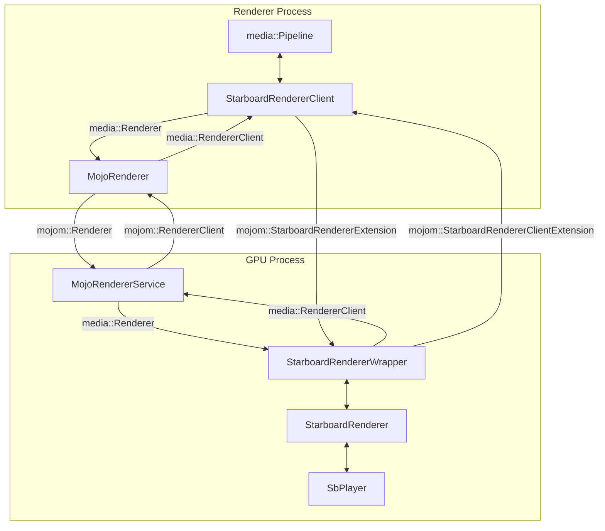

# StarboardRenderer as MojoRenderer

This document explains the communication architecture between the Renderer
Process and the GPU Process when using the `StarboardRenderer`. It details
how Mojo IPC (Inter-Process Communication) enables a clean, bidirectional
command and callback flow.

Note: Single-process mode runs all of the browser and renderer code in a
single process. Because `StarboardRenderer` runs in single-process mode,
the "process" in this document refers to **thread**. For more details, see
[go/starboard-renderer-media-pipeline](http://go/starboard-renderer-media-pipeline).

## Core Architecture

In a modern browser architecture, media playback is split across at least
two processes to ensure security and stability:

*   **Renderer Process**: A sandboxed process that handles web content,
    including the main `media::Pipeline`. It is the "client" in this
    model.
*   **GPU Process**: A more privileged process that has direct access to the
    system's graphics and media hardware. The `StarboardRenderer`, which
    is the core media engine, lives here.

Direct function calls between these processes are not possible. **Mojo** is
the IPC framework that bridges this gap. It uses `.mojom` files to define
strict interfaces, creating proxy objects that make cross-process
communication look like a local function call.

### Figure 1: StarboardRenderer as MojoRenderer


The key components are:

*   **In the Renderer Process**:
    *   `StarboardRendererClient`: The client-side logic component. It
        translates media pipeline requests into Mojo calls and receives
        callbacks from the renderer.
    *   `MojoRenderer`: A generic Mojo proxy that sends commands to the GPU
        process.

*   **In the GPU Process**:
    *   `MojoRendererService`: The service that receives commands from the
        `MojoRenderer` proxy.
    *   `StarboardRendererWrapper`: Implements the Mojo interfaces and wraps
        the core renderer, acting as an adapter.
    *   `StarboardRenderer`: The actual platform-specific renderer engine
        that calls the Starboard (`SbPlayer`) APIs.

This architecture allows the generic media pipeline to control a
platform-specific renderer in another process.

---

## Design Deep Dive: The Extension Interface Pattern

A crucial design choice in this architecture is the use of
`mojom::StarboardRendererExtension` and
`mojom::StarboardRendererClientExtension` instead of adding functions
directly to the base `mojom::Renderer` and `mojom::RendererClient`
interfaces. This follows a key software design principle: **the separation
of a generic interface from a specific implementation.**

The Chromium ecosystem contains many different types of media renderers,
each tailored to a specific platform or purpose. For example:
*   `MediaFoundationRenderer`: Used on Windows to leverage the built-in
    Media Foundation framework for hardware-accelerated playback.
*   `StarboardRenderer`: Used on specific hardware platforms (like Cobalt)
    that have their own native media players exposed through the Starboard
    API.

The core `mojom::Renderer` and `mojom::RendererClient` interfaces define a
**universal contract** that the media pipeline can use to communicate with
*any* of these renderers. They contain only the fundamental functions that
are guaranteed to exist for every renderer type (e.g., `Initialize`,
`Flush`, `OnError`, `OnEnded`).

Adding a platform-specific function like `OnVideoGeometryChange` (which is
only relevant for renderers like `StarboardRenderer` that control a
hardware video plane) to the base `mojom::Renderer` interface would be
problematic:
*   **Interface Pollution**: Every other renderer implementation
    (`MediaFoundationRenderer`, etc.) would be forced to have an
    `OnVideoGeometryChange` method, even though it is meaningless for
    them. This leads to confusing, boilerplate code.
*   **Violates Interface Segregation Principle**: It would force the
    generic media pipeline and other renderer clients to be aware of and
    depend on functions they will never use.
*   **Tight Coupling**: The generic `mojom::Renderer` interface would become
    tightly coupled to the specific needs of one platform, violating the
    goal of keeping the core pipeline clean and agnostic.

The **Extension Pattern** solves this by creating separate, optional
interfaces for specialized functionality. The `StarboardRendererClient`
specifically requests the `mojom::StarboardRendererExtension`. If it gets
it, it can use the specialized functions. If it were talking to a
`MediaFoundationRenderer`, it would not receive this interface and would not
attempt to call its methods.

This maintains a clean, universal contract for `mojom::Renderer` and
`mojom::RendererClient` while allowing for powerful, opt-in features in
specific implementations.

---

## Example 1: Command Flow (Renderer -> GPU) with `OnVideoGeometryChange`

This example shows how the client tells the renderer to do something. The
goal is to inform the `StarboardRenderer` that the video's size or
position on the screen has changed.

**Scenario**: The user scrolls a page, moving a video element. The
browser's layout engine calculates the new position (`gfx::Rect`) for the
video. This geometry must be sent to the native video player to move the
video plane accordingly.

The communication is defined by an extension interface, found in
`media/mojo/mojom/renderer_extensions.mojom`:

```mojom
// Implemented in the GPU process by StarboardRendererWrapper
interface StarboardRendererExtension {
  OnVideoGeometryChange(gfx.mojom.Rect rect);
};
```

### Step-by-Step Flow:

1.  **Initiation (Renderer Process)**
    The `StarboardRendererClient` receives the new video geometry from the
    browser's layout system. It holds a Mojo `remote` proxy object
    (`renderer_extension_`) that points to the
    `StarboardRendererExtension` implementation in the GPU process
    (i.e., `StarboardRendererWrapper`).

    ```cpp
    // In StarboardRendererClient (Renderer Process)
    void StarboardRendererClient::OnVideoGeometryChange(
        const gfx::RectF& rect_f,
        gfx::OverlayTransform /* transform */) {
      DCHECK(media_task_runner_->RunsTasksInCurrentSequence());
      gfx::Rect new_bounds = gfx::ToEnclosingRect(rect_f);
      renderer_extension_->OnVideoGeometryChange(new_bounds);
    }
    ```

2.  **Reception (GPU Process)**
    The `StarboardRendererWrapper` implements the
    `StarboardRendererExtension` interface. When the IPC message arrives,
    Mojo invokes the implementation of `OnVideoGeometryChange` on the
    wrapper.

    ```cpp
    // In StarboardRendererWrapper (GPU Process)
    void StarboardRendererWrapper::OnVideoGeometryChange(
        const gfx::Rect& output_rect) {
      DCHECK_CALLED_ON_VALID_THREAD(thread_checker_);
      GetRenderer()->OnVideoGeometryChange(output_rect);
    }
    ```

3.  **Execution (GPU Process)**
    The `StarboardRenderer` receives the new bounds and uses the Starboard
    API to command the native player.

    ```cpp
    // In StarboardRenderer (GPU Process)
    void StarboardRenderer::OnVideoGeometryChange(const gfx::Rect& output_rect) {
      set_bounds_helper_->SetBounds(output_rect.x(), output_rect.y(),
                                    output_rect.width(), output_rect.height());
    }
    ```

---

## Example 2: Callback Flow (GPU -> Renderer) with `PaintVideoHoleFrame`

This example shows the reverse flow: how the renderer notifies the client
of an event. The goal is to signal the Renderer Process that it should
"punch out" a transparent hole in its UI, allowing the native video to
show through from behind.

**Scenario**: The `StarboardRenderer` is ready to display video. It needs
to tell the `StarboardRendererClient` to create a `CompositorFrame` with a
hole at the video's location.

This callback is defined in the `mojom::StarboardRendererClientExtension`
interface, found in `media/mojo/mojom/renderer_extensions.mojom`, which
the `StarboardRendererClient` class implements.

```mojom
// Implemented in the Renderer process by StarboardRendererClient
interface StarboardRendererClientExtension {
  PaintVideoHoleFrame(gfx.mojom.Size size);
};
```

### Step-by-Step Flow:

1.  **Callback Injection (GPU Process)**
    During initialization, the `StarboardRendererWrapper` "injects" its
    own methods as callbacks into the `StarboardRenderer`. This is a key
    design pattern that keeps the core renderer unaware of Mojo. The
    wrapper passes a `base::RepeatingCallback` that is bound to its own
    `OnPaintVideoHoleFrameByStarboard` method.

    ```cpp
    // In StarboardRendererWrapper::Initialize()
    GetRenderer()->SetStarboardRendererCallbacks(
        base::BindRepeating(
            &StarboardRendererWrapper::OnPaintVideoHoleFrameByStarboard,
            weak_factory_.GetWeakPtr()),
        ...);
    ```

2.  **Initiation (GPU Process)**
    Later, when the `StarboardRenderer` needs to signal that a hole should
    be painted (e.g., after the video configuration changes), it invokes
    the stored callback. It has no knowledge that this will trigger an IPC
    call.

    ```cpp
    // In StarboardRenderer::UpdateDecoderConfig()
    paint_video_hole_frame_cb_.Run(
        stream->video_decoder_config().visible_rect().size());
    ```

3.  **Mojo Call (GPU Process)**
    The execution now jumps back to the `StarboardRendererWrapper`, which
    performs the Mojo call. The wrapper holds a Mojo `remote`
    (`client_extension_remote_`) that points to the
    `StarboardRendererClientExtension` implementation in the Renderer
    process (i.e., `StarboardRendererClient`).

    ```cpp
    // In StarboardRendererWrapper (GPU Process)
    void StarboardRendererWrapper::OnPaintVideoHoleFrameByStarboard(
        const gfx::Size& size) {
      DCHECK_CALLED_ON_VALID_THREAD(thread_checker_);
      client_extension_remote_->PaintVideoHoleFrame(size);
    }
    ```

4.  **Reception and Execution (Renderer Process)**
    The `StarboardRendererClient` receives the IPC call and executes the
    final action: painting a hole in the UI via the `VideoRendererSink`.

    ```cpp
    // In StarboardRendererClient (Renderer Process)
    void StarboardRendererClient::PaintVideoHoleFrame(const gfx::Size& size) {
      DCHECK(media_task_runner_->RunsTasksInCurrentSequence());
      video_renderer_sink_->PaintSingleFrame(
          video_overlay_factory_->CreateFrame(size));
    }
    ```

## Conclusion

The "StarboardRenderer as MojoRenderer" architecture uses Mojo to create a
robust, bidirectional communication channel between the Renderer and GPU
processes.

*   **Commands** flow from the client to the renderer
    (`OnVideoGeometryChange`), allowing the browser to control native
    video playback.
*   **Callbacks** flow from the renderer back to the client
    (`OnPaintVideoHoleFrame`), allowing the native player to notify the
    browser of important events.

This clean separation, enabled by type-safe Mojo interfaces, effectively
decouples the high-level media pipeline from the low-level,
platform-specific implementation, enhancing security and stability.

---

## References

*   **`StarboardRendererClient`**:
    `media/mojo/clients/starboard/starboard_renderer_client.h`
*   **`StarboardRendererWrapper`**:
    `media/mojo/services/starboard/starboard_renderer_wrapper.h`
*   **`StarboardRenderer`**:
    `media/starboard/starboard_renderer.h`
*   **`Extension Interfaces`**:
    `media/mojo/mojom/renderer_extensions.mojom`
