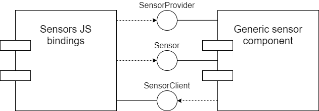
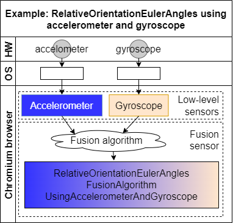
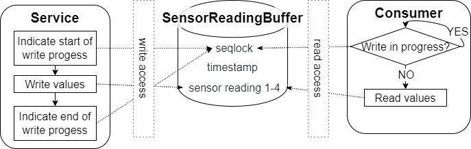

# Sensors

[TOC]

## Introduction

This document explains how sensor APIs (such as Ambient Light Sensor,
Accelerometer, Gyroscope, Magnetometer) are implemented in Chromium.

This directory contains the platform-specific parts of the
implementation, which is used, among others, by the [Generic Sensor
API](https://w3c.github.io/sensors/) and the [Device Orientation
API](https://w3c.github.io/deviceorientation/).

The document describes the Generic Sensor API implementation in both
the renderer and the browser process and lists important
implementation details, such as how data from a single platform sensor
is distributed among multiple JavaScript sensor instances and how
sensor configurations are managed.

## Background

The Generic Sensor API defines base interfaces that should be implemented by
concrete sensors. In most cases, concrete sensors should only define
sensor-specific data structures and, if required, sensor configuration options.

The same approach is applied to the implementation in Chromium, which was
designed with the following requirements in mind:

1.  Share the crucial parts of functionality between the concrete sensor
    implementations. Avoid the code duplication and thus simplify maintenance and
    development of new features.
1.  Support simultaneous existence and functioning of multiple JS Sensor
    instances of the same type that can have different configurations and
    lifetimes.
1.  Support for both “slow” sensors that provide periodic updates (e.g.
    Ambient Light, Proximity), and “fast” streaming sensors that have low-latency
    requirements for sensor reading updates (motion sensors).

**Note**: the implementation is architected in such a way that Blink (i.e.
`third_party/blink/renderer/modules/sensor`) is just a consumer of the data from
`services/device/generic_sensor` like any other. For example, the Blink [Device
Orientation API](/third_party/blink/renderer/modules/device_orientation/)
consumes sensor data from `//services` independently from the Blink Generic
Sensor implementation. The same applies to
[`device/vr/orientation`](/device/vr/orientation).

## Implementation Design

### Main components and APIs

The Generic Sensor API implementation consists of two main components: the
`sensor` module in Blink
([//third_party/blink/renderer/modules/sensor/](/third_party/blink/renderer/modules/sensor/))
which contains JS bindings for Generic Sensor API and concrete sensors APIs, and
the `generic_sensor` device service
([//services/device/generic_sensor/](/services/device/generic_sensor/)) \- a set
of classes running on the service process side that eventually call system APIs
to access the actual device sensor data.

The `//services` side also includes a few other directories:

*   `//services/device/public/cpp/generic_sensor` contains C++ classes and data
    structures used by both `//services/device/generic_sensor` as well as its
    consumers.
*   `//services/device/public/mojom` contains Mojo interfaces by the Generic
    Sensor implementation.
    *   [SensorProvider](/services/device/public/mojom/sensor_provider.mojom)
        is a “factory-like” interface that provides data about the sensors
        present on the device and their capabilities (reporting mode, maximum
        sampling frequency), and allows users to request a specific sensor or
        request that a specific sensor be backed by a "virtual sensor" for
        testing purposes. Note that Blink calls go through
        [WebSensorProvider](/third_party/blink/public/mojom/sensor/web_sensor_provider.mojom)
        first.
    *   [Sensor](/services/device/public/mojom/sensor.mojom) is an interface
        wrapping a concrete device sensor.
    *   [SensorClient](/services/device/public/mojom/sensor.mojom) is
        implemented by Blink (and other consumers) to be notified about errors
        occurred on platform side and about sensor reading updates for sensors
        with ‘onchange’ reporting mode.

The Blink implementation also contains the following directories:

*   `third_party/blink/public/mojom/sensor` contains the Mojo interfaces that
    are exposed to Blink users.
    *   [WebSensorProvider](/third_party/blink/public/mojom/sensor/web_sensor_provider.mojom)
        provides an API that is a subset of what `SensorProvider` exposes. This
        allows the latter to offer privileged methods that should not be
        visible or accessible by Blink. The translation between the two Mojo
        interfaces happens in `//content`.
    *   [WebSensorProviderAutomation](/third_party/blink/public/mojom/sensor/web_sensor_provider_automation.mojom)
        is used by the Internals code in Blink to communicate with
        `WebTestVirtualSensorProvider` and allow content_shell to invoke
        virtual sensor operations.

Actual sensor data is not passed to consumers (such as Blink) via Mojo
calls \- a shared memory buffer is used instead, thus we avoid filling up the
Mojo IPC channel with sensor data (for sensors with continuous reporting mode) when
the platform sensor has a high sampling frequency, and also avoid adding extra
latency.

A high-level diagram of the Mojo architecture looks like this:

#### Sensor Fusion

Some sensors provide data that is obtained by combining readings from other
sensors (so-called low-level sensors). This process is called **sensor fusion**.
It can be done in hardware or software.

In Chromium, we sometimes perform software sensor fusion when a certain
hardware sensor is not available but "fusing" readings from other sensors
provides a similar reading. The fusion process involves reading data from one or
more sensors and applying a fusion algorithm to derive another reading from them
(possibly in a different unit).

The figure below figure shows an overview of the fusion sensor flow:

In the code, the main classes are
[`PlatformSensorFusion`](platform_sensor_fusion.h) and
[`PlatformSensorFusionAlgorithm`](platform_sensor_fusion_algorithm.h).

`PlatformSensorFusion` owns a `PlatformSensorFusionAlgorithm` instance. It
inherits from both `PlatformSensor` as well as `PlatformSensor::Client`. The
former indicates it can be treated by consumers as a regular sensor, while the
latter means that it subscribes to updates from low-level sensors (like
[`SensorImpl`](sensor_impl.h) itself).  It is in its implementation of
`OnSensorReadingChanged()` that it invokes its `PlatformSensorFusionAlgorithm`
to fuse data from the underlying sensors.

Once any of the low-level sensors receive a new value, it notifies its clients
(including the fusion sensor). The fusion sensor algorithm reads the low-level
sensor raw values and outputs a new reading, which is fed to
`PlatformSensor::UpdateSharedBufferAndNotifyClients()` as usual.

### Security and Privacy

Platform sensor readings can expose more information about a device and
consequently lead to an increase in the [fingerprinting
surface](https://w3c.github.io/fingerprinting-guidance/) exposed by the
browser, eavesdropping, and keystroke monitoring.

The security and anti-fingerprinting considerations are also based on existing
literature on the topic, especially research on sensors exposed to native
applications on mobile devices:

*   [Gyrophone: Recognizing Speech from Gyroscope
    Signals](https://crypto.stanford.edu/gyrophone/files/gyromic.pdf)
*   [ACCessory: password inference using accelerometers on
    smartphones](https://pdfs.semanticscholar.org/3673/2ae9fbf61f84eab43e60bc2bcb0a48d05b67.pdf)
*   [Touchsignatures: identification of user touch actions and pins based on
    mobile sensor data via javascript](https://arxiv.org/pdf/1602.04115.pdf)
*   [SoK: Systematic Classification of Side-Channel Attacks on Mobile
    Devices](https://arxiv.org/pdf/1611.03748.pdf)
*   [Pin skimming: Exploiting the ambient-light sensor in mobile
    devices](https://arxiv.org/pdf/1405.3760.pdf)
*   [TapLogger: Inferring User Inputs On Smartphone Touchscreens Using On-board
    Motion Sensors](https://pdfs.semanticscholar.org/c860/4311321f1b8f8fdc8acff8871a5bad2ad4ac.pdf)

The Generic Sensor implementation in Chromium follows the [Mitigation
Strategies](https://w3c.github.io/sensors/#mitigation-strategies) section of
the Generic Sensor API specification. Namely, this means that:

*   The sensor APIs are only exposed to secure contexts (the same also applies
    to the API exposed by the [Device Orientation
    spec](https://w3c.github.io/deviceorientation/#idl-index)).
*   There is integration with both the Permissions API and the Permissions
    Policy API.
*   Sensor readings are only available to documents whose visibility state is
    "visible" (this also applies to the Device Orientation API).
*   Sensor readings are only available for active documents whose origin is same
    origin-domain with the currently focused area document.

The Chromium implementation also applies additional privacy measures (some of
which are making their way back to the specification):

*   **Frequency**: The maximum sampling frequency is
    [capped](/services/device/public/cpp/generic_sensor/sensor_traits.h) at 60Hz
    for most sensor types. Ambient Light sensors and magnetometers are capped at
    10Hz.
*   **Accuracy**: Readings are [quantized](#Rounding), and for some sensor types
    readings which do not differ by a certain [threshold](#Threshold-checks) are
    discarded and never exposed.

There is no distinction in how the Generic Sensor APIs are exposed to regular
and incognito windows.

### Classes & APIs

#### //services main classes

*   `SensorImpl`: implements the exposed `Sensor` Mojo interface and forwards
    IPC calls to the owned PlatformSensor instance. `SensorImpl` implements the
    `PlatformSensor::Client` interface to receive notifications from
    `PlatformSensor`.

*   `SensorProviderImpl`: implements the exposed `SensorProvider` Mojo interface
    and forwards IPC calls to either the `PlatformSensorProvider` singleton
    instance or one of the `VirtualPlatformSensorProvider` instances.

*   `PlatformSensor`: represents a device sensor of a given type. There can be
    only one `PlatformSensor` instance of the same type at a time; its ownership
    is shared between existing `SensorImpl` instances. `PlatformSensor` is an
    abstract class which encapsulates generic functionality and is inherited by
    the platform-specific implementations (`PlatformSensorAndroid`,
    `PlatformSensorWin` etc).

    `VirtualPlatformSensor` is a specialized subclass used for testing. Its
    implementation is platform-agnostic, and ownership and cardinality vary
    slightly: there is one `VirtualPlatformSensor` instance of the same type per
    Mojo connection to `SensorProviderImpl`, as the `VirtualPlatformSensor`
    instances are managed by `VirtualPlatformSensorProvider`, which exists on a
    per-Mojo connection (i.e. per-`content::WebContents`) basis.

*   `PlatformSensorProvider`: singleton class whose main functionality is to
    create and track `PlatformSensor` instances. `PlatformSensorProvider` is
    also responsible for creating a shared buffer for sensor readings. Every
    platform has its own implementation of `PlatformSensorProvider`
    (`PlatformSensorProviderAndroid`, `PlatformSensorProviderWin` etc).

    `VirtualPlatformSensorProvider` is a specialized subclass used for tests
    that manages `VirtualPlatformSensor` instances, which are OS-independent.

The classes above have the following ownership relationships:

*   `SensorProviderImpl` owns a single `PlatformSensorProvider` instance via a
    `std::unique_ptr` and multiple `VirtualPlatformSensorProvider` (one per
    `mojo::RemoteId`).
*   `SensorProviderImpl` owns all `SensorImpl` instances via a
    `mojo::UniqueReceiverSet`.
*   `PlatformSensor` is a ref-counted class, and a `SensorImpl` has a reference
    to a `PlatformSensor`.
*   `DeviceService` owns a single `SensorProviderImpl` instance.
    `DeviceService::BindSensorProvider()` is responsible for creating a
    `PlatformSensorProvider` if one does not exist and pass it to
    `SensorProviderImpl`.

#### //content main classes

*   [`EmulationHandler`](/content/browser/devtools/protocol/emulation_handler.h)
    is not a sensor-specific class, but it implements several commands from the
    `Emulation` DevTools domain as specified in
    [`browser_protocol.pdl`](/third_party/blink/public/devtools_protocol/browser_protocol.pdl).
    Namely, the `getOverriddenSensorInformation`, `setSensorOverrideEnabled`,
    and `setSensorOverrideReadings` commands are implemented by using a
    [`ScopedVirtualSensorForDevTools`](https://source.chromium.org/chromium/chromium/src/+/main:content/browser/generic_sensor/web_contents_sensor_provider_proxy.h?q=symbol:%5Cbcontent::ScopedVirtualSensorForDevTools%5Cb)
    to invoke virtual sensor operations.

*   `FrameSensorProviderProxy`: a per-RenderFrameHost implementation of the
    `SensorProvider` Mojo interface. Blink Mojo connections are routed to
    instances of this class, which then forwards the binding request to
    `WebContentsSensorProviderProxy` with extra RenderFrameHost information.

*   `WebContentsSensorProviderProxy`: does not implement any Mojo interface,
    but communicates with `SensorProviderImpl` in `//services` via Mojo. This
    class provides access to privileged virtual sensor operations and can only
    be reached by other classes in `content` itself; Blink can only access
    `FrameSensorProviderProxy` and its `GetSensor()` method.

*   `WebTestVirtualSensorProvider`: partial implementation of the
    `VirtualSensorProvider` Mojo interface that is exposed only to
    `content_shell` when it is run in web tests mode. It is used by the
    `InternalsSensor` code to provide access to the virtual sensor functions to
    testdriver.js when web tests are run via `content_shell`.

`FrameSensorProviderProxy` and `WebContentsSensorProviderProxy` exist as
separate entities with different granularity solely because of the virtual
sensor-related operations used by WebDriver and web tests.

In Blink, `SensorProviderProxy` exists on a per-DOMWindow basis, but limitations
in testdriver and how it communicates with WebDriver require all WebDriver
communication to go through the frame that includes testharness.js. In other
words, if an iframe tries to create a virtual sensor, the call will ultimately
be issued by the top-level frame instead. If the calls to //services are all
routed through a per-WebContents object, this does not matter since the same
virtual sensors are used by all frames in the tree. This also makes more sense
from a testing perspective since the environment behaves more similarly to a
real one.

Furthermore, while the Blink issue above could be solved by using a per-Page
object rather than a per-WebContents one, we also want the virtual sensor
information to persist across navigations, as this allow WebDriver users to make
use of the sensor endpoints more effectively: they can set up virtual sensors
before loading the page(s) that will be tested.

#### Blink main classes

*   `Sensor`: implements bindings for the `Sensor` IDL interface. All classes
    that implement concrete sensor interfaces (such as `AmbientLightSensor`,
    `Gyroscope`, `Accelerometer`) must inherit from it.

*   `SensorProviderProxy`: owns one side of the `WebSensorProvider` Mojo
    interface pipe and manages `SensorProxy` instances. This class supplements
    `DOMWindow`, so `Sensor` obtains a `SensorProviderProxy` instance via
    `SensorProviderProxy::From()` and uses it to the get `SensorProxy` instance
    for a given sensor type.

*   `SensorProxy`: owns one side of the `Sensor` Mojo interface and implements
    the `SensorClient` Mojo interface. It also defines a
    `SensorProxy::Observer` interface that is used to notify `Sensor` and its
    subclasses of errors or data updates from the platform side. `Sensor` and
    its subclasses interact with the `//services` side via `SensorProxy` (and
    `SensorProviderProxy`) rather than owning the Mojo pipes themselves.

In a `LocalDOMWindow`, there is one `SensorProxy` instance for a given sensor
type (ambient light, accelerometer, etc) whose ownership is shared among
`Sensor` instances. `SensorProxy` instances are created when `Sensor::start()`
is called and are destroyed when there are no more active Sensor instances left.

### Testing and virtual sensors

When running web tests and/or doing automation via WebDriver, one cannot depend
on the availability of specific hardware sensors, especially when the idea is to
test the general mechanism of sensor management.

This is addressed by introducing the concept of **virtual sensors**: sensors
that are not backed by one or more hardware sensor and whose state and readings
are entirely controlled by API users.

In the Generic Sensor specification, "virtual sensors" are defined as "device
sensors" since its definition of platform sensor is quite abstract and works
like a mixture of the `PlatformSensor` class and Blink's `SensorProxy`. In
Chromium, the implementation of the specification's "virtual sensors" works as
both a platform sensor and a device sensor from a spec perspective.

`VirtualPlatformSensorProvider` and `VirtualPlatformSensor` inherit from
`PlatformSensorProvider` and `PlatformSensor` respectively, but their
cardinality and the way they are managed differ from the other, non-virtual
platform sensor classes in //services.

Conceptually, virtual sensors exist on a per-`WebContents` basis, so that
different tabs can run their tests concurrently without one page's readings
interfering with another's. This is achieved in `SensorProviderImpl`, which
keeps a mapping of `mojo::RemoteId`s to `VirtualPlatformSensorProvider`
instances. This works in contrast to the non-virtual approach, where the idea
is that the same readings are shared with all readers, and as such
`SensorProviderImpl` keeps a single `PlatformSensorProvider` instance.

It is possible for regular sensors and virtual sensors (even those of the same
type) to coexist in the same page, provided that the real sensors are created
before `SensorProviderImpl::CreateVirtualSensor()` is called. After that
function is called, all calls to `GetSensor()` with the sensor type passed to it
will result in the creation of a virtual sensor, and not a real one. Existing
real sensors will continue to work as usual.

When `SensorProviderImpl::RemoveVirtualSensor()` is called, all existing virtual
sensors of a given type for a given frame will stop and behave as if a
corresponding hardware sensor had been disconnected (resulting in an "error"
event being fired in Blink on all active sensors of the given type, for
example).

The only way to update a virtual sensor's readings are by calling
`SensorProviderImpl::UpdateVirtualSensor()`. In other words, any mechanisms to
update readings on a periodic basis, for example, need to be implemented by
callers.

It is also important to notice that updating a virtual sensor's readings does
not necessarily mean that the exposed readings will be updated and that e.g. a
"reading" event will be fired by Blink: calling `UpdateVirtualSensor()` is akin
to a `PlatformSensor` class receiving a new reading from the operating system.
The new reading will still be passed to
`PlatformSensor::UpdateSharedBufferAndNotifyClients()`, which may discard it
depending on the sensor's reporting mode and the threshold and rounding checks.

#### Interacting with virtual sensors as a user

*** aside
The implementation of the CDP commands below, the content_shell version and
WebContentsSensorProviderProxy's architecture are documented in more depth in
[content/browser/generic_sensor's
README.md](/content/browser/generic_sensor/README.md#Virtual-Sensor-support).
***

API users cannot reach //service classes such as `SensorProviderImpl` and
`VirtualPlatformSensor` directly. The virtual sensor functionality is exposed to
users in a few different manners.

The base of the user-facing API is in CDP (Chrome DevTools Protocol): the
`getOverriddenSensorInformation`, `setSensorOverrideEnabled`, and
`setSensorOverrideReadings` commands in the `Emulation` domain are essentially
wrappers for the virtual sensor `SensorProvider` Mojo calls that reach
`SensorProviderImpl` via //content's `WebContentsSensorProviderProxy`.

On top of the CDP layer, there sits the ChromeDriver layer: it implements the
[WebDriver endpoints described in the Generic Sensor
spec](https://w3c.github.io/sensors/#automation) as a thin wrapper for the CDP
calls above and also exposes them via its Python API.

Web tests in [WPT](https://web-platform-tests.org) can make use of the
[testdriver.js
APIs](https://web-platform-tests.org/writing-tests/testdriver.html#sensors) to
manage virtual sensors. The testdriver.js code is essentially a JavaScript
wrapper for the WebDriver endpoints described above.

*** note
When the web tests in WPT are run in the Chromium CI (i.e. via
`run_web_tests.py`), they follow a different code path compared to WPT's `wpt
run` (or Chromium's `run_wpt_tests.py`), as they are run with content_shell
rather than Chromium and ChromeDriver.

To allow the tests to work with content_shell, there is a [separate
implementation](/third_party/blink/web_tests/resources/testdriver-vendor.js) of
the testdriver.js API that relies on Blink's `Internals` JS API. The Internals
implementation for the Sensor APIs lives in
[`internals_sensor.cc`](/third_party/blink/renderer/modules/sensor/testing/internals_sensor.cc).
It uses [a separate Mojo
interface](/third_party/blink/public/mojom/sensor/web_sensor_provider_automation.mojom)
to make virtual sensor calls. This Mojo interface is implemented on the
//content side by
[WebTestSensorProviderManager](/content/web_test/browser/web_test_sensor_provider_manager.h),
which exists only to content_shell running in web tests mode.
***

### Code flow

#### Low-level sensor

The figure below shows the code flow for a low-level (i.e. non-fusion) sensor:

Each OS-specific `PlatformSensor` implementation retrieves sensor readings
differently, but they all ultimately call
`PlatformSensor::UpdateSharedBufferAndNotifyClients()`. This function invokes
`PlatformSensor::UpdateSharedBuffer()` in
[`platform_sensor.cc`](platform_sensor.cc), which checks and transforms a
reading before storing it in the shared buffer:

1.  Sensors whose reporting mode is `mojom::ReportingMode::ON_CHANGE` (i.e. they
    only send notifications when the reading has changed) first check if the new
    value is different enough compared to the current value. What is considered
    different enough (i.e. the threshold check) varies per sensor type (see
    `PlatformSensor::IsSignificantlyDifferent()` for the base implementation).
    [Threshold](#threshold)-chapter has more information why code uses threshold
    value. And [Used threshold values](#used-threshold-values)-chapter has the
    actual values.
1.  If the check above passes, the so-called "raw" (unrounded) reading is stored
    to [`last_raw_reading_`](platform_sensor.h).
1.  The reading is rounded via `RoundSensorReading()` (in
    [`platform_sensor_util.cc`](platform_sensor_util.cc)) using a per-type
    algorithm. [Rounding](#rounding)-chapter has more information why sensor
    values are rounded.
1.  The rounded reading is stored in the shared buffer and becomes the value
    that clients can read.

#### Fusion sensor

Fusion sensors behave similarly, but with extra steps at the end:

1.  They get notified of a new reading when
    `PlatformSensor::UpdateSharedBufferAndNotifyClients()` invokes
    `PlatformSensorFusion::OnSensorReadingChanged()`.
1.  `PlatformSensorFusion::OnSensorReadingChanged()` invokes the sensor's fusion
    algorithm, which fetches the low-level sensors' **raw** readings and fuses
    them.
1.  It invokes `UpdateSharedBufferAndNotifyClients()`, which will go through the
    same threshold check and rounding process described above, but for the fused
    reading.

The figure below shows an example of the code flow:

#### Rounding and threshold checks

##### Rounding

Rounding is a form of
[quantization](https://en.wikipedia.org/wiki/Quantization_(signal_processing)).
It is used to reduce the accuracy of raw sensor readings in order to help reduce
the fingerprinting surface exposed by sensors. For example, instead of exposing
an accelerometer reading of 12.34567m/s^2, we expose a value of 12.3m/s^2
instead. https://crbug.com/1018180 and https://crbug.com/1031190 show examples
of issues we try to avoid by providing rounded readings.

Choosing how much rounding to apply is a balance between reducing the
fingerprinting surface while also still providing values that are meaningful
enough to users. [`platform_sensor_util.h`](platform_sensor_util.h) contains the
values we use for each different sensor type.

Currently magnetometer, pressure and proximity sensor readings are not rounded
(magnetometer is not exposed by default, and there is no backend implementation
for pressure and proximity sensors).

##### Threshold checks

To prevent small changes around the rounding border from triggering
notifications, a threshold check is performed and readings that fail it are
discarded. Rounding is the main measure to prevent fingerprinting and data
leaks, and the threshold checks play an auxiliary role in conjunction with it by
reducing the number of updates when a raw reading is hovering around a certain
value.

**Note:** see the discussions in https://crrev.com/c/3666917 and
https://crbug.com/1332536 about the role threshold checks play as a mitigation
strategy. On the one hand, there is no mathematical analysis behind its use as a
security measure, on the other hand we know that it does reduce the number of
updates and does not increase the attack surface.

**Note:** threshold checks are only performed for sensors whose reporting mode
is `ON_CHANGE`. We consider that for sensors with a `CONTINUOUS` reporting mode
it is more important to report readings at a certain rate than to ignore similar
readings.

For example, if the code rounded readings to the nearest multiple of 50 and no
threshold checks were done, a change from a raw value of 24 (rounded to 0) to
25 (rounded to 50) would trigger a new reading notification, whereas requiring
the raw readings to differ by 25 guarantees that the readings must differ more
significantly to trigger a new notification.

The actual checks differ by sensor type:

*   Ambient Light Sensor readings must differ by half of the rounding multiple
    (`kAlsRoundingMultiple`), or 25 lux in practice.
*   Fusion sensors default to requiring a difference of 0.1 in readings, which
    can be changed by calling `PlatformSensorFusionAlgorithm::set_threshold()`
*   Other low-level sensors only check for equality between current and new
    readings at the moment.

##### Execution order of rounding and threshold check

We first perform a threshold check on the current and new raw readings and only
perform rounding and store the new rounded reading if the threshold check
passes.

If we did rounding first, we would increase even more the area which rounding
already protects, and callers would get values that are too inaccurate.

#### Permissions

##### Permissions API integration

The [`Sensor.start()`](https://w3c.github.io/sensors/#sensor-start) operation
in the Generic Sensor spec invokes the [request sensor
access](https://w3c.github.io/sensors/#request-sensor-access) abstract
operation so that permission checks (via the [Permissions
API](https://w3c.github.io/permissions/) are performed before a sensor is
started.

In Chromium, the permission checks are done in the `//content/browser` side:
`WebContentsSensorProviderProxy::GetSensor()` invokes
`PermissionController::RequestPermissionFromCurrentDocument()` and only
connects to the `//services` side if permission has been granted.

**Note**: At the moment, users are never prompted to grant access to a device's
sensors, access is either allowed or denied. This ended up happening for
historical reasons: the Device Orientation API was implemented first and neither
spec nor implementation were supposed to prompt for sensor access (it was
retrofitted into the spec years later), the Generic Sensor API was added to
Chromium later, the Device Orientation API in Blink was changed to use the same
backend in `//services`, and the permission behavior was kept to avoid breaking
user compatibility. Work to improve the situation for both the Device
Orientation API and the Generic Sensor API in Chromium is tracked in
https://crbug.com/947112.

From a UI perspective, users are able to grant or deny access to sensors in the
global settings (chrome://settings/content) or on a per-site basis even before
work on issue 947112 is finished.

##### Permissions policy integration

The Chromium implementation follows the spec and integrates with the Permissions
Policy spec.

The [Policy Controlled
Features](https://github.com/w3c/webappsec-permissions-policy/blob/main/features.md)
page lists the current status of different features.

Blink performs checks in
[`Sensor::Sensor()`](/third_party/blink/renderer/modules/sensor/sensor.cc) by
calling `AreFeaturesEnabled()`, while the `content/` side also performs checks
in
[`FrameSensorProviderProxy`](/content/browser/generic_sensor/frame_sensor_provider_proxy.cc).

#### Reporting values to consumer

##### Reporting modes

Sensors have two ways of reporting new values as defined in
[`ReportingMode`](/services/device/public/mojom/sensor.mojom). The values are
based on the [Android sensor reporting
modes](https://source.android.com/devices/sensors/report-modes):

*   `ON_CHANGE`: Clients are notified via
    `PlatformSensor::Client::OnSensorReadingChanged()` when the measured values
    have changed. Different sensor types have different thresholds for
    considering whether a change is significant enough to be reported as
    discussed in [the round and thresholds
    section](#rounding-and-threshold-checks).
*   `CONTINUOUS`: Sensor readings are continuously updated at a frequency
    derived from
    [`PlatformSensorConfiguration.frequency`](/services/device/public/cpp/generic_sensor/platform_sensor_configuration.h).
    The sampling frequency value is capped to 10Hz or 60Hz (defined in
    [`sensor_traits.h`](/services/device/public/cpp/generic_sensor/sensor_traits.h))
    for security reasons as explained in the [Security and
    Privacy](#Security-and-Privacy) section of this document.
    `PlatformSensor::Client::OnSensorReadingChanged()` is never invoked, and
    clients are expected to periodically fetch readings on their own via
    `SensorReadingSharedBufferReader::GetReading()`.

There is no default reporting mode: `PlatformSensor` subclasses are expected to
implement the `GetReportingMode()` method and return a value fit for the given
OS and sensor type.

##### Configuration and frequency management

As described above, there is always at most one `PlatformSensor` instance for a
given sensor type, and it can have multiple clients consuming its readings. Each
client might be interested in receiving readings at a different frequency, and
it is up to `PlatformSensor` to coordinate these requests and choose a reading
frequency.

Clients first invoke the [`SensorProvider.GetSensor()` Mojo
method](/services/device/public/mojom/sensor_provider.mojom); on success, the
return values include a [`Sensor` Mojo
interface](/services/device/public/mojom/sensor.mojom). Clients then invoke the
`Sensor.AddConfiguration()` and `Sensor.RemoveConfiguration()` to add and remove
`SensorConfiguration` instances from the given `Sensor`.

When a new configuration is added, `PlatformSensor::UpdateSensorInternal()` is
called and will ultimately choose the highest of all requested frequencies
(within the boundaries defined in
[sensor_traits.h](/services/device/public/cpp/generic_sensor/sensor_traits.h)
for security reasons). In other words, a client's requested frequency does not
necessarily match `PlatformSensor`'s actual sampling frequency (or the frequency
the OS ends up using).

It is then up to each client to check a reading's timestamp and decide whether
to ignore it if not enough time has passed since the previous reading was
delivered. It is also possible for clients to simply process all readings
regardless of the actual sampling frequency.

Blink adopts the former strategy:

*   For sensors with a `CONTINUOUS` reporting mode, `SensorProxyImpl` polls the
    shared memory buffer at the highest requested frequency. For sensors with a
    `ON_CHANGE` reporting mode, it will receive updates from the services side
    via `SensorProxyImpl::SensorReadingChanged()`.
*   Each individual `Sensor` instance connected to a `SensorProxyImpl` will be
    notified via `Sensor::OnSensorReadingChanged()`, which takes care of
    avoiding sending too many "reading" JS notifications depending on the Sensor
    instance's requested frequency.

##### Sensor readings shared buffer

As mentioned above, sensor readings are not transmitted from the services side
to the consumers (such as the renderer process) via IPC calls, but with a
[shared memory buffer](/base/memory/read_only_shared_memory_region.h).
Read-write operations are synchronized via a seqlock mechanism.

The `PlatformSensorProvider` singleton owned by `DeviceService` maintains a
shared memory mapping of the entire buffer. Only `PlatformSensorProvider` has
write access to it; all consumers only have read-access to the buffer. This
shared buffer is a contiguous sequence of `SensorReadingSharedBuffer`s, one per
`mojom::SensorType`.

Each `SensorReadingBuffer` structure has 6 tightly-packed 64-bit floating
fields: **seqlock**, **timestamp**, **sensor reading 1**, **sensor reading 2**,
**sensor reading 3**, and **sensor reading 4**. This has a fixed size of 6 * 8 =
48 bytes. The whole shared buffer's size depends on `mojom::SensorType`'s size;
at the time of writing, there are 12 distinct sensor types, which means the
entire shared buffer handle is 12 * 48 = 576 bytes in size.
[sensor_reading.h](/services/device/public/cpp/generic_sensor/sensor_reading.h)
has the actual `SensorReading` data structure as well as the
`SensorReadingSharedBuffer` structure.

The code treats each `SensorReadingBuffer` embedded in the mapping as completely
independent from the others: `SensorReadingSharedBuffer::GetOffset()` provides
the offset in the buffer corresponding to the `SensorReadingBuffer` representing
a given sensor type, `SensorReadingSharedBufferReader::Create()` requires an
offset to map only a specific portion of the shared buffer and, additionally,
each `SensorReadingBuffer` has its own `seqlock` for coordinating reads and
writes.

In terms of code flow, the creation and sharing of the shared buffer when
between Blink calls `SensorProviderProxy::GetSensor()` works roughly like this:

1.  `SensorProviderProxy::GetSensor()` calls the `GetSensor()` operation in the
    Sensor Mojo interface.
1.  That is implemented by `SensorProviderImpl::GetSensor()`. It invokes
    `PlatformSensorProvider::CloneSharedMemoryRegion()`.
    1.  `PlatformSensorProvider::CloneSharedMemoryRegion()` initializes the
        shared buffer and the mapping if necessary in
        `PlatformSensorProvider::CreateSharedBufferIfNeeded()`.
    1.  `PlatformSensorProvider::CloneSharedMemoryRegion()` returns a
        read-only mapping handle.
1.  If the platform sensor still needs to be created,
    `SensorProviderImpl::GetSensor()` will invoke
    `PlatformSensorProvider::CreateSensor()`, which invokes
    `PlatformSensorProvider::GetSensorReadingSharedBufferForType()`. The
    `SensorReadingSharedBuffer` pointer returned by this function is later
    passed to `PlatformSensor` and its subclasses, which update it when the
    readings change.
1.  Ultimately, `PlatformSensorProvider::SensorCreated()` is called, and the
    read-only shared buffer handle and the offset in it corresponding to the
    sensor type being created are passed in `mojom::SensorInitParams`.
1.  On the Blink side, `SensorProxyImpl::OnSensorCreated()` is invoked with the
    `SensorInitParams` initialized above. It invokes
    `SensorReadingSharedBufferReader::Create()` with the buffer and offset from
    `SensorInitParams`, and that is what it later used to obtain readings.

### Platform-specific details

#### Android

The Android implementation in `//services` consists of two parts, native (C++)
and Java. The native side includes `PlatformSensorProviderAndroid` and
`PlatformSensorAndroid`, while the Java side consists of the
`PlatformSensorProvider` and `PlatformSensor` classes that are included in the
`org.chromium.device.sensors` package. Java classes interface with Android
Sensor API to fetch readings from device sensors. The native and Java sides
communicate via JNI.

The [`PlatformSensorProviderAndroid`](platform_sensor_provider_android.h) C++
class inherits from `PlatformSensorProvider` and is responsible for creating a
`PlatformSensorProvider` (Java) instance via JNI. When the Java object is
created, all sensor creation requests are forwarded to the Java object.

The [`PlatformSensorAndroid`](platform_sensor_android.h) C++ class inherits from
`PlatformSensor`, owns the `PlatformSensor` Java object and forwards start, stop
and other requests to it.

The
[`PlatformSensorProvider`](android/java/src/org/chromium/device/sensors/PlatformSensorProvider.java)
Java class is responsible for thread management, and `PlatformSensor` creation.
It also owns the Android `SensorManager` object that is accessed by
`PlatformSensor` Java objects.

The
[`PlatformSensor`](android/java/src/org/chromium/device/sensors/PlatformSensor.java)
Java class implements the `SensorEventListener` interface and owns the Android
`Sensor` object. `PlatformSensor` adds itself as an event listener to receive
sensor reading updates and forwards them to native side using the `native*`
methods.

#### Windows

The Windows backend has its [own README.md](windows/README.md).

#### ChromeOS

On ChromeOS, sensors are implemented with Mojo connections to IIO Service, a
CrOS daemon that provides sensors' data to other applications.

_Need to add information about iio service and the platform-specific
implementation that reads sensor data and feeds it to Chromium_

#### Linux

Sensor data is exposed by the Linux kernel via its Industrial I/O (iio)
subsystem. Sensor readings and metadata are readable via sysfs; udev is used for
device enumeration and getting notifications about sensors that are added or
removed from the system.

[`PlatformSensorProviderLinuxBase`](platform_sensor_provider_linux_base.h) is
shared between the Linux and ChromeOS implementations, and
[`PlatformSensorProviderLinux`](platform_sensor_provider_linux.h) is its
Linux-specific subclass. Similarly,
[`PlatformSensorLinux`](platform_sensor_linux.h) inherits from the base
`PlatformSensor` class.

The implementation is supported by a few more classes:

*   [`SensorDeviceManager`](linux/sensor_device_manager.h): interfaces with udev
    by subclassing `device::UdevWatcher::Observer`. It enumerates all sensors
    exposed by the Linux kernel via udev, caches their information (frequency,
    scaling value, sysfs location etc) and notifies users (i.e.
    `PlatformSensorProviderLinux`) of changes later.
*   [`SensorInfoLinux`](linux/sensor_data_linux.h): gathers all iio sensor
    information in a single struct (frequency, scaling value, sysfs location
    etc).
*   [`SensorReader`](platform_sensor_reader_linux.h) and
    [`PollingSensorReader`](platform_sensor_reader_linux.cc) implement the
    reading and reporting of sensor data from sysfs.

When a request for a specific type of sensor comes and
`PlatformSensorProviderLinux::CreateSensorInternal()` is called, it will either
cause `SensorDeviceManager` to start enumerating all available sensors if that
has not happened yet or look for a specific sensor in `SensorDeviceManager`'s
cache. That is then used to construct a new `PlatformSensorLinux` object (which
takes a `SensorInfoLinux` pointer), which then owns a `SensorReader` that uses
the `SensorInfoLinux` to know which sensor data to read and how to parse it.

#### macOS

All the code to get sensor information on Mac devices stopped working because it
was taking advantage of undocumented hardware features of Mac laptops that
stopped being included in modern Mac laptops. Perhaps in the future there could
be new hardware or new APIs that can be added, but for now, alas, there is no
macOS support.
