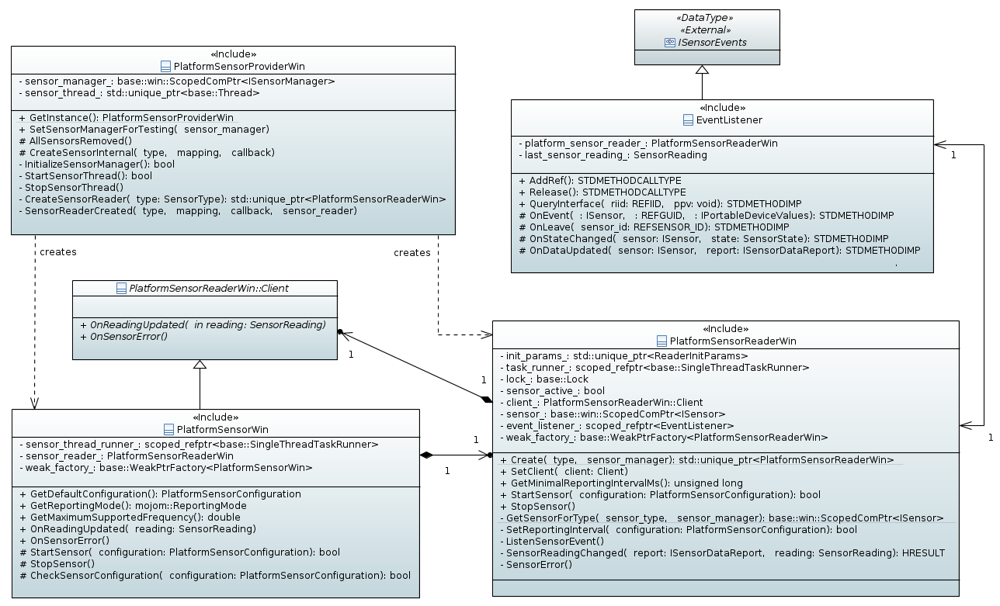
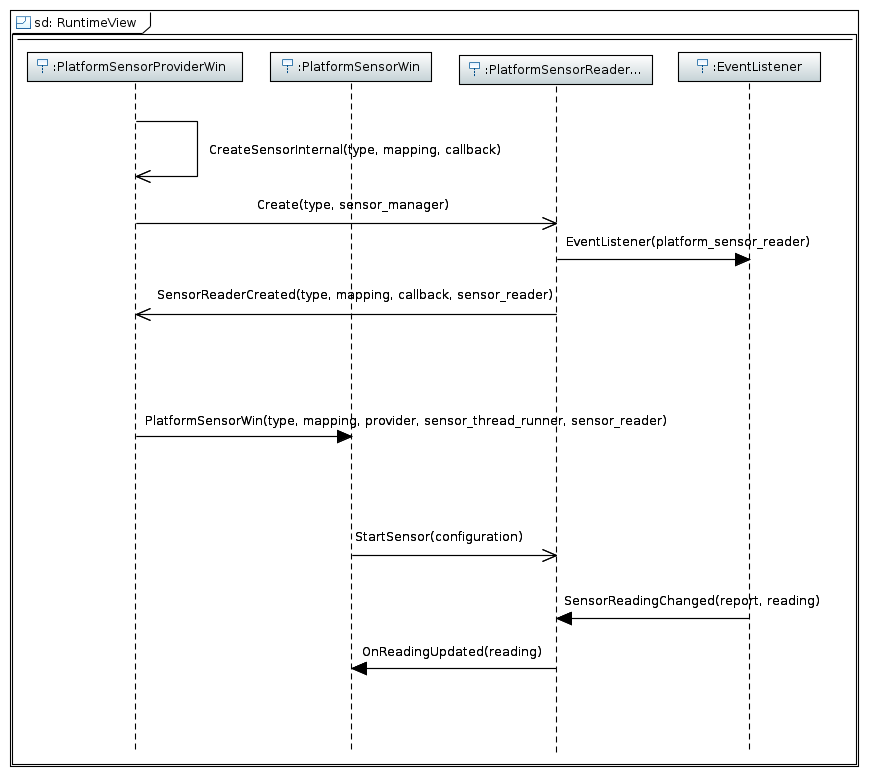

# Chromium Sensor Backend Modernization on Windows

## 1. Summary

Windows has two sets of sensor APIs:

- [ISensor API](https://docs.microsoft.com/en-us/windows/desktop/sensorsapi/about-the-sensor-api):
  The Win32 sensor API on Windows, which is now deprecated.
- [Windows.Devices.Sensors WinRT API](https://docs.microsoft.com/en-us/uwp/api/windows.devices.sensors):
  The WinRT sensor API on Windows.

The Chromium sensor backend on Windows is forked, systems running
Windows 19H1 or later will use the WinRT based stack while older
systems will use the ISensor stack. This document outlines both
of those implementations:

1. Summary
2. General Chromium Sensor Backend Model
3. ISensor Chromium Sensor Backend Model on Windows
4. Windows.Devices.Sensors Chromium Sensor Backend Model on Windows

## 2. General Chromium Sensor Backend Model

For context, the Chromium sensor backend is abstracted into these
interfaces:

- SensorProvider – Sensor factory class responsible for discovering
  sensors on system, querying capabilities, and creating new sensor
  instances.
- Sensor – Sensor device wrapper class used to control the sensor.
- SensorClient – Event class that observes sensor reading changes
  and error conditions.

These interfaces are ultimately what the
[W3C sensor interface](https://www.w3.org/TR/generic-sensor/)
communicates with - each platform has its own implementation.

## 3. ISensor Chromium Sensor Backend Model on Windows

The following diagram shows the ISensor based Chromium backend
implementation on Windows:

The implementation contains three main classes:

- PlatformSensorProviderWin
  - Windows implementation of the SensorProvider interface. It
    is responsible for the creation of PlatformSensorWin and
    PlatformSensorReaderWin. It also manages ISensorManager
    (overall manager for the ISensor API) and the sensor thread where
    all COM objects are created.
- PlatformSensorWin
  - Windows implementation of the Sensor and SensorClient
  interface, manages the state of PlatformSensorReaderWin.
- PlatformSensorReaderWin
  - Wrapper class around an ISensor instance.

The following diagram shows the typical usage flow:

Support for the SensorTypes defined by the Mojo interface
on Windows is summarized below:

| SensorType                        | Sensor GUID                               |
| --------------------------------- | ----------------------------------------- |
| AMBIENT_LIGHT                     | SENSOR_TYPE_AMBIENT_LIGHT                 |
| ACCELEROMETER                     | SENSOR_TYPE_ACCELEROMETER_3D              |
| LINEAR_ACCELEROMETER              | *                                         |
| GRAVITY                           | *                                         |
| GYROSCOPE                         | SENSOR_TYPE_GYROMETER_3D                  |
| MAGNETOMETER                      | SENSOR_TYPE_COMPASS_3D                    |
| ABSOLUTE_ORIENTATION_EULER_ANGLES | SENSOR_TYPE_INCLINOMETER_3D               |
| ABSOLUTE_ORIENTATION_QUATERNION   | SENSOR_TYPE_AGGREGATED_DEVICE_ORIENTATION |

*The LINEAR_ACCELEROMETER sensor type is provided by
implementing a low-pass-filter over the values returned by the
ACCELEROMETER in order to remove the contribution of the gravitational
force.

*The GRAVITY sensor type is provided by implementing a low-pass-filter
over the values returned by the ACCELEROMETER in order to get
the contribution of the gravitational force.

The "Sensor GUID" column specifies the names of the sensor type GUIDs
used to provide data for a SensorType. Any SensorType not mentioned by
this table are not supported on Windows.

## 4. Windows.Devices.Sensors Chromium Sensor Backend Model on Windows

The overall sensor backend design on Windows remains the same
(as detailed in section 3). The classes which take a direct dependency
on the ISensor API have their interfaces abstracted out and
reimplemented with Windows.Devices.Sensors:

- The PlatformSensorProviderWin class:
  - platform_sensor_provider_win.h
  - platform_sensor_provider_win.cc
- The PlatformSensorReaderWin class:
  - platform_sensor_reader_win.h
  - platform_sensor_reader_win.cc

This allows the other classes, which are agnostic to the underlying API,
to interchangeability use the ISensor vs. Windows.Devices.Sensors
implementation. This is advantageous as the two implementations live side
by side.

### 4.1 Support For Adapting Between ISensor and Windows.Devices.Sensors Sensor Implementations

Please refer to [platform_sensor_provider.cc](../platform_sensor_provider.cc).

### 4.2 Windows.Devices.Sensors Sensor Implementation

The overall Windows.Devices.Sensors design is the same as the current design
detailed in section 3 except the classes that take a dependency on the ISensor
API have been reimplemented with these new classes:

- PlatformSensorProviderWinrt
  - Windows.Devices.Sensors based implementation of PlatformSensorProvider,
    functional equivalent of PlatformSensorProviderWin.
- PlatformSensorReaderWinrt
  - Wrapper class around the actual Windows.Devices.Sensors APIs, functional
    equivalent of PlatformSensorReaderWin.

#### 4.2.1 PlatformSensorReaderWinrt

The existing PlatformSensorReaderWin class has been pulled out into
its own interface in [platform_sensor_reader_win_base.h](../platform_sensor_reader_win_base.h).

The existing (ISensor) PlatformSensorReaderWin32 class and new
(Windows.Devices.Sensors) PlatformSensorReaderWinrt class inherit from
this interface so both classes can be interchangeably used with the
ISensor/Windows.Devices.Sensors agnostic PlatformSensorWin, which simply
consume the PlatformSensorReaderWinBase interface.

Since there are several Windows.Devices.Sensors sensor functions which are
identical between the different sensor types, an abstract class
encapsulates the common functionality. Please refer to
[platform_sensor_reader_winrt.h](../platform_sensor_reader_winrt.h).
