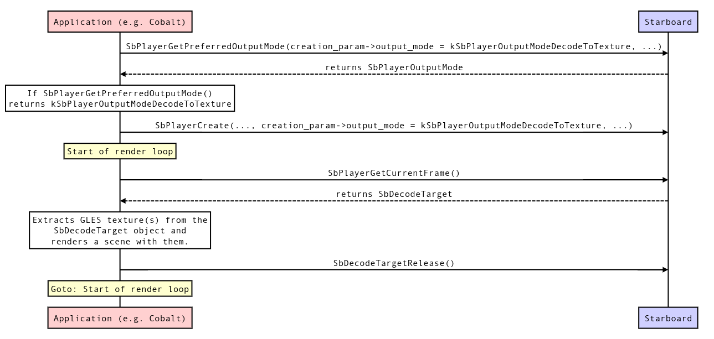

# **HOWTO:** Decode to Texture

Starboard declares the interfaces necessary to allow applications to query for
video frames from the media player, and have them returned as texture objects
(e.g. GLES textures).  This is useful if the application would like to apply
a geometrical transformation to the rendered video, in order to support 360
spherical video playback for example.  Additionally, if a Starboard platform
implementation does not support punch-through video playback, then
applications can choose to use decode-to-texture instead.

## API Overview

Decode-to-texture support involves multiple Starboard API functions spanning
both the [`starboard/player.h`](../player.h) and
[`starboard/decode_target.h`](../decode_target.h) Starboard interface header
files.  Support for decode-to-texture began in version 4 of the Starboard
API.

In particular, the following function implementations require consideration
for decode-to-texture support:

From [`starboard/player.h`](../player.h),

* `SbPlayerCreate()`
* `SbPlayerOutputModeSupported()`
* `SbPlayerGetCurrentFrame()`

From [`starboard/decode_target.h`](../decode_target.h),

* `SbDecodeTargetCreate()`
* `SbDecodeTargetRelease()`
* `SbDecodeTargetGetInfo()`

Note that it is possible that you may not need to implement
`SbDecodeTargetCreate()` on your platform if you do not need to
use the `SbDecodeTargetProvider`.  More on this later.

## Example Application Usage Pattern

We now describe an example, and typical, sequence of steps that an
application will take when it wishes to make use of decode-to-texture
support.

1. An application with the desire to make use of decode-to-texture will first
   call `SbPlayerOutputModeSupported()`, passing in
   `kSbPlayerOutputModeDecodeToTexture` for its `output_mode` parameter.  If
   the function returns false, the application learns that decode-to-texture
   is not supported by the platform and it will not continue with a
   decode-to-texture flow.

2. If `SbPlayerOutputModeSupported()` returns true, the application will call
   `SbPlayerCreate()`, passing in `kSbPlayerOutputModeDecodeToTexture` for
   the `output_mode` parameter, and also providing a valid `provider`
   parameter (more on this later).  At this point, the Starboard platform is
   expected to have created a player with the decode-to-texture output mode.

3. Once the player is started and playback has begun, the application's
   renderer thread (this may be a different thread than the one that called
   `SbPlayerCreate()`) will repeatedly and frequently call
   `SbPlayerGetCurrentFrame()`.  Since this function will be called from the
   application's renderer thread, it should be thread-safe.  If the platform
   uses a GLES renderer, it is guaranteed that this function will be called
   with the GLES renderer context set as current.  This function is expected
   to return the video frame that is to be displayed at the time the function
   is called as a `SbDecodeTarget` object.  The `SbPlayerGetCurrentFrame()`
   will be called at the renderer's frequency, i.e. the application render
   loop's frame rate.  If the application's frame rate is higher than the
   video's frame rate, then the same video frame will sometimes be returned
   in consecutive calls to `SbPlayerGetCurrentFrame()`.  If the video's frame
   rate is higher than the application's (this should be rare), then some
   video frames will never be returned by calls to
   `SbPlayerGetCurrentFrame()`; in other words, video frames will be
   dropped.

4. Once the application has acquired a valid SbDecodeTarget object through a
   call to `SbPlayerGetCurrentFrame()`, it will call
   `SbDecodeTargetGetInfo()` on it to extract information about the opaque
   `SbDecodeTarget` object.  The `SbDecodeTargetGetInfo()` function fills
   out a `SbDecodeTargetInfo` structure which contains information about the
   decoded frame and, most importantly, a reference to a GLES texture ID on
   GLES platforms, or a reference to a `SbBlitterSurface` object on
   Starboard Blitter API platforms.  The application can then use this
   texture/surface handle to render the video frame as it wishes.

5. When the application is finished using the `SbDecodeTarget` that it has
   aquired through the `SbPlayerGetCurrentFrame()` function, it will call
   `SbDecodeTargetRelease()` on it.  The Starboard platform implementation
   should ensure that the `SbDecodeTarget` object returned by
   `SbPlayerGetCurrentFrame()` remains valid until the corresponding call to
   `SbDecodeTargetRelease()` is made.  A call to `SbDecodeTargetRelease()`
   will be made to match each call to `SbPlayerGetCurrentFrame()`.

## The `SbDecodeTargetProvider` object

It is completely possible that a platform's Starboard implementation can
properly implement decode-to-texture support without dealing with the
`SbDecodeTargetProvider` object (passed in to `SbPlayerCreate()`).
The `SbDecodeTargetProvider` reference gives platforms the ability to
initialize and destroy `SbDecodeTarget` options while holding current the
context (e.g. the GLES context) in which they will be rendered.  On some
platforms this may not be necessary, but if it is necessary, then
`SbDecodeTargetCreate()` will need to be implemented as well.

The application will pass a `SbDecodeTargetProvider` into the
`SbPlayerCreate()` call.  The `SbDecodeTargetProvider` contains two
application-provided callbacks for creating and destroying `SbDecodeTarget`
objects.  When `SbDecodeTargetProvider::acquire` is called, the application
will arrange for the renderer's context (the one that will be current when
`SbPlayerGetCurrentFrame()` is called and the resulting texture is rendered)
to be acquired, and then call `SbDecodeTargetCreate()`.  So
the implementation of `SbDecodeTargetCreate()` can assume that the graphics
context will be acquired when it is called.  This is useful for example
when the platform needs to make calls like `glGenTextures()`.  When
`SbDecodeTargetProvider::release` is called, the application will similarly
arrange to call `SbDecodeTargetRelease()` with the graphics context held
current.  This is useful for example if the platform needs to make calls
like `glDeleteTextures()`.

## Performance Considerations

The decode-to-texture Starboard API is specifically designed to allow
Starboard implementations to have the player decode directly to a texture,
so that the application can then reference and render with that texture
without at any point performing a pixel copy.  The
decode-to-texture path can therefore be highly performant.

It is still recommended however that platforms support the punch-through
player mode if possible.  When using the decode-to-texture player output
mode, the video may be rendered within the application's render loop, which
means that non-video-related time complexity in the application's render
loop can affect video playback's apparent frame rate, potentially resulting in
dropped frames.  The platform can likely configure punch-through video to
refresh on its own loop, decoupling it from the application render loop.

## Implementation Strategies

### Working with "push" players

If your player implementation is setup with a "push" framework where
frames are pushed out as soon as they are decoded, then you will need
to cache those frames (along with their timestamps) so that they can be
passed on to the application when `SbPlayerGetCurrentFrame()` is called.
This same strategy applies if the player pushes frames only when they are meant
to be rendered.