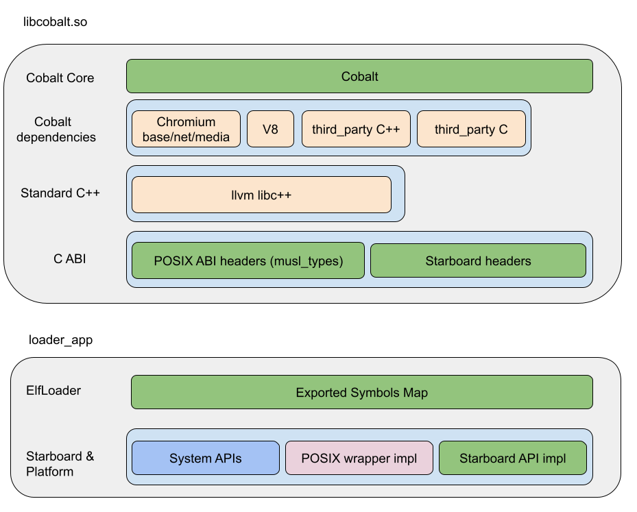

# Starboard 17 POSIX APIs


## Background
Updating existing Chromium components in the Cobalt repository or
bringing new ones requires porting to Starboard. This Starboardization process
takes a lot of time, however the majority of the APIs
involved in the porting are well established POSIX APIs with duplicates in
Starboard e.g: `malloc()` - `SbMemoryAllocate()`,
`socket()` - `SbSocketCreate()`, `open()` - `SbFileOpen()`,
`opendir()` - `SbDirectoryOpen()`, `pthread_mutex_create()` - `SbMutexCreate()`
 etc...


### Verification
To verify a platform integration the `nplb` test should be run in Evergreen mode.

A test suite [starboard/nplb/posix_compliance](../nplb/posix_compliance) is added to `nplb`
to verify the POSIX APIs specification and to enforce uniformity across all platforms.

To run `nplb` in Evergreen mode:
1. Build the `nplb_loader` for the target platform. This will build both the
   `elf_loader_sandbox` (the equivalent of `loader_app` but for running tests
   on the command line) and the `libnplb.so` library.
    ```shell
    ninja -C out/${PLATFORM}_devel/ nplb_loader
    ```
1. Run the `nplb` test
    ```shell
    out/${PLATFORM}_devel/nplb_loader.py
    ```

`nplb_loader.py` is a wrapper script that runs the `elf_loader_sandbox`. The
`elf_loader_sandbox` takes two command line switches: `--evergreen_library` and
`--evergreen_content`. These switches are the path to the shared library to be
run and the path to that shared library's content. These paths should be
*relative to the content of the elf_loader_sandbox*.

```
.../elf_loader_sandbox
.../content/app/nplb/lib/libnplb.so
.../content/app/nplb/content
```

If the test fails in the `posix_compliance_tests` please take a look at the next section **Evergreen integration**. You may need to fix your **POSIX wrapper impl**.

### Evergreen integration


#### POSIX ABI headers (musl_types)
The POSIX standard doesn't provide an ABI specification. There is guidance
around type definitions, but the actual memory representation is left
to the platform implementation. For example the `clock_gettime(CLOCK_MONOTONIC, &ts)` uses
various constants (e.g. CLOCK_MONOTONIC) to define which system clock to query
and a `struct timespec` pointer to populate the time data. The struct has 2
members, but the POSIX standard does not explicitly require that these members
be a specific number of bytes (e.g. the type long may be 4 or 8 bytes),
nor the padding/layout of the members in the struct
(e.g. a compiler is allowed to add additional padding).

The Starboard 17 POSIX ABI is defined by a combination of existing
[third_party/musl](../../third_party/musl) types and values and new types
and values added under [third_party/musl/src/starboard](../../third_party/musl/src/starboard).
All of the types have a concrete stable ABI defined per CPU architecture.

#### POSIX wrapper impl
The musl ABI types are translated to the native POSIX types in the
POSIX wrapper implementation.
The actual implementation, which assumes a native POSIX support is
implemented in `starboard/shared/modular`. For example
[starboard/shared/modular/starboard_layer_posix_time_abi_wrappers.h](../shared/modular/starboard_layer_posix_time_abi_wrappers.h),
[starboard/shared/modular/starboard_layer_posix_time_abi_wrappers.cc](../shared/modular/starboard_layer_posix_time_abi_wrappers.cc).

If the provided implementation doesn't work out of the box
partners can fix it and adjust for their own internal platform. If the
fix is applicable to other POSIX implementations they can upstream the change
to the Cobalt project.

#### Exported Symbols Map
The Exported Symbols Map is part of the Evergreen loader and provides all the unresolved
external symbols required by the Coabalt Core binary. The map is defined as
`std::map<std::string, const void*>` and all the Starboard and POSIX symbols are
registered there. The implementation resides in
[starboard/elf_loader/exported_symbols.cc](../elf_loader/exported_symbols.cc).
For POSIX APIs a wrapper function is used whenever a translation
from `musl` types to platform POSIX types is needed e.g.

```
map_["clock_gettime"] = reinterpret_cast<const void*>(&__abi_wrap_clock_gettime);
```
The symbol may be registered directly without a wrapper if there is no need
for any translation or ajustements of the API e.g.
```
REGISTER_SYMBOL(malloc);
```

# POSIX API Reference
Starting with Starboard 16 the POSIX equivalent Starboard APIs were
deprecated and removed, and the standard POSIX APIs are used instead:

### Memory Management

| Removed Starboard APIs           | Added POSIX APIs|
|----------------------------------|-----------------|
| SbMemoryAllocate                 | malloc          |
| SbMemoryAllocateAligned          | posix_memalign  |
| SbMemoryAllocateAlignedUnchecked |                 |
| SbMemoryAllocateNoReport         |                 |
| SbMemoryAllocateUnchecked        |                 |
| SbMemoryDeallocate               | free            |
| SbMemoryDeallocateAligned        |                 |
| SbMemoryDeallocateNoReport       |                 |
| SbMemoryFlush                    | msync           |
| SbMemoryFree                     |                 |
| SbMemoryFreeAligned              |                 |
| SbMemoryMap                      | mmap            |
| SbMemoryProtect                  | mprotect        |
| SbMemoryReallocate               | realloc         |
| SbMemoryReallocateUnchecked      |                 |
| SbMemoryUnmap                    | munmap          |


### Concurrency
| Removed Starboard APIs           | Added POSIX APIs            |
|----------------------------------|-----------------------------|
| SbConditionVariableBroadcast     | pthread_cond_broadcast      |
| SbConditionVariableDestroy       | pthread_cond_destroy        |
| SbConditionVariableCreate        | pthread_cond_init           |
| SbConditionVariableSignal        | pthread_cond_signal         |
| SbConditionVariableWait          | pthread_cond_wait           |
| SbConditionVariableWaitTimed     | pthread_cond_timedwait      |
| SbMutexAcquire                   | pthread_mutex_lock          |
| SbMutexAcquireTry                | pthread_mutex_trylock       |
| SbMutexCreate                    | pthread_mutex_init          |
| SbMutexDestroy                   | pthread_mutex_destroy       |
| SbMutexRelease                   | pthread_mutex_unlock        |
| SbThreadCreate                   | pthread_create              |
| SbThreadCreateLocalKey           | pthread_key_create          |
| SbThreadDestroyLocalKey          | pthread_key_delete          |
| SbThreadDetach                   | pthread_detach              |
| SbThreadGetCurrent               | pthread_self                |
| SbThreadGetLocalValue            | pthread_getspecific         |
| SbThreadGetName                  | pthread_getname_np          |
| SbThreadIsEqual                  | pthread_equal               |
| SbThreadJoin                     | pthread_join                |
| SbThreadSetLocalValue            | pthread_setspecific         |
| SbThreadSetName                  | pthread_setname_np          |
| SbThreadSleep                    | usleep                      |
| SbThreadYield                    | sched_yield                 |
| SbOnce                           | pthread_once                |
|                                  | pthread_attr_init           |
|                                  | pthread_attr_destroy        |
|                                  | pthread_attr_getdetachstate |
|                                  | pthread_attr_getstacksize   |
|                                  | pthread_attr_setdetachstate |
|                                  | pthread_attr_setstacksize   |
|                                  | pthread_condattr_destroy    |
|                                  | pthread_condattr_getclock   |
|                                  | pthread_condattr_init       |
|                                  | pthread_condattr_setclock   |
|                                  | pthread_attr_init           |
|                                  | pthread_attr_init           |


### I/O, sockets, files, directories

| DeprecatedStarboard APIs     | Added POSIX APIs|
|------------------------------|-----------------|
| SbDirectoryCanOpen           | stat            |
| SbDirectoryClose             | closedir        |
| SbDirectoryCreate            | mkdir           |
| SbDirectoryGetNext           | readdir_r       |
| SbDirectoryOpen              | opendir         |
| SbFileCanOpen                | stat            |
| SbFileClose                  | close           |
| SbFileDelete                 | unlink, rmdir   |
| SbFileExists                 | stat            |
| SbFileFlush                  | fsync           |
| SbFileGetInfo                | fstat           |
| SbFileGetPathInfo            | stat            |
| SbFileModeStringToFlags      |                 |
| SbFileOpen                   | open , opedir   |
| SbFileRead                   | read            |
| SbFileSeek                   | lseek           |
| SbFileTruncate               | ftruncate       |
| SbFileWrite                  | write           |
| SbSocketAccept               | accept          |
| SbSocketBind                 | bind            |
| SbSocketClearLastError       |                 |
| SbSocketConnect              | connect         |
| SbSocketCreate               | socket          |
| SbSocketDestroy              | close           |
| SbSocketFreeResolution       |                 |
| SbSocketGetInterfaceAddress| | getifaddrs      |
| SbSocketGetLastError         | errrno          |
| SbSocketGetLocalAddress      | getsockname     |
| SbSocketIsConnected          |                 |
| SbSocketIsConnectedAndIdle   |                 |
| SbSocketJoinMulticastGroup   | setsockopt      |
| SbSocketListen               | listen          |
| SbSocketReceiveFrom          | recv, recvfrom  |
| SbSocketResolve              | getaddrinfo     |
| SbSocketSendTo               | send, sendto    |
| SbSocketSetBroadcast         | setsockopt      |
| SbSocketSetReceiveBufferSize | setsockopt      |
| SbSocketSetReuseAddress      | setsockopt      |
| SbSocketSetSendBufferSize    | setsockopt      |
| SbSocketSetTcpKeepAlive      | setsockopt      |
| SbSocketSetTcpNoDelay        | setsockopt      |
| SbSocketSetTcpWindowScaling  | setsockopt      |
|                              | freeifaddrs     |
|                              | inet_ntop       |

### Strings
| Removed Starboard APIs | Added POSIX APIs|
|------------------------|-----------------|
| SbStringCompareNoCase  | strcasecmp      |
| SbStringCompareNoCaseN | strncasecmp     |
| SbStringDuplicate      | strdup          |
| SbStringScan           | vsscanf         |
| SbStringFormat         | vsnprintf       |
| SbStringFormatWide     | vfwprintf       |


### Time
| Removed Starboard APIs         | Added POSIX APIs|
|--------------------------------|-----------------|
| SbTimeGetMonotonicNow          | clock_gettime   |
| SbTimeGetMonotonicThreadNow    | clock_gettime   |
| SbTimeGetNow                   | gettimeofday    |
| SbTimeIsTimeThreadNowSupported |                 |
|                                | time            |

### Related Starboard APIs Added

```
SbThreadSetPriority
SbThreadGetPriority
SbPosixSocketWaiterAdd
SbPosixSocketWaiterRemove
```


### Backwards compatibility with Starboard 14 and Starboard 15
For older Starboard Versions e.g. 14 and 15 an emulation layer was provided through
the `third_party/musl` library. This should be completely transparent to
partner's integrations.
