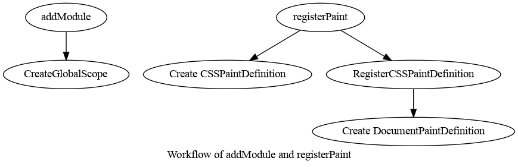
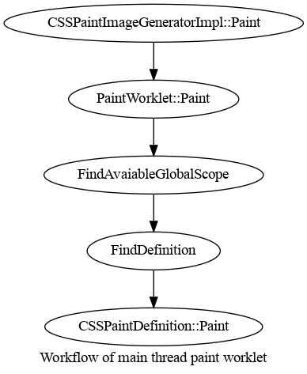

# CSS Paint API

This directory contains the implementation of the CSS Paint API.

See [CSS Paint API](https://drafts.css-houdini.org/css-paint-api/) for the web exposed APIs this
implements.

See [Explainer](https://github.com/w3c/css-houdini-drafts/blob/master/css-paint-api/EXPLAINER.md)
of this feature, as well as [Samples](https://github.com/GoogleChromeLabs/houdini-samples/tree/master/paint-worklet).

## Workflow

Historically the CSS Paint API (PaintWorklet) implementation ran on the main
thread. It has been optimized to run on the compositor thread. We will use an
example to show the workflow of both cases.

Here is a simple example of using PaintWorklet to draw something on the screen.

``` html
<style>
#demo {
  background-image: paint(foo);
  width: 200px;
  height: 200px;
}
</style>
<script id="code" type="text/worklet">
registerPaint('foo', class {
  paint(ctx, size) {
    ctx.fillStyle = 'green';
    ctx.fillRect(0, 0, size.width, size.height);
  }
});
</script>
<script>
var code = document.getElementById('code').textContent;
var blob = new Blob([code], {type : 'text/javascript'});
CSS.paintWorklet.addModule(URL.createObjectURL(blob));
</script>
```

In our implementation, there is one [PaintWorklet](paint_worklet.h) instance
created from the frame.

### Main thread workflow

Let's start with the two web-exposed APIs and dive into the main thread
workflow. Specifically the two APIs are `addModule` and `registerPaint`.

When `addModule` is executed, `Worklet::addModule` is called. There are two
[PaintWorkletGlobalScope](paint_worklet_global_scope.h) created, and the
[PaintWorkletGlobalScopeProxy](paint_worklet_global_scope_proxy.h) serves as the
proxy when other classes need to communicate with PaintWorkletGlobalScope. We
create two PaintWorkletGlobalScope to enforce stateless. The number of global
scopes can be arbitrary as long as it is >= 2, and we chose two in our
implementation.

`registerPaint` is executed on each PaintWorkletGlobalScope. When the
`PaintWorkletGlobalScope::registerPaint` is called, it creates a
[CSSPaintDefinition](css_paint_definition.h) and PaintWorkletGlobalScope owns
it. Besides that, it creates
[DocumentPaintDefinition](document_paint_definition.h) which is owned by
PaintWorklet. It then registers the CSSPaintDefinition to the
DocumentPaintDefinition.

Below is a diagram that shows what happens when `addModule` and `registerPaint`
are called:



During `PaintWorkletGlobalScope::registerPaint`, the Javascript inside the paint
function is turned into a V8 paint callback. We randomly choose one of the two
global scopes to execute the callback. The execution of the callback
produces a PaintRecord, which contains a set of skia draw commands. The V8 paint
callback is executed on a shared V8 isolate.

During the main thread paint, the `PaintWorklet::Paint` is called, which
executes the V8 paint callback synchronously. A PaintRecord is produced and
passed to the compositor thread to raster.

When animation is involved, the main thread animation system updates the value
of the animated properties, which are used by the `PaintWorklet::Paint`.

Below is a diagram that shows what happens when `PaintWorklet::Paint` is called.



### Off main thread workflow

Let's see how it works without animations.

1. During the main thread paint, a
   [PaintWorkletDeferredImage](../../core/css/cssom/paint_worklet_deferred_image.h)
   is created. This is an image without any color information, it is a
   placeholder to the Blink paint system. The creation of its actual content
   is deferred to CC raster time. It holds input arguments which is
   encapsulated in [CSSPaintWorkletInput](../../core/css/cssom/css_paint_worklet_input.h).
   The input arguments contain necessary information for the CC raster phase.

   In our code, this step is executed in `CSSPaintValue::GetImage`, and we can
   trace its call sites to find out when and where this is called during the
   main thread paint. This function creates a `PaintWorkletDeferredImage`.

1. During commit, the `PaintWorkletInput` is passed to CC. Specifically, the
   `PictureLayerImpl` owns `PaintWorkletRecordMap`, which is a map from
   `PaintWorkletInput` to `std::pair<PaintImage::Id, PaintRecord>`. The
   `PaintImage::Id` is used for efficient invalidation. The `PaintRecord` is
   the actual content of the `PaintWorkletDeferredImage`, which will be
   generated at CC raster time. Initially the `PaintRecord` is `nullptr` which
   indicates that it needs to be produced.

   But how does the `PaintWorkletInput` gets passed to CC? During main thread
   paint, we will generate a set of `DisplayItemList` for each layer, and each
   `DisplayItemList` contains a `DiscardableImageMap`. If a
   `DiscardableImageMap` is for paint worklet, then it will contain a vector
   of `PaintWorkletinputWithImageId`, where each one is a pair of
   `PaintWorkletInput` and `PaintImage::Id`. Now if we look at the
   `PaintWorkletDeferredImage` class, we can see it contains a `PaintImage`.

1. After commit, we need to update the pending tree. This happens in
   `LayerTreeHostImpl::UpdateSyncTreeAfterCommitOrImplSideInvalidation`.
   There are two steps involved.

   1. The first step is to gather all dirty paint worklets that need to be
     updated, which happens in `LayerTreeHostImpl::GatherDirtyPaintWorklets`. It
     basically goes through each `PictureLayerImpl` whose
     `PaintWorkletRecrodMap` isn't empty, and if there is a `PaintWorkletInput`
     with its associated `PaintRecord` being nullptr, then this worklet needs to
     be updated.

   1. Once we have gathered all the dirty paint worklets, the next step is to
     produce the `PaintRecord` which is the actual contents. The compositor
     thread asynchronously dispatches the paint jobs that produce the
     `PaintRecord` to a worklet thread. Each paint job is basically a V8 paint
     callback, the paint callback is executed on the worklet thread and the
     `PaintRecord` is given back to the compositor thread such that it can be
     rastered. Given that the V8 paint callback contains user defined javascript
     code and can take arbitrary amount of time, the paint job doesn't block the
     tree activation. In other word, the pending tree can be activated even if
     the paint jobs are not finished, it will just use the `PaintRecord` that
     was produced in the previous frame.

Now let's see how it works with animation. Here is an
[example](https://jsbin.com/muwiyux/9/edit?html,css,output) that animates a
custom property '--foo' with paint worklet. Traditionally
[custom properties](https://developer.mozilla.org/en-US/docs/Web/CSS/Using_CSS_custom_properties)
cannot be animated on the compositor thread. With off main thread paint worklet
design, we can animate the custom properties off the main thread and use them in
paint worklet. Note that currently our implementation supports custom property
animations only, not native properties. We do intend to extend to support
native properties in the future.

1. When resolving style, `CompositorKeyframeValue` will be created through
   `CompositorKeyframeValueFactory::Create` function. This basically tells the
   main thread animation system to not animate the custom properties, and
   instead creating a compositor animation for each custom property.

1. After Blink paint, a compositor animation will be created through the
   `CreateCompositorAnimation` function. The compositor animation is passed to
   CC via commit process.

1. CC ticks the compositor animation, which updates the value for the custom
   property. Currently we only support custom properties that represents number
   or color. This is handled by
   `AnimatedPaintWorkletTracker::OnCustomPropertyMutated`. The
   `AnimatedPaintWorkletTracker` class handles custom properties animated by
   paint worklet.

1. By combining custom property name with `ElementId`, we create
   `PaintWorkletInput::PropertyKey` which can be used to identify a
   `PaintWorkletInput`. Then we can use the `PaintWorkletInput` to find its
   associated `PaintRecord` in the `PictureLayerImpl`'s `PaintWorkletRecordMap`,
   invalidate it and update its content when we update the pending tree. More
   specifically, this happens in
   `AnimatedPaintWorkletTracker::InvalidatePaintWorkletsOnPendingTree`, and
   `AnimatedPaintWorkletTracker::InvalidatePaintWorkletsOnPendingTree` is
   called by `LayerTreeHostImpl::UpdateSyncTreeAfterCommitOrImplSideInvalidation`
   which does the impl-side invalidation.

Some other differences compared with the main-thread workflow.

When `addModule` is executed, we are creating two `PaintWorkletGlobalScope` on
the main thread, and two on the worklet thread. Please refer to the two different
Create function in the [PaintWorkletGlobalScope](paint_worklet_global_scope.h)
class for details. The two global scopes on the worklet thread are created when
the worklet thread is initialized.

`registerPaint` is executed on each PaintWorkletGlobalScope. That means, twice
on the main thread, and twice on the worklet thread. In this case, we need to
make sure that the `CSSPaintDefinition` created on the main thread and the
worklet thread are consistent with each other. Once that is verified, we then
register the CSSPaintDefinition to the DocumentPaintDefinition. For the main
thread version, this is happening at `PaintWorklet::RegisterCSSPaintDefinition`.
For the worklet thread, this happens at
`PaintWorkletProxyClient::RegisterCSSPaintDefinition`.

## Implementation

### [CSSPaintDefinition](css_paint_definition.h)

Represents a class registered by the author through `PaintWorkletGlobalScope#registerPaint`.
Specifically this class holds onto the javascript constructor and paint functions of the class via
persistent handles. This class keeps these functions alive so they don't get garbage collected.

The `CSSPaintDefinition` also holds onto an instance of the paint class via a persistent handle. This
instance is lazily created upon first use. If the constructor throws for some reason the constructor
is marked as invalid and will always produce invalid images.

The `PaintWorkletGlobalScope` has a map of paint `name` to `CSSPaintDefinition`.

### [CSSPaintImageGenerator][generator] and [CSSPaintImageGeneratorImpl][generator-impl]

`CSSPaintImageGenerator` represents the interface from which the `CSSPaintValue` can generate
`Image`s. This is done via the `CSSPaintImageGenerator#paint` method. Each `CSSPaintValue` owns a
separate instance of `CSSPaintImageGenerator`.

`CSSPaintImageGeneratorImpl` is the implementation which lives in `modules/csspaint`. (We have this
interface / implementation split as `core/` cannot depend on `modules/`).

When created the generator will access its paint worklet and lookup it's corresponding
`CSSPaintDefinition` via `PaintWorkletGlobalScope#findDefinition`.

If the paint worklet does not have a `CSSPaintDefinition` matching the paint `name` the
`CSSPaintImageGeneratorImpl` is placed in a "pending" map. Once a paint class with `name` is
registered the generator is notified so it can invalidate an display the correct image.

[generator]: ../../core/css/css_paint_image_generator.h
[generator-impl]: css_paint_image_generator_impl.h
[paint-value]: ../../core/css/css_paint_value.h

### Generating a [PaintGeneratedImage](../../platform/graphics/paint_generated_image.h)

`PaintGeneratedImage` is a `Image` which just paints a single `PaintRecord`.

A `CSSPaintValue` can generate an image from the method `CSSPaintImageGenerator#paint`. This method
calls through to `CSSPaintDefinition#paint` which actually invokes the javascript paint method.
This method returns the `PaintGeneratedImage`.

### Style Invalidation

The `CSSPaintDefinition` keeps a list of both native and custom properties it will invalidate on.
During style invalidation `ComputedStyle` checks if it has any `CSSPaintValue`s, and if any of their
properties have changed; if so it will invalidate paint for that `ComputedStyle`.

If the `CSSPaintValue` doesn't have a corresponding `CSSPaintDefinition` yet, it doesn't invalidate
paint.

## Testing

Tests live [here](../../../web_tests/http/tests/csspaint/) and
[here](../../../web_tests/external/wpt/css/css-paint-api/).
