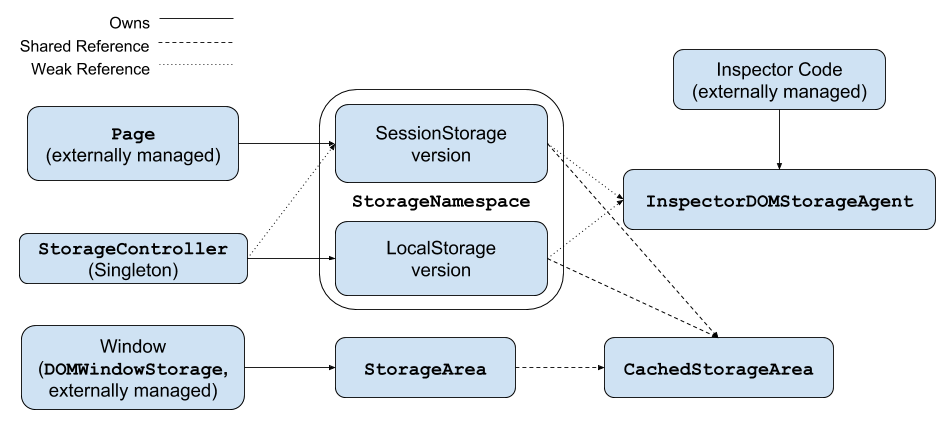

# `blink/renderer/modules/storage`

This directory contains the renderer side implementation of the DOM Storage API. This API is defined in the [HTML Spec](https://html.spec.whatwg.org/multipage/webstorage.html)'s section on Web Storage.

The browser side code for this lives in `content/browser/dom_storage/`.

## Class Responsibilities
### [`DOMWindowStorage`](dom_window_storage.h)
This implements the partial `Window` interface in
[window_storage.idl](window_storage.idl), and provides bindings for
`window.localStorage` and `window.sessionStorage` to the web platform. This
creates & owns the `StorageArea` objects.
### [`StorageArea`](storage_area.h)
This implements the WebIDL `Storage` interface in [storage.idl](storage.idl),
and provides access to `localStorage` and `sessionStorage`. This class holds a
shared reference to a `CachedStorageArea` (which can be shared between multiple
`StorageArea`s), and basically delegates most calls here.

This is also temporarily created & used by `InspectorDOMStorageAgent` to make modifications to local & session storage.
### [`CachedStorageArea`](cached_storage_area.h)
This is responsible for
 * keeping a local cache of the localStorage or sessionStorage data (which it
 does using a [`StorageAreaMap`](storage_area_map.h)),
 * keeping track of `Source`s that are using this cached storage area (which
 are `StorageAreas`),
 * loading and saving data with a
 [`StorageArea`](../../../public/mojom/dom_storage/storage_area.mojom) mojo
 interface, and
 * observing changes from that `StorageArea` interface and communicating these
 to all `Source`s, and `InspectorEventListener`s.
### [`StorageAreaMap`](storage_area_map.h)
This represents an in-memory cache of a storage area. It holds key-value
storage and keeps track of the total size of the bytes stored.
### [`StorageNamespace`](storage_namespace.h)
This class is responsible for
 * creating & caching `CachedStorageArea`s on a per-origin basis,
 * holding weak references to `DOMStorageInspectorAgent`s & telling them when a
 storage event was dispatched,
 * interacting with the
 [`StoragePartitionService`](../../../public/mojom/dom_storage/storage_partition_service.mojom)
 and
 [`SessionStorageNamespace`](../../../public/mojom/dom_storage/session_storage_namespace.mojom)
 mojo interfaces to create `StorageArea` mojo ptrs for the `CachedStorageArea`s
 and clone namespaces for SessionStorage.
* accounting for all storage used in its cached areas, and
* cleaning up unused caches areas on demand.

There are two versions of this class - one version is the SessionStorage
version, which holds a
[`SessionStorageNamespace`](../../../public/mojom/dom_storage/session_storage_namespace.mojom)
mojo ptr and lives on a `Page` as a Page Supplement. The other version is for
LocalStorage, which just uses the
[`StoragePartitionService`](../../../public/mojom/dom_storage/storage_partition_service.mojom)
to open the `StorageAreas`, and is owned by the `StorageController`.

### [`StorageController`](storage_controller.h)
This is a singleton that is responsible for keeping track of all
`StorageNamespace`s and provide access to the functionality of its single
LocalStorage `StorageNamespace` that it owns. It holds weak references to all
of the SessionStorage `StorageNamespace`s so it can account for the total
amount of memory used by all of DOMStorage. If this gets too high, it can ask
all namespaces to prune all unused `CacheStorageArea`s.
### [`InspectorDOMStorageAgent`](inspector_dom_storage_agent.h)
This is used by the Inspector (DevTools) code to listen to and modify local &
session storage. The `StorageNamespace` class allows these agents to be added &
removed by the Inspector system, and all events that are dispatched on that
namespace are sent to its `InspectorDOMStorageAgent`s.

This class also creates a temporary `StorageArea` to query & modify local &
session storage.
## Class Ownership Structure
`StorageArea` lives on the `window`. Instances of this class hold a reference
to a `CachedStorageArea` instance. All `StorageArea` instances representing the
same area use the same `CachedStorageArea` instance (which is reference
counted). Two classes are used to create and manage `CachedStorageArea`s - the
`StorageController`, and `StorageNamespace`s.

The `StorageNamespace` represents a SessionStorage namespace, but can also be
used for LocalStorage. It creates & manages `CachedStorageArea`s per-origin. It
keeps a reference to all `CachedStorageArea`s it creates for memory accounting
and object re-use. It also contains weak references to
`InspectorDOMStorageAgent`s that it notifies when StorageEvents are dispatched.

SessionStorage `StorageNamespace` objects live as supplements on the `Page`, so
each `Page` owns one. The LocalStorage `StorageNamespace` object lives in the
`StorageController`.

The `StorageController` is a singleton. It owns the LocalStorage
`StorageNamespace`, and hold weak references to each SessionStorage
`StorageNamespace`.

Finally - `InspectorDomStorageAgent` will create temporary `StorageArea`
objects when it wants to query or modify DOMStorage.

[Image Source](https://docs.google.com/drawings/d/1YlaLMyJT5G8jqU_wHnldWIA3LEtGBPFs39gLkikAzyc/edit?usp=sharing)
